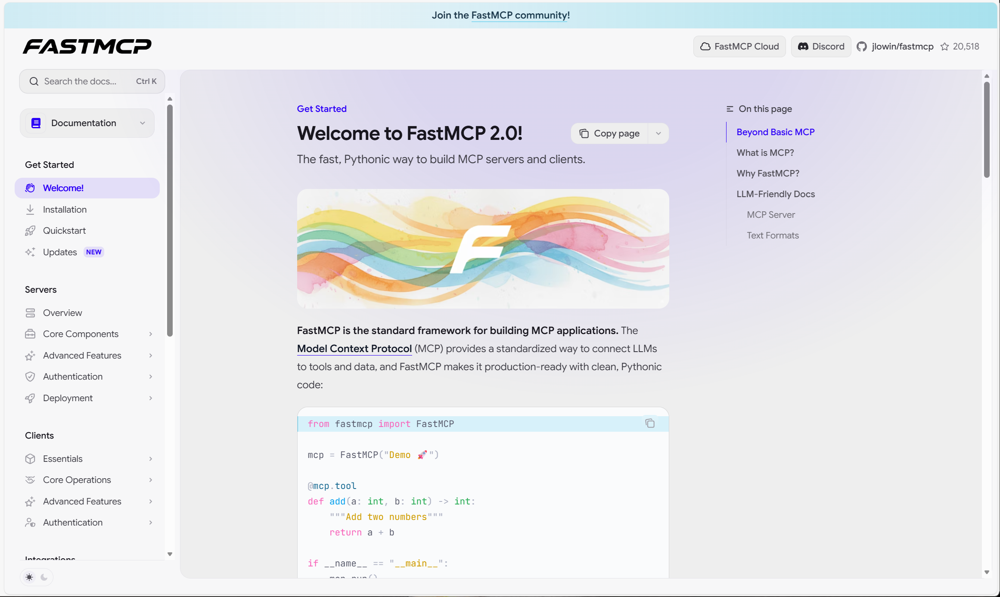
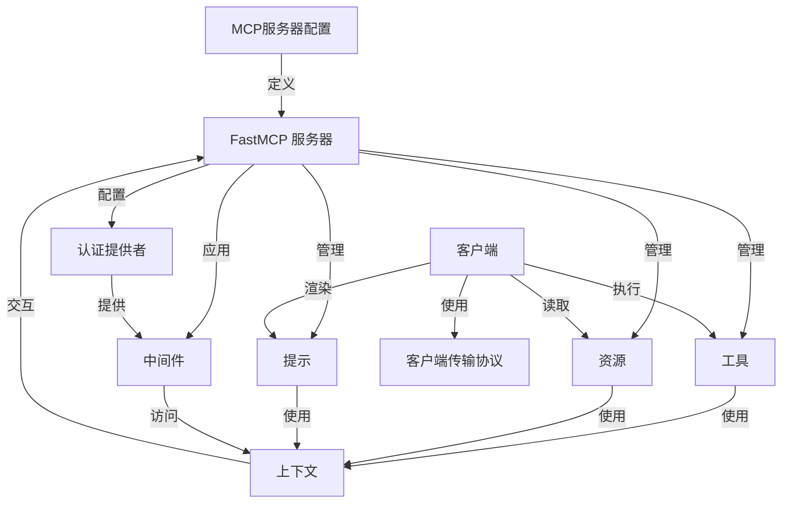
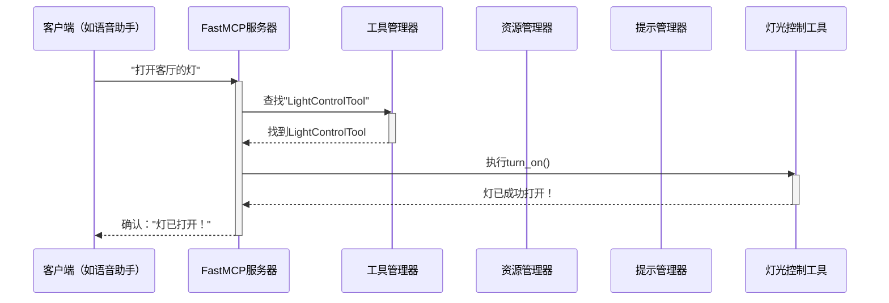

链接：[Welcome to FastMCP 2.0! - FastMCP](https://gofastmcp.com/getting-started/welcome)

很漂亮的网页前端desu🥹



# docs：fastmcp

`FastMCP` 是一个强大的框架，用于构建和交互 **模型上下文协议（MCP）** 应用程序

允许我们==创建一个 *中央服务器*，提供==各种 *服务*（工具）、*数据*（资源）和 *可定制文本*（提示）。客户端可以通过不同的 *通信方式*（传输协议）连接到该服务器，*访问和利用* 这些服务，同时隐藏复杂的网络逻辑和认证细节。

## 可视化



## 章节

1. [FastMCP 服务器](01_fastmcp_server_.md)
2. [客户端](02_client_.md)
3. [工具](03_tool_.md)
4. [资源](04_resource_.md)
5. [提示](05_prompt_.md)
6. [上下文](06_context_.md)
7. [客户端传输协议](07_clienttransport_.md)
8. [MCP服务器配置](08_mcpserverconfig_.md)
9. [认证提供者](09_authprovider_.md)
10. [中间件](10_middleware_.md)

---
# 第1章：FastMCP服务器

在第一章中，我们将认识这个框架的核心主角：**FastMCP服务器**。可以把它想象成整个应用程序的中枢大脑。

## FastMCP解决什么问题？

假设我们正在构建一个"智能家居助手"，希望它能实现以下功能：
*   "打开客厅的灯"
*   "厨房现在温度是多少？"
*   "给我一个个性化的早安问候"

为了实现这些功能，我们需要让==助手==（即"[客户端](02_client_.md)"）能够与智能家居的各个部分（灯光、温控器、问候语生成器）进行==通信==。这就是**FastMCP服务器**的用武之地！它充当中央枢纽，==理解==所有这些请求并知道如何完成任务。

(可以 对比 之前手写过的rpc服务器 进行理解)

## FastMCP服务器：智能家居的中央枢纽

`FastMCP`服务器就像一个高级餐厅，类比关系如下：

*   **餐厅（FastMCP服务器）**：这是主体设施，负责接收顾客订单、准备餐点和管理后台运作
*   **服务菜单（工具）**：就像餐厅有菜单一样，`FastMCP`服务器提供各种服务。对智能家居来说，"开灯"或"调节温控器"就像是菜单上的菜品。我们称这些为**[工具](03_tool_.md)**
*   **信息看板（资源）**：餐厅可能会展示每日特价或过敏信息。`FastMCP`服务器可以提供"当前厨房温度"或"天气预报"等信息。这些是**[资源](04_resource_.md)**
*   **定制订单表（提示）**：如果想定制餐点，可以填写订单表。类似地，服务器能根据输入生成"个性化早安问候"等专门响应。这些是**[提示](05_prompt_.md)**
*   **顾客（[客户端](02_client_.md)）**：这些是向服务器发送请求的应用程序或代理（如我们的智能家居助手）

我们定义这些组件（[工具](03_tool_.md)、[资源](04_resource_.md)、[提示](05_prompt_.md)），服务器负责处理来自客户端的请求，协调交互并返回正确响应。它还管理重要设置，如认证（谁有权限？）和与外部世界的通信方式。

## 创建第一个FastMCP服务器

让我们从创建一个非常基础的`FastMCP`服务器开始，这是构建"智能家居服务器"的第一步！

```python
from fastmcp.server import FastMCP

# 1. 创建FastMCP服务器实例
smart_home_server = FastMCP(name="我的智能家居中枢")

print(f"服务器已创建：{smart_home_server.name}")
```

这段代码简单地导入`FastMCP`并创建一个实例。我们给它一个`name`以便后续识别。此时的服务器就像一个空餐厅——它存在，但还没有提供任何服务。

## 添加基础组件

虽然我们将在后续章节深入探讨[工具](03_tool_.md)、[资源](04_resource_.md)和[提示](05_prompt_.md)，但先看看如何将它们添加到`FastMCP`服务器会很有帮助。

假设我们已经定义了简单的`LightControlTool`、`TemperatureResource`和`MorningGreetingPrompt`类（我们将在相应章节学习如何创建这些！）。

```python
from fastmcp.server import FastMCP
# 假设这些已在其他地方定义（后续会讲到！）
from .my_smart_home_components import (
    LightControlTool, TemperatureResource, MorningGreetingPrompt
)

smart_home_server = FastMCP(name="我的智能家居中枢")

# 2. 注册组件
smart_home_server.add_tool(LightControlTool())
smart_home_server.add_resource(TemperatureResource())
smart_home_server.add_prompt(MorningGreetingPrompt())

print(f"已注册工具：{smart_home_server.list_tools()}")
# ...资源和提示同理
```

这里，`add_tool()`、`add_resource()`和`add_prompt()`是`FastMCP`服务器上的方法，允许我们"将菜品添加到餐厅菜单"或"将信息放到看板上"。注册后，服务器就知道了这些功能。

## FastMCP服务器内部工作原理

创建`FastMCP`服务器并注册组件时，它不只是存储它们，而是设置了内部管理器来处理这些组件。请看一个简单的事件序列：



在这个图中：
*   **[客户端](02_client_.md)**发送请求
*   **FastMCP服务器**接收请求
*   检查其专门的管理器（如**工具管理器**）以找到处理请求的正确组件
*   找到后，服务器要求**灯光控制工具**执行操作
*   最后，服务器将响应返回给客户端

这展示了`FastMCP`服务器如何协调交互。它不直接*执行*开灯的工作，而是将这些工作委托给它管理的专门[工具](03_tool_.md)（或[资源](04_resource_.md)或[提示](05_prompt_.md)）。

## 内部结构

`FastMCP`类使用专门的"管理器"来管理其组件。虽然完整`server.py`文件没有在代码片段中展示，但我们可以从`fastmcp/openapi.py`和`fastmcp/proxy.py`等文件推断其行为。

例如，在`fastmcp/openapi.py`中，`FastMCPOpenAPI`类（基于`FastMCP`）使用了内部管理器：

```python
# 来自src/fastmcp/openapi.py（在FastMCPOpenAPI的__init__中）
class FastMCPOpenAPI(FastMCP):
    def __init__(self, ...):
        super().__init__(...)
        # ...
        self._tool_manager = ProxyToolManager(...) # 示例：基础FastMCP可能使用不同的管理器
        self._resource_manager = ProxyResourceManager(...)
        self._prompt_manager = ProxyPromptManager(...)
        # ...
```

这段代码告诉我们，`FastMCP`（及其专门版本如`FastMCPOpenAPI`）具有`_tool_manager`、`_resource_manager`和`_prompt_manager`等属性。这些内部对象负责存储、查找和运行已注册的[工具](03_tool_.md)、[资源](04_resource_.md)和[提示](05_prompt_.md)。

当我们调用`smart_home_server.add_tool(LightControlTool())`时，`FastMCP`服务器内部将这个工具传递给它的`_tool_manager`，然后由管理器跟踪`LightControlTool`。

## 总结

本章我们了解到，`FastMCP`服务器是模型上下文协议应用程序的中央枢纽，就像一个提供服务（[工具](03_tool_.md)）、信息（[资源](04_resource_.md)）和定制请求（[提示](05_prompt_.md)）的餐厅。我们学习了如何创建基础服务器，并理解了它的高级内部工作原理。

接下来，我们将探索交互的另一端：**[客户端](02_client_.md)**，也就是与`FastMCP`服务器交互的"顾客"。

[下一章：客户端](02_client_.md)

