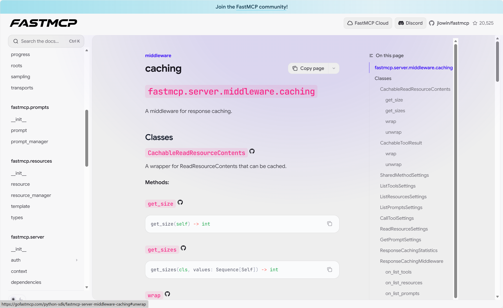
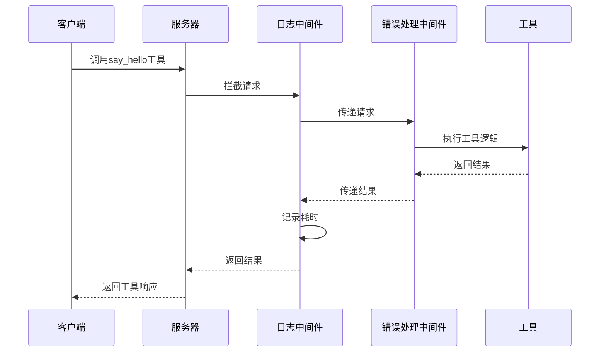

# 第10章：中间件

[caching - FastMCP](https://gofastmcp.com/python-sdk/fastmcp-server-middleware-caching)



在上一章[认证提供者](09_authprovider_.md)中，我们学习了如何通过验证客户端身份和权限来保护[FastMCP服务器](01_fastmcp_server_.md)。有趣的是，`认证提供者`本身正是利用了一个强大概念来实现其功能：**中间件**。

## 中间件解决什么问题？

想象"智能家居餐厅"生意兴隆，每份顾客订单（请求）都需要经过几个环节：
1. **门口迎宾**：检查顾客准入资格（认证）
2. **下单受理**：接收订单（如"开灯"指令）
3. **后厨制作**：厨师（[工具](03_tool_.md)）准备餐点
4. **出餐质检**：检查菜品质量（错误处理）或确认是否需要重新制作（缓存）
5. **餐品送达**：将餐点交付顾客

如果需要新增环节，例如记录每笔订单（日志记录）、限制顾客下单频率（限流）或检查菜品是否需要重新制作（缓存），我们不希望将这些逻辑分散添加到每个厨师的菜谱中。这正是`中间件`要解决的问题——作为可定制的"检查点"，在不修改核心[工具](03_tool_.md)、[资源](04_resource_.md)或[提示](05_prompt_.md)逻辑的前提下，对请求和响应进行拦截处理。

## 中间件：服务器检查点

`中间件`如同部署在请求-响应流程中的管理员，每个请求（及响应）都需要经过这些检查点链。

主要特性包括：
* **全局拦截**：作为必经的"过滤器"或"检查点"
* **检视修改**：可查看入站请求（如调用工具、参数）和出站响应，并对其进行修改
* **流程控制**：决定是否放行请求到下一环节（`call_next`）或直接终止（如认证失败时）
* **链式处理**：多个中间件可形成处理管道
* **上下文传递**：通过`MiddlewareContext`共享请求相关信息

`fastmcp`内置多种中间件：

| 中间件类型       | 类比           | 功能说明                           |
| :--------------- | :------------- | :--------------------------------- |
| `日志记录中间件` | 餐厅订单记录员 | 记录每个请求的详细信息             |
| `错误处理中间件` | 菜品质量检查员 | 捕获并标准化错误响应               |
| `响应缓存中间件` | 预制菜管理员   | 缓存常用响应加速后续请求           |
| `限流中间件`     | 客流控制保安   | 防止服务器过载                     |
| `认证中间件`     | 身份核验岗亭   | 验证令牌和权限（由认证提供者使用） |

### 使用中间件：添加请求日志

我们通过`日志记录中间件`自动记录每个请求及其耗时。

创建基础服务器文件`my_logged_server.py`：

```python
# my_logged_server.py
from fastmcp.server import FastMCP
from fastmcp.tools.tool import Tool
import asyncio

app = FastMCP(name="我的日志服务器")

async def say_hello(name: str) -> str:
    """模拟短暂工作后返回问候语"""
    await asyncio.sleep(0.05)
    return f"你好，{name}！"

app.add_tool(Tool.from_function(say_hello, name="say_hello"))
```

配置`fastmcp.json`启用中间件：

```json
{
  "middleware": [
    {
      "type": "LoggingMiddleware",
      "config": {
        "log_level": "INFO",
        "include_payloads": false
      }
    },
    {
      "type": "ErrorHandlingMiddleware"
    }
  ]
}
```

**中间件配置说明：**
- `LoggingMiddleware`：记录请求开始/完成事件
- `ErrorHandlingMiddleware`：统一错误处理

启动服务器后，客户端调用工具时将在服务器终端看到自动生成的日志：

```
INFO:     请求开始 method=tools/call
INFO:     请求成功 method=tools/call 耗时=51.25ms
```

## 内部工作原理

中间件处理流程示意图：



**核心代码结构：**

```python
# src/fastmcp/server/middleware/middleware.py（简化）
class Middleware:
    async def __call__(self, context, call_next):
        # 前置处理（如记录请求开始时间）
        result = await call_next(context)  # 调用下一中间件或工具
        # 后置处理（如记录请求耗时）
        return result

class LoggingMiddleware(Middleware):
    async def on_message(self, context, call_next):
        start_time = time.time()
        self.log("请求开始")
        try:
            result = await call_next(context)
            self.log(f"请求成功 耗时={time.time()-start_time}ms")
            return result
        except Exception as e:
            self.log("请求异常")
            raise
```

## 总结

`中间件`作为请求处理管道中的可定制检查点，让我们能够以非侵入方式实现日志记录、错误处理等横切关注点。通过组合不同中间件，可以构建灵活可靠的请求处理流程。

至此我们已完成`fastmcp`核心概念的全面讲解，现在您已掌握构建安全可靠的`FastMCP服务器`所需的所有知识！

