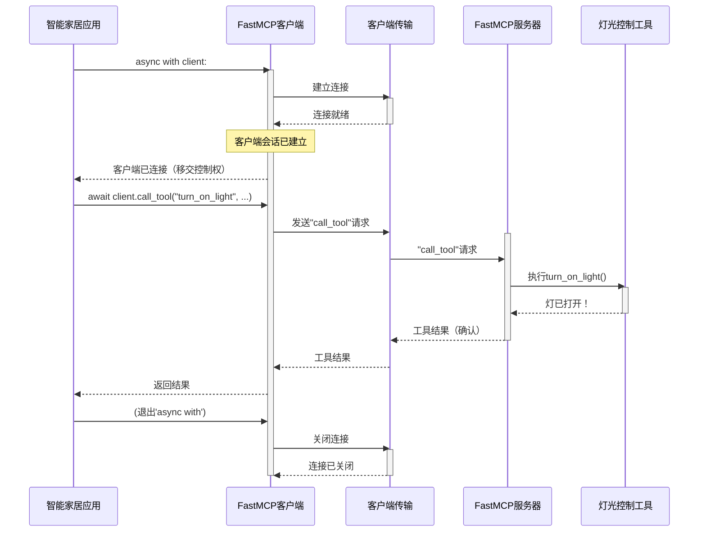

# 第2章：客户端

在第一章中，我们认识了[FastMCP服务器](01_fastmcp_server_.md)，这个中央枢纽（我们的"智能家居餐厅"）提供了各种服务。但餐厅需要顾客

这就是**客户端**的用武之地。

## 客户端解决什么问题？

想象我们的"智能家居助手"应用（如语音助手或移动应用）。它需要一种方式与[FastMCP服务器](01_fastmcp_server_.md)进行*对话*以实现功能。我们的语音助手如何告诉服务器：
*   "打开客厅的灯"
*   "厨房现在温度是多少？"
*   "给我一个个性化的早安问候"

`fastmcp`中的**`Client`**对象就是友好的信使。它是应用中==负责向[FastMCP服务器](01_fastmcp_server_.md)发送请求并理解响应的部分==。

## 客户端：智能家居的"声音"

将`Client`视为餐厅类比中的**顾客**：
*   **顾客（客户端）**：用户或应用（如智能家居助手）。我们不需要进厨房做饭，只需下单。
*   **下单（调用工具）**：当说"打开客厅的灯"时，`Client`将其转换为对服务器上特定[工具](03_tool_.md)的"订单"。
*   **请求信息（读取资源）**：当询问"温度是多少？"时，`Client`向[资源](04_resource_.md)请求信息。
*   **定制需求（获取提示）**：如果需要"个性化早安问候"，`Client`向[提示](05_prompt_.md)发送请求获取定制响应。

`Client`隐藏了网络通信的复杂细节。我们无需关心服务器是在本地计算机还是互联网上运行，或消息如何传输。`Client`处理所有这些，让我们专注于*想要做什么*。

## 创建第一个客户端

让我们创建一个能与智能家居服务器通信的客户端。假设第一章的[FastMCP服务器](01_fastmcp_server_.md)正在运行并可访问（例如在`http://localhost:8000`）。

```python
from fastmcp import Client

# 1. 创建客户端实例
# 它知道如何连接到这个地址的服务器
smart_home_client = Client("http://localhost:8000")

print(f"客户端已创建，准备连接到：{smart_home_client.transport}")
```

这段代码简单地导入`Client`并创建实例，提供服务器的地址（URL）。`Client`会根据提供的地址自动确定最佳通信方式。

我们也可以让`Client`直接连接到*同一Python程序*中运行的`FastMCP`服务器实例：

```python
from fastmcp import Client
from fastmcp.server import FastMCP

# 这是第一章的服务器
smart_home_server = FastMCP(name="我的进程内服务器")

# 创建直接与此服务器实例通信的客户端
# 非常适合测试或服务器和客户端在一个应用中
local_client = Client(smart_home_server)

print(f"客户端已创建，准备直接连接到：{local_client.transport}")
```

## 与服务器对话：调用工具

有了`Client`后，需要在`async with`代码块中使用它。这是客户端建立然后关闭与服务器连接的方式。在此代码块内可以发送请求。

假设智能家居服务器有一个名为`"turn_on_light"`的[工具](03_tool_.md)。

```python
import asyncio
from fastmcp import Client

# 准备与服务器通信的客户端（如http://localhost:8000）
smart_home_client = Client("http://localhost:8000")

async def control_lights():
    # 'async with client:'连接服务器并确保后续清理
    async with smart_home_client:
        print("客户端已连接到智能家居服务器！")

        # 1. 调用"turn_on_light"工具
        print("发送命令：'打开客厅的灯'...")
        result = await smart_home_client.call_tool(
            "turn_on_light",         # 工具名称
            {"room": "living room"}  # 工具参数
        )

        # 'result'包含工具返回的内容
        # 可能是文本、结构化数据或确认信息
        print(f"服务器响应：{result.data if result.data else result.content[0].text}")

        # 2. 假设有另一个工具："adjust_thermostat"
        print("发送命令：'将厨房温度设为22度'...")
        await smart_home_client.call_tool(
            "adjust_thermostat",
            {"room": "kitchen", "temperature_celsius": 22}
        )
        print("温控器已调整。")

    print("客户端已断开连接。")

# 运行异步函数
asyncio.run(control_lights())
```

**解释：**
1.  创建指向服务器的`Client`
2.  定义`async def control_lights():`函数，因为`fastmcp`操作是"异步的"——可以在程序执行其他操作时在后台运行
3.  `async with smart_home_client:`建立连接。就像走进餐厅、找桌子、准备点餐。`with`代码块结束时关闭连接（离开餐厅）
4.  `await smart_home_client.call_tool(...)`向服务器发送实际请求。指定要使用的[工具](03_tool_.md)名称（`"turn_on_light"`）和必要参数（`{"room": "living room"}`）
5.  `await`关键字表示程序将在此"等待"直到服务器响应
6.  `result`包含服务器的回答。如果工具工作正常，`result.data`或`result.content`会保存成功消息或工具返回的数据

## 客户端内部工作原理

使用`Client`时，特别是`async with`语句，后台发生了许多管理连接和通信的操作。



**步骤分解：**

1.  **`async with client:`**：`智能家居应用`初始化客户端的上下文管理器
2.  **客户端连接**：`FastMCP客户端`要求内部`ClientTransport`建立与服务器的连接
3.  **传输连接**：`ClientTransport`（处理HTTP、WebSockets或本地进程通信等实际网络协议）建立连接
4.  **会话就绪**：连接就绪后，`Client`建立MCP"会话"（持续对话通道）
5.  **`client.call_tool(...)`**：应用调用工具时，`Client`将其打包成MCP协议消息
6.  **传输发送请求**：`ClientTransport`通过网络将此消息发送给`FastMCP服务器`
7.  **服务器接收并委托**：`FastMCP服务器`接收请求，识别正确的[工具](03_tool_.md)（如`灯光控制工具`），要求其执行操作
8.  **工具执行**：[工具](03_tool_.md)完成工作（如开灯）
9.  **服务器响应**：[工具](03_tool_.md)的结果返回给`FastMCP服务器`，打包成MCP响应
10. **传输传递响应**：`ClientTransport`接收响应并传回`Client`
11. **客户端返回结果**：`Client`解包响应并将结果返回给`智能家居应用`
12. **退出`async with`**：应用退出`async with`代码块时，`Client`通知`ClientTransport`优雅关闭连接

## 内部结构

`Client`类位于`src/fastmcp/client/client.py`。看一些简化代码片段了解如何管理连接：

```python
# 来自src/fastmcp/client/client.py（简化版）
from fastmcp.client.transports import ClientTransportT, infer_transport

class Client(Generic[ClientTransportT]):
    def __init__(
        self,
        transport: Any, # 可以是URL、路径、服务器实例等
        name: str | None = None,
        # ... 其他处理器和配置 ...
    ) -> None:
        self.name = name or self.generate_name()
        # 关键在此：infer_transport确定如何连接！
        self.transport = cast(ClientTransportT, infer_transport(transport))
        # ... 更多设置 ...

    # 进入'async with client:'时调用
    async def __aenter__(self):
        return await self._connect() # 连接并设置会话

    # 退出'async with client:'时调用
    async def __aexit__(self, exc_type, exc_val, exc_tb):
        await self._disconnect() # 清理并关闭会话
```

如你所见，`Client`构造函数接收`transport`参数，可以是多种形式（如`"http://localhost:8000"`的URL字符串、文件路径或直接是`FastMCP`服务器对象）。`infer_transport`函数（来自`fastmcp/client/transports.py`）负责自动选择正确的`[ClientTransport](07_clienttransport_.md)`子类（如`StreamableHttpTransport`、`FastMCPTransport`、`PythonStdioTransport`）处理实际通信。

`_connect()`和`_disconnect()`方法对管理连接生命周期至关重要。它们确保开始与服务器交互时正确设置资源，完成时清理。

## 总结

我们了解到`Client`是`fastmcp`的"顾客"组件，使应用能与[FastMCP服务器](01_fastmcp_server_.md)交互。它通过抽象底层网络复杂性，简化了向[工具](03_tool_.md)、[资源](04_resource_.md)和[提示](05_prompt_.md)发送请求的过程。我们还学习了如何创建客户端、使用`async with`语句连接服务器以及发送第一个命令。

接下来，我们将深入探讨客户端可以下达的第一类"订单"：**[工具](03_tool_.md)**。

[下一章：工具](03_tool_.md)

