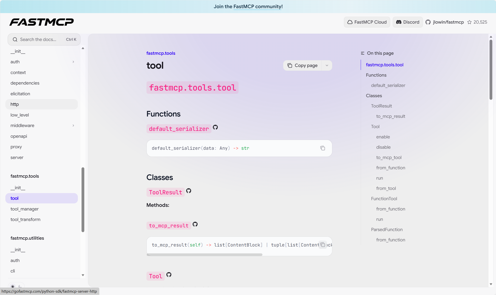
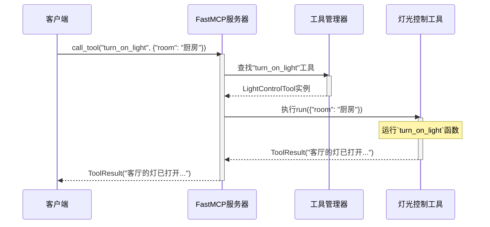

# 第3章：工具

[tool - FastMCP](https://gofastmcp.com/python-sdk/fastmcp-tools-tool)



在上一章中，我们学习了[客户端](02_client_.md)，这个向[FastMCP服务器](01_fastmcp_server_.md)发送请求的"顾客"。现在，让我们看看服务器"菜单"上的"菜品"——它能执行的实际操作。这就引出了**工具**的概念。

## 工具解决什么问题？

想象我们的智能家居助手。当我们说"打开客厅的灯"或"将温控器设为22度"时，[FastMCP服务器](01_fastmcp_server_.md)如何知道要*做什么*？它不可能神奇地理解每个请求。它需要明确、定义好的能力。

`工具`正是这样的：`FastMCP`服务器能够执行的已定义能力或操作。就像我们餐厅里的专业厨师。当顾客（[客户端](02_client_.md)）点特定菜品（调用`工具`）时，专业厨师知道如何准备它。

## 工具：服务器的专门操作

`fastmcp`中的`工具`是服务器暴露的特定功能。每个工具都有：

*   **明确名称**：[客户端](02_client_.md)如何引用它（如`"turn_on_light"`）
*   **描述**：解释工具的功能（如"打开指定房间的灯"）
*   **参数（输入模式）**：工具工作需要的信息。对于"开灯"，可能需要`room`（如"客厅"）和`brightness`（如80%）
*   **输出**：工具完成后返回的内容（如确认消息或数据）

客户端使用工具来触发计算、与物理设备交互或集成外部服务。

## 创建第一个工具：开灯

让我们为智能家居中枢创建一个简单工具：`turn_on_light`。这个工具将模拟打开指定房间的灯。

```python
from fastmcp.tools.tool import Tool

# 1. 为操作定义普通Python函数
def turn_on_light(room: str, brightness: int = 100) -> str:
    """
    打开指定房间的灯。
    参数：
        room: 房间名称（如"客厅"、"厨房"）。
        brightness: 亮度级别，0到100。
    返回：
        确认消息。
    """
    # 实际应用中，这会控制真实灯光！
    print(f"操作：将{room}的灯光亮度设为{brightness}%。")
    return f"{room}的灯已打开，亮度{brightness}%。"

# 2. 将函数转换为FastMCP工具
# FastMCP使用类型提示（如'room: str'）自动
# 理解参数及其类型。
light_tool = Tool.from_function(
    fn=turn_on_light,
    name="turn_on_light",
    description="以指定亮度打开特定房间的灯。",
)

print(f"工具'{light_tool.name}'已创建。")
print(f"工具描述：{light_tool.description}")
print(f"工具参数（输入模式）：{light_tool.parameters}")
print(f"工具输出模式：{light_tool.output_schema}")
```

**解释：**
*   首先定义普通Python函数`turn_on_light`。使用**类型提示**（`room: str`、`brightness: int`）明确定义函数期望的输入类型。这很关键，因为`fastmcp`用这些提示自动构建工具的"输入模式"（它接受的参数）
*   函数的`description`字符串（文档字符串）也被`fastmcp`自动用作工具描述，便于客户端理解
*   `Tool.from_function()`是将Python函数直接转为`fastmcp.Tool`对象的便捷方式。我们明确提供`name`，也可选择覆盖`description`

## 向服务器注册工具

有了`light_tool`对象后，需要将其添加到`FastMCP服务器`，让客户端能发现并使用它。就像向餐厅菜单添加新菜品。

```python
from fastmcp.server import FastMCP
from fastmcp.tools.tool import Tool # 假设light_tool已定义

# 第一章的服务器实例
smart_home_server = FastMCP(name="我的智能家居中枢")

# （假设turn_on_light函数和light_tool如上定义）
def turn_on_light(room: str, brightness: int = 100) -> str:
    # ...（函数体同前）...
    return f"{room}的灯已打开，亮度{brightness}%。"

light_tool = Tool.from_function(
    fn=turn_on_light,
    name="turn_on_light",
    description="以指定亮度打开特定房间的灯。",
)

# 3. 向服务器注册工具
smart_home_server.add_tool(light_tool)

print(f"已注册工具：{smart_home_server.list_tools()}")
# 预期输出：已注册工具：['turn_on_light']
```

现在，`smart_home_server`知道`turn_on_light`工具了。

## 从客户端调用工具

工具注册后，[客户端](02_client_.md)可以"点"这个"菜"了。

```python
import asyncio
from fastmcp import Client
from fastmcp.server import FastMCP
from fastmcp.tools.tool import Tool

# （假设turn_on_light函数和light_tool如上定义）
def turn_on_light(room: str, brightness: int = 100) -> str:
    print(f"操作：将{room}的灯光亮度设为{brightness}%。")
    return f"{room}的灯已打开，亮度{brightness}%。"

light_tool = Tool.from_function(
    fn=turn_on_light,
    name="turn_on_light",
    description="以指定亮度打开特定房间的灯。",
)

smart_home_server = FastMCP(name="我的智能家居中枢")
smart_home_server.add_tool(light_tool)

# 创建直接与此服务器通信的客户端（演示用）
local_client = Client(smart_home_server)

async def control_lights_with_tool():
    async with local_client:
        print("客户端已连接。")
        # 4. 调用注册的工具
        print("调用'turn_on_light'工具...")
        result = await local_client.call_tool(
            "turn_on_light",                 # 工具名称
            {"room": "厨房", "brightness": 75} # 工具参数
        )
        print(f"工具已执行。服务器响应：{result.content[0].text}")

        # 用默认亮度再次调用
        print("为客厅调用'turn_on_light'...")
        result_default = await local_client.call_tool(
            "turn_on_light",
            {"room": "客厅"} # 亮度将如函数默认设为100
        )
        print(f"工具已执行。服务器响应：{result_default.content[0].text}")
    print("客户端已断开连接。")

asyncio.run(control_lights_with_tool())
```

**解释：**
*   `local_client`（智能家居助手）使用`await local_client.call_tool()`
*   提供工具`name`（`"turn_on_light"`）和参数字典（`{"room": "厨房", "brightness": 75}`）
*   `fastmcp`服务器接收后，找到`light_tool`，用提供参数执行`turn_on_light`Python函数
*   函数返回值作为`ToolResult`对象的一部分发回客户端

## 工具内部工作原理

[客户端](02_client_.md)要求[FastMCP服务器](01_fastmcp_server_.md)调用`工具`时，简化流程如下：



**步骤分解：**

1.  **[客户端](02_client_.md)请求**：客户端向`FastMCP服务器`发送执行工具请求，指定名称（`"turn_on_light"`）和参数（`{"room": "厨房"}`）
2.  **服务器接收并委托**：`FastMCP服务器`接收请求。它不直接执行工具，而是委托内部`ToolManager`处理
3.  **工具管理器定位工具**：`ToolManager`从注册工具中查找对应`"turn_on_light"`的`工具`对象
4.  **工具执行`run()`方法**：找到后，`ToolManager`调用该`LightControlTool`实例的`run()`方法，传入客户端提供的参数
5.  **函数执行**：在`LightControlTool`中（本例是包装`turn_on_light`Python函数的`FunctionTool`），实际执行Python函数`turn_on_light`
6.  **工具返回结果**：`turn_on_light`的结果（如"客厅的灯已打开..."）打包成`ToolResult`对象
7.  **服务器发送响应**：`FastMCP服务器`将此`ToolResult`发回等待的[客户端](02_client_.md)

## 内部结构

`工具`核心逻辑在`src/fastmcp/tools/tool.py`，管理在`src/fastmcp/tools/tool_manager.py`。

`Tool`类是基类，但大多数简单情况会使用`FunctionTool`，由`Tool.from_function()`创建。

```python
# 来自src/fastmcp/tools/tool.py（简化版）

class Tool(FastMCPComponent):
    # ... name、description、tags等其他属性...
    parameters: dict[str, Any] # 保存输入的JSON模式
    output_schema: dict[str, Any] | None = None # 输出的JSON模式

    # 我们使用的工厂方法
    @staticmethod
    def from_function(
        fn: Callable[..., Any],
        name: str | None = None,
        # ... 其他参数...
    ) -> FunctionTool:
        # 内部调用FunctionTool.from_function创建
        return FunctionTool.from_function(...)

    # 所有工具必须实现此异步方法
    async def run(self, arguments: dict[str, Any]) -> ToolResult:
        raise NotImplementedError("子类必须实现run()")

class FunctionTool(Tool):
    fn: Callable[..., Any] # 实际Python函数

    @classmethod
    def from_function(
        cls,
        fn: Callable[..., Any],
        name: str | None = None,
        # ... 其他参数...
    ) -> FunctionTool:
        # 此方法使用'ParsedFunction'检查'fn'
        # 从类型提示和文档字符串自动生成'parameters'（输入模式）
        # 和'output_schema'
        parsed_fn = ParsedFunction.from_function(fn, exclude_args=exclude_args)
        # ... 构造并返回FunctionTool实例...

    async def run(self, arguments: dict[str, Any]) -> ToolResult:
        # 实际调用Python函数`fn`的地方！
        # 处理根据`parameters`模式验证参数，
        # 调用`self.fn(**arguments)`，打包结果
        # ... 参数验证...
        result = await self.fn(**arguments) # 执行函数！
        # ... 将结果打包为ToolResult...
        return ToolResult(...)
```

`ToolManager`（位于`src/fastmcp/tools/tool_manager.py`）负责存储和检索`工具`对象：

```python
# 来自src/fastmcp/tools/tool_manager.py（简化版）

class ToolManager:
    def __init__(self, ...):
        self._tools: dict[str, Tool] = {} # 存储注册工具

    def add_tool(self, tool: Tool) -> Tool:
        # 将工具添加到字典，以名称为键
        self._tools[tool.key] = tool
        return tool

    async def get_tool(self, key: str) -> Tool:
        # 按名称（key）检索工具
        # ... 未找到的错误处理...
        return self._tools[key]

    async def call_tool(self, key: str, arguments: dict[str, Any]) -> ToolResult:
        # FastMCP服务器调用执行工具的方法
        tool = await self.get_tool(key) # 查找工具
        return await tool.run(arguments) # 调用工具的run方法
```

还可以使用`src/fastmcp/contrib/mcp_mixin/mcp_mixin.py`中的`@mcp_tool`装饰器，将类方法注册为工具，这对在单个类中组织相关工具很有用。

```python
# 来自src/fastmcp/contrib/mcp_mixin/mcp_mixin.py（简化版）

from fastmcp.contrib.mcp_mixin.mcp_mixin import mcp_tool, MCPMixin
from fastmcp.server import FastMCP

class SmartHomeDevice(MCPMixin):
    def __init__(self, name: str):
        self.name = name

    @mcp_tool(name="toggle_light", description="切换电灯开关。")
    async def toggle_light_switch(self, room: str) -> str:
        return f"{room}的灯被{self.name}切换。"

# ... 之后...
server = FastMCP()
device = SmartHomeDevice("主中枢")
device.register_tools(server) # 发现@mcp_tool装饰的方法
```
这种装饰器方法为从单个类实例定义和注册多个工具提供了更清晰的方式，但`Tool.from_function`对独立函数同样强大。

## 总结

我们了解到`工具`是`FastMCP`服务器能执行的已定义操作或能力。就像专业厨师，接受特定参数（食材）并产生结果（成品菜）。我们学习了如何使用Python函数和类型提示定义工具、向服务器注册、然后从客户端调用。理解`工具`是用`fastmcp`构建交互式功能应用的基础。

接下来，我们将转向另一种"菜单项"：**[资源](04_resource_.md)**，它提供信息而非执行操作。

[下一章：资源](04_resource_.md)