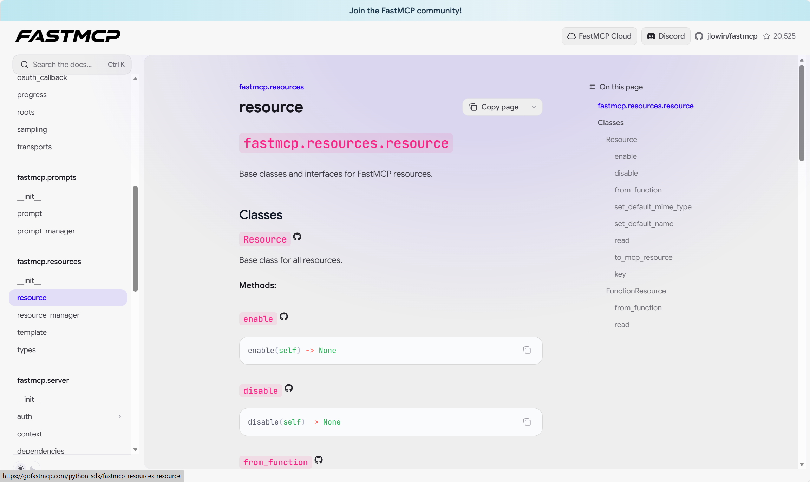
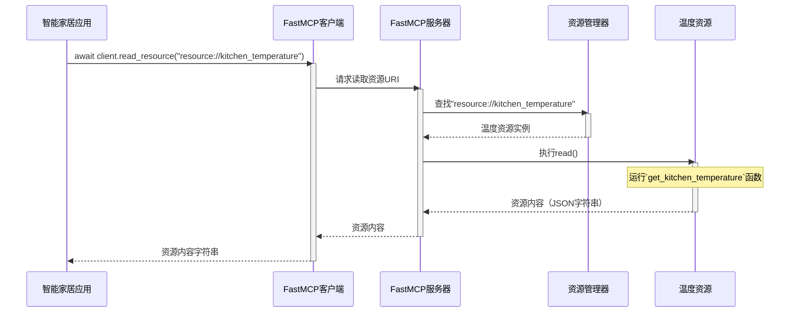

# 第4章：资源

[resource - FastMCP](https://gofastmcp.com/python-sdk/fastmcp-resources-resource)



在我们探索`fastmcp`的旅程中，我们已经将[FastMCP服务器](01_fastmcp_server_.md)视为"==智能家居餐厅=="，而[客户端](02_client_.md)则是=="下单"的顾客==。

在上一章中，我们重点介绍了[工具](03_tool_.md)——服务器可以*执行*的"菜品"或操作，比如"==开灯=="。

但如果我们需要的是*获取信息*而非*执行操作*呢？想象餐厅里还有一块"==信息公告板=="或"每日特供"清单。我们不会"点"每日特供，而是"查看"它们了解有什么可选。这就是**资源**概念的用武之地。

## 资源解决什么问题？

在智能家居助手中，我们可能会询问：
*   "厨房现在温度是多少？"
*   "显示今天的天气预报"
*   "给我最新的新闻头条"

这些都是对*信息*或*数据*的请求，而非要求执行操作

我们不是让服务器*改变*什么，只是想*读取*某些内容。`资源`是`FastMCP`服务器提供这类数据的完美方式。

## 资源：服务器的信息公告板

`fastmcp`中的`资源`是服务器提供的一段数据或内容，供客户端读取。就像餐厅公告板上的信息条目，详细说明每日特供或提供过敏信息。

每个`资源`都有几个关键特征：

*   **唯一URI（统一资源标识符）**：信息的唯一地址或名称标签。例如`resource://kitchen_temperature`或`resource://weather_forecast`。客户端使用此URI请求特定信息
*   **描述**：对资源提供内容的简短说明
*   **内容类型（MIME类型）**：告诉客户端预期数据类型（如简单文本用`text/plain`，结构化数据用`application/json`，图片用`image/png`）
*   **内容本身**：实际数据（如"23°C"、"晴天，最高25°C"或图像文件）

客户端可以通过URI请求"读取"资源内容。服务器随后检索并发送该内容。资源可以是简单的静态文本、来自传感器的动态数据，或从其他在线服务获取的信息。

## 创建第一个资源：厨房温度

让我们为智能家居中枢创建一个提供当前厨房温度的资源。本例中我们使用简单的硬编码值，但在实际应用中，这可能来自传感器。

```python
from fastmcp.resources.resource import Resource
import json

# 1. 定义提供数据的普通Python函数
def get_kitchen_temperature() -> str:
    """
    提供厨房当前温度。
    """
    # 实际应用中，这会读取温度传感器！
    temperature_data = {"room": "kitchen", "temperature_celsius": 23, "unit": "celsius"}
    print(f"操作：读取厨房温度：{temperature_data['temperature_celsius']}°C")
    return json.dumps(temperature_data) # 结构化数据通常以JSON返回

# 2. 将函数转换为FastMCP资源
# 需要提供唯一URI和内容类型
temperature_resource = Resource.from_function(
    fn=get_kitchen_temperature,
    uri="resource://kitchen_temperature",
    name="厨房温度",
    description="提供厨房当前温度。",
    mime_type="application/json", # 返回JSON数据
)

print(f"资源'{temperature_resource.name}'已创建。")
print(f"资源URI：{temperature_resource.uri}")
print(f"资源MIME类型：{temperature_resource.mime_type}")
```

**解释：**
*   定义标准Python函数`get_kitchen_temperature`返回字符串。使用`json.dumps`明确表示此资源提供JSON格式的结构化数据，这很常见
*   `Resource.from_function()`是包装Python函数使其成为`fastmcp.Resource`的便捷方式
*   提供`uri`（`"resource://kitchen_temperature"`）作为唯一标识符。客户端通过此请求*特定信息*
*   指定`mime_type`为`"application/json"`，因为函数返回JSON

## 向服务器注册资源

与[工具](03_tool_.md)类似，需要将`temperature_resource`添加到`FastMCP服务器`，让客户端知道它的存在并能"读取"。就像在公告板上添加新条目。

```python
from fastmcp.server import FastMCP
from fastmcp.resources.resource import Resource # 假设temperature_resource已定义

# 第一章的服务器实例
smart_home_server = FastMCP(name="我的智能家居中枢")

# （假设get_kitchen_temperature函数和temperature_resource如上定义）
def get_kitchen_temperature() -> str:
    # ...（函数体同前）...
    return json.dumps({"room": "kitchen", "temperature_celsius": 23, "unit": "celsius"})

temperature_resource = Resource.from_function(
    fn=get_kitchen_temperature,
    uri="resource://kitchen_temperature",
    name="厨房温度",
    description="提供厨房当前温度。",
    mime_type="application/json",
)

# 3. 向服务器注册资源
smart_home_server.add_resource(temperature_resource)

print(f"已注册资源：{smart_home_server.list_resources()}")
# 预期输出：已注册资源：['resource://kitchen_temperature']
```

现在，`smart_home_server`知道`kitchen_temperature`资源了。

## 从客户端读取资源

资源注册后，[客户端](02_client_.md)可以"读取"此信息。

```python
import asyncio
from fastmcp import Client
from fastmcp.server import FastMCP
from fastmcp.resources.resource import Resource
import json # 别忘了导入json

# （假设get_kitchen_temperature函数和temperature_resource如上定义）
def get_kitchen_temperature() -> str:
    print("操作：从传感器读取厨房温度...")
    return json.dumps({"room": "kitchen", "temperature_celsius": 23, "unit": "celsius"})

temperature_resource = Resource.from_function(
    fn=get_kitchen_temperature,
    uri="resource://kitchen_temperature",
    name="厨房温度",
    description="提供厨房当前温度。",
    mime_type="application/json",
)

smart_home_server = FastMCP(name="我的智能家居中枢")
smart_home_server.add_resource(temperature_resource)

# 创建直接与此服务器通信的客户端（演示用）
local_client = Client(smart_home_server)

async def read_smart_home_info():
    async with local_client:
        print("客户端已连接。")
        # 4. 读取注册的资源
        print("请求'kitchen_temperature'资源...")
        resource_content = await local_client.read_resource("resource://kitchen_temperature")

        # 'resource_content'是字符串或字节，取决于mime_type
        print(f"接收的原始内容：{resource_content}")

        # 如果是JSON，可以解析
        parsed_data = json.loads(resource_content)
        print(f"解析后的厨房温度：{parsed_data['temperature_celsius']}°C")

    print("客户端已断开连接。")

asyncio.run(read_smart_home_info())
```

**解释：**
*   `local_client`（智能家居助手）使用`await local_client.read_resource()`
*   提供资源`uri`（`"resource://kitchen_temperature"`）
*   `fastmcp`服务器接收后，找到`temperature_resource`，执行`get_kitchen_temperature`Python函数
*   函数返回值（JSON字符串）发回客户端
*   客户端接收原始字符串并用`json.loads()`解析以处理结构化数据

## 资源内部工作原理

[客户端](02_client_.md)要求[FastMCP服务器](01_fastmcp_server_.md)读取`资源`时，简化流程如下：



**步骤分解：**

1.  **[客户端](02_client_.md)请求**：客户端向`FastMCP服务器`发送读取资源请求，指定URI（`"resource://kitchen_temperature"`）
2.  **服务器接收并委托**：`FastMCP服务器`接收请求。它委托内部`ResourceManager`处理此任务
3.  **资源管理器定位资源**：`ResourceManager`从注册资源中查找对应`"resource://kitchen_temperature"`的`资源`对象
4.  **资源执行`read()`方法**：找到后，`ResourceManager`调用该`温度资源`实例的`read()`方法
5.  **函数执行**：在`温度资源`中（本例是包装`get_kitchen_temperature`Python函数的`FunctionResource`），实际执行Python函数`get_kitchen_temperature`
6.  **资源返回内容**：`get_kitchen_temperature`的结果（如JSON字符串）返回
7.  **服务器发送响应**：`FastMCP服务器`将此内容发回等待的[客户端](02_client_.md)

## 内部结构

`资源`核心逻辑在`src/fastmcp/resources/resource.py`，管理在`src/fastmcp/resources/resource_manager.py`。

`Resource`类是基类，但大多数简单情况会使用`FunctionResource`，由`Resource.from_function()`创建。

```python
# 来自src/fastmcp/resources/resource.py（简化版）

class Resource(FastMCPComponent):
    uri: AnyUrl = Field(default=..., description="资源的URI")
    name: str = Field(default="", description="资源名称")
    mime_type: str = Field(default="text/plain", ...)
    # ... description、tags、annotations等其他属性...

    # 我们使用的工厂方法
    @staticmethod
    def from_function(
        fn: Callable[..., Any],
        uri: str | AnyUrl,
        name: str | None = None,
        # ... 其他参数...
    ) -> FunctionResource:
        # 内部调用FunctionResource.from_function创建
        return FunctionResource.from_function(...)

    # 所有资源必须实现此异步方法以提供内容
    async def read(self) -> str | bytes:
        raise NotImplementedError("子类必须实现read()")

class FunctionResource(Resource):
    fn: Callable[..., Any] # 实际Python函数

    @classmethod
    def from_function(
        cls,
        fn: Callable[..., Any],
        uri: str | AnyUrl,
        name: str | None = None,
        # ... 其他参数...
    ) -> FunctionResource:
        # 此方法使用'inspect.getdoc(fn)'获取描述
        # 并在未提供时推断mime_type
        # ... 构造并返回FunctionResource实例...

    async def read(self) -> str | bytes:
        # 实际调用Python函数`fn`的地方！
        result = self.fn() # 执行函数！
        if inspect.isawaitable(result):
            result = await result
        # ... 根据mime_type将结果转为str或bytes...
        return result
```

`ResourceManager`（位于`src/fastmcp/resources/resource_manager.py`）负责存储和检索`资源`对象：

```python
# 来自src/fastmcp/resources/resource_manager.py（简化版）

class ResourceManager:
    def __init__(self, ...):
        self._resources: dict[str, Resource] = {} # 存储注册资源
        self._templates: dict[str, ResourceTemplate] = {} # 动态资源用

    def add_resource(self, resource: Resource) -> Resource:
        # 将资源添加到字典，以URI为键
        self._resources[resource.key] = resource
        return resource

    async def get_resource(self, uri: AnyUrl | str) -> Resource:
        # 按URI（key）检索资源
        # ... 也处理资源模板和错误...
        return self._resources[str(uri)]

    async def read_resource(self, uri: AnyUrl | str) -> str | bytes:
        # FastMCP服务器调用读取资源的方法
        resource = await self.get_resource(uri) # 查找资源
        return await resource.read() # 调用资源的read方法
```

还可以使用`src/fastmcp/contrib/mcp_mixin/mcp_mixin.py`中的`@mcp_resource`装饰器，将类方法注册为资源，类似于`@mcp_tool`的工作方式。

```python
# 来自src/fastmcp/contrib/mcp_mixin/mcp_mixin.py（简化版）

from fastmcp.contrib.mcp_mixin.mcp_mixin import mcp_resource, MCPMixin
from fastmcp.server import FastMCP

class SmartHomeInfo(MCPMixin):
    def __init__(self, name: str):
        self.name = name

    @mcp_resource(
        uri="resource://weather",
        name="本地天气",
        description="提供当前本地天气情况。",
        mime_type="text/plain"
    )
    async def get_weather_forecast(self) -> str:
        return f"{self.name}的天气是晴天，25°C。"

# ... 之后...
server = FastMCP()
info_hub = SmartHomeInfo("我的城市")
info_hub.register_resources(server) # 发现@mcp_resource装饰的方法
```
这种装饰器为在类中定义和注册多个资源提供了结构化方式，非常适合组织服务器的信息。

## 总结

我们了解到`资源`是`FastMCP`服务器提供的一段定义好的数据或内容，供客户端"读取"

就像餐厅的公告板，提供详情而非执行操作。我们学习了如何使用Python函数定义资源、分配唯一URI、向服务器注册、然后从客户端读取其内容。理解`资源`让服务器能与其他应用共享有价值的信息。

接下来，我们将探索**[提示](05_prompt_.md)**，这是服务器交互的另一种强大方式，专注于根据客户端输入生成定制化、类人响应。

[下一章：提示](05_prompt_.md)

（可以联想到之前rpc的注册和读取~架构异曲同工之妙）

