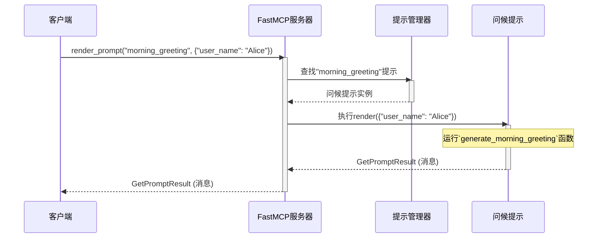

# 第5章：提示

[prompt - FastMCP](https://gofastmcp.com/python-sdk/fastmcp-prompts-prompt)


在上一章中，我们学习了[资源](04_resource_.md)，这是[FastMCP服务器](01_fastmcp_server_.md)提供静态或动态信息的方式，比如==查询"厨房温度"==。我们还介绍了[工具](03_tool_.md)，这是服务器可以执行的操作，比如"开灯"。

但如果我们需要比固定信息更动态灵活、且更专注于生成文本而非执行操作的功能呢？

这在需要为大型语言模型（LLMs）等高级系统创建定制文本输入时特别有用。这就引出了**提示**的概念。

## 提示解决什么问题？

假设我们希望智能家居助手生成个性化的早安问候。它不应该只是机械地说"早上好"，而应该考虑：
*   当前用户（如"Alice"或"Bob"）
*   用户偏好（如"喜欢鼓励性消息"）
*   甚至结合当天天气或即将到来的日程

这不仅仅是"获取信息"（[资源](04_resource_.md)），也不是"执行操作"（[工具](03_tool_.md)）。它需要接收输入，用其填充模板，生成定制化、类人的消息。

`fastmcp`中的`提示`正是为此而生：可定制的文本模板。就像餐厅类比中的**特殊订单表**。我们（[客户端](02_client_.md)）在表格（`提示`的参数）中填写一些细节，服务器（厨师）用这些细节准备独特的个性化消息或"餐点"。

提示专为灵活、动态的内容生成设计，特别适合为AI模型构造输入。

## 提示：服务器的特殊订单表

`fastmcp`中的`提示`是生成定制文本的已定义方式。它包含：

*   **名称**：[客户端](02_client_.md)如何引用它（如`"morning_greeting"`）
*   **描述**：说明提示生成何种文本
*   **参数（输入模式）**：订单表上可定制的"空白处"，客户端可填写。早安问候可能包括`user_name`或`mood_preference`
*   **生成输出**：最终格式化消息或消息列表，通常采用适合LLMs的结构化格式

客户端使用提示要求服务器"渲染"或"填写"此特殊订单表，提供参数后接收量身定制的文本。

## 创建第一个提示：个性化问候

让我们为智能家居中枢创建生成个性化早安问候的提示。

```python
from fastmcp.prompts.prompt import Prompt, Message

# 1. 定义生成问候语的普通Python函数
def generate_morning_greeting(user_name: str, mood: str = "neutral") -> list[Message]:
    """
    生成个性化早安问候。
    参数：
        user_name: 要问候的用户名。
        mood: 问候的期望情绪（如"happy"、"calm"、"neutral"）。
    返回：
        问候消息列表。
    """
    greeting_text = f"早上好，{user_name}！"
    if mood == "happy":
        greeting_text += " 祝您度过精彩的一天！"
    elif mood == "calm":
        greeting_text += " 愿您拥有宁静的早晨。"
    else: # neutral
        greeting_text += " 祝您今天高效充实。"

    print(f"操作：为{user_name}生成情绪为'{mood}'的问候语。")
    # 提示通常返回Message对象列表
    return [Message(content=greeting_text, role="assistant")]

# 2. 将函数转换为FastMCP提示
# FastMCP使用类型提示（如'user_name: str'）自动
# 理解参数及其类型。
greeting_prompt = Prompt.from_function(
    fn=generate_morning_greeting,
    name="morning_greeting",
    description="根据用户和情绪生成个性化早安问候。",
)

print(f"提示'{greeting_prompt.name}'已创建。")
print(f"提示描述：{greeting_prompt.description}")
print(f"提示参数（输入模式）：{greeting_prompt.arguments}")
```

**解释：**
*   定义标准Python函数`generate_morning_greeting`。与[工具](03_tool_.md)类似，使用**类型提示**（`user_name: str`、`mood: str`）告诉`fastmcp`函数期望的参数类型
*   函数的文档字符串自动用作提示描述
*   函数返回`Message`对象列表。`Message`是`fastmcp.prompts.prompt`的辅助类，用于创建结构化消息，这在LLM工作中很常见。`role="assistant"`表示此消息来自AI或助手
*   `Prompt.from_function()`将Python函数转为`fastmcp.Prompt`对象，自动提取名称、描述和参数

## 向服务器==注册提示==

创建`greeting_prompt`对象后，需将其添加到`FastMCP服务器`，让客户端能发现并使用。就像向餐厅菜品中添加新订单表。

```python
from fastmcp.server import FastMCP
from fastmcp.prompts.prompt import Prompt, Message # 假设greeting_prompt已定义

# 第一章的服务器实例
smart_home_server = FastMCP(name="我的智能家居中枢")

# （假设generate_morning_greeting函数和greeting_prompt如上定义）
def generate_morning_greeting(user_name: str, mood: str = "neutral") -> list[Message]:
    # ...（函数体同前）...
    return [Message(content=f"早上好，{user_name}！祝您{mood}的一天。", role="assistant")]

greeting_prompt = Prompt.from_function(
    fn=generate_morning_greeting,
    name="morning_greeting",
    description="根据用户和情绪生成个性化早安问候。",
)

# 3. 向服务器注册提示
smart_home_server.add_prompt(greeting_prompt)

print(f"已注册提示：{smart_home_server.list_prompts()}")
# 预期输出：已注册提示：['morning_greeting']
```

现在，`smart_home_server`知道如何生成个性化早安问候了。

## 从客户端==渲染提示==

提示注册后，[客户端](02_client_.md)可以"填写特殊订单表"并接收定制消息。

```python
import asyncio
from fastmcp import Client
from fastmcp.server import FastMCP
from fastmcp.prompts.prompt import Prompt, Message

# （假设generate_morning_greeting函数和greeting_prompt如上定义）
def generate_morning_greeting(user_name: str, mood: str = "neutral") -> list[Message]:
    print(f"操作：为{user_name}生成情绪为'{mood}'的问候语。")
    return [Message(content=f"早上好，{user_name}！祝您{mood}的一天。", role="assistant")]

greeting_prompt = Prompt.from_function(
    fn=generate_morning_greeting,
    name="morning_greeting",
    description="根据用户和情绪生成个性化早安问候。",
)

smart_home_server = FastMCP(name="我的智能家居中枢")
smart_home_server.add_prompt(greeting_prompt)

# 创建直接与此服务器通信的客户端（演示用）
local_client = Client(smart_home_server)

async def get_custom_greeting():
    async with local_client:
        print("客户端已连接。")
        # 4. 渲染注册的提示
        print("为Alice请求情绪'happy'的'morning_greeting'...")
        prompt_result = await local_client.render_prompt(
            "morning_greeting",                  # 提示名称
            {"user_name": "Alice", "mood": "happy"} # 提示参数
        )

        # 结果包含描述和消息列表
        print(f"提示描述：{prompt_result.description}")
        for msg in prompt_result.messages:
            print(f"  [{msg.role}] {msg.content[0].text}")

        # 用默认情绪为Bob再试一次
        print("\n为Bob请求'morning_greeting'...")
        prompt_result_bob = await local_client.render_prompt(
            "morning_greeting",
            {"user_name": "Bob"} # 情绪将如函数默认设为"neutral"
        )
        for msg in prompt_result_bob.messages:
            print(f"  [{msg.role}] {msg.content[0].text}")

    print("客户端已断开连接。")

asyncio.run(get_custom_greeting())
```

**解释：**
*   `local_client`（智能家居助手）使用`await local_client.render_prompt()`
*   提供提示`name`（`"morning_greeting"`）和参数字典（`{"user_name": "Alice", "mood": "happy"}`）
*   `fastmcp`服务器接收后，找到`greeting_prompt`，用提供参数执行`generate_morning_greeting`Python函数
*   函数返回值（`Message`对象列表）作为`GetPromptResult`对象的一部分发回客户端
*   客户端从`prompt_result.messages`访问生成的消息

## 提示内部工作原理

[客户端](02_client_.md)要求[FastMCP服务器](01_fastmcp_server_.md)渲染`提示`时，简化流程如下：



**步骤分解：**

1.  **[客户端](02_client_.md)请求**：客户端向`FastMCP服务器`发送渲染提示请求，指定名称（`"morning_greeting"`）和参数（`{"user_name": "Alice"}`）
2.  **服务器接收并委托**：`FastMCP服务器`接收请求。它不直接渲染提示，而是委托内部`PromptManager`处理此任务
3.  **提示管理器定位提示**：`PromptManager`从注册提示中查找对应`"morning_greeting"`的`提示`对象
4.  **提示执行`render()`方法**：找到后，`PromptManager`调用该`问候提示`实例的`render()`方法，传入客户端提供的参数
5.  **函数执行**：在`问候提示`中（本例是包装`generate_morning_greeting`Python函数的`FunctionPrompt`），实际执行Python函数`generate_morning_greeting`
6.  **提示返回结果**：`generate_morning_greeting`的结果（如`Message`对象列表）打包成`GetPromptResult`对象
7.  **服务器发送响应**：`FastMCP服务器`将此`GetPromptResult`发回等待的[客户端](02_client_.md)

## 内部结构

`提示`核心逻辑在`src/fastmcp/prompts/prompt.py`，管理在`src/fastmcp/prompts/prompt_manager.py`。

`Prompt`类是基类，但大多数简单情况会使用`FunctionPrompt`，由`Prompt.from_function()`创建。

```python
# 来自src/fastmcp/prompts/prompt.py（简化版）

class Prompt(FastMCPComponent):
    arguments: list[PromptArgument] | None = Field(...) # 输入参数列表

    @staticmethod
    def from_function(
        fn: Callable[..., PromptResult | Awaitable[PromptResult]],
        name: str | None = None,
        # ... 其他参数...
    ) -> FunctionPrompt:
        # 内部调用FunctionPrompt.from_function创建
        return FunctionPrompt.from_function(...)

    async def render(
        self,
        arguments: dict[str, Any] | None = None,
    ) -> list[PromptMessage]:
        raise NotImplementedError("子类必须实现render()")

class FunctionPrompt(Prompt):
    fn: Callable[..., PromptResult | Awaitable[PromptResult]] # 实际Python函数

    @classmethod
    def from_function(
        cls,
        fn: Callable[..., PromptResult | Awaitable[PromptResult]],
        # ... 参数...
    ) -> FunctionPrompt:
        # 此方法使用'inspect.signature(fn)'和Pydantic的TypeAdapter
        # 从类型提示和文档字符串自动生成'arguments'
        # 也处理特殊参数如'Context'
        # ... 构造并返回FunctionPrompt实例...

    async def render(
        self,
        arguments: dict[str, Any] | None = None,
    ) -> list[PromptMessage]:
        # 实际调用Python函数`fn`的地方！
        # 处理：
        # 1. 验证必需参数
        # 2. 如果函数需要，注入Context
        # 3. 用Pydantic将客户端的字符串参数转为预期Python类型
        #    （如"true"转True，"123"转123，JSON字符串转字典）
        kwargs = self._convert_string_arguments(arguments) # 重要转换步骤！
        result = self.fn(**kwargs) # 执行函数！
        if inspect.isawaitable(result):
            result = await result
        # ... 将结果（str、dict、Message或其列表）转为list[PromptMessage]...
        return messages # 生成的消息列表
```

`PromptManager`（位于`src/fastmcp/prompts/prompt_manager.py`）负责存储和检索`提示`对象：

```python
# 来自src/fastmcp/prompts/prompt_manager.py（简化版）

class PromptManager:
    def __init__(self, ...):
        self._prompts: dict[str, Prompt] = {} # 存储注册提示

    def add_prompt(self, prompt: Prompt) -> Prompt:
        # 将提示添加到字典，以名称为键
        self._prompts[prompt.key] = prompt
        return prompt

    async def get_prompt(self, key: str) -> Prompt:
        # 按名称（key）检索提示
        # ... 未找到的错误处理...
        return self._prompts[key]

    async def render_prompt(
        self,
        name: str,
        arguments: dict[str, Any] | None = None,
    ) -> GetPromptResult:
        # FastMCP服务器调用渲染提示的方法
        prompt = await self.get_prompt(name) # 查找提示
        messages = await prompt.render(arguments) # 调用提示的render方法
        return GetPromptResult(description=prompt.description, messages=messages)
```

还可以使用`src/fastmcp/contrib/mcp_mixin/mcp_mixin.py`中的`@mcp_prompt`装饰器，将类方法注册为提示，类似于`@mcp_tool`和`@mcp_resource`的工作方式。

```python
# 来自src/fastmcp/contrib/mcp_mixin/mcp_mixin.py（简化版）

from fastmcp.contrib.mcp_mixin.mcp_mixin import mcp_prompt, MCPMixin
from fastmcp.server import FastMCP

class SmartHomeGreetings(MCPMixin):
    @mcp_prompt(
        name="daily_advice",
        description="提供针对用户的每日建议。"
    )
    async def get_daily_advice(self, user_name: str, topic: str = "general") -> list[Message]:
        advice_text = f"你好{user_name}！这是关于{topic}的每日建议：保持好奇心。"
        return [Message(content=advice_text, role="assistant")]

# ... 之后...
server = FastMCP()
greetings_hub = SmartHomeGreetings()
greetings_hub.register_prompts(server) # 发现@mcp_prompt装饰的方法
```
这种装饰器方法为在单个类中定义和组织多个提示提供了清晰方式，使服务器的自定义文本生成能力结构良好。

## 总结

我们了解到`fastmcp`中的`提示`就像特殊订单表，允许服务器基于客户端提供的参数生成高度可定制的文本响应

它非常适合个性化问候或为AI模型创建动态输入等任务。我们学习了如何用带类型提示的Python函数定义提示、向服务器注册、然后从客户端渲染以接收定制消息。理解`提示`为`fastmcp`应用中的动态内容生成开启了强大可能性。

接下来，我们将深入探讨**[上下文](06_context_.md)**，这对在[工具](03_tool_.md)、[资源](04_resource_.md)和[提示](05_prompt_.md)运行时提供额外动态信息至关重要。

[下一章：上下文](06_context_.md)

