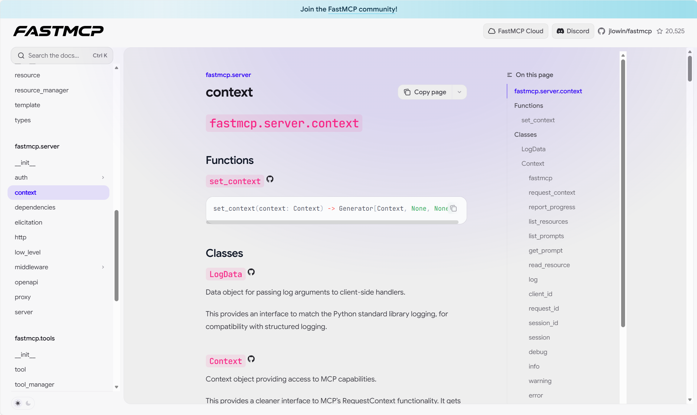
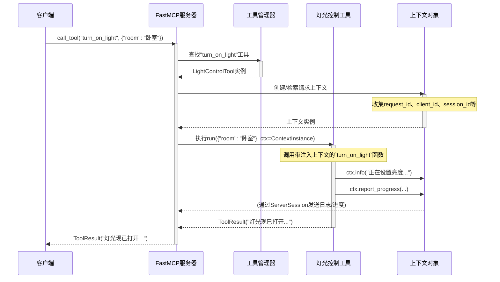

# 第6章：上下文

[context - FastMCP](https://gofastmcp.com/python-sdk/fastmcp-server-context)



在上一章中，我们探讨了[提示](05_prompt_.md)，它让[FastMCP服务器](01_fastmcp_server_.md)能基于客户端输入生成定制化动态文本。至此，我们已经了解了如何定义操作（[工具](03_tool_.md)）、提供信息（[资源](04_resource_.md)）和生成动态文本（[提示](05_prompt_.md)）。

但当[工具](03_tool_.md)、[资源](04_resource_.md)或[提示](05_prompt_.md)实际*运行时*，它们通常需要比[客户端](02_client_.md)直接提供的参数更多的信息。它们可能需要知道：
*   具体是哪个客户端发出的请求？
*   本次请求的唯一ID是什么？
*   如何向客户端发送进度更新或日志消息？
*   能否从*当前操作内部*访问其他[工具](03_tool_.md)或[资源](04_resource_.md)？
*   有没有方法存储一些数据供*同一请求*的其他部分使用？

这就是**`上下文`**对象的用武之地。

## 上下文解决什么问题？

假设智能家居助手正告诉[FastMCP服务器](01_fastmcp_server_.md)："打开客厅的灯。"虽然`turn_on_light`[工具](03_tool_.md)知道*如何*开灯，但它可能还想：
*   **日志记录**：向客户端发送消息"客厅灯光已设为75%亮度"，以便客户端展示给用户
*   **身份识别**：知道是*哪个具体*语音助手（如"Alice的手机"）发出的请求，可能用于检查权限或定制响应
*   **协调**：如果开灯还涉及检查当前亮度，`turn_on_light`工具可能需要*读取另一个[资源](04_resource_.md)*如`resource://living_room_light_sensor`

`上下文`对象就像伴随每个"厨师"（[工具](03_tool_.md)）、"信息提供者"（[资源](04_resource_.md)）或"定制订单准备者"（[提示](05_prompt_.md)）的"私人助理"。这位助理携带关于当前请求、客户端、会话的所有关键细节，并提供特殊能力（如日志记录或访问其他服务器组件）。

## 上下文：私人助理

`上下文`对象在函数运行时提供关键的动态信息和能力。如果函数请求它，`fastmcp`会自动提供。

以下是`上下文`对象能提供的一些关键功能：

*   **请求信息：**
    *   `ctx.request_id`：当前请求的唯一标识符
    *   `ctx.client_id`：标识发出请求的特定[客户端](02_client_.md)应用
    *   `ctx.session_id`：同一[客户端](02_client_.md)会话多次请求间保持不变的ID，用于存储会话特定数据

*   **通信能力：**
    *   `ctx.info(message)`：向客户端发送信息性日志消息。还有`debug()`、`warning()`、`error()`方法
    *   `ctx.report_progress(progress, total, message)`：为长时间运行操作向客户端发送进度更新

*   **服务器交互：**
    *   `ctx.read_resource(uri)`：从当前函数内读取同一服务器上另一[资源](04_resource_.md)的内容
    *   `ctx.get_prompt(name, arguments)`：渲染同一服务器上的另一[提示](05_prompt_.md)

*   **状态管理：**
    *   `ctx.set_state(key, value)`：存储可被*同一请求*内其他函数或中间件共享和检索的数据
    *   `ctx.get_state(key)`：检索上下文状态中存储的数据

**如何获取？**只需在函数中添加参数并标注类型提示`Context`。`fastmcp`会自动检测并注入当前请求的正确`上下文`对象。

## 在工具中使用上下文：增强灯光控制

让我们增强[第3章：工具](03_tool_.md)中的`turn_on_light`[工具](03_tool_.md)以使用`上下文`对象。我们将让它记录信息回客户端，并在内部打印中包含`request_id`。

首先，带`上下文`参数的`turn_on_light`函数如下：

```python
from fastmcp.tools.tool import Tool
from fastmcp.server import FastMCP, Context # 导入Context

# 1. 定义带'ctx: Context'参数的函数
async def turn_on_light(room: str, brightness: int = 100, ctx: Context) -> str:
    """
    打开指定房间的灯并报告进度。
    参数：
        room: 房间名称。
        brightness: 亮度级别(0-100)。
        ctx: FastMCP上下文对象，自动提供。
    返回：
        确认消息。
    """
    request_id = ctx.request_id # 获取唯一请求ID
    print(f"[{request_id}] 操作：将{room}灯光设为{brightness}%...")

    # 向客户端报告进度
    await ctx.report_progress(25, 100, f"正在初始化{room}灯光...")
    await ctx.info(f"正在将{room}亮度设为{brightness}%。") # 记录到客户端

    # 模拟灯光激活延迟
    await anyio.sleep(0.1) # 需要'anyio'实现异步sleep

    await ctx.report_progress(75, 100, f"正在激活{room}灯光...")

    # 实际应用中，这会控制真实灯光！
    await ctx.debug(f"已发送{room}硬件命令。") # 调试日志到客户端

    await anyio.sleep(0.1)

    # 最终日志和进度
    await ctx.report_progress(100, 100, f"{room}灯光已打开。")
    await ctx.info(f"{room}灯光现为{brightness}%。请求完成。")

    return f"{room}灯光现为{brightness}%。"

# 2. 将函数转换为FastMCP工具
# 注意：定义工具方式不变，Context自动处理！
light_tool = Tool.from_function(
    fn=turn_on_light,
    name="turn_on_light",
    description="以指定亮度打开特定房间的灯并报告进度。",
)

print(f"工具'{light_tool.name}'已创建，可使用上下文。")
```

**解释：**
*   我们添加`ctx: Context`作为`turn_on_light`函数的参数。这是告诉`fastmcp`提供上下文对象所需的全部
*   函数内部，使用`ctx.request_id`获取当前请求ID
*   使用`await ctx.report_progress(...)`和`await ctx.info(...)`、`await ctx.debug(...)`向客户端发送消息和进度更新。这些是`async`操作，所以需要`await`
*   添加`anyio.sleep`模拟现实操作耗时

现在，将此增强工具注册到[FastMCP服务器](01_fastmcp_server_.md)并从[客户端](02_client_.md)调用。

```python
import asyncio
from fastmcp import Client
from fastmcp.server import FastMCP, Context
from fastmcp.tools.tool import Tool
import anyio # sleep函数需要

# （假设turn_on_light函数和light_tool如上定义）
async def turn_on_light(room: str, brightness: int = 100, ctx: Context) -> str:
    # ...（函数体同前）...
    request_id = ctx.request_id
    print(f"[{request_id}] 操作：将{room}灯光设为{brightness}%...")
    await ctx.report_progress(25, 100, f"正在初始化{room}灯光...")
    await ctx.info(f"正在将{room}亮度设为{brightness}%。")
    await anyio.sleep(0.1)
    await ctx.report_progress(75, 100, f"正在激活{room}灯光...")
    await ctx.debug(f"已发送{room}硬件命令。")
    await anyio.sleep(0.1)
    await ctx.report_progress(100, 100, f"{room}灯光已打开。")
    await ctx.info(f"{room}灯光现为{brightness}%。请求完成。")
    return f"{room}灯光现为{brightness}%。"

light_tool = Tool.from_function(
    fn=turn_on_light,
    name="turn_on_light",
    description="以指定亮度打开特定房间的灯并报告进度。",
)

smart_home_server = FastMCP(name="我的智能家居中枢")
smart_home_server.add_tool(light_tool)

# 创建直接与此服务器通信的客户端（演示用）
local_client = Client(smart_home_server)

async def control_lights_with_context():
    async with local_client:
        print("客户端已连接。")
        print("调用带上下文日志的'turn_on_light'工具...")
        result = await local_client.call_tool(
            "turn_on_light",
            {"room": "卧室", "brightness": 60}
        )
        print(f"工具执行完成。服务器响应：{result.content[0].text}")
    print("客户端已断开连接。")

asyncio.run(control_lights_with_context())
```

运行时，在这个简单脚本中不会直接看到`ctx.info()`或`ctx.debug()`消息打印。但如果使用更高级的`fastmcp`客户端（如UI客户端），它会接收并显示这些消息。工具函数内的`print()`语句会显示在服务器控制台，包括`request_id`。

**服务器控制台输出示例（简化版，request_id唯一）：**
```
[b7f4e9a0-c1d2-4e3a-9b8e-6f8d0c2c1a0c] 操作：将卧室灯光设为60%...
```

**客户端*将*接收的内容（如果处理通知）：**
*   进度更新（25/100，消息："正在初始化卧室灯光..."）
*   日志消息（级别：INFO，消息："正在将卧室亮度设为60%。"）
*   另一进度更新（75/100，消息："正在激活卧室灯光..."）
*   日志消息（级别：DEBUG，消息："已发送卧室硬件命令。"）
*   最终进度更新（100/100，消息："卧室灯光已打开。"）
*   最终日志消息（级别：INFO，消息："卧室灯光现为60%。请求完成。"）
*   最后，工具返回值："卧室灯光现为60%。"

这展示了`上下文`如何弥合差距，让服务器端逻辑能向客户端传递丰富的实时反馈。

## 上下文内部工作原理

当[客户端](02_client_.md)调用请求`上下文`对象的[工具](03_tool_.md)时，`fastmcp`在幕后施展魔法：



**步骤分解：**

1.  **[客户端](02_client_.md)请求**：客户端向`FastMCP服务器`发送`call_tool`请求
2.  **服务器接收并委托**：`FastMCP服务器`接收请求并委托其`ToolManager`处理
3.  **工具管理器定位工具**：`ToolManager`找到`LightControlTool`实例
4.  **上下文创建/检索**：执行工具前，`FastMCP服务器`（具体是其处理请求的内部机制）为*此特定请求*创建或检索`上下文`对象。此对象填充了`request_id`、`client_id`、`session_id`等细节，以及底层`ServerSession`的引用（用于向客户端发送消息）
5.  **上下文注入**：`fastmcp`调用`turn_on_light`函数（通过工具的`run`方法）时，检查函数签名。如果发现类型提示为`Context`的参数，就将特别准备的`上下文`对象*注入*该参数
6.  **工具使用上下文**：`turn_on_light`函数现在能访问`ctx`对象，使用`ctx.info()`或`ctx.report_progress()`等方法。这些方法内部使用`ServerSession`（通过`ctx.session`访问）向[客户端](02_client_.md)发送实际消息
7.  **工具返回结果**：函数完成工作并返回`ToolResult`
8.  **服务器发送响应**：`FastMCP服务器`将`ToolResult`发回等待的[客户端](02_client_.md)

## 内部结构

`上下文`类定义于`src/fastmcp/server/context.py`。我们看看它的简化结构和部分关键属性方法。

```python
# 来自src/fastmcp/server/context.py（简化版）
import weakref
import logging
from contextvars import ContextVar
from typing import Any, Mapping # 为代码片段清晰添加

from fastmcp.server.server import FastMCP # 显式导入FastMCP
from mcp.server.lowlevel.server import request_ctx # 提供底层请求细节

# ContextVar保存当前活动上下文，使其随处可用
_current_context: ContextVar[Context | None] = ContextVar("context", default=None)

class Context:
    def __init__(self, fastmcp: FastMCP):
        # 存储FastMCP服务器的弱引用，防止循环依赖
        self._fastmcp: weakref.ref[FastMCP] = weakref.ref(fastmcp)
        self._state: dict[str, Any] = {} # 用于请求范围的状态管理

    @property
    def fastmcp(self) -> FastMCP:
        # 访问FastMCP服务器实例
        fastmcp = self._fastmcp()
        if fastmcp is None:
            raise RuntimeError("FastMCP实例不可用")
        return fastmcp

    @property
    def request_context(self) -> Any | None: # 简化返回类型
        # 尝试获取底层MCP请求上下文
        try:
            return request_ctx.get()
        except LookupError:
            return None # 如果MCP会话未建立则不可用

    @property
    def request_id(self) -> str:
        # 从底层request_context提取request_id
        if self.request_context is None:
            raise RuntimeError("request_id不可用...")
        return str(self.request_context.request_id)

    @property
    def session(self) -> Any: # 简化返回类型
        # 从底层request_context提取ServerSession
        if self.request_context is None:
            raise RuntimeError("session不可用...")
        return self.request_context.session

    async def info(
        self,
        message: str,
        logger_name: str | None = None,
        extra: Mapping[str, Any] | None = None,
    ) -> None:
        """向连接的MCP客户端发送INFO级别消息。"""
        # 调用通用日志方法，通过self.session向客户端发送
        await self.log(level="info", message=message, logger_name=logger_name, extra=extra)

    def set_state(self, key: str, value: Any) -> None:
        """在上下文状态中设置值（针对此请求）。"""
        self._state[key] = value

    def get_state(self, key: str) -> Any:
        """从上下文状态获取值（针对此请求）。"""
        return self._state.get(key)
```

`上下文`对象实际注入到[工具](03_tool_.md)、[资源](04_resource_.md)或[提示](05_prompt_.md)函数的过程发生在`FunctionTool`（或`FunctionResource`、`FunctionPrompt`）类中。具体在其`run()`（或`read()`、`render()`）方法中检查是否需要`上下文`参数：

```python
# 来自src/fastmcp/tools/tool.py（简化版）
import inspect
from fastmcp.server.dependencies import get_context
# 假设Context已导入或全局可用

class FunctionTool(Tool):
    fn: Callable[..., Any] # 实际Python函数

    # ... 其他方法 ...

    async def run(self, arguments: dict[str, Any]) -> ToolResult:
        arguments = arguments.copy()

        # 检查用户函数是否期望Context对象
        # `find_kwarg_by_type`检查`self.fn`的签名
        context_kwarg = find_kwarg_by_type(self.fn, kwarg_type=Context)

        if context_kwarg and context_kwarg not in arguments:
            # 如果期望Context，获取当前Context对象并注入
            arguments[context_kwarg] = get_context()

        # 使用Pydantic的TypeAdapter验证转换参数
        type_adapter = get_cached_typeadapter(self.fn)
        validated_arguments = type_adapter.validate_python(arguments)

        # 用处理后的参数调用用户原始Python函数
        result = self.fn(**validated_arguments)

        if inspect.isawaitable(result):
            result = await result

        # ... 将结果处理为ToolResult ...
        return ToolResult(...)
```

`get_context()`函数（来自`src/fastmcp/server/dependencies.py`）只是检索请求开始时存储在`_current_context` `ContextVar`中的`上下文`对象。这确保即使深层嵌套函数调用中，也总能获取当前执行请求的正确`上下文`对象。

## 总结

我们了解到`上下文`对象是[工具](03_tool_.md)、[资源](04_resource_.md)和[提示](05_prompt_.md)的重要"私人助理"

它提供关于请求和客户端的关键运行时信息，并提供强大能力如发送日志、报告进度和与其他服务器组件交互。只需在函数中用类型提示标注`上下文`参数，就能解锁`fastmcp`应用中更深层次的交互和控制。

接下来，我们将探索**[客户端传输](07_clienttransport_.md)**，这是客户端实际与`FastMCP服务器`通信的底层机制。

[下一章：客户端传输](07_clienttransport_.md)

