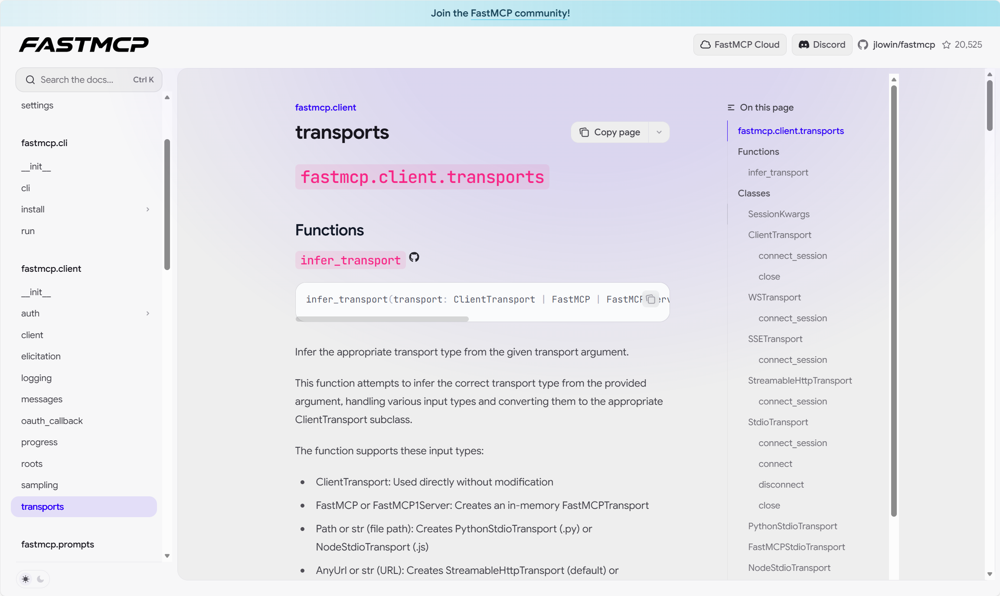
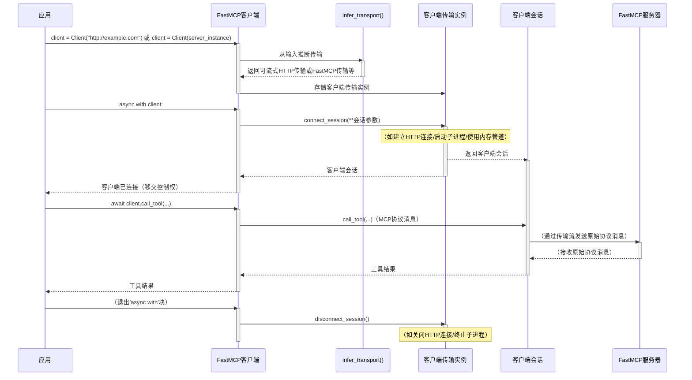
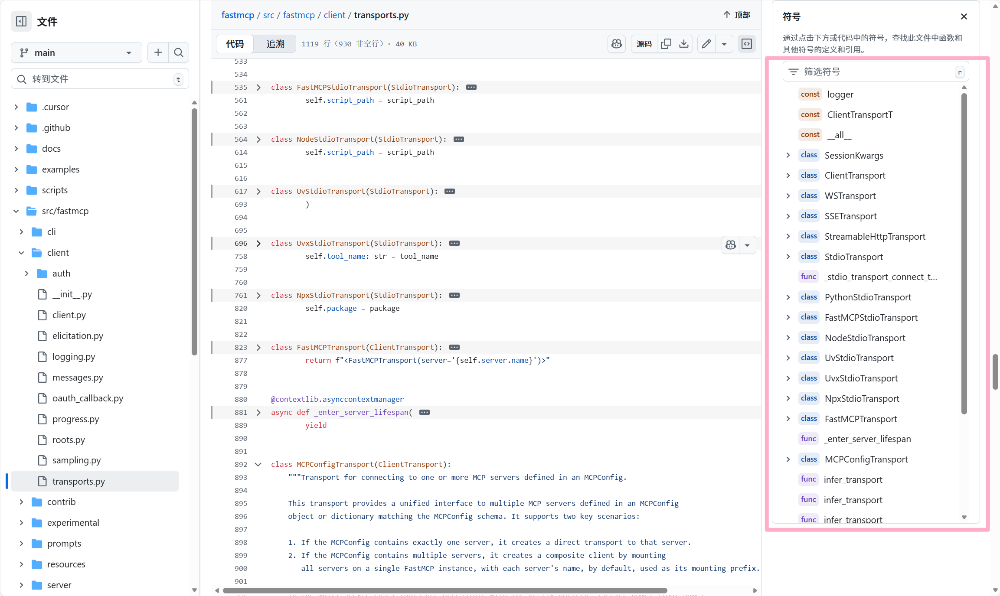

# 第7章：客户端传输

[transports - FastMCP](https://gofastmcp.com/python-sdk/fastmcp-client-transports)



在上一章[上下文](06_context_.md)中，我们学习了为[工具](03_tool_.md)、[资源](04_resource_.md)和[提示](05_prompt_.md)提供运行时信息和能力的"私人助理"对象。现在，我们将焦点转回[客户端](02_client_.md)侧，了解它如何实际与[FastMCP服务器](01_fastmcp_server_.md)通信。

## 客户端传输解决什么问题？

想象要去餐厅用餐，有多种交通方式可选：
*   **自驾车**（类似通过HTTP连接互联网上的服务器）
*   **乘坐持续更新的列车**（类似服务器推送事件SSE）
*   **直接拨打电话**（如同机器上进程间使用标准输入输出stdio通信）
*   **直接走进隔壁房间**（如同同一Python应用中的"内存内"连接）

[客户端](02_client_.md)需要与[FastMCP服务器](01_fastmcp_server_.md)通信，但服务器可能运行在各种环境并使用不同通信方式。客户端如何知道该用哪种"交通方式"？

`客户端传输`抽象定义了[客户端](02_client_.md)连接和通信的具体方式，如同"旅行顾问"或"交通方式选择器"。无论服务器是本地Python脚本、远程Web服务还是同一程序中的对象，它都能让客户端无缝工作。

## 客户端传输：通信方式

`fastmcp`中的`客户端传输`处理建立和维护连接的所有底层细节，使客户端无需关心网络套接字、子进程管理或内存流处理等复杂问题。

常见传输类型及类比：

| 传输类型             | 类比                | 用例                                      |
| :------------------- | :------------------ | :---------------------------------------- |
| `可流式HTTP传输`     | **自驾车**          | 通过标准HTTP/S连接远程服务器，Web服务常用 |
| `SSE传输`            | **持续更新的列车**  | 使用服务器推送事件建立长连接              |
| `标准IO传输`（基类） | **直拨电话**        | 同一机器上通过标准输入输出连接独立进程    |
| `Python标准IO传输`   | **调用Python程序**  | 运行Python脚本作为服务器的特定实现        |
| `Node标准IO传输`     | **调用Node.js程序** | 运行Node.js脚本作为服务器的特定实现       |
| `FastMCP传输`        | **走进隔壁房间**    | 同一Python应用中直接连接服务器实例        |
| `MCP配置传输`        | **多行程旅行顾问**  | 统一访问配置文件中定义的多个服务器        |

创建[客户端](02_client_.md)实例时，`fastmcp`通常根据输入（如URL、文件路径或服务器对象）自动*推断*正确的传输方式。需要更多控制时也可显式提供`客户端传输`实例。

## 客户端传输使用示例

### 1. 从URL推断传输（可流式HTTP传输）

提供HTTP URL时自动使用`可流式HTTP传输`。

```python
from fastmcp import Client
import asyncio

# 创建远程服务器客户端（自动使用可流式HTTP传输）
remote_client = Client("http://localhost:8000")

print(f"客户端将使用：{remote_client.transport}")
# 预期输出：<可流式HTTP传输(url='http://localhost:8000')>

async def check_remote_server():
    async with remote_client:
        print(f"已连接远程服务器：{remote_client.transport}")
        # 假设列出远程服务器工具
        # await remote_client.list_tools()
        print("成功执行虚拟操作。")
    print("已断开远程连接。")

# 无http://localhost:8000服务器时不运行
# asyncio.run(check_remote_server())
```

### 2. 从内存服务器推断传输（FastMCP传输）

若[FastMCP服务器](01_fastmcp_server_.md)运行在同一Python进程，可直接传递服务器对象，使用`FastMCP传输`。

```python
from fastmcp import Client
from fastmcp.server import FastMCP
import asyncio

# 第一章的内存服务器
my_local_server = FastMCP(name="我的进程内服务器")

# 创建直接连接此服务器的客户端
in_memory_client = Client(my_local_server)

print(f"客户端将使用：{in_memory_client.transport}")
# 预期输出：<FastMCP传输(server='我的进程内服务器')>

async def check_in_memory_server():
    async with in_memory_client:
        print(f"已连接内存服务器：{in_memory_client.transport}")
        # 假设列出内存服务器工具
        # tools = await in_memory_client.list_tools()
        print("成功执行虚拟操作。")
    print("已断开内存连接。")

# asyncio.run(check_in_memory_server())
```

### 3. 从Python脚本路径推断传输（Python标准IO传输）

若服务器是实现`FastMCP`协议的Python脚本（如CLI应用），提供文件路径后`fastmcp`会用`Python标准IO传输`将其作为子进程运行。

```python
from fastmcp import Client
from fastmcp.client.transports import PythonStdioTransport
from pathlib import Path
import asyncio

# 创建演示用的虚拟服务器脚本
dummy_server_path = Path("dummy_mcp_server.py")
dummy_server_path.write_text("""
from fastmcp.server import FastMCP
import asyncio

server = FastMCP(name="虚拟标准IO服务器")

async def main():
    async with server.run_stdio():
        print("虚拟标准IO服务器运行中...")
        await asyncio.Event().wait() # 保持服务器运行

if __name__ == "__main__":
    asyncio.run(main())
""")

# 创建将Python脚本作为服务器运行的客户端
stdio_client = Client(dummy_server_path)

print(f"客户端将使用：{stdio_client.transport}")
# 预期输出：<Python标准IO传输(command='<python路径>', args=['dummy_mcp_server.py'])>

# 演示后清理虚拟服务器文件
# dummy_server_path.unlink()

async def check_stdio_server():
    print("尝试连接标准IO服务器...")
    # 将dummy_mcp_server.py作为子进程启动
    async with stdio_client:
        print(f"已通过{stdio_client.transport}连接标准IO服务器")
        # 可在此子进程服务器上调用工具/资源
        # tools = await stdio_client.list_tools()
        print("成功执行虚拟操作。")
    print("已断开标准IO连接。")

# 需要'anyio'和'uv'进行进程管理
# asyncio.run(check_stdio_server())
```

这些示例展示`客户端`构造器如何借助`infer_transport`智能选择传输方式。连接后，无论底层传输如何，客户端调用（如`call_tool`或`list_resources`）保持不变。

## 客户端传输内部工作原理

[客户端](02_client_.md)需要连接`FastMCP`服务器时，`客户端传输`是关键中介。



**步骤分解：**

1.  **客户端实例化**：创建`FastMCP客户端`时首先确定最佳传输方式
2.  **`infer_transport()`魔法**：此函数检查输入（URL/文件路径/服务器对象）并返回适当的传输子类实例
3.  **连接阶段**：进入`async with client:`块时，客户端调用传输的`connect_session()`方法
4.  **传输建立连接**：
    *   `可流式HTTP传输`发起HTTP请求
    *   `Python标准IO传输`生成Python子进程并建立通信管道
    *   `FastMCP传输`创建内存通信流
5.  **创建客户端会话**：底层通信流就绪后，传输创建并返回`mcp.客户端会话`对象，该对象实际使用模型上下文协议通信
6.  **MCP通信**：客户端使用此会话发送MCP消息（如`call_tool`、`list_resources`），会话通过传输提供的流收发原始数据
7.  **断开阶段**：退出`async with`块时调用传输的`disconnect_session()`方法，优雅关闭连接

## 内部结构



`客户端传输`核心逻辑在`src/fastmcp/client/transports.py`。

`客户端传输`是抽象基类，定义所有具体传输必须实现的`connect_session`方法：

```python
# src/fastmcp/client/transports.py（简化版）
import abc
import contextlib
from typing import AsyncIterator
from mcp import ClientSession

class ClientTransport(abc.ABC):
    @abc.abstractmethod
    @contextlib.asynccontextmanager
    async def connect_session(
        self, **session_kwargs
    ) -> AsyncIterator[ClientSession]:
        """建立连接并返回活跃的客户端会话"""
        raise NotImplementedError
        yield # type: ignore
```

`infer_transport`函数（同文件）负责选择正确传输：

```python
# src/fastmcp/client/transports.py（简化版）
from pathlib import Path
from pydantic import AnyUrl

# ...导入具体传输类...

def infer_transport(
    transport: ClientTransport | FastMCP | AnyUrl | Path | dict[str, Any] | str,
) -> ClientTransport:
    if isinstance(transport, ClientTransport):
        return transport
    elif isinstance(transport, FastMCP):
        return FastMCPTransport(mcp=transport)
    elif isinstance(transport, Path | str) and Path(transport).exists():
        if str(transport).endswith(".py"):
            return PythonStdioTransport(script_path=transport)
        elif str(transport).endswith(".js"):
            return NodeStdioTransport(script_path=transport)
        # ...其他文件类型...
    elif isinstance(transport, AnyUrl | str) and str(transport).startswith("http"):
        # 检查/sse端点返回SSE传输，否则默认可流式HTTP传输
        return StreamableHttpTransport(url=transport)
    elif isinstance(transport, dict | MCPConfig):
        return MCPConfigTransport(config=transport)
    else:
        raise ValueError(f"无法从输入推断有效传输：{transport}")
```

每种具体传输实现适合其通信方式的`connect_session()`。例如`可流式HTTP传输`使用`mcp.client.streamable_http.streamablehttp_client`，`Python标准IO传输`使用`mcp.client.stdio.stdio_client`管理子进程。

```python
# src/fastmcp/client/transports.py（简化版）
import contextlib
from mcp.client.streamable_http import streamablehttp_client

class StreamableHttpTransport(ClientTransport):
    def __init__(self, url: str | AnyUrl, ...):
        self.url = str(url)
        # ...认证设置...

    @contextlib.asynccontextmanager
    async def connect_session(self, **session_kwargs) -> AsyncIterator[ClientSession]:
        async with streamablehttp_client(self.url, auth=self.auth, **client_kwargs) as transport:
            read_stream, write_stream, _ = transport
            async with ClientSession(
                read_stream, write_stream, **session_kwargs
            ) as session:
                yield session

# src/fastmcp/client/transports.py（简化版）
import contextlib
from mcp import ClientSession, StdioServerParameters
from mcp.client.stdio import stdio_client

class PythonStdioTransport(StdioTransport):
    # ...初始化和细节...

    @contextlib.asynccontextmanager
    async def connect_session(self, **session_kwargs) -> AsyncIterator[ClientSession]:
        server_params = StdioServerParameters(command=self.command, args=self.args, ...)
        async with stdio_client(server_params, errlog=sys.stderr) as transport:
            read_stream, write_stream = transport
            async with ClientSession(read_stream, write_stream, **session_kwargs) as session:
                yield session
```

## 总结

我们了解到`客户端传输`是`fastmcp`中定义[客户端](02_client_.md)通信方式的抽象层。它让客户端能适应各种服务器环境——从远程HTTP服务到本地Python脚本甚至内存对象——同时保持应用代码简洁一致。无论是自动推断还是显式指定，`客户端传输`都确保客户端总能找到连接服务器的正确"交通方式"。

接下来，我们将探索**[MCP服务器配置](08_mcpserverconfig_.md)**，这是定义和管理`FastMCP`服务器配置的标准方式，常与`客户端传输`协同实现动态客户端设置。

[下一章：MCP服务器配置](08_mcpserverconfig_.md)

