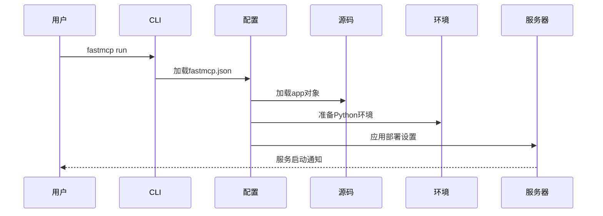

# 第8章：MCP服务器配置

在上一章[客户端传输](07_clienttransport_.md)中，我们探讨了[客户端](02_client_.md)与[FastMCP服务器](01_fastmcp_server_.md)通信的不同"通信模式"。现在，我们将注意力转向服务器本身的*设置和配置*。

## MCP服务器配置解决什么问题？

想象我们不是在经营一家"智能家居餐厅"，而是要打造连锁品牌。我们需要确保每家分店都采用统一标准：
*   使用相同菜谱（源代码）
*   配备相同高品质厨具（Python环境与依赖包）
*   在指定地址营业并提供相同配送服务（主机、端口、传输协议）

如果每次开设新店都要手动配置这些细节，不仅工作量大还容易出错！

这正是`MCP服务器配置`要解决的问题。它作为**声明式配置文件**（通常命名为`fastmcp.json`），充当服务器的主蓝图。我们只需声明需求："这是代码路径，这是运行环境，这是运行方式"，而无需逐步指导如何设置服务器。

## MCP服务器配置：服务器主蓝图

`MCP服务器配置`是定义服务器完整设置的JSON文件，包含三个主要部分：

1.  **`source`**：指明服务器Python代码位置（"菜谱"和"厨房布局"）
2.  **`environment`**：定义运行所需的Python环境（"厨具设备"如Python版本和依赖包）
3.  **`deployment`**：指定服务器部署运行方式（"餐厅运营细节"如地址、端口和通信协议）

### 创建首个蓝图配置

首先创建基础服务器文件`my_server_app.py`：

```python
# my_server_app.py
from fastmcp.server import FastMCP

app = FastMCP(name="我的配置服务器")

from fastmcp.tools.tool import Tool

def greet(name: str) -> str:
    return f"你好，{name}！来自我的配置服务器！"

app.add_tool(Tool.from_function(greet, name="greet"))

if __name__ == "__main__":
    import asyncio
    print(f"服务器'{app.name}'定义中...")
```

在同目录创建`fastmcp.json`：

```json
{
  "$schema": "https://gofastmcp.com/public/schemas/fastmcp.json/v1.json",
  "source": {
    "path": "my_server_app.py",
    "entrypoint": "app"
  },
  "environment": {
    "python": "3.11",
    "dependencies": ["pydantic", "anyio"]
  },
  "deployment": {
    "transport": "http",
    "host": "0.0.0.0",
    "port": 8000,
    "log_level": "INFO"
  }
}
```

**配置说明：**
- `$schema`：提供编辑器智能提示的JSON模式文件
- `source.path`：服务器代码文件路径
- `source.entrypoint`：代码中服务器对象变量名
- `environment.python`：指定Python版本
- `environment.dependencies`：必需Python包
- `deployment.transport`：通信协议类型
- `deployment.host/port`：服务监听地址
- `deployment.log_level`：日志级别

### 运行配置化服务器

在配置文件目录执行：

```bash
fastmcp run
```

输出示例：
```
INFO:     从fastmcp.json加载配置
INFO:     使用uv准备环境...
INFO:     从my_server_app.py加载服务器'我的配置服务器'
INFO:     我的配置服务器运行于 http://0.0.0.0:8000
```

使用客户端测试：

```python
# client_test.py
import asyncio
from fastmcp import Client

async def test_server():
    client = Client("http://0.0.0.0:8000")
    async with client:
        result = await client.call_tool("greet", {"name": "世界"})
        print(f"服务器响应：{result.content[0].text}")

asyncio.run(test_server())
```

**命令行覆盖配置：**
```bash
fastmcp run --port 8080 --log-level DEBUG
```

## 内部工作原理

执行流程示意图：



**核心代码结构：**

```python
# src/fastmcp/utilities/mcp_server_config/v1/mcp_server_config.py（简化）
from pydantic import BaseModel

class Source(BaseModel):
    path: str
    entrypoint: str = "app"

class Environment(BaseModel):
    python: str | None = None
    dependencies: list[str] = []

class Deployment(BaseModel):
    transport: str = "http"
    host: str = "0.0.0.0"
    port: int = 8000

class MCPServerConfig(BaseModel):
    source: Source
    environment: Environment
    deployment: Deployment

    async def run_server(self):
        server = await self.source.load_server()
        await server.run_async(**self.deployment.dict())
```

## 总结

`MCP服务器配置`通过声明式配置文件实现服务器标准化部署，确保开发、测试和生产环境的一致性。下一章我们将探讨**[认证提供者](09_authprovider_.md)**，了解如何保障服务器安全访问。

[下一章：认证提供者](09_authprovider_.md)

