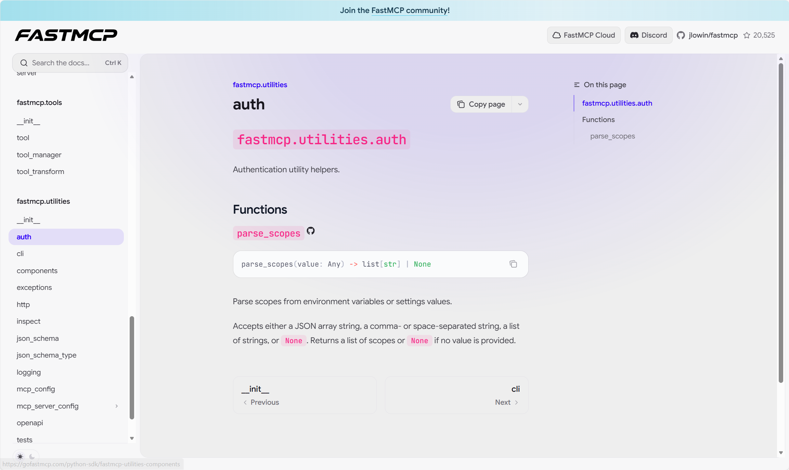
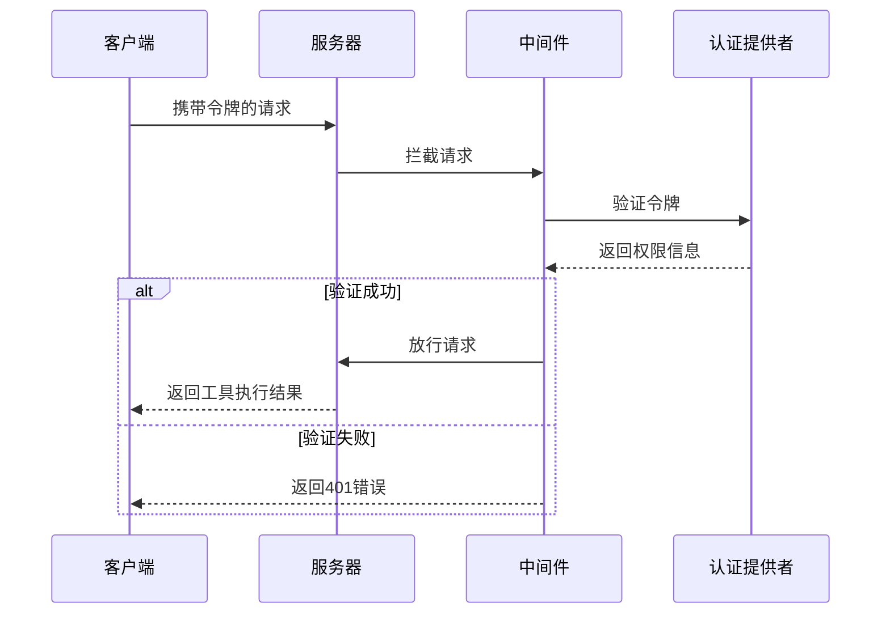

# 第9章：认证提供者

[auth - FastMCP](https://gofastmcp.com/python-sdk/fastmcp-utilities-auth#fastmcp-utilities-auth)



在上一章[MCP服务器配置](08_mcpserverconfig_.md)中，我们学习了如何使用蓝图文件(`fastmcp.json`)定义和部署[FastMCP服务器](01_fastmcp_server_.md)。现在，当我们的"智能家居餐厅"开业后，谁被允许进入？谁能点特色菜或进入私人厨房？

这就是**`认证提供者`**的职责所在——确保服务器安全并控制访问权限。

## 认证提供者解决什么问题？

假设"智能家居餐厅"已开业，我们拥有强大的[工具](03_tool_.md)（如"开灯"）和[资源](04_resource_.md)（如"厨房温度"）。我们希望信任的智能家居助手([客户端](02_client_.md))能访问这些功能，但绝不允许陌生人在互联网上随意关灯或读取私人传感器数据！

`认证提供者`充当服务器的**安保系统**，负责：
*   **身份核验（认证）**：当顾客([客户端](02_client_.md))尝试点餐或获取信息时，检查其数字身份证（通常称为"令牌"）
*   **权限审查（授权）**：验证身份后，确认顾客是否有权使用特定服务（称为"作用域"）。例如，有些人可以控制灯光，而其他人只能读取温度

## 认证提供者：服务器安保系统

`认证提供者`是管理服务器访问权限的核心组件，如同餐厅门口的安检系统。

主要功能包括：
*   **`verify_token`**：核心方法，验证客户端令牌有效性及权限
*   **`get_middleware`**：通过中间件拦截请求进行验证
*   **`get_routes`**：高级提供者可能提供特殊路由（如登录页面）

`fastmcp`提供多种认证提供者：

| 类型             | 类比                 | 适用场景                 |
| :--------------- | :------------------- | :----------------------- |
| `静态令牌验证器` | 手持名单的保安       | 开发测试环境使用固定令牌 |
| `JWT验证器`      | 检验防伪标识的安检机 | 验证权威机构签名的令牌   |
| `远程认证提供者` | 联系总部的安检台     | 通过外部服务验证令牌     |
| `OAuth提供者`    | 全套身份认证中心     | 处理客户端注册和令牌签发 |

### 使用静态令牌验证器保护工具

创建受保护的服务器文件`my_protected_server.py`：

```python
# my_protected_server.py
from fastmcp.server import FastMCP, Context
from fastmcp.tools.tool import Tool

async def get_secret_info(ctx: Context) -> str:
    await ctx.info("正在访问机密信息")
    return "这是绝密数据！"

secret_tool = Tool.from_function(
    fn=get_secret_info,
    name="get_secret_info",
    description="访问高度机密信息"
)

app = FastMCP(name="我的受保护服务器")
app.add_tool(secret_tool)
```

配置`fastmcp.json`添加认证：

```json
{
  "auth": {
    "type": "StaticTokenVerifier",
    "config": {
      "tokens": {
        "my_secure_token": {
          "client_id": "智能家居助手",
          "scopes": ["admin", "lights:control"],
          "expires_at": 9999999999
        }
      },
      "required_scopes": ["admin"]
    }
  }
}
```

**认证配置说明：**
- `type`：指定使用静态令牌验证器
- `tokens`：定义有效令牌及其权限
- `required_scopes`：设置全局最低权限要求

### 客户端访问测试

```python
# client_access.py
import asyncio
from fastmcp import Client
from fastmcp.auth import BearerToken

async def access_tool(token: str):
    client = Client("http://0.0.0.0:8000")
    if token:
        client.auth = BearerToken(token)
    
    async with client:
        try:
            result = await client.call_tool("get_secret_info", {})
            print(f"成功：{result.content[0].text}")
        except Exception as e:
            print(f"失败：{e}")

asyncio.run(access_tool("my_secure_token"))  # 使用有效令牌
asyncio.run(access_tool("invalid_token"))    # 使用无效令牌
```

**预期结果：**
- 有效令牌：返回"这是绝密数据！"
- 无效令牌：返回"未授权"错误

## 内部工作原理

认证流程示意图：



**核心代码结构：**

```python
# src/fastmcp/server/auth/auth.py（简化）
class AccessToken:
    token: str
    scopes: list[str]

class AuthProvider:
    async def verify_token(self, token: str) -> AccessToken | None:
        pass

class StaticTokenVerifier(AuthProvider):
    def __init__(self, tokens: dict):
        self.tokens = tokens
        
    async def verify_token(self, token: str):
        if token not in self.tokens:
            return None
        return AccessToken(token=token, scopes=self.tokens[token]["scopes"])
```

## 总结

`认证提供者`是服务器的安全防线，通过令牌验证和权限控制保障系统安全。下一章我们将探讨**[中间件](10_middleware_.md)**，了解如何更灵活地处理请求。

[下一章：中间件](10_middleware_.md)

