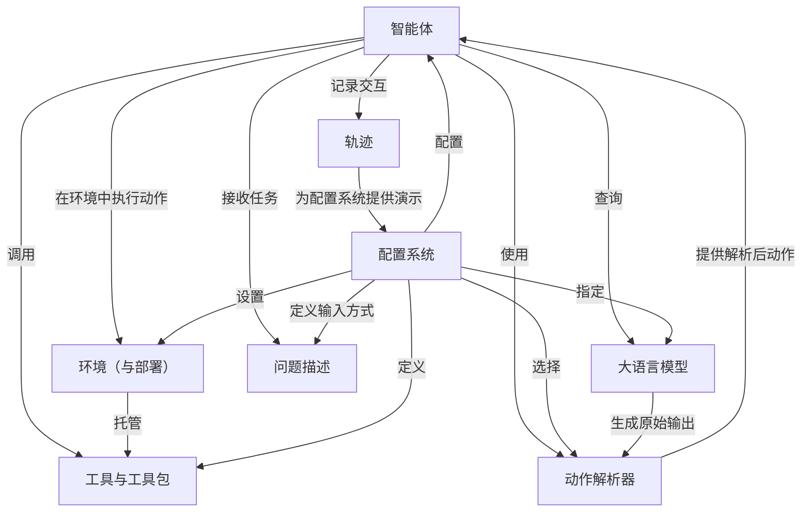

大概几个月前 有想过写一个类似的issue-bot 然后写一半不出意外的鸽掉了，因为发现有好用的现成的了...

链接：[Getting Started - SWE-agent documentation](https://swe-agent.com/latest/)

# docs：SWE-agent  

SWE-agent 是一个创新项目，它部署了一位*AI软件工程师*来自主修复GitHub问题。 
其核心架构中，**智能体（Agent）**接收**问题描述（Problem Statement）**（即任务），随后利用**大语言模型（LLM）**作为"大脑"生成"思考"和"动作"。

这些动作通常涉及专用的**工具与工具包（Tools & Tool Bundles）**，并在隔离的**环境（与部署）**中执行。所有交互和决策都被 meticulously 记录在**轨迹（Trajectory）**中，这对调试和学习至关重要。

为了确保系统能理解LLM的输出，**动作解析器（Action Parsers）**会将原始模型响应转换为可执行命令。整个系统的行为——从使用的LLM到可用工具——都可通过全面的**配置系统**高度定制。  

## 可视化

## 章节  

1. [问题描述](01_problem_statement_.md)  
2. [智能体](02_agent_.md)  
3. [大语言模型](03_language_model__llm__.md)  
4. [动作解析器](04_action_parsers_.md)  
5. [工具与工具包](05_tools___tool_bundles_.md)  
6. [环境（与部署）](06_environment__and_deployment__.md)  
7. [配置系统](07_configuration_system_.md)  
8. [轨迹](08_trajectory_.md)  

---
