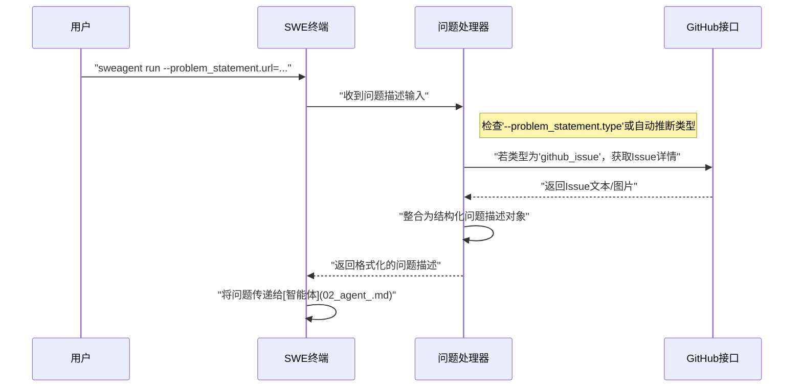

# 第1章：问题描述  

欢迎来到SWE-agent

想象你拥有一位超级智能的机器人助手，专门用于修复代码缺陷和实现修改

为了让这位机器人完成任务，它需要清晰的指令。正如没有蓝图就无法建造房屋一样，SWE-agent若不了解问题*本质*，就无法解决问题。  

这就是**问题描述（Problem Statement）**的用武之地。  

## 什么是问题描述？  

**问题描述**是对SWE-agent需要完成任务的具体说明

它是机器人的"蓝图"，提供了所有必要信息，使其在开始与代码库交互前就明确目标。  

举例来说：如果你想让机器人"修复欢迎信息中的拼写错误"，这就是一个问题描述。但问题描述可以更详细，包括缺陷位置、正确文本内容，甚至错误截图。  

### 为何如此重要？  

清晰的问题描述至关重要，因为它为SWE-agent设定了目标。没有它，智能体将无所适从。这是任何成功的代码修改或缺陷修复的起点。  

## 定义问题的多种方式  

SWE-agent非常灵活

根据问题的呈现形式，你可以通过多种方式提供指令。就像给人指路：有时直接口头说明，有时提供地图，有时则发送在线链接。  

以下是SWE-agent支持的常见问题描述类型：  

### 1. 纯文本描述  
最简单的方式，直接输入任务内容。适用于快速修复或简单需求。  

**用例**：让SWE-agent修改文件中某行文本。  

```bash title="纯文本问题描述"  
sweagent run \  
  --agent.model.name=gpt-4o \  
  --problem_statement.text="将'app.py'中的问候语从'Hello'改为'Hi'" \  
  --problem_statement.type=text  
```

**运行逻辑**：SWE-agent读取文本指令，并将其作为主要目标。`--problem_statement.type=text`明确告知SWE-agent输入类型为纯文本。  

### 2. 本地文件指令  
若问题描述较长或已保存在文件中（如`README.md`或`bug_report.txt`），SWE-agent可直接读取文件内容。  

**用例**：本地保存了详细的缺陷报告`bug.md`，希望SWE-agent处理。  

首先生成模拟缺陷报告文件：  

```bash  
# 创建模拟缺陷报告  
echo "## 缺陷报告：按钮标签错误\n\n**描述：**登录页的'提交'按钮误标为'发送'，请修正为'提交'。" > bug.md  
```

随后运行：  

```bash title="从本地文件加载问题"  
sweagent run \  
  --agent.model.name=gpt-4o \  
  --problem_statement.path=bug.md \  
  --problem_statement.type=text_file  
```

**运行逻辑**：SWE-agent读取`bug.md`内容作为问题描述。`--problem_statement.type=text_file`标志指明输入为文本文件路径。  

### 3. GitHub Issue链接  
开发者常用GitHub Issue跟踪缺陷和需求。SWE-agent可直接通过Issue链接获取问题描述，无缝集成现有开发流程。  

**用例**：团队在GitHub提交了缺陷报告，直接通过Issue链接让SWE-agent修复。  

```bash title="从GitHub Issue加载问题"  
sweagent run \  
  --agent.model.name=gpt-4o \  
  --problem_statement.url=https://github.com/SWE-agent/test-repo/issues/1 \  
  --problem_statement.type=github_issue  
```

**运行逻辑**：SWE-agent访问GitHub链接，读取Issue标题和描述作为任务依据。`--problem_statement.type=github_issue`标志表明输入为GitHub链接。  

### 4. 多模态问题描述（文本+图像）  
某些问题需要图文结合说明（如缺陷截图或UI设计稿）。SWE-agent支持**多模态**输入，能同时处理多种信息类型。  

**用例**：用户报告网站视觉缺陷并附截图。  

多模态任务的命令行配置较复杂（通常需专用配置文件处理图像），但核心逻辑是问题描述可包含图片链接和文本。SWE-agent会下载图像，并将其与文本一同传递给底层语言模型（智能体的"大脑"），以更全面理解问题。  

例如，多模态问题描述内部可能如下：  

```text  
"修复截图所示的渲染问题。  
  
  
"  
```

**运行逻辑**：SWE-agent将图像转换为AI模型可理解的base64编码，与文本一并提供给模型，使智能体清晰掌握缺陷的视觉信息。  

## 底层原理：SWE-agent如何理解问题  

当你提交问题描述时，SWE-agent会执行以下流程（如同接待员将需求转交对应部门）：  



### 核心代码实现  

该流程由`sweagent/agent/problem_statement.py`中的代码管理。该文件定义了不同问题描述类型的"类"（即存储特定数据和处理逻辑的模板）。  

以下是简化版的类定义：  

```python  
# 摘自：sweagent/agent/problem_statement.py（简化版）  
from pathlib import Path  

class TextProblemStatement:  
    def __init__(self, text: str):  
        self.text = text  
        self.id = "文本唯一标识"  

    def get_problem_statement(self) -> str:  
        """返回原始问题文本"""  
        return self.text  

class FileProblemStatement:  
    def __init__(self, path: Path):  
        self.path = path  
        self.id = "文件唯一标识"  

    def get_problem_statement(self) -> str:  
        """读取并返回文件内容"""  
        return self.path.read_text()  

class GithubIssue:  
    def __init__(self, github_url: str):  
        self.github_url = github_url  
        self.id = "GitHub唯一标识"  

    def get_problem_statement(self) -> str:  
        """从GitHub获取Issue描述"""  
        return f"GitHub Issue问题：{self.github_url} - 修复描述中的缺陷。"  
```

每个类都包含`get_problem_statement()`方法，用于生成标准化的问题描述。调度函数`problem_statement_from_simplified_input`根据输入类型创建对应的类实例：  

```python  
# 摘自：sweagent/agent/problem_statement.py（简化版）  
from typing import Literal  

def problem_statement_from_simplified_input(  
    *, input: str, type: Literal["text", "text_file", "github_issue"]  
):  
    """根据输入类型创建对应的问题描述对象"""  
    if type == "text":  
        return TextProblemStatement(text=input)  
    elif type == "text_file":  
        return FileProblemStatement(path=Path(input))  
    elif type == "github_issue":  
        return GithubIssue(github_url=input)  
    else:  
        raise ValueError("未知的问题描述类型！")  

# 示例：当运行 sweagent run --problem_statement.text="修复X" --problem_statement.type=text  
problem = problem_statement_from_simplified_input(  
    input="将按钮颜色改为蓝色",  
    type="text"  
)  
print(f"智能体目标：{problem.get_problem_statement()}")  # 输出：智能体目标：将按钮颜色改为蓝色  
```

## 结语  

问题描述是使用SWE-agent的第一步

无论是简单文本、详细文件、GitHub Issue还是图文组合，清晰的定义都是SWE-agent成功解决编码挑战的基础。  

现在我们已经了解如何告知SWE-agent"做什么"，接下来的问题是：*谁*来执行这些操作？答案就是背后的核心——[智能体](02_agent_.md)
