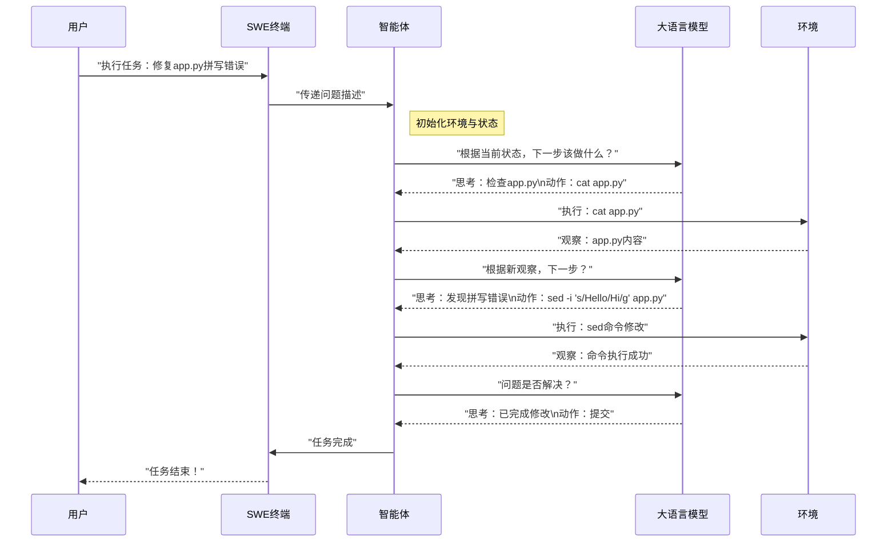

# 第2章：智能体  

欢迎回来

在[第1章：问题描述](01_problem_statement_.md)中，我们学会了如何为SWE-agent==提供明确任务==，例如"修复拼写错误"或"实现新功能"

问题描述就像建筑项目的蓝图，但==谁来*阅读*蓝图、制定决策并执行操作呢==？  

这就是**智能体（Agent）**的职责所在。  

## 什么是智能体？  

**智能体**是SWE-agent的核心大脑——它本身就是那位AI软件工程师

当它接收到任务（即问题描述）后，其职责是找到解决方案。它不会机械地执行指令，而是主动*思考*、*规划*、*行动*，并从结果中*学习*。  

想象你雇佣一位经验丰富的软件工程师修复缺陷：  
1.  **理解问题**：阅读缺陷报告  
2.  **制定计划**："我会先检查日志，再查看相关代码文件，可能还需要运行测试"  
3.  **执行操作**：打开文件、在终端输入命令、运行测试  
4.  **观察结果**：检查测试是否通过、命令输出是否合理  
5.  **调整策略**：若首次尝试失败，会调整方法再次尝试  
6.  **循环执行**：直到缺陷修复并通过验证  

SWE-agent的**智能体**完全复现了这一流程，但以自动化方式实现。它是协调整个问题解决过程的核心智能。  

## 智能体工作原理：简化视图  

智能体解决问题的过程是一个持续的"思考-行动"循环：  

1.  **接收任务**：获取[问题描述](01_problem_statement_.md)  
2.  **思考**：利用"大脑"（[大语言模型](03_language_model__llm__.md)）生成思考过程并决定下一步最佳操作  
3.  **行动**：执行命令或使用特定[工具](05_tools___tool_bundles_.md)在编程[环境](06_environment__and_deployment__.md)中操作  
4.  **观察**：查看操作结果（如命令输出、文件内容、测试结果）  
5.  **学习与调整**：根据观察结果更新理解并决定后续步骤  
6.  **循环执行**：直到任务完成或判定无法继续  

## 与智能体的首次交互  

通过命令行运行SWE-agent时，默认使用`DefaultAgent`智能体。以下重温第1章的简单示例，让SWE-agent修改文件中的特定文本：  

```bash title="隐式使用DefaultAgent"  
sweagent run \  
  --agent.model.name=gpt-4o \  
  --problem_statement.text="将'app.py'中的问候语从'Hello'改为'Hi'" \  
  --problem_statement.type=text  
```

**运行逻辑**：  
- 通过`run`命令启动任务  
- 未显式指定智能体类型时，默认使用`DefaultAgent`  
- 该智能体将使用`gpt-4o`模型作为"大脑"思考并执行操作  
- 执行流程：思考→运行命令（如`ls`查看文件→`cat app.py`读取内容→`sed`修改文本）→观察输出→循环直至任务完成  

## 智能体类型  

SWE-agent提供多种智能体应对不同需求，主要包含两类：  

| 智能体类型     | 描述                                                         | 适用场景                                                     |
| :------------- | :----------------------------------------------------------- | :----------------------------------------------------------- |
| `DefaultAgent` | 标准通用型AI软件工程师，通过"思考-行动-观察-学习"循环解决问题 | 最常见场景。适用于直接处理缺陷修复或小功能开发，默认使用的智能体类型 |
| `RetryAgent`   | 高级"元智能体"，管理多个`DefaultAgent`实例。运行多次尝试后选择最佳解决方案 | 复杂问题场景。当单次尝试可能不足时，通过多方案比较提高成功率 |

`RetryAgent`如同项目经理，协调多个工程师（`DefaultAgent`实例）共同解决问题并择优采用。  

## 底层原理：智能体工作机制  

### 智能体工作流  

以下是智能体解决问题的简化流程：  



### 核心代码

智能体逻辑位于`sweagent/agent/agents.py`。其中`AbstractAgent`是基础抽象类，`DefaultAgent`和`RetryAgent`是具体实现。  

#### `DefaultAgent`  

作为主力智能体，`DefaultAgent`包含与[大语言模型](03_language_model__llm__.md)交互的主循环，并在[环境](06_environment__and_deployment__.md)中执行[工具](05_tools___tool_bundles_.md)操作。以下是简化结构：  

```python  
# 摘自：sweagent/agent/agents.py（简化版）  
class DefaultAgent:  
    def __init__(self, templates, tools, history_processors, model, max_requeries, name="main"):  
        self.model = model  # 大语言模型"大脑"  
        self.tools = tools  # 可用工具（如ls/cat/edit）  
        self._env = None    # 代码修改环境  
        self.history = []   # 历史交互记录  

    def run(self, env, problem_statement, output_dir: Path) -> AgentRunResult:  
        self.setup(env, problem_statement, output_dir)  # 初始化任务  
        step_output = StepOutput()  
        while not step_output.done:  # 循环执行直至任务完成  
            step_output = self.step()  
        return AgentRunResult(...)  

    def step(self) -> StepOutput:  
        # 单步"思考-行动-观察"流程  
        step_output = self.forward_with_handling(self.messages)  
        self.update_history(step_output)  
        return step_output  

    def forward_with_handling(self, history: list[dict[str, str]]) -> StepOutput:  
        # 调用大语言模型→解析动作→执行操作→处理错误  
        llm_response = self.model.query(history)  
        action = parse_action(llm_response)  # 使用动作解析器  
        result = self.tools.execute(action, self._env)  
        return StepOutput(action, result)  
```

`run`方法协调整个流程：先`setup`初始化任务，再通过`while`循环调用`step()`方法。每个`step()`代表一次完整的"思考-行动-观察"过程。  

#### `RetryAgent`  

`RetryAgent`基于`DefaultAgent`构建，其`run`方法会创建多个`DefaultAgent`实例进行尝试：  

```python  
# 摘自：sweagent/agent/agents.py（简化版）  
class RetryAgent(AbstractAgent):  
    def run(self, env: SWEEnv, problem_statement, output_dir: Path) -> AgentRunResult:  
        self.setup(env, problem_statement, output_dir)  
        self._setup_agent()  # 首次尝试  
        while not step_output.done:  
            step_output = self.step()  
            if step_output.done and self._need_retry():  
                step_output.done = False  
                self._next_attempt()  # 准备新一轮尝试  
        return AgentRunResult(...)  
```

通过`RetryLoop`评估每次尝试结果，决定是否需要重试，从而提高复杂任务的解决率。  

## 结语  

**智能体**是SWE-agent的核心组件，作为AI软件工程师读取[问题描述](01_problem_statement_.md)，在[环境](06_environment__and_deployment__.md)中思考解决方案并执行操作

无论是直接解决问题的`DefaultAgent`，还是管理多轮尝试的`RetryAgent`，智能体都是实现代码变更的智能协调者。  

了解*谁*来执行任务后，下一步将探索智能体*如何*思考——其核心智能来源于[大语言模型](03_language_model__llm__.md)，这正是下一章的主题。  

