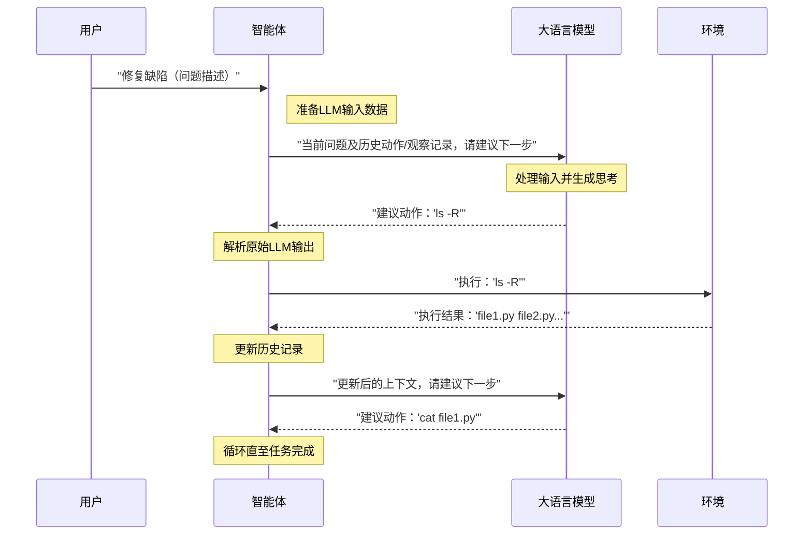

# 第3章：大语言模型（LLM）

欢迎回来

在[第2章：智能体](02_agent_.md)中，我们了解到**智能体**是SWE-agent的核心大脑，扮演着协调整个问题解决流程的AI软件工程师角色。但究竟是什么*赋予*了智能体思考能力？它如何实现"思考"、"推理"和"决策"？

答案就在于**大语言模型（LLM）**。

## 什么是大语言模型？

**大语言模型**是智能体真正的"大脑"。这个强大的AI能够理解人类语言、生成文本并执行复杂推理任务。可以将其视为AI智能体中那位高智商的软件工程师。

当你向SWE-agent下达任务（即[问题描述](01_problem_statement_.md)）时，智能体会将这些信息连同编程环境中的观察结果一并传递给LLM。随后LLM处理所有信息并生成：
1. **"思考"**：内部推理过程、计划和观察结论
2. **"动作"**：希望智能体执行的具体命令或操作

LLM生成思考与动作、智能体在[环境](06_environment__and_deployment_.md)中执行的循环，构成了SWE-agent解决问题的核心机制。

### 为何LLM如此重要？

若没有LLM，智能体将只是一套预设规则，无法适应新问题或理解复杂指令。LLM赋予了SWE-agent灵活性、创造力和问题解决能力，使其能像真正的软件工程师一样工作。

## LLM与SWE-agent的协作流程

假设我们的智能体需要完成"将'welcome.txt'中的拼写错误'Welocme'修正为'Welcome'"任务：

1. **接收任务与初始上下文**：智能体将问题描述传递给LLM，可能同时提供项目文件概览
2. **生成思考与首个动作**：LLM思考："需要先定位'welcome.txt'文件"，随后提议动作：`ls -R`（递归列出文件）
3. **接收观察结果**：智能体执行`ls -R`后，将输出结果（如"welcome.txt"、"app.py"等）作为观察反馈给LLM
4. **生成后续思考与动作**：LLM处理`ls -R`输出后思考："发现目标文件，需读取内容确认错误"，随后提议：`cat welcome.txt`
5. **循环执行**：这个持续的信息处理-思考-动作提议循环将推动整个问题解决流程直至任务完成

## 支持的LLM类型

SWE-agent设计灵活，可对接多种LLM——从强大的云端模型到本地部署模型。这种多样性通过`LiteLLM`库实现，该库提供了统一的LLM调用接口。

| 模型类型         | 描述                                                         | 示例模型                          | 应用场景                                                     |
| :--------------- | :----------------------------------------------------------- | :-------------------------------- | :----------------------------------------------------------- |
| **API模型**      | 云端托管的高性能模型（如OpenAI/Anthropic），通过API密钥按使用量计费 | `gpt-4o`, `claude-sonnet-4`       | 最常见方案。SWE-agent将提示词（指令、观察）发送至模型API，接收返回的思考与动作建议 |
| **本地模型**     | 在本地运行的模型（如通过Ollama部署），需额外配置但保障隐私且无按次费用 | `ollama/llama2`, `ollama/mistral` | 需专门配置[动作解析器](04_action_parsers_.md)和成本追踪模块  |
| **人工介入模型** | 特殊"模型"，实际由用户输入指导。适用于测试、调试或创建人工引导的演示场景 | `HumanModel`, `HumanThoughtModel` | 取代AI生成，由用户手动输入思考与动作，实现逐步流程控制       |
| **回放模型**     | 非思考型工具，用于重放历史交互记录（"轨迹"），适用于调试或复现历史运行 | `ReplayModel`                     | 读取包含过往步骤的文件，按原样输出动作序列，无需调用真实LLM即可复现完整流程 |

## 在SWE-agent中使用LLM

运行SWE-agent时，可通过`--agent.model.name`参数指定智能体使用的LLM类型。

### 示例：调用GPT-4o

沿用前文修改`app.py`的案例，指定使用`gpt-4o`模型：

```bash title="指定LLM模型"
sweagent run \
  --agent.model.name=gpt-4o \
  --problem_statement.text="将'app.py'中的问候语从'Hello'改为'Hi'" \
  --problem_statement.type=text
```

**运行逻辑**：
- `--agent.model.name=gpt-4o`告知SWE-agent使用`gpt-4o`作为底层LLM
- 智能体将调用该模型解读问题描述、生成思考、决定操作命令（如`ls`/`cat`/`sed`）并处理命令输出

### API密钥管理

对于`gpt-4o`等API模型，需通过环境变量、`.env`文件或`--agent.model.api_key`参数提供API密钥：

```bash title="通过环境变量设置OpenAI密钥"
export OPENAI_API_KEY="sk-您的密钥"
sweagent run --agent.model.name=gpt-4o ...
```

这是SWE-agent连接云端模型服务的关键凭证。

## 技术实现：LLM在智能体循环中的角色

通过序列图展示LLM如何参与智能体决策循环（即[第2章](02_agent_.md)提到的"思考-行动-观察"循环）：



LLM持续接收当前问题、历史动作和环境观察结果，基于这些信息生成后续思考与动作建议。

### 核心代码

LLM交互逻辑位于`sweagent/agent/models.py`，该文件定义了各类模型（如API模型`LiteLLMModel`、人工模型`HumanModel`等）的查询机制。

基础抽象类`AbstractModel`规定了所有LLM实现必须包含的`query`方法：

```python
# 摘自：sweagent/agent/models.py（简化版）
class AbstractModel(ABC):
    """所有语言模型的基类"""
    def __init__(self, config, tools):
        self.config = config  # 包含模型名称、温度系数等设置
        self.stats = ...      # 调用统计与成本追踪

    @abstractmethod
    def query(self, history: History, action_prompt: str = "> ") -> dict:
        """核心方法：向LLM提交查询请求"""
        pass
```

最常用的`LiteLLMModel`通过`litellm`库对接各类LLM API：

```python
class LiteLLMModel(AbstractModel):
    def query(self, history: History, n: int = 1, temperature: float | None = None) -> list[dict] | dict:
        # 转换历史记录为LLM所需格式
        messages = self._history_to_messages(history)

        # 关键调用：通过litellm库与LLM API交互
        response = litellm.completion(
            model=self.config.name,
            messages=messages,
            temperature=self.config.temperature,
            api_key=self.config.choose_api_key(),
        )

        # 处理LLM响应
        output = response.choices[0].message.content
        return {"message": output}
```

工厂函数`get_model`根据配置返回对应的模型实例：

```python
def get_model(args: ModelConfig, tools: ToolConfig) -> AbstractModel:
    """根据配置返回相应模型实例"""
    if args.name == "human":
        return HumanModel(args, tools)
    elif args.name == "replay":
        return ReplayModel(args, tools)
    else:
        return LiteLLMModel(args, tools)
```

该机制确保无论选择何种LLM，SWE-agent都能无缝集成其为智能体的"大脑"。

## 结语

**大语言模型**是SWE-agent的智能核心，作为[智能体](02_agent_.md)的"大脑"解读任务指令、生成推理过程并提议具体操作。借助`LiteLLM`等工具库，SWE-agent可灵活对接各类LLM方案。理解LLM的运作机制是掌握SWE-agent智能问题解决能力的关键。

了解LLM如何生成思考与动作后，下一步将探索SWE-agent==如何*解析*这些动作以便执行==——这正是[动作解析器](04_action_parsers_.md)的职责所在
