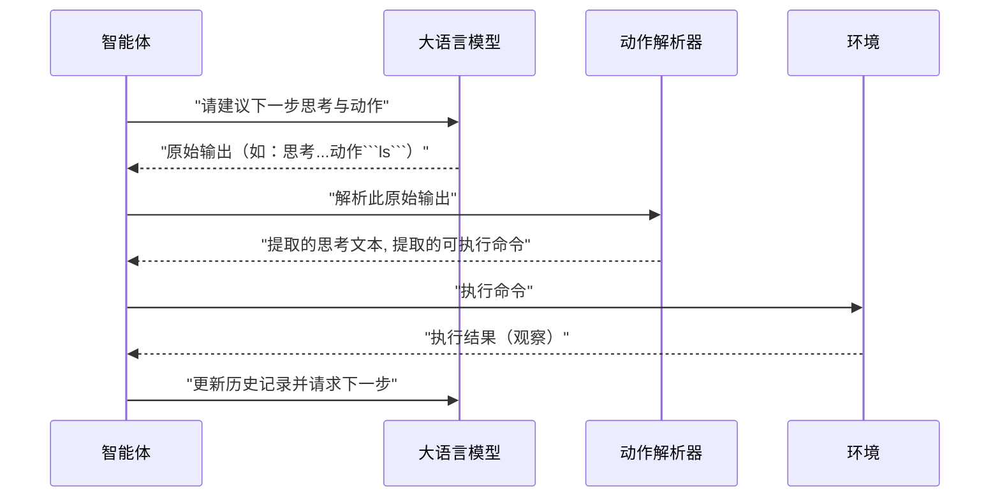

# 第4章：动作解析器  

欢迎回来

在[第3章：大语言模型](03_language_model__llm__.md)中，我们了解到**大语言模型**是[智能体](02_agent_.md)的智能核心，能够处理问题、分析历史操作与观察结果，并以纯文本形式生成"思考"和"动作"建议。  

但这里存在一个关键挑战：LLM输出的是文本字符串，通常混杂着推理过程。而SWE-agent需要在编程[环境](06_environment__and_deployment_.md)中执行实际命令（如运行`ls -l`或编辑文件）。如何==将LLM的文本*意图*转化为可执行的*命令*？==  

这正是**动作解析器**的职责所在

## 什么是动作解析器？  

**动作解析器**如同专业翻译官，其核心任务是解析[大语言模型](03_language_model__llm__.md)的原始文本输出，精确提取待执行的命令。  

当LLM完成"思考"并决定下一步操作后，会返回如下响应：  

```text  
思考：我需要列出当前目录文件以确认'app.py'是否存在  
动作：  
```bash  
ls -F  
```
```  

动作解析器会分析完整消息并提取关键信息："实际要执行的命令是`ls -F`"，随后将这条标准化命令交给[智能体](02_agent_.md)执行。  

### 为何动作解析器如此重要？  

*   **桥梁作用**：连接LLM的"思考"（文本输出）与智能体的"执行"（运行命令）  
*   **多格式兼容**：LLM可能以不同形式输出动作（如Bash代码块、结构化JSON或XML标签），解析器需适配多种"语言"  
*   **确保正确性**：仅提取有效命令，避免误将LLM的推理文本当作指令执行  

## LLM动作表达方式与解析器适配  

人类可通过多种方式表达指令，LLM同样支持多样化的动作输出格式。SWE-agent提供不同类型的解析器应对这些场景。  

### 1. Bash代码块（使用`ThoughtActionParser`）  

多数LLM习惯在```` ```bash ````或```` ``` ````标记的代码块中输出命令。`ThoughtActionParser`会提取*最后一个*有效代码块作为动作。  

**LLM输出示例：**  
```text  
思考：用户希望我列出所有文件  
动作：  
```bash  
ls -R  
```
```  

解析器将提取`ls -R`。  

### 2. 结构化函数调用（使用`FunctionCallingParser`）  

现代LLM（如`gpt-4o`或新版Claude）支持"函数调用"功能，能以结构化形式调用特定工具或函数。  

**LLM输出示例：**  
```json  
{  
  "thought": "需要查看'app.py'内容以定位问候语",  
  "tool_calls": [{  
    "function": {  
      "name": "bash",  
      "arguments": {"command": "cat app.py"}  
    }  
  }]  
}  
```

`FunctionCallingParser`会解析该结构化输出，提取命令`cat app.py`。  

### 3. XML标签命令（使用`XMLThoughtActionParser`）  

部分LLM配置可能采用XML标签显式标记命令。  

**LLM输出示例：**  
```xml  
思考：需要列出当前目录文件  
<command>  
ls -l  
</command>  
```

`XMLThoughtActionParser`将提取`ls -l`。  

## 在SWE-agent中使用==动作解析器==  

通过YAML配置文件或命令行参数`--agent.tools.parse_function.type`指定解析器类型。  

| 解析器类型               | 描述                                    | 适用场景                                                     | 示例参数值               |
| :----------------------- | :-------------------------------------- | :----------------------------------------------------------- | :----------------------- |
| `thought_action`         | 提取LLM输出中最后一个代码块内容         | LLM以Markdown代码块输出命令时的通用方案（默认解析器）        | `thought_action`         |
| `function_calling`       | 解析LLM结构化`tool_calls`字段           | **推荐用于支持函数调用的现代LLM**，可靠性更高且能清晰分离思考与动作 | `function_calling`       |
| `xml_thought_action`     | 提取`<command>`标签内的命令             | LLM被明确要求以XML格式输出动作时                             | `xml_thought_action`     |
| `single_bash_code_block` | 严格提取唯一一个```` ```bash ````块内容 | 强制要求LLM只输出单个Bash命令块时                            | `single_bash_code_block` |
| `action_only`            | 将整个LLM输出视为动作（无思考部分）     | 测试场景或简单直接命令                                       | `action_only`            |

### 示例：指定解析器类型  

显式要求使用`thought_action`解析器：  

```bash title="使用ThoughtActionParser"  
sweagent run \  
  --agent.model.name=gpt-4o \  
  --problem_statement.text="将'app.py'中的'Hello'改为'Hi'" \  
  --agent.tools.parse_function.type=thought_action  
```

**运行逻辑：**  
- 明确告知SWE-agent：LLM输出将包含以```` ```bash ````标记的命令  
- 若LLM返回`sed -i 's/Hello/Hi/g' app.py`代码块，解析器会精确提取该命令  
- 若LLM输出不符合格式（如无代码块），解析器将报错并通知[智能体](02_agent_.md)  

## 技术实现：解析器工作流程  

### 解析器在智能体循环中的角色  



[智能体](02_agent_.md)不直接理解LLM的原始输出，始终依赖动作解析器进行转换。解析器作为关键中介，将LLM的"语言"转化为[环境](06_environment__and_deployment_.md)可执行的指令。  

### 核心代码

解析器逻辑位于`sweagent/tools/parsing.py`，定义了解析器基类`AbstractParseFunction`及各具体实现。  

#### 基类`AbstractParseFunction`  

所有解析器均继承该基类，需实现`__call__`方法：  

```python  
# 摘自：sweagent/tools/parsing.py（简化版）  
class AbstractParseFunction(ABC):  
    error_message: str  # 解析错误时的提示模板  

    @abstractmethod  
    def __call__(self, model_response: dict, commands: list, strict=False) -> tuple[str, str]:  
        """  
        核心解析方法  
        model_response: LLM原始输出字典  
        commands: 可用命令列表（用于校验）  
        返回: (思考文本, 动作命令)  
        """  
        raise NotImplementedError  
```

#### 示例：`ThoughtActionParser`  

通过正则表达式匹配代码块：  

```python  
class ThoughtActionParser(AbstractParseFunction):  
    def __call__(self, model_response: dict, commands: list, strict=False) -> tuple[str, str]:  
        # 使用正则匹配所有代码块  
        code_blocks = re.findall(r"```(?:bash)?\n(.*?)\n```", model_response["message"], re.DOTALL)  
        if not code_blocks:  
            raise FormatError("未找到有效命令代码块")  

        last_action = code_blocks[-1].strip()  # 提取最后一个代码块  
        thought = re.sub(r"```.*?```", "", model_response["message"], flags=re.DOTALL)  
        return thought, last_action  
```

#### 示例：`FunctionCallingParser`  

直接解析结构化`tool_calls`字段：  

```python  
class FunctionCallingParser(AbstractParseFunction):  
    def __call__(self, model_response: dict, commands: list, strict=False) -> tuple[str, str]:  
        if "tool_calls" not in model_response:  
            raise FunctionCallingFormatError("缺少tool_calls字段")  

        tool_call = model_response["tool_calls"][0]  
        action = f"{tool_call['function']['name']} {tool_call['function']['arguments']['command']}"  
        return model_response["message"], action  
```

## 结语  

**动作解析器**是SWE-agent的关键组件，负责将[大语言模型](03_language_model__llm__.md)的原始文本转化为[智能体](02_agent_.md)可执行的命令

通过支持多种格式（如Bash代码块、结构化函数调用或XML标签），解析器确保SWE-agent能准确理解并执行LLM的意图。  

了解动作解析机制后，接下来的问题是：==智能体具体能执行哪些操作？这些操作如何定义==？这正是[第5章：工具与工具包](05_tools___tool_bundles_.md)要探讨的主题

