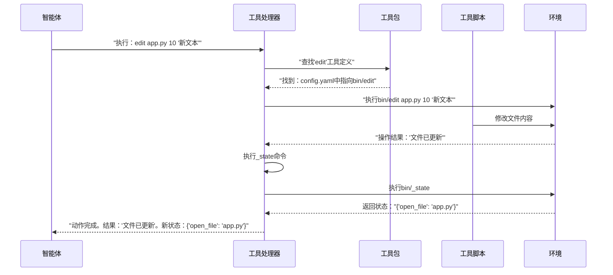

# 第5章：工具与工具包  

欢迎回来

在[第4章：动作解析器](04_action_parsers_.md)中，我们了解到SWE-agent如何通过解析[大语言模型](03_language_model__llm__.md)的文本输出，将其转化为具体动作（如"运行`ls -F`"或"编辑`app.py`"）

但这些动作具体*是什么*？SWE-agent如何让[智能体](02_agent_.md)使用这些能力？  

答案就在于**工具与工具包**。它们定义了智能体与代码库交互的具体能力。  

## 什么是工具？  

想象你是一名软件工程师在修复缺陷时，不仅会*思考*解决方案，还会执行以下操作：  
- 用`open`命令查看文件内容  
- 用`search`在目录中查找特定函数  
- 用`edit`修改代码行  
- 用`run`测试验证修复效果  

在SWE-agent中，这些操作被称为**工具**。一个**工具**是智能体在编程[环境](06_environment__and_deployment__.md)中可执行的特定能力或命令。  

==工具如同智能体的"双手"，是它与计算机交互的接口==。例如`ls`、`cat`、`edit`或`submit`等命令，智能体通过这些工具操作文件、运行代码并最终解决问题。  

### 为何工具如此重要？  
- **交互性**：工具让智能体能够主动操作代码，而非被动观察  
- **问题解决**：没有工具，智能体无法修改代码、运行测试甚至查看文件  
- **灵活性**：通过添加新工具可扩展智能体的能力范围  

SWE-agent的核心用例是修复缺陷，为此智能体需要以下工具：  
1. **查看环境**：`ls`、`cat`（或专用文件查看工具`open`）  
2. **修改代码**：`edit`（或直接调用`sed`等Bash命令）  
3. **验证结果**：`run_tests`（或通过`bash`执行测试命令）  

## 什么是工具包？  

如果将**工具**比作锤子或螺丝刀等独立工具，**工具包**则是将这些工具按逻辑分类的工具箱。  

一个**工具包**是相关工具的集合，通常按功能分组。例如：  
- **文件管理包**（包含`ls`、`cat`、`find`）  
- **代码编辑包**（包含`edit_file`、`search_in_file`）  
- **实用工具包**（包含提升士气的`print_cat`！）  

工具包帮助组织工具，并方便批量启用或禁用智能体的功能集。  

### 工具包的结构  

每个工具包在SWE-agent中是一个具有特定结构的目录：  

```
工具包/  
├── bin/            # 存放工具的可执行脚本  
│   └── <工具脚本1>  
│   └── <工具脚本2>  
├── config.yaml     # 定义工具及其参数  
├── install.sh      # （可选）安装工具依赖的脚本  
└── README.md       # （可选）工具包说明文档  
```

- **`bin/`**：包含工具的实际执行脚本（如Python或Bash脚本）  
- **`config.yaml`**：关键配置文件，声明工具名称、描述（`docstring`）和参数。这些信息会提供给[大语言模型](03_language_model__llm__.md)，指导其使用工具  
- **`install.sh`**：若工具需要特殊依赖（如Python包），此脚本在部署到[环境](06_environment__and_deployment__.md)时自动运行  

### 特殊工具：`bash`与`_state`  

- **`bash`工具**：基础工具，允许智能体执行*任意*Shell命令，相当于直接赋予其命令行接口。多数SWE-agent配置默认包含此工具。  
  ```yaml  
  # config.yaml中bash工具的简化定义  
  tools:  
    bash:  
      signature: "<命令>"  
      docstring: "直接在bash中执行给定命令"  
      arguments:  
        - name: command  
          type: string  
          description: "要执行的bash命令"  
          required: true  
  ```
  该工具使智能体具备极高灵活性，即使某些任务没有专用工具也能处理。  

- **`_state`命令**：工具包中的特殊命令，用于获取环境当前状态（如工作目录或编辑器打开的文件）。每次动作后自动执行，帮助智能体跟踪上下文。  
  ```python  
  # tools/windowed/bin/_state（简化版）  
  #!/usr/bin/env python3  
  import json  
  import os  
  from pathlib import Path  
  
  def main():  
      state = {  
          "open_file": "未设置.txt",  # 实际环境中从注册表获取  
          "working_dir": os.getcwd()  
      }  
      print(json.dumps(state))  
  
  if __name__ == "__main__":  
      main()  
  ```
  此脚本输出的JSON字符串会被SWE-agent处理，用于生成后续给[大语言模型](03_language_model__llm__.md)的提示词，确保其掌握最新上下文。  

## 如何在SWE-agent中使用工具与工具包  

通过YAML配置文件启用特定工具包。SWE-agent默认提供多个实用工具包，如支持高级文件编辑的`edit_anthropic`，或提交解决方案的`submit`包。  

### 示例：加载工具包  

修改配置文件的`bundles`部分来加载工具包：  

```yaml  
# config/my_custom_config.yaml（简化版）  
agent:  
  bundles:  
    - path: tools/registry         # 状态管理工具包  
    - path: tools/edit_anthropic   # 高级文件编辑工具包  
    - path: tools/submit           # 解决方案提交工具包  
```

运行SWE-agent时指定此配置：  

```bash  
sweagent run \  
  --config config/my_custom_config.yaml \  
  --agent.model.name=gpt-4o \  
  --problem_statement.text="将config.py中的'version'改为'2.0.0'" \  
  --env.repo.github_url=https://github.com/SWE-agent/test-repo  
```

**运行流程**：  
1. SWE-agent读取配置文件，加载`registry`、`edit_anthropic`和`submit`工具包  
2. 将这些工具包安装到[环境](06_environment__and_deployment__.md)中（包括运行`install.sh`脚本）  
3. 工具包中的工具（如`open`、`edit`、`submit`）对智能体可用  
4. [大语言模型](03_language_model__llm__.md)根据工具文档（来自`config.yaml`）选择使用方式。例如：  
   - `open config.py`查看文件  
   - `edit config.py 10 "version = '2.0.0'"`修改代码  
   - `submit`提交解决方案  

如需创建自定义工具，请参考[添加自定义工具](../usage/adding_custom_tools.md)教程！  

## 技术实现：工具与工具包的管理  

当智能体决定使用某个工具时，后台会执行以下流程：  

### 工具执行流程  



`工具处理器`作为协调者，管理所有已加载工具包中的工具，并在[环境](06_environment__and_deployment__.md)中执行它们。每次动作后自动运行`_state`命令以更新上下文。  

### 核心代码

工具与工具包的核心逻辑位于`sweagent/tools/tools.py`、`sweagent/tools/bundle.py`和`sweagent/tools/commands.py`。  

#### `ToolConfig`与`ToolHandler`  

`ToolConfig`类（`sweagent/tools/tools.py`）定义所有工具相关配置，包括要加载的工具包列表。`ToolHandler`类则负责运行时管理这些工具。  

```python  
# sweagent/tools/tools.py（简化版）  
class ToolConfig:  
    bundles: list[Bundle] = []  # 工具包列表  

    @cached_property  
    def commands(self) -> list[Command]:  
        """从所有工具包收集Command对象"""  
        return [cmd for bundle in self.bundles for cmd in bundle.commands]  

class ToolHandler:  
    def __init__(self, tools: ToolConfig):  
        self.config = tools  

    def install(self, env: SWEEnv) -> None:  
        """将所有工具包安装到环境中"""  
        for bundle in self.config.bundles:  
            env.install_bundle(bundle)  

    def get_state(self, env: SWEEnv) -> dict:  
        """执行所有_state命令并合并结果"""  
        return {k: v for bundle in self.config.bundles   
                for k, v in bundle.get_state(env).items()}  
```

#### `Bundle`  

`Bundle`类（`sweagent/tools/bundle.py`）表示单个工具包，负责加载其`config.yaml`并提供定义的`Command`对象。  

```python  
# sweagent/tools/bundle.py（简化版）  
class Bundle:  
    path: Path  # 工具包路径  

    def load_config(self) -> None:  
        """加载config.yaml"""  
        with open(self.path / "config.yaml") as f:  
            self.config = yaml.safe_load(f)  

    @property  
    def commands(self) -> list[Command]:  
        """返回该工具包定义的所有Command对象"""  
        return [Command(name=name, **cfg)   
                for name, cfg in self.config["tools"].items()]  
```

#### `Command`  

`Command`类（`sweagent/tools/commands.py`）定义单个工具的元数据，包括名称、描述、参数等，并能转换为现代LLM支持的"函数调用"格式。  

```python  
# sweagent/tools/commands.py（简化版）  
class Command:  
    name: str  
    docstring: str  # 工具描述  

    def to_function_calling(self) -> dict:  
        """转换为OpenAI函数调用格式"""  
        return {  
            "name": self.name,  
            "description": self.docstring,  
            "parameters": {  
                "type": "object",  
                "properties": {arg.name: {"type": arg.type} for arg in self.args}  
            }  
        }  
```

## 结语  

**工具与工具包**是智能体与[环境](06_environment__and_deployment__.md)交互的核心能力。工具定义具体操作，工具包则按功能组织这些操作。通过合理配置工具，我们赋予SWE-agent执行[大语言模型](03_language_model__llm__.md)生成"思考"的能力，从而解决实际编码问题。  

了解工具机制后，接下来的问题是：这些==工具在*何处*运行？==这正是[第6章：环境与部署](06_environment__and_deployment__.md)要探讨的主题

