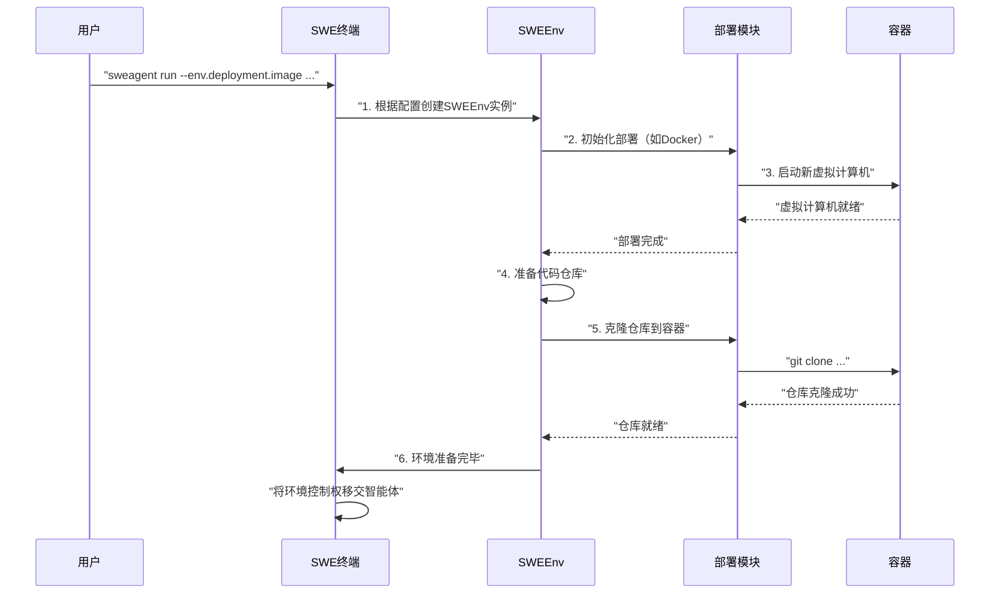

# 第6章：环境与部署  

欢迎回来

在[第5章：工具与工具包](05_tools___tool_bundles_.md)中，我们了解了智能体能够执行的具体操作（工具），例如打开文件、编辑代码或运行测试。但这些操作实际在*何处*发生？  

想象一位软件工程师需要修复项目中的缺陷。他们并非凭空修改代码，而是需要一台具备操作系统、项目文件和必要软件（如Python、Git或代码编辑器）的计算机，同时需要一个安全的工作空间以避免影响主系统。  

对SWE-agent而言，这个"虚拟计算机"或"安全工作区"就是**环境**。  

## 什么是环境？  

**环境**是智能体"生存"并执行代码和命令的隔离工作区。可以将其视为专为单个任务配置的虚拟计算机或沙箱。  

环境的核心价值：  
- **安全性**：与真实计算机完全隔离。智能体可安装软件、删除文件甚至崩溃虚拟系统，而不会影响实际机器。  
- **一致性**：每次启动新任务时，智能体都会获得一个全新的干净环境，确保之前的任务不会遗留混乱文件或冲突的软件安装。  
- **即用性**：环境是[工具与工具包](05_tools___tool_bundles_.md)安装和运行的场所，提供操作系统、文件系统和Shell（如Bash）等基础设施。  

SWE-agent使用强大的**SWE-ReX**包来管理这些环境，该包专门用于创建和运行隔离的代码执行沙箱。  

## 什么是部署？  

**部署**定义了如何创建和管理这个隔离工作区（环境）。它如同IT部门，负责配置虚拟计算机。  

SWE-agent支持多种部署方式：  

| 部署类型       | 描述                                   | 适用场景                                                     |
| :------------- | :------------------------------------- | :----------------------------------------------------------- |
| **本地Docker** | 环境在本地计算机的Docker容器中运行     | 本地开发、测试和小型任务的常见选择。若已安装Docker则易于设置。 |
| **云服务**     | 环境在远程云平台（如Modal、AWS）上运行 | 大规模操作、性能测试或需要超出本地计算能力的场景。           |

对于初学者，**本地Docker**是最推荐的方式。  

## 如何配置环境与部署  

通过命令行参数（通常以`--env`为前缀）指定环境和部署的细节。常见用例包括：  
1. 指定基础操作系统镜像（如特定Python版本）  
2. 声明要克隆到环境中的代码仓库（如GitHub仓库）  

### 示例：使用自定义Docker镜像和GitHub仓库  

假设我们需要SWE-agent修复GitHub项目中某个缺陷，并要求使用Python 3.11的Docker镜像作为基础环境：  

```bash  
sweagent run \  
  --agent.model.name=gpt-4o \  
  --problem_statement.text="修复'utils.py'中访问config_data时的'KeyError'" \  
  --problem_statement.type=text \  
  --env.deployment.image="python:3.11" \  
  --env.repo.github_url="https://github.com/swe-agent/test-repo" \  
  --env.repo.type="github"  
```

**运行逻辑：**  
- `--env.deployment.image="python:3.11"`：基于`python:3.11`镜像创建隔离环境  
- `--env.repo.github_url`：将指定GitHub仓库克隆到环境中  
- `--env.repo.type="github"`：明确声明URL指向GitHub仓库  

在智能体开始*思考*如何修复缺陷前，SWE-agent会自动：  
1. 启动基于`python:3.11`的新Docker容器  
2. 在容器内克隆指定仓库  
3. 设置工作区（包括安装指定的[工具与工具包](05_tools___tool_bundles_.md)）  
4. 将控制权移交智能体，此时它已拥有一个即用型编码环境  

### 自定义Docker镜像  

若项目需要特定依赖或基础配置，可通过`Dockerfile`构建自定义镜像。例如使用名为`my-custom-swe-env`的镜像：  

```bash  
sweagent run \  
  --env.deployment.image="my-custom-swe-env" \  
  --env.repo.path="/path/to/my/local/code" \  
  --env.repo.type="local" \  
  --problem_statement.text="运行本地测试"  
```

（更多自定义环境细节请参考[环境配置文档](docs/config/environments.md)）  

## 技术实现：环境搭建流程  

### 环境初始化流程  



1. **配置读取**：运行`sweagent run`时，终端首先读取所有配置（包括环境类型和仓库信息）  
2. **环境初始化**：创建`SWEEnv`类（来自`sweagent/environment/swe_env.py`）实例，该类是环境的核心管理器  
3. **部署启动**：`SWEEnv`通过**SWE-ReX**启动隔离工作区（如Docker容器）  
4. **仓库设置**：容器运行后，根据`RepoConfig`克隆或复制代码库到容器中  
5. **工具安装**：将[工具与工具包](05_tools___tool_bundles_.md)安装到环境中  
6. **就绪移交**：最终将`SWEEnv`实例传递给智能体，后者可在这个干净隔离的沙箱中开始操作  

### 核心代码解析  

环境管理逻辑位于`sweagent/environment/swe_env.py`和`sweagent/environment/repo.py`。  

#### `EnvironmentConfig`与`SWEEnv`  

`EnvironmentConfig`类定义所有环境设置，`SWEEnv`类则根据这些配置创建和管理实际运行环境。  

```python  
# sweagent/environment/swe_env.py（简化版）  
class EnvironmentConfig:  
    deployment: DeploymentConfig = Field(  
        default_factory=lambda: DockerDeploymentConfig(image="python:3.11")  
    )  
    repo: Optional[RepoConfig] = None  

class SWEEnv:  
    def __init__(self, deployment, repo):  
        self.deployment = deployment  # SWE-ReX部署对象  
        self.repo = repo  

    def start(self):  
        """启动部署并设置仓库"""  
        self.deployment.start()  
        if self.repo:  
            self.repo.copy(self.deployment)  
```

`SWEEnv.from_config`方法将配置转换为实际运行环境，`start()`方法协调初始化、仓库设置等流程。  

#### 仓库配置（`repo.py`）  

`sweagent/environment/repo.py`定义不同类型仓库的处理逻辑。例如`GithubRepoConfig`类：  

```python  
# sweagent/environment/repo.py（简化版）  
class GithubRepoConfig:  
    github_url: str  

    def copy(self, deployment):  
        """将仓库克隆到沙箱"""  
        command = f"git clone {self.github_url} ."  
        deployment.runtime.execute(Command(command, shell=True))  
```

该类通过向容器发送`git clone`命令实现仓库克隆。  

#### 环境内命令执行  

环境就绪后，`SWEEnv.communicate()`是智能体与容器交互的核心方式：  

```python  
# sweagent/environment/swe_env.py（简化版）  
class SWEEnv:  
    def communicate(self, command: str) -> str:  
        """在运行环境中执行命令"""  
        result = asyncio.run(  
            self.deployment.runtime.run_in_session(BashAction(command))  
        )  
        return result.output  
```

该方法将命令（如`ls -F`）封装为`BashAction`对象，通过SWE-ReX在容器Shell中执行。  

## 结语  

**环境**是SWE-agent执行任务的隔离、一致且安全的工作区，**部署**则定义其创建方式（通常通过本地Docker或云服务）。借助**SWE-ReX**包，我们能为智能体提供完美的"虚拟计算机"，以应对各类编码挑战。  

了解智能体的工作场所后，下一步将探索==如何微调SWE-agent的每个行为细节==——这正是[第7章：配置系统](07_configuration_system_.md)的主题
