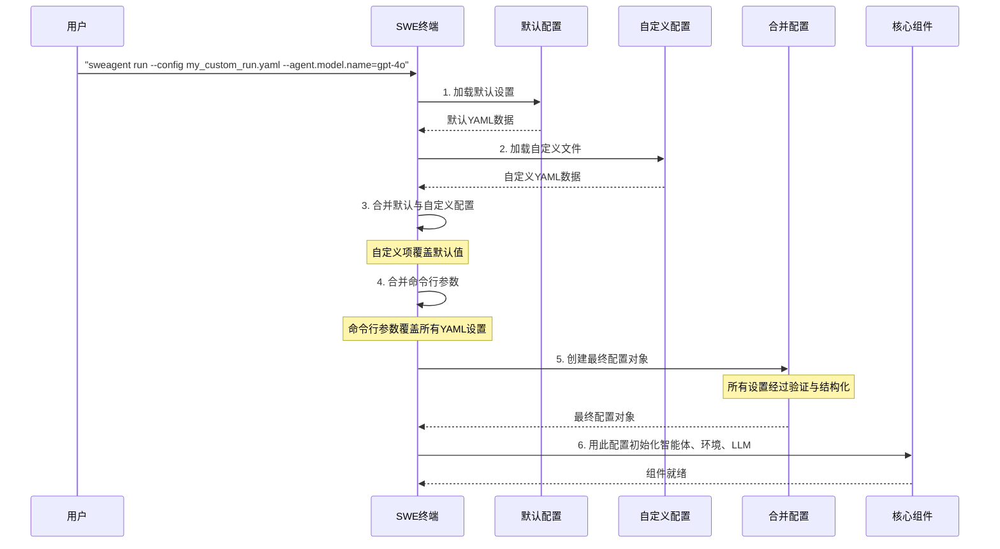

# 第7章：配置系统  

欢迎回来

在[第6章：环境与部署](06_environment__and_deployment__.md)中，我们了解了智能体执行任务的隔离工作区。

现在，假设我们已经拥有了这些强大的组件——智能的[大语言模型](03_language_model__llm__.md)、多样的[工具与工具包](05_tools___tool_bundles__.md)以及灵活的[环境与部署](06_environment__and_deployment__.md)。如何在不修改核心代码的情况下，告诉SWE-agent使用*哪种*LLM、启动*哪个*Docker镜像以及提供*哪些*工具？  

这就是**配置系统**的职责所在。  

## 什么是配置系统？  

**配置系统**是SWE-agent运行的"总体规划"。可以将其视为复杂菜品的食谱或智能手机的设置菜单。它允许你通过简单易读的**YAML**文件定义和定制SWE-agent的每个行为细节——从大脑到工作区。  

### 为何配置系统如此重要？  
- **无代码定制**：无需修改SWE-agent的底层代码即可调整其行为（如更换LLM或添加新工具），具备极高的灵活性。  
- **可复现性**：保存特定配置并分享，确保任务能在相同设置下精确复现。  
- **实验性**：轻松尝试不同LLM、工具集或环境配置，找到最适合特定问题的方案。  

## 可配置的内容  

配置系统几乎涵盖SWE-agent的每个部分。以下是关键可配置项：  

| 配置项                                                | 描述                                                         | 示例                                                   | 相关章节                                                     |
| :---------------------------------------------------- | :----------------------------------------------------------- | :----------------------------------------------------- | :----------------------------------------------------------- |
| **[智能体](02_agent_.md)**                            | 智能体类型（`DefaultAgent`、`RetryAgent`）及通用设置         | 最大步数、智能体名称                                   | [第2章：智能体](02_agent_.md)                                |
| **[大语言模型](03_language_model__llm__.md)**         | 使用的LLM（`gpt-4o`、`claude`）、温度参数（创造性）、API密钥及成本限制 | `--agent.model.name=gpt-4o`                            | [第3章：大语言模型](03_language_model__llm__.md)             |
| **[动作解析器](04_action_parsers_.md)**               | 如何将LLM的原始文本输出解析为可执行命令（如`function_calling`、`thought_action`） | `--agent.tools.parse_function.type=function_calling`   | [第4章：动作解析器](04_action_parsers_.md)                   |
| **[工具与工具包](05_tools___tool_bundles_.md)**       | 可用的具体工具（如`edit`、`ls`、`submit`），按工具包分组     | `--agent.bundles=[tools/edit_anthropic, tools/submit]` | [第5章：工具与工具包](05_tools___tool_bundles_.md)           |
| **[环境与部署](06_environment__and_deployment__.md)** | 隔离工作区：使用的Docker镜像、克隆的GitHub仓库或挂载的本地代码 | `--env.deployment.image="python:3.12"`                 | [第6章：环境与部署](06_environment__and_deployment__.md)     |
| **提示词模板**                                        | 任务不同阶段展示给LLM的指令和示例的精确措辞                  | 初始系统消息、工具示例                                 | （隐含在[大语言模型](03_language_model__llm__.md)和[智能体](02_agent_.md)中） |
| **问题描述**                                          | 问题提供方式（纯文本、GitHub issue URL、本地文件）           | `--problem_statement.text="..."`                       | [第1章：问题描述](01_problem_statement_.md)                  |

## 如何使用配置系统  

SWE-agent使用**YAML**文件进行配置。YAML是一种人类友好的数据序列化标准，便于读写结构化设置。  

所有配置按**层级**方式处理：  
1. **默认配置**：SWE-agent首先加载`config/default.yaml`文件作为基准设置。  
2. **自定义配置文件**：通过`--config`标志提供自定义`.yaml`文件，这些文件会合并到默认设置中。若自定义文件与默认配置存在相同项，自定义项将*覆盖*默认值。  
3. **命令行参数**：直接在命令行中提供的选项（如`--agent.model.name=gpt-4o`）*始终覆盖*YAML文件中的设置。  

这种"后者优先"的合并规则便于精细调整每次运行。  

### 示例：自定义SWE-agent运行  

假设你需要：  
- 使用不同的LLM：`claude-sonnet-4`  
- 指定Docker镜像：`python:3.12`  
- 为智能体添加新工具：`web_browser`（用于浏览网页）  

创建自定义YAML文件`my_custom_run.yaml`：  

```yaml  
agent:  
  model:  
    name: claude-sonnet-4  
  tools:  
    bundles:  
      - path: tools/registry  
      - path: tools/edit_anthropic  
      - path: tools/web_browser  # 添加网页浏览工具包！  
      - path: tools/submit  
env:  
  deployment:  
    image: python:3.12  
```

运行SWE-agent时加载此配置：  

```bash  
sweagent run \  
  --config my_custom_run.yaml \  
  --problem_statement.text="浏览example.com并返回主标题" \  
  --env.repo.github_url="https://github.com/SWE-agent/test-repo"  
```

**运行流程：**  
1. SWE-agent首先加载`default.yaml`。  
2. 接着加载`my_custom_run.yaml`，其中`agent.model.name`、`agent.tools.bundles`和`env.deployment.image`覆盖默认值，`web_browser`工具包被加入。  
3. 智能体将使用`claude-sonnet-4`作为大脑，在`python:3.12`的Docker环境中运行，并可通过`web_browser`工具与网页交互。  

### 通过命令行参数覆盖  

若想临时改用`gpt-4o`而非`claude-sonnet-4`（无需修改YAML文件），只需在命令行中添加：  

```bash  
sweagent run \  
  --config my_custom_run.yaml \  
  --agent.model.name=gpt-4o \  
  --problem_statement.text="浏览example.com并返回主标题" \  
  --env.repo.github_url="https://github.com/SWE-agent/test-repo"  
```

此时，命令行中的`--agent.model.name=gpt-4o`优先级高于YAML文件中的设置，而其他配置（如Docker镜像和`web_browser`工具）仍会生效。  

## 技术实现：配置合并流程  

### 配置合并流程  



1. **加载默认配置**：`SWE终端`首先从`config/default.yaml`加载基准配置。  
2. **加载自定义文件**：接着加载用户通过`--config`指定的YAML文件。  
3. **合并YAML**：这些配置被合并，若同一项出现在多个文件中，后加载的文件优先级更高。  
4. **合并命令行参数**：解析命令行参数并合并到配置中，命令行参数始终具有最高优先级。  
5. **创建配置对象**：合并后的设置用于生成一个结构化的**配置对象**，并通过Pydantic库验证其格式正确性。若存在错误（如无效的LLM名称），系统会提示。  
6. **初始化组件**：最终验证通过的配置对象传递给SWE-agent的核心组件——[智能体](02_agent_.md)、[环境与部署](06_environment__and_deployment__.md)、[大语言模型](03_language_model__llm__.md)和[工具与工具包](05_tools___tool_bundles_.md)，以初始化其行为。  

### 核心代码

配置解析与合并逻辑位于`sweagent/run/common.py`的`BasicCLI`类中，嵌套字典的合并由`sweagent/utils/serialization.py`处理。  

#### `BasicCLI.get_config`  

`get_config`方法是核心协调者，完成上述所有步骤。它使用`argparse`处理基础命令行选项（如`--config`和`--help`），并借助`pydantic-settings`解析和验证剩余参数及合并后的YAML数据。  

```python  
# sweagent/run/common.py（简化版）  
class BasicCLI:  
    def get_config(self, args: list[str] | None = None) -> BaseSettings:  
        # 1. & 2. 加载配置文件（默认+自定义）  
        config_merged = {}  
        if self.default_settings:  
            config_merged = yaml.safe_load(self.default_config_file.read_text())  
        for f in cli_args.config:  # 处理自定义--config文件  
            merge_nested_dicts(config_merged, yaml.safe_load(Path(f).read_text()))  

        # 3. & 4. 合并剩余参数与配置  
        try:  
            config: BaseSettings = CliApp.run(  
                self.arg_type,  
                remaining_args,  # 命令行参数  
                **config_merged,  # 合并的YAML数据  
            )  
        except ValidationError as e:  
            raise RuntimeError("配置无效") from e  

        return config  
```

- `config_type`（如`RunSingleConfig`）是最终配置对象的蓝图。  
- `yaml.safe_load()`读取YAML文件内容。  
- `merge_nested_dicts()`确保嵌套字典被正确合并而非简单覆盖。  
- `CliApp.run()`整合所有配置数据并进行验证。  

## 结语  

**配置系统**是SWE-agent的控制面板，允许==定义任务的"总体规划"==，从[大语言模型](03_language_model__llm__.md)到[工具与工具包](05_tools___tool_bundles_.md)再到[环境与部署](06_environment__and_deployment__.md)

通过理解YAML文件与命令行参数的层级合并机制，你可以==在不修改核心代码的情况下完全掌控SWE-agent的行为==。  

了解如何配置SWE-agent后，下一步将探索它==如何记录==整个任务过程——每一次思考、动作和观察。这正是[第8章：轨迹](08_trajectory_.md)的主题
