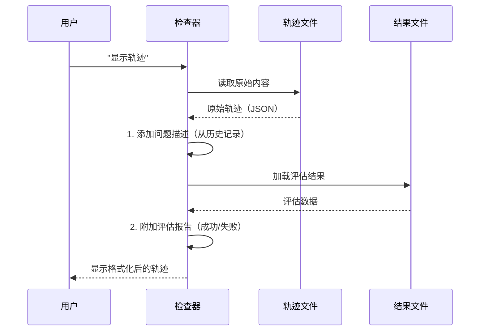

# 第8章：轨迹  

欢迎回来

在[第7章：配置系统](07_configuration_system_.md)中，我们学习了如何设置和微调SWE-agent的每个部分，从智能大脑（[大语言模型](03_language_model__llm__.md)）到工作区（[环境与部署](06_environment__and_deployment__.md)）。现在，假设我们配置好的智能体刚刚完成了一项编码任务，比如修复一个复杂项目中的缺陷。我们如何知道它*做了什么*？如何回顾它的工作、理解它的决策过程，甚至在出错时进行调试？  

这就是**轨迹**的用武之地

## 什么是轨迹？  

**轨迹**是智能体从开始任务到完成（或失败）的完整步骤记录。它就像飞机的飞行记录仪，或者智能体解决问题的详细日记。  

智能体的[大语言模型](03_language_model__llm__.md)的每一次"思考"、通过[工具与工具包](05_tools___tool_bundles_.md)提出的每一个"动作"、以及从[环境与部署](06_environment__and_deployment__.md)返回的每一个"观察"都被细致地记录下来。这包括：  

- **思考**：智能体的推理过程。  
- **动作**：执行的命令或操作（如`ls -F`、`cat app.py`、`edit file.py`）。  
- **观察**：动作的输出或结果（如文件内容、命令错误、测试结果）。  
- **元数据**：其他重要细节，如环境状态、动作耗时、发送给LLM的精确消息等。  

轨迹是SWE-agent运行的**主要输出文件**，封装了整个交互历史，并以JSON格式保存为`.traj`文件。  

### 为何轨迹如此重要？  

轨迹的价值体现在以下几个方面：  
- **调试**：如果智能体失败，可以重放其精确步骤，定位问题所在。是误解了[问题描述](01_problem_statement_.md)？命令错误？还是对观察结果的错误解读？  
- **理解行为**：分析成功（或失败）的运行，了解智能体如何应对不同类型的问题、使用了哪些策略、如何从错误中恢复。  
- **生成新示例**：成功的轨迹可以转换为"演示"，作为工作示例展示给[大语言模型](03_language_model__llm__.md)，帮助其学习未来解决类似问题的方法。  

## 如何查看轨迹  

SWE-agent提供了便捷的工具来查看这些详细的轨迹文件：命令行检查器和基于Web的检查器。两者都能帮助你逐步导航并理解智能体的推理过程。  

### 1. 命令行检查器  

CLI检查器是一个强大的基于文本的工具，可直接在终端中快速查看轨迹。  

**使用方法：**  
导航到包含`.traj`文件的目录（通常是`trajectories/$USER/<experiment_name>/<instance_id>/`），运行：  

```bash  
sweagent inspect  
# 或简写  
sweagent i  
```

**运行效果：**  
终端中将打开一个分页器，显示轨迹内容。你可以逐步浏览智能体的操作步骤。  

**关键导航控制（类似`vim`）：**  

| 按键      | 功能                                |
| :-------- | :---------------------------------- |
| `q`       | 退出检查器                          |
| `H` / `L` | 跳转到**上一条** / **下一条**轨迹   |
| `t`       | 显示所有轨迹列表（可搜索）          |
| `h` / `l` | 跳转到**上一步** / **下一步**       |
| `j` / `k` | 在当前视图中**向下** / **向上**滚动 |
| `v`       | 切换步骤的"简略"和"完整"视图        |
| `o`       | 打开关联的日志文件                  |
| `e`       | 在`$EDITOR`中打开当前文件           |

### 2. 基于Web的检查器  

对于更直观的体验（尤其是长轨迹或与他人共享时），基于Web的检查器非常有用。  

**使用方法：**  
导航到包含`.traj`文件的目录，运行：  

```bash  
sweagent inspector  
# 或简写  
sweagent I  
```

**运行效果：**  
SWE-agent将启动本地Web服务器（通常在`http://localhost:8000`），并自动在浏览器中打开。Web界面提供交互式视图，可点击浏览步骤并查看完整上下文。  

{: style="width: 49%;"}  
{: style="width: 49%;"}  

## 技术实现：轨迹文件的结构  

轨迹本质上是JSON文件。每个文件代表一次智能体运行，包含一个`info`字典（摘要统计信息）和一个`trajectory`列表（每个列表项是一个步骤）。  

以下是`.traj`文件的简化结构：  

```json  
{  
  "info": {  
    "exit_status": "submitted",  
    "model_stats": {  
      "instance_cost": 0.05,  
      "api_calls": 5  
    }  
    // ... 其他摘要信息 ...  
  },  
  "trajectory": [  
    {  
      "thought": "用户希望我修复拼写错误...",  
      "action": "ls -F",  
      "observation": "app.py\nREADME.md\n",  
      "state": {  
        "open_file": "",  
        "working_dir": "/my_repo"  
      },  
      "query": [{"role": "system", "content": "你是一个乐于助人的助手..."}],  
      "response": "思考：... 动作：```ls -F```",  
      "execution_time": 1.2  
    },  
    {  
      "thought": "我找到了app.py，现在需要读取其内容...",  
      "action": "cat app.py",  
      "observation": "print('Helo world!')\n",  
      "state": {  
        "open_file": "app.py",  
        "working_dir": "/my_repo"  
      },  
      "query": [{"role": "system", "content": "你是一个乐于助人的助手..."}],  
      "response": "思考：... 动作：```cat app.py```",  
      "execution_time": 0.8  
    }  
    // ... 更多步骤直至任务完成或失败 ...  
  ]  
}  
```

### 轨迹数据的核心代码  

轨迹中单个步骤的核心定义位于`sweagent/types.py`。该文件作为共享数据结构的中心，避免循环依赖。  

```python  
# sweagent/types.py（简化版）  
class TrajectoryStep(TypedDict):  
    action: str  
    observation: str  
    response: str  # LLM的原始响应  
    state: dict[str, str]  # 环境状态  
    thought: str  
    execution_time: float  
    query: list[dict[str, Any]]  # 发送给LLM的消息  
    extra_info: dict[str, Any]  

class AgentRunResult(BaseModel):  
    info: AgentInfo  # 摘要信息  
    trajectory: list[TrajectoryStep]  # 步骤列表  
```

### 检查器如何处理轨迹  

CLI和Web检查器不会直接显示原始JSON，而是加载`.traj`文件并进行额外处理，以提供更有用的信息。  

以下是检查器准备轨迹视图的简化流程：  



## 结语  

**轨迹**是智能体完整问题解决过程的逐步记录，是SWE-agent的主要输出。通过理解和利用CLI与Web检查器，你可以获得强大的调试、行为分析和示例生成工具。轨迹对于真正理解和提升SWE-agent的性能至关重要。  

至此，我们完成了SWE-agent核心概念的探索！从定义[问题描述](01_problem_statement_.md)到配置[智能体](02_agent_.md)的每个方面，再到回顾完整的[轨迹](#chapter-8-trajectory)，你现在已经具备了构建和部署自己的AI软件工程师的坚实基础。编码愉快

END *★,°*:.☆(￣▽￣)/.°★* 。