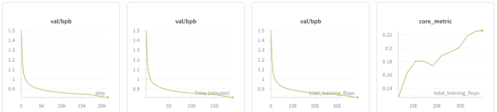
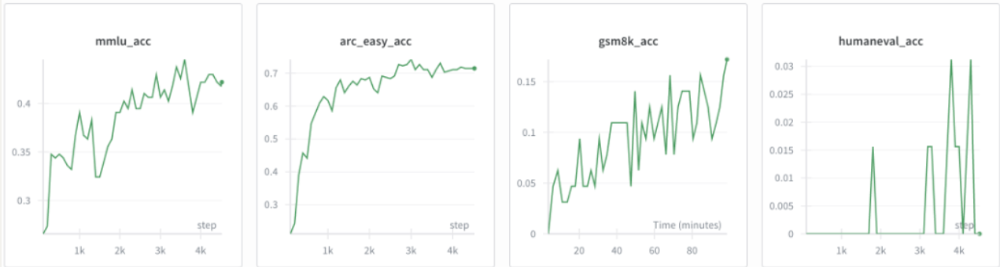
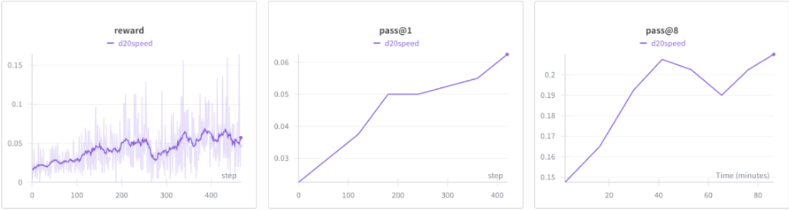
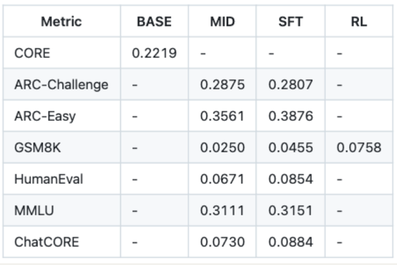

(思考了一下，还是决定在讲解训练阶段之前，插入对readme的翻译，如果想直接继续看训练阶段的可以跳转即可)

# nanoGPT


这是一个最简单、最快速的中等规模GPT训练/微调代码库。它是对minGPT的重写，更注重实用性而非教学性。目前仍在积极开发中，但当前版本的train.py可在OpenWebText数据集上复现GPT-2（124M参数）的训练，在8块A100 40GB显卡节点上约需4天完成训练。代码本身简洁易读：train.py是约300行的标准训练循环，model.py是约300行的GPT模型定义，可选择加载OpenAI的GPT-2预训练权重。仅此而已。


## 复现124M模型

由于代码极其简单，很容易根据需求进行修改：从头训练新模型，或微调预训练检查点（例如目前可用的最大起点是OpenAI的GPT-2 1.3B模型）。

## 安装
```bash
pip install torch numpy transformers datasets tiktoken wandb tqdm
```
依赖项：
- pytorch <3
- numpy <3
- transformers（用于加载Hugging Face的GPT-2检查点）<3
- datasets（如需下载+预处理OpenWebText）<3
- tiktoken（用于OpenAI的快速BPE编码）<3
- wandb（可选日志记录）<3
- tqdm（进度条）<3

## 快速开始
如果您不是深度学习专业人士，只想体验神奇效果，最快的方式是在莎士比亚作品上训练字符级GPT。首先下载数据（1MB文件）并将原始文本转换为整数流：
```bash
python data/shakespeare_char/prepare.py
```
这将在data目录下生成train.bin和val.bin。接下来训练GPT，模型规模取决于您的计算资源：

### 有GPU的情况
使用config/train_shakespeare_char.py配置快速训练小型GPT：
```bash
python train.py config/train_shakespeare_char.py
```
该配置训练一个上下文长度256字符、384特征通道、6层Transformer（每层6个头）的模型。在A100 GPU上约3分钟完成训练，最佳验证损失1.4697。训练完成后可从最佳模型生成样本：
```bash
python sample.py --out_dir=out-shakespeare-char
```
示例输出：
```
ANGELO:
And cowards it be strawn to my bed,
And thrust the gates of my threats,
Because he that ale away, and hang'd
An one with him.

DUKE VINCENTIO:
I thank your eyes against it.
```
对于字符级模型，3分钟GPU训练效果已不错。更佳结果可通过微调预训练GPT-2获得（见后文微调章节）。

### 只有Macbook（或其他廉价电脑）
仍可训练GPT但需降低配置。建议安装PyTorch nightly版提升效率。基础训练命令：
```bash
python train.py config/train_shakespeare_char.py --device=cpu --compile=False --eval_iters=20 --log_interval=1 --block_size=64 --batch_size=12 --n_layer=4 --n_head=4 --n_embd=128 --max_iters=2000 --lr_decay_iters=2000 --dropout=0.0
```
CPU运行需设置`--device=cpu`并关闭PyTorch 2.0编译`--compile=False`。其他调整包括：评估迭代20次（原200）、上下文长度64字符（原256）、批量12（原64）、更小的Transformer（4层4头128嵌入尺寸）、2000次迭代（学习率相应衰减）、取消正则化`--dropout=0.0`。约3分钟运行后损失值1.88，生成样本：
```
GLEORKEN VINGHARD III:
Whell's the couse, the came light gacks,
And the for mought you in Aut fries the not high shee
```
对于CPU上3分钟训练，已能捕捉角色神韵。若愿意等待更久，可调整超参数增加网络规模、上下文长度等。

对于Apple Silicon Macbook，添加`--device=mps`可利用芯片GPU加速训练（2-3倍）。详见Issue 28。

## 复现GPT-2
专业用户可能更关注复现GPT-2结果。首先对OpenWebText（OpenAI WebText的开源复现）进行分词：
```bash
python data/openwebtext/prepare.py
```
生成包含GPT2 BPE token id的train.bin和val.bin。复现GPT-2（124M）至少需要8块A100 40GB显卡：
```bash
torchrun --standalone --nproc_per_node=8 train.py config/train_gpt2.py
```
约4天训练后损失降至~2.85。在多节点环境可跨节点运行，例如：
```bash
# 主节点（示例IP 123.456.123.456）：
torchrun --nproc_per_node=8 --nnodes=2 --node_rank=0 --master_addr=123.456.123.456 --master_port=1234 train.py
# 工作节点：
torchrun --nproc_per_node=8 --nnodes=2 --node_rank=1 --master_addr=123.456.123.456 --master_port=1234 train.py
```
单GPU训练直接运行`python train.py`，所有参数都设计为可读、可修改。

## 基线测试
通过OpenAI GPT-2检查点获取OpenWebText基线：
```bash
$ python train.py config/eval_gpt2.py
$ python train.py config/eval_gpt2_medium.py
$ python train.py config/eval_gpt2_large.py
$ python train.py config/eval_gpt2_xl.py
```
训练/验证损失如下：

| 模型        | 参数量 | 训练损失 | 验证损失 |
| ----------- | ------ | -------- | -------- |
| gpt2        | 124M   | 3.11     | 3.12     |
| gpt2-medium | 350M   | 2.85     | 2.84     |
| gpt2-large  | 774M   | 2.66     | 2.67     |
| gpt2-xl     | 1558M  | 2.56     | 2.54     |

注意GPT-2是在未公开的WebText上训练，而OpenWebText是其开源复现，存在领域差距。直接微调GPT-2（124M）可使损失降至~2.85，成为更合适的复现基线。

## 微调
微调与训练类似，只需从预训练模型初始化并使用更小学习率。例如微调莎士比亚数据集：
```bash
python train.py config/finetune_shakespeare.py
```
这会加载config/finetune_shakespeare.py配置（未深度调优），从GPT2检查点初始化并正常训练（时间更短、学习率更小）。内存不足时可减小模型规模或上下文长度。最佳检查点默认保存在out-shakespeare目录，采样：
```bash
python sample.py --out_dir=out-shakespeare
```
示例输出：
```
THEODORE:
Thou shalt sell me to the highest bidder: if I die,
I sell thee to the first; if I go mad,
I sell thee to the second; if I lie, 
I sell thee to the third: so buy or sell,
I tell thee again, thou shalt not sell my possession.
```
未深度调优超参数，欢迎尝试改进！

## 采样/推理
使用sample.py从OpenAI发布的预训练GPT-2或自定义模型采样。例如从最大gpt2-xl模型采样：
```bash
python sample.py \
    --init_from=gpt2-xl \
    --start="What is the answer to life, the universe, and everything?" \
    --num_samples=5 --max_new_tokens=100
```
从自定义模型采样使用`--out_dir`指定路径，也可从文件输入提示文本（如`--start=FILE:prompt.txt`）。

## 效率说明
bench.py可用于简单模型基准测试和分析，它剥离了train.py训练循环中的其他复杂性。

代码默认使用PyTorch 2.0（截至2022年12月29日需安装nightly版），一行`torch.compile()`即可将迭代时间从~250ms/iter降至135ms/iter。

## 待办事项
- 研究添加FSDP替代DDP
- 评估标准测试集（如LAMBADA/HELM）的零样本困惑度
- 优化微调脚本超参数
- 实现训练期间线性批量增长计划
- 整合其他嵌入（rotary/alibi）
- 检查点中分离优化器缓冲与模型参数
- 增加网络健康日志（梯度裁剪事件/幅度等）
- 研究更好的初始化方法

## 故障排除
默认使用PyTorch 2.0（即`torch.compile`），某些平台（如Windows）可能不支持，添加`--compile=False`可禁用（会降低运行速度）。

了解本代码库/GPT/语言模型背景可观看[Zero To Hero系列](https://www.youtube.com/watch?v=kCc8FmEb1nY)中的GPT视频。

更多问题讨论欢迎加入Discord #nanoGPT频道。

(书接前文↓)

# 3. 训练阶段

### 预训练

在开始预训练之前，Karpathy 建议需要下载一个名为**“eval bundle”** 的文件。

在预训练过程中，脚本会定期评估 **CORE 指标**。简单来说，CORE 是一个规范化的综合指标，用于衡量模型在多个自动补全数据集上的表现。数据集包括 HellaSwag、Jeopardy、BigBench QA、Wikidata、ARC-Easy/Challenge、COPA、Commonsense QA、PIQA、Lambada、Winograd、BoolQ 等，总共 22 个数据集。

下载、解压，并将 eval bundle 放到基础目录下：~/.cache/nanochat/eval_bundle

```bash
curl -L -o eval_bundle.zip https://karpathy-public.s3.us-west-2.amazonaws.com/eval_bundle.zipunzip -q eval_bundle.ziprm eval_bundle.zipmv eval_bundle "$HOME/.cache/nanochat"
```

另外一个可选步骤是**设置 wandb**，可以在训练过程中查看漂亮的可视化曲线。

虽然 uv 已经安装了 wandb，但你仍需要注册账号并登录：

```nginx
wandb login
```

接下来，可以开始预训练了

Karpathy 表示，这是计算量最大的一步，模型通过**预测序列中的下一个 token** 来压缩网页文本，同时也逐渐学习世界知识。

```apache
torchrun --standalone --nproc_per_node=8 -m scripts.base_train -- --depth=20
```

这里 Karpathy 使用了 **8 张 GPU** 启动训练，训练一个 **20 层的 Transformer**

默认情况下，每张 GPU 每次前向/反向传播处理 **32 行 × 2048 token**，也就是 524,288 ≈ 0.5M token 每步优化。

如果 wandb 已设置，可加上 --run=speedrun 记录训练日志。

训练过程中，会看到类似信息（为了简洁起见，这里删除了一些内容）：

```swift
Vocab size: 65,536num_layers: 20model_dim: 1280num_heads: 10num_kv_heads: 10Tokens / micro-batch / rank: 32 x 2048 = 65,536Tokens / micro-batch: 524,288Total batch size 524,288 => gradient accumulation steps: 1Number of parameters: 560,988,160Estimated FLOPs per token: 3.491758e+09Calculated number of iterations from target data:param ratio: 21,400Total number of training tokens: 11,219,763,200Tokens : Params ratio: 20.00Total training FLOPs estimate: 3.917670e+19Scaling the LR for the AdamW parameters ∝1/√(1280/768) = 0.774597Muon: Grouping 80 params of shape torch.Size([1280, 1280]), device cuda:0, dtype torch.float32Muon: Grouping 20 params of shape torch.Size([1280, 5120]), device cuda:0, dtype torch.float32Muon: Grouping 20 params of shape torch.Size([5120, 1280]), device cuda:0, dtype torch.float32Step 00000 | Validation bpb: 3.3013^[step 00000/21400 (0.00%) | loss: 11.090355 | lrm: 1.00 | dt: 23156.74ms | tok/sec: 22,640 | mfu: 1.00 | total time: 0.00mstep 00001/21400 (0.00%) | loss: 10.808654 | lrm: 1.00 | dt: 649.22ms | tok/sec: 807,569 | mfu: 35.64 | total time: 0.00mstep 00002/21400 (0.01%) | loss: 10.179083 | lrm: 1.00 | dt: 472.29ms | tok/sec: 1,110,094 | mfu: 48.99 | total time: 0.00mstep 00003/21400 (0.01%) | loss: 9.449214 | lrm: 1.00 | dt: 487.47ms | tok/sec: 1,075,523 | mfu: 47.47 | total time: 0.00mstep 00004/21400 (0.02%) | loss: 8.903216 | lrm: 1.00 | dt: 487.57ms | tok/sec: 1,075,308 | mfu: 47.46 | total time: 0.00mstep 00005/21400 (0.02%) | loss: 8.531662 | lrm: 1.00 | dt: 482.58ms | tok/sec: 1,086,417 | mfu: 47.95 | total time: 0.00mstep 00006/21400 (0.03%) | loss: 8.231589 | lrm: 1.00 | dt: 487.21ms | tok/sec: 1,076,113 | mfu: 47.49 | total time: 0.00mstep 00007/21400 (0.03%) | loss: 7.993080 | lrm: 1.00 | dt: 484.10ms | tok/sec: 1,083,014 | mfu: 47.80 | total time: 0.00mstep 00008/21400 (0.04%) | loss: 7.803373 | lrm: 1.00 | dt: 488.17ms | tok/sec: 1,073,989 | mfu: 47.40 | total time: 0.00mstep 00009/21400 (0.04%) | loss: 7.627318 | lrm: 1.00 | dt: 484.78ms | tok/sec: 1,081,486 | mfu: 47.73 | total time: 0.00mstep 00010/21400 (0.05%) | loss: 7.491893 | lrm: 1.00 | dt: 487.03ms | tok/sec: 1,076,511 | mfu: 47.51 | total time: 0.00mstep 00011/21400 (0.05%) | loss: 7.354157 | lrm: 1.00 | dt: 487.10ms | tok/sec: 1,076,334 | mfu: 47.50 | total time: 0.01mstep 00012/21400 (0.06%) | loss: 7.246406 | lrm: 1.00 | dt: 487.99ms | tok/sec: 1,074,383 | mfu: 47.42 | total time: 0.02mstep 00013/21400 (0.06%) | loss: 7.159368 | lrm: 1.00 | dt: 486.56ms | tok/sec: 1,077,540 | mfu: 47.55 | total time: 0.02m
```

可以看到，这个 Transformer 在注意力机制中有 **1280 维通道**，注意力头数为 10，总参数约 **5.6 亿**

按照 Chinchilla scaling law 推荐，这里需要训练**约 560M×20≈11.2B tokens。由于优化器的每一步都需要 524,288 个 tokens，这意味着**总共需要**约 11.2B/0.5M≈21400 次迭代**。

通过将每个标记的预估 FLOP 数乘以标记总数，最终得到这个模型的性能约为 4e19 FLOP。

学习率会自动按 1/sqrt(dim) 的比例缩小，因为较大的模型更倾向于较小的学习率。

这次过程中，Karpathy 使用 Muon 优化矩阵，并使用 AdamW 优化嵌入和去嵌入

- 此模型中没有其他可训练参数（偏差、rmsnorm 参数等）。训练会定期报告“验证 bpb”，即验证数据集上的每字节位数。

- 每字节位数比典型的交叉熵损失要好得多，因为它进一步将每个标记的损失用该标记的字节数进行归一化，从而使该指标与分词器无关。

因此，无论你的分词器词汇量大小，这个数字都是可比的，这与原始交叉熵损失不同。

注意，每一步大约需要 0.5 秒，`lrm `是学习率衰减乘数（在训练结束时会线性下降到 0），报告的 MFU（模型浮点运算利用率）看起来不错，几乎达到了一半左右，这意味着我们正在利用大量可用的 bfloat16 计算资源。

训练大约需要 **3 小时** 执行完 4e19 FLOPs。在 wandb 上，你会看到 bpb 逐渐下降（模型预测下一个 token 更准确），CORE 指标逐渐上升。



训练完成后，可通过以下命令进一步评估模型：

```apache
torchrun --standalone --nproc_per_node=8 -m scripts.base_losstorchrun --standalone --nproc_per_node=8 -m scripts.base_eval
```

可以看到，训练集和验证集的 bpb 达到 **0.81**，而 **CORE** 指标上升到 **0.22**

作为对比，eval bundle 中包含了 GPT-2 模型的 CORE 分数。其中，CORE **0.22** 略高于 GPT-2 Large（0.21），但略低于 GPT-2 XL（也就是标准 GPT-2，0.26）。

此时的模型本质上是一个高级的自动补全工具，我们可以通过几个示例提示（prompts）来了解模型里存储了哪些知识。文件 **base_loss.py** 会执行这些示例提示。Prompt 内容如下：

```ini
prompts = [    "The capital of France is",    "The chemical symbol of gold is",    "If yesterday was Friday, then tomorrow will be",    "The opposite of hot is",    "The planets of the solar system are:",    "My favorite color is",    "If 5*x + 3 = 13, then x is",]
```

模型完成结果如下：

```cs
The capital of France is Paris. It is the largest city in France and the second largest city in EuropeThe chemical symbol of gold is Au. The chemical symbol of silver is Ag. The chemical symbol of copper isIf yesterday was Friday, then tomorrow will be Saturday. If yesterday was Monday, then tomorrow will be Monday. If yesterday wasThe opposite of hot is cold. The opposite of hot is cold. The opposite of hot is cold.The planets of the solar system are: Mercury, Venus, Earth, Mars, Jupiter, Saturn, Uranus, Neptune,My favorite color is red. It is the color of the sun, the color of the sky,If 5*x + 3 = 13, then x is a positive integer.
```

可见模型已经掌握了**地理、化学、时间逻辑、基础数学**和**太阳系行星**等知识，但对一些简单常识（如天空颜色）仍不确定。

（不过，对于一个训练成本仅 **72 美元**的模型来说，表现已经相当不错了...

推理阶段使用**自定义 Engine 类**，支持 **KV 缓存**提升效率，并实现了 **prefill** 和 **decode** 两个常用阶段。同时，Engine 还支持调用工具（如 Python 解释器），这在后续训练 GSM8K 时会非常有用。

### 中期训练

接下来是**中期训练**，主要是进一步微调模型，让它更适合 SmolTalk 对话数据。

算法上和预训练完全相同，但现在训练的数据变成了多轮对话，模型也会学习新的**特殊 token**，用来构建多轮对话对象。

每条对话大致如下（参考 OpenAI Harmony chat 格式）：

```swift
<|bos|><|user_start|>What is the color of the sky?<|user_end|><|assistant_start|>Red. Wait, possibly blue. I'm not sure.<|assistant_end|><|user_start|>lol<|user_end|><|assistant_start|>...etcetc
```

其中 <|example|> 这样的 token 是特殊 token，遵循 OpenAI 的格式。中期训练阶段对于模型中的许多调整非常有用：

- 模型学习与多轮对话相关的特殊 token（除了 <|bos|>（文档起始符），这些 token 在基础模型预训练阶段并不存在）
- 适应对话数据的分布，模型不再只是处理网页文本，而是学习如何理解和生成对话
- 训练模型做选择题（Multiple Choice），小模型仅靠随机网络训练无法理解选择题的规则，模型必须学会将选项（A、B、C、D）与正确答案对应，我们在训练中加入了 MMLU auxiliary_train 中的 10 万道选择题。
- 训练模型使用工具，比如让模型学会在特殊 token <|python_start|> … <|python_end|> 内执行 Python 命令。这在之后训练 GSM8K（数学题）时会很有用。
- 其他潜在适应，如扩展上下文长度等（目前尚未探索）。

默认的中期训练数据混合如下：

```bash
train_dataset = TaskMixture([    SmolTalk(split="train"), # 460K rows of general conversations    MMLU(subset="auxiliary_train", split="train"), # 100K rows of multiple choice problems drawn from ARC, MC_TEST, OBQA, RACE    GSM8K(subset="main", split="train"), # 8K rows teaching simple math and (calculator) tool use]) # total: 460K + 100K + 8K = 568K rows
```

启动中期训练命令：

```apache
torchrun --standalone --nproc_per_node=8 -m scripts.mid_train
```

这一步大约只需 **8 分钟**，远比预训练的 3 小时短。现在模型已经成为一个完整的 **Chat 模型**，可以充当 Assistant 回答用户问题。评估模型：

```apache
torchrun --standalone --nproc_per_node=8 -m scripts.chat_eval -- -i mid
```

此阶段模型的表现：

```diff
- ARC-Easy: 0.3561- ARC-Challenge: 0.2875- MMLU: 0.3111- GSM8K: 0.0250- HumanEval: 0.0671- ChatCORE metric: 0.0730
```

我们可以看到以下几点：

- **世界知识**：前 3 个测试（ARC-Easy、ARC-Challenge 和 MMLU）都是选择题，用来衡量模型在不同领域的常识水平。因为每道题有 4 个选项（A、B、C、D），随机猜的正确率大约是 25%。而这里得到的模型已经明显超过了这个水平——这对这么小的模型来说其实挺难的。
- **数学**：GSM8K 是小学数学题。这里的基准分是 0%，因为模型需要写出具体的数字答案。目前训练出来的模型表现还不算理想，只能解出大约 2% 的题目。
- **代码**：HumanEval 是 Python 编程测试，同样随机猜测的正确率是 0%。
- **ChatCORE 指标**：这是 Karpathy 为了模仿 CORE 分数（用于基础模型）并扩展到聊天模型而设计的指标。具体做法是：把所有任务的得分减去基准分，使得最终分数范围在 0 到 1 之间（例如在 MMLU 上，随机模型是 0，而不是 25%），然后取这些任务的平均值。这样就能得到一个简单的数字，来概括当前模型的整体水平。
- 目前这些评估还不算完整，还有很多维度暂时没测到。

Karpathy 表示，由于没有太好的图表能展示这一步的效果，但可以看看他之前给一个更大模型做中期训练（midtraining）时的曲线图——能直观看到这些指标在微调过程中是如何上升的。



### 监督微调

在训练中期之后，接下来是**监督微调（SFT）** 阶段。这是对对话数据的又一轮微调，但这里通常会**精挑细选最优质的数据**，同时也可以加入一些安全训练，比如训练助手学会拒绝不合适的请求。Karpathy 调侃道，“我们的模型连天空是什么颜色都不太确定，所以目前在生物安全方面应该没问题。”

SFT 阶段的一个重要改进是领**域适配（domain adaptation）**：

- 它会拉伸数据行并进行填充（padding），严格模拟测试时的格式。换句话说，样本不再像预训练或中期训练中那样随意拼接成长行，这种拼接主要是为了训练效率。
- 通过修正这种域不匹配，模型会得到额外的性能提升，相当于再“拧紧一颗螺丝”。

运行 SFT 并重新评估模型：

```apache
torchrun --standalone --nproc_per_node=8 -m scripts.chat_sfttorchrun --standalone --nproc_per_node=8 -m scripts.chat_eval -- -i sft
```

这一阶段大约只需 **7 分钟**，你会发现各项指标都有小幅提升：

```diff
- ARC-Easy: 0.3876- ARC-Challenge: 0.2807- MMLU: 0.3151- GSM8K: 0.0455- HumanEval: 0.0854- ChatCORE metric: 0.0884
```

最后，我们可以真正以**用户身份**与模型进行对话了！虽然在中期训练后就可以聊，但现在效果会更好。可以在终端里聊天：

```nginx
python -m scripts.chat_cli
```

或者通过网页界面聊天：

```nginx
python -m scripts.chat_web
```

chat_web 会使用 **FastAPI** 启动服务，记得正确访问，比如在 Lambda 上用节点的公网 IP 加端口，例如：

```apache
http://209.20.xxx.xxx:8000/
```

聊天界面大致会是这样的效果：


Karpathy 提醒道——由于这个 **100 美元档模型只有 4e19 FLOPs 能力**，聊起来就像在跟幼儿园小朋友对话

它目前还不可能赢得物理或诗歌比赛，但令人惊讶的是，我们用**这么少的预算**就能训练出这样一个模型，而且这个项目**远未完全调优**，潜力很大。

### 强化学习

**speedrun 的最后阶段**（默认情况下被注释掉）是强化学习（RL）。

通过 RLHF（基于人类反馈的强化学习）可以提升模型性能几个百分点，同时缓解采样循环带来的问题，比如幻觉生成、无限循环等。但对于自己构建的小模型来说，这些问题不是主要考虑因素。

在使用的数据集中，Karpathy 表示，**GSM8K** 是唯一有清晰、客观奖励函数的数据集（即数学题的正确答案）。因此可以直接在答案上进行强化学习，通过一个简单的 RL 循环交替进行采样和训练：

```apache
torchrun --standalone --nproc_per_node=8 -m scripts.chat_rltorchrun --standalone --nproc_per_node=8 -m scripts.chat_eval -- -i rl -a GSM8K
```

在 RL 过程中，模型会遍历训练集中的所有 GSM8K 题目，先生成答案，然后根据奖励评分，再用高奖励的答案进行训练。我们使用了一个高度简化的 **GRPO** 训练循环：

- 不使用信任域（丢掉参考模型和 KL 正则化）
- 采用 on-policy（丢掉 PPO 的比例和裁剪机制）
- 使用 GAPO 风格归一化（按 token 级别，而非序列级别）
- 奖励优势计算采用简单的均值平移（丢掉 z-score 归一化）

最终的效果看起来更像 **REINFORCE**，但保留了 GR（group relative）部分来计算奖励优势。对于这种规模和任务，这种方法效果还可以。具体细节可以查看脚本。

当前，默认情况下，RL 被注释掉，因为它还没有完全调优，也没有实现完整通用的 RLHF。Karpathy 表示，其目前只在 GSM8K 上进行 RL，因此评估也只限于 GSM8K（使用 -a 标志）。强化学习训练时间较长，因为监督信号有限，默认设置大约 **1.5 小时**，效果如下：



从图中可以看到：

- 奖励在上升（模型在学习）
- pass@1（首次答对率）在提升
- pass@8（8 次机会内答对率）也在提升
- pass@8 明显高于 pass@1，说明还有提升空间，可以通过更多 RL 轮次和训练周期进一步优化

强化学习对**更大模型**的提升更明显。

# 4. 性能结果

值得注意的是，项目文件夹中会生成 **report.md** 文件，它记录了训练的详细信息，并在末尾提供了一个清晰的总结表格，方便查看各项指标和模型表现。

下面就是 nanochat 在 100 美元成本下的成绩单：

- 代码字符数——Characters: 333,989
- 代码行数——Lines: 8,304
- 工程文件数——Files: 44
- 代码中的 Token 数——Tokens (approx): 83,497
- 依赖项——Dependencies (uv.lock lines): 2,004



总花费时间：3 小时 51 分钟。

不过，Karpathy 也提醒道，nanochat 目前还远未完成，还有很多需要调优或优化的地方，但整体框架已经足够清晰，所以现在把它上传到 GitHub，让更多人参与改进和完善。

整体来看，nanochat 不是一项颠覆性的突破，但它非常实用。

它==将 LLM 训练的门槛降低到了普通人也能达到的水平==。你可以亲眼看到，==仅用几百美元和几小时就能完成什么==。

(其实几百并非仅用kukuku

