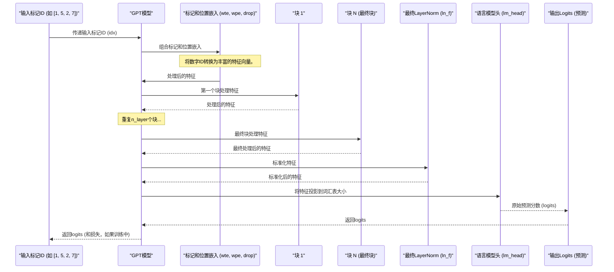

# 第二章：GPT模型架构

欢迎回来

在[第一章：数据预处理与分词](01_data_preparation___tokenization_.md)中，我们像细致的厨师一样，通过将原始文本"食材"切分为数字"标记"并整理成整齐的二进制文件来准备原料。现在原料已备齐，是时候建造"厨师"本身了——**GPT模型架构**。

想象你正在建造一个能写故事的机器人。前一章展示了如何教会机器人认识字母和单词（分词）。本章则是设计机器人的*大脑*：它如何将这些单词拼接起来、理解其含义，进而创作出连贯的新句子。

`nanoGPT`项目的目标是创建一个强大而简洁的生成式预训练Transformer（GPT）版本。这个"抽象"就是大脑的详细蓝图，定义了核心神经网络结构，概述了我们的数字文本如何被处理以学习复杂语言模式，最终生成类人文本。

## GPT模型架构的职责是什么？

本质上，GPT模型是一个**预测机器**。给定一个单词序列（以数字表示），其主要任务是预测该序列中*下一个最可能出现的单词*。

**用例：** 输入模型："The cat sat on the"
模型应预测下一个单词可能是"mat"、"rug"、"floor"等，每个词有不同的概率。

本章将引导你了解这个"==预测机器=="的基本组成部分，帮助你理解它如何接收数字并推断接下来应该出现什么数字。

## ⭕整体概览：`GPT`类

在`nanoGPT`中，整个GPT模型封装在一个名为`GPT`的类中（可在`model.py`中找到）。将`GPT`类视为总建筑师，它将所有小型专用组件组合成完整的"大脑"。

它==接收输入的数字标记，并通过多个层次处理它们，最终输出下一个标记的预测==。

让我们看看`GPT`类启动所需的"原料"（其配置）：

```python
# 摘自model.py
@dataclass
class GPTConfig:
    block_size: int = 1024
    vocab_size: int = 50304
    n_layer: int = 12
    n_head: int = 12
    n_embd: int = 768
    dropout: float = 0.0
    bias: bool = True
```
这个`GPTConfig`就像一张食谱卡片，指定了关键的架构决策：
*   `block_size`：模型能同时查看的最大标记数。
*   `vocab_size`：模型理解的独特标记（字符或子词）总数（来自[第一章：数据预处理与分词](01_data_preparation___tokenization_.md)）。
*   `n_layer`：模型将堆叠多少"处理单元"（称为`Block`）。层数越多，模型越深，潜力越大。
*   `n_head`：与模型如何关注文本不同部分相关（稍后详述）。
*   `n_embd`：每个标记数字表示的"大小"或丰富度。
*   `dropout`：防止模型"过度记忆"的技术。

## `GPT`大脑内部：核心组件

`GPT`模型由几个协同工作的关键组件构建而成。让我们从最简单的开始探索它们。

### 1. `LayerNorm`："质量控制"步骤

神经网络有时会产生过大或过小的数字，导致训练不稳定。

`LayerNorm`就像一个质量控制经理，确保流经网络的所有==数字保持在健康稳定的范围内==。

它对数据进行标准化，类似于食谱可能告诉你"==刮平=="一杯面粉以确保一致性。

```python
# 摘自model.py
class LayerNorm(nn.Module):
    def __init__(self, ndim, bias):
        super().__init__()
        self.weight = nn.Parameter(torch.ones(ndim))
        self.bias = nn.Parameter(torch.zeros(ndim)) if bias else None

    def forward(self, input):
        # 对输入应用标准化
        return F.layer_norm(input, self.weight.shape, self.weight, self.bias, 1e-5)
```
*   `ndim`：特征的大小（如`GPTConfig`中的`n_embd`）。
*   `bias`：可学习的小附加值，提供更多灵活性。

这个虽小但强大的组件有助于保持训练过程的平稳和稳定。

### 2. `CausalSelfAttention`："上下文侦探"

这是像GPT这样的Transformer模型最关键且独特的部分。`CausalSelfAttention`允许模型"回看"输入序列中的先前标记，并决定每个过去标记对理解*当前*标记的重要性。

"因果"部分意味着它*只能*查看过去的标记，而不能查看未来的标记。这对于生成文本至关重要，因为你不能通过查看尚未生成的单词来预测下一个单词！

**类比：** 想象你在写一个句子："The dog chased the ___." 为了选择下一个单词，你会回看"dog"（它是一个名词，一个生物）、"chased"（一个动作动词）和"the"（一个冠词）。你==不会查看空白*之后*的单词，因为它们还不存在==！`CausalSelfAttention`正是为每个标记做这件事。

以下是其核心的简化视图：

```python
# 摘自model.py
class CausalSelfAttention(nn.Module):
    def __init__(self, config):
        super().__init__()
        # 将输入投影到查询、键、值向量
        self.c_attn = nn.Linear(config.n_embd, 3 * config.n_embd, bias=config.bias)
        # 将组合的注意力输出投影回原始嵌入大小
        self.c_proj = nn.Linear(config.n_embd, config.n_embd, bias=config.bias)
        self.n_head = config.n_head # "注意力头"的数量

        # 因果掩码确保标记只关注先前的标记。
        # 它是一个由1组成的三角形：右上角为0，其余为1
        # 例如block_size=4：
        # [[1, 0, 0, 0],
        #  [1, 1, 0, 0],
        #  [1, 1, 1, 0],
        #  [1, 1, 1, 1]]
        # 实际代码中右上角存储为0，稍后用-inf填充
        self.register_buffer("bias", torch.tril(torch.ones(config.block_size, config.block_size))
                                    .view(1, 1, config.block_size, config.block_size))

    def forward(self, x):
        B, T, C = x.size() # 批量大小、序列长度、嵌入维度

        # 1. 创建查询(q)、键(k)、值(v)
        # 这些就像每个标记信息的不同视角。
        # 查询："我在寻找什么？"
        # 键："我包含什么信息？"
        # 值："我实际提供什么信息？"
        q, k, v  = self.c_attn(x).split(self.n_embd, dim=2)
        # 为多头注意力重塑形状 (B, nh, T, hs) -> 批量、头数、序列长度、头大小
        k = k.view(B, T, self.n_head, C // self.n_head).transpose(1, 2)
        q = q.view(B, T, self.n_head, C // self.n_head).transpose(1, 2)
        v = v.view(B, T, self.n_head, C // self.n_head).transpose(1, 2)

        # 2. 计算注意力分数
        # 每个查询与每个键的"匹配"程度。
        # (B, nh, T, hs) x (B, nh, hs, T) -> (B, nh, T, T)
        att = (q @ k.transpose(-2, -1)) * (1.0 / math.sqrt(k.size(-1)))
        # 应用因果掩码：防止查看未来
        att = att.masked_fill(self.bias[:,:,:T,:T] == 0, float('-inf'))
        # 3. Softmax获取概率（权重）
        # 将分数转换为概率，每个查询的总和为1。
        att = F.softmax(att, dim=-1)

        # 4. 将权重应用于值
        # 根据注意力概率加权求和值向量。
        # (B, nh, T, T) x (B, nh, T, hs) -> (B, nh, T, hs)
        y = att @ v
        # 重新组装所有头的输出
        y = y.transpose(1, 2).contiguous().view(B, T, C)

        # 5. 输出投影
        y = self.c_proj(y)
        return y
```
**多头注意力（使用`n_head`）：** 模型不仅使用一个"上下文侦探"，而是使用==几个==（`n_head`）独立的"侦探"。

每个侦探==专注于过去标记的不同方面，并将它们的见解结合起来==。这有助于模型理解复杂的关系。

### 3. `MLP`："思维处理器"

在`CausalSelfAttention`为每个标记确定了上下文后，`MLP`（多层感知器）接收该上下文并进行进一步处理。它是一个标准的==前馈神经网络==，增加了非线性，使模型能够对其收集的信息进行更深层次的计算。

**类比：** 如果注意力是单词讨论它们关系的"会议室"，那么`MLP`就像是会议后的"个人反思"时间，每个单词处理它学到的内容并整合新信息。

```python
# 摘自model.py
class MLP(nn.Module):
    def __init__(self, config):
        super().__init__()
        # 第一线性层扩展维度（通常4倍）
        self.c_fc    = nn.Linear(config.n_embd, 4 * config.n_embd, bias=config.bias)
        self.gelu    = nn.GELU() # 常见的激活函数（如ReLU）
        # 第二线性层投影回原始维度
        self.c_proj  = nn.Linear(4 * config.n_embd, config.n_embd, bias=config.bias)

    def forward(self, x):
        x = self.c_fc(x)
        x = self.gelu(x)
        x = self.c_proj(x)
        return x
```

（attention is all you need for 的说）

### 4. `Block`：GPT的核心构建单元

`Block`是真正发生魔法的地方

将`LayerNorm`、`CausalSelfAttention`和`MLP`组合成一个单一的重复单元。完整的GPT模型==将许多这样的`Block`堆叠在一起（`n_layer`次），使其能够构建越来越复杂的语言理解==。

```python
# 摘自model.py
class Block(nn.Module):
    def __init__(self, config):
        super().__init__()
        self.ln_1 = LayerNorm(config.n_embd, bias=config.bias)
        self.attn = CausalSelfAttention(config)
        self.ln_2 = LayerNorm(config.n_embd, bias=config.bias)
        self.mlp = MLP(config)

    def forward(self, x):
        # 应用LayerNorm，然后Attention，添加到输入（残差连接）
        x = x + self.attn(self.ln_1(x))
        # 应用LayerNorm，然后MLP，添加到结果（残差连接）
        x = x + self.mlp(self.ln_2(x))
        return x
```
> 注意`x = x + ...`部分。这些被称为**残差连接**。

它们像是"捷径"，==允许信息绕过某些层，这对于高效训练非常深的神经网络至关重要==。它有助于防止早期信息在通过许多层时丢失或被稀释。

## 完整的`GPT`模型：组装部件

现在让我们看看`GPT`类如何将所有部分组合在一起。

### `__init__`：设置工厂

`GPT`构造函数（`__init__`）==初始化所有子组件==。

```python
# 摘自model.py
class GPT(nn.Module):
    def __init__(self, config):
        super().__init__()
        self.config = config

        self.transformer = nn.ModuleDict(dict(
            # 标记嵌入：将标记ID转换为丰富的数字向量
            wte = nn.Embedding(config.vocab_size, config.n_embd),
            # 位置嵌入：添加每个标记在序列中位置的信息
            wpe = nn.Embedding(config.block_size, config.n_embd),
            drop = nn.Dropout(config.dropout), # 用于正则化的dropout层
            # Transformer块的堆叠
            h = nn.ModuleList([Block(config) for _ in range(config.n_layer)]),
            # 输出头之前的最终LayerNorm
            ln_f = LayerNorm(config.n_embd, bias=config.bias),
        ))
        
        # 语言模型头：将最终特征映射回词汇表大小
        # 该层预测下一个标记的概率。
        self.lm_head = nn.Linear(config.n_embd, config.vocab_size, bias=False)

        # 权重绑定：输入和输出嵌入权重共享
        self.transformer.wte.weight = self.lm_head.weight
        # ...（为简洁起见，跳过了权重初始化代码）...
```

*   **`wte`（权重标记嵌入）：** 这就像一个字典，将我们的输入标记ID（如`23`、`10`、`55`）转换为密集的数字向量。每个标记获得一个独特的、丰富的表示（`n_embd`数字的列表）。
*   **`wpe`（权重位置嵌入）：** 关键的是，Transformer本身并不理解单词的*顺序*。`wpe`为每个标记的嵌入添加一个小的数字向量，告诉模型其在序列中的位置（如第一个单词、第二个单词等）。
*   **`h`（块）：** 这是我们刚刚讨论的`n_layer`个Transformer`Block`的列表，按顺序堆叠。
*   **`ln_f`（最终LayerNorm）：** 所有块之后的最终标准化步骤。
*   **`lm_head`（语言模型头）：** 这是最终的线性层，它接收每个标记的处理信息，并将其投影回我们的`vocab_size`大小。输出数字（logits）表示每个可能的下一个标记的概率。
*   **权重绑定：** `wte`和`lm_head`共享它们的权重。这是一种常见的优化，节省内存并通常提高性能。

### `forward`：信息流

此方法描述了当你实际通过`GPT`模型传递输入时会发生什么。

**输入：** 一批标记ID（`idx`），通常是形状为`(batch_size, sequence_length)`的`torch.Tensor`。

**示例输入：** `idx = [[1, 5, 2, 7], [3, 8, 0, 4]]`（两个序列，每个4个标记长）

让我们追踪输入标记的旅程：

```python
# 摘自model.py
class GPT(nn.Module):
    # ...（init和其他方法）...
    def forward(self, idx, targets=None):
        device = idx.device
        b, t = idx.size() # 批量大小，序列长度

        # 1. 标记和位置嵌入
        # 将输入标记ID转换为其数字表示（嵌入）
        tok_emb = self.transformer.wte(idx) # (b, t, n_embd)
        # 为序列中每个标记的位置创建位置嵌入
        pos = torch.arange(0, t, dtype=torch.long, device=device) # (t)
        pos_emb = self.transformer.wpe(pos) # (t, n_embd)

        # 组合标记和位置嵌入，然后应用dropout
        x = self.transformer.drop(tok_emb + pos_emb)

        # 2. 通过Transformer块传递
        # 核心处理发生在这里，堆叠所有注意力和MLP层
        for block in self.transformer.h:
            x = block(x) # (b, t, n_embd)

        # 3. 最终层标准化
        x = self.transformer.ln_f(x) # (b, t, n_embd)

        # 4. 语言模型头（输出预测）
        # 将处理后的特征转换为每个可能下一个标记的"logits"（原始分数）
        logits = self.lm_head(x) # (b, t, vocab_size)

        loss = None
        if targets is not None:
            # 如果我们有真实'targets'，可以计算损失
            # 这衡量我们的预测有多好。
            loss = F.cross_entropy(logits.view(-1, logits.size(-1)), targets.view(-1), ignore_index=-1)

        return logits, loss
```

**输出：**
*   `logits`：形状为`(batch_size, sequence_length, vocab_size)`的`torch.Tensor`。这些是序列中每个位置下一个可能标记的原始分数。例如，`logits[0, 3, 100]`将是第一个序列中第3个单词之后标记ID`100`的分数。
*   `loss`：如果提供了`targets`（在训练期间），这是一个数字，表示模型的预测与实际下一个标记的差距。这是模型在训练期间试图最小化的内容。

### 流程可视化

让我们看看数据通过`GPT`模型的整个过程：



## 结论

在本章中，我们剖析了`nanoGPT`模型的"大脑"：其架构。我们首先理解了`GPT`类作为协调者的角色，然后深入研究了其基本构建块：

*   **`LayerNorm`**：保持内部数据稳定的质量控制系统。
*   **`CausalSelfAttention`**：核心机制，使模型通过查看先前标记来"理解"上下文。
*   **`MLP`**：进一步精炼信息的"思维处理器"。
*   **`Block`**：==结合`LayerNorm`、`CausalSelfAttention`和`MLP`与残差连接的重复单元==。

然后，我们看到了`GPT`类如何将这些`Block`与标记和位置嵌入组装成一个完整的网络，能够接收数字文本并输出下一个标记的预测。

准备好==数据和模型架构==后，下一步是学习如何==让这个模型真正*学习*==

[下一章：配置系统](03_configuration_system_.md)

