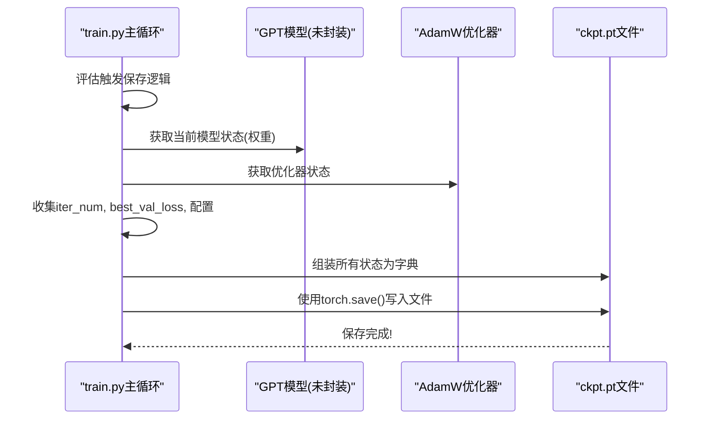
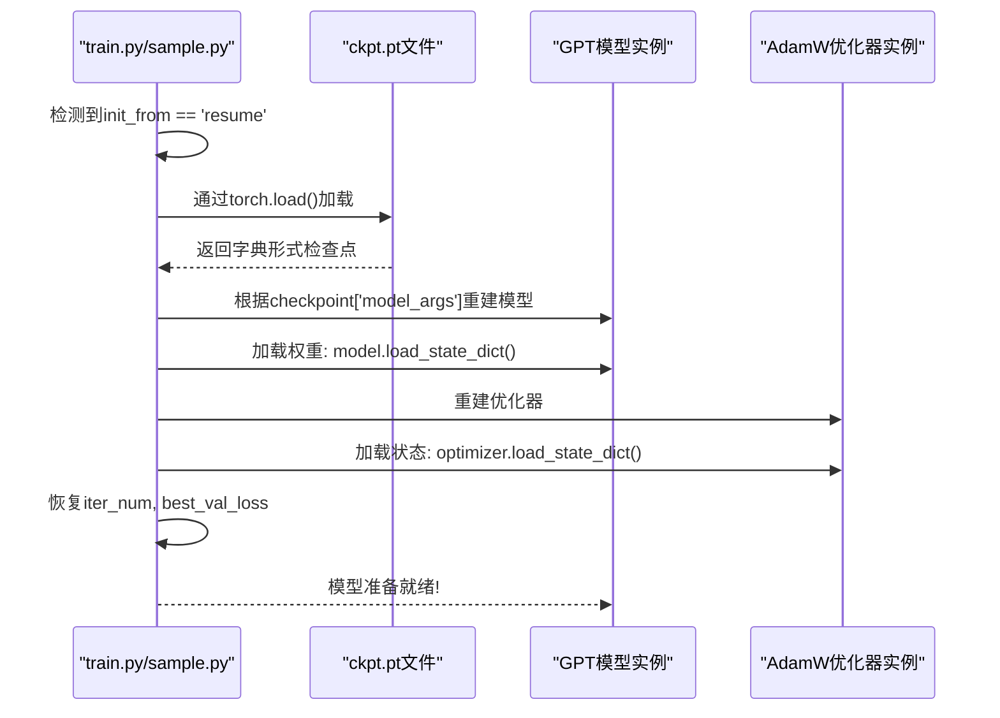
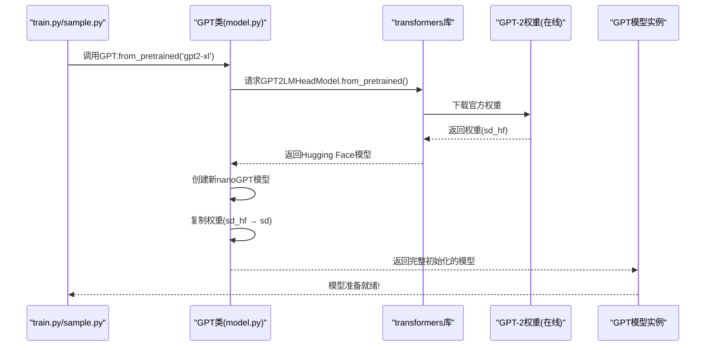

# 第五章：检查点与预训练模型加载

欢迎回来

在[第四章：训练流程编排](04_training_loop_orchestration_.md)中，我们学习了`nanoGPT`如何像熟练的指挥家一样协调所有组件来训练模型——输入数据、生成预测、从错误中学习。

假设你已不眠不休地训练模型，它终于开始输出连贯文本。此时若电脑崩溃怎么办？或想暂停训练明日继续？又或希望基于他人训练好的模型加速自己的项目？

这就是**检查点与预训练模型加载**的价值所在。

它如同为模型大脑准备的"记忆水晶"，可以完整保存其知识体系（学习到的权重、优化器状态、训练进度），并在需要时精准还原。更妙的是，我们还能直接加载高度智能的现成大脑（预训练模型），省去大量训练时间。

## 为何需要检查点与预训练模型？

本章核心解决两大需求：**可靠保存训练进度以便==续训或复用==**，以及**==利用现有==强大GPT-2模型加速自身学习**。

具体解决以下问题：

1. **防止训练中断（检查点）**：大模型训练可能耗时数周。若无检查点，任何意外中断（断电、崩溃或主动暂停）都将导致进度归零。检查点定期保存模型的*完整状态*，确保可随时接续训练。
   * **类比**：就像游戏存档，没人愿意每次重启都从第一关开始！
2. **后期评估与微调（检查点）**：训练完成后，可能需要测试模型表现或适配新任务。检查点提供了模型学习历程的快照，便于后续操作。
3. **知识迁移加速（预训练模型）**：从零训练强大GPT模型需海量数据和算力。而公开的预训练GPT-2模型已掌握大量语言知识，以其为起点进行训练（而非从零开始），可大幅缩短时间且通常表现更优。
   * **类比**：不是教婴儿学说话，而是让博学者专精新领域。

本章将展示`nanoGPT`如何实现这些关键功能，助高效管理模型学习历程。

相关前文传送：[[Sora] 从检查点恢复训练 | `Booster`接口 | EMA模型 | .safetensors](https://blog.csdn.net/2301_80171004/article/details/153417011?ops_request_misc=%257B%2522request%255Fid%2522%253A%2522dae2aaa76f719a61ccf6488e15c6fd50%2522%252C%2522scm%2522%253A%252220140713.130102334.pc%255Fblog.%2522%257D&request_id=dae2aaa76f719a61ccf6488e15c6fd50&biz_id=0&utm_medium=distribute.pc_search_result.none-task-blog-2~blog~first_rank_ecpm_v1~rank_v31_ecpm-3-153417011-null-null.nonecase&utm_term=Sora%E6%A3%80%E6%B5%8B%E7%82%B9&spm=1018.2226.3001.4450)

## 功能使用指南

`nanoGPT`通过`train.py`和`sample.py`中的`init_from`参数简化了这些功能的使用。

### 1. 训练中保存检查点

运行`train.py`时，`nanoGPT`可自动保存检查点。检查点文件(`ckpt.pt`)通常包含：
- 模型权重（"大脑"）
- 优化器状态（当前学习策略如动量值）
- 训练进度（如迭代次数`iter_num`，最佳验证损失`best_val_loss`）
- 模型配置(`model_args`)

检查点保存在配置指定的`out_dir`目录（如`out-shakespeare-char`）。

参考`train.py`或配置文件如`config/train_shakespeare_char.py`：

```python
# 摘自train.py
out_dir = 'out'              # 检查点保存目录
eval_interval = 2000         # 评估/保存间隔
always_save_checkpoint = True # 每次评估后强制保存
# ...
```
在`config/finetune_shakespeare.py`中：
```python
# 摘自配置文件
out_dir = 'out-shakespeare'
eval_interval = 5           # 微调时提高评估频率
always_save_checkpoint = False # 仅在验证损失改善时保存
# ...
```
* `out_dir`：指定`ckpt.pt`保存路径
* `eval_interval`：每隔多少训练迭代评估一次（可能触发保存）
* `always_save_checkpoint`：为`True`时每次评估后保存；为`False`则仅在模型表现提升时保存

**示例**：训练字符级莎士比亚GPT并保存检查点：
```bash
python train.py config/train_shakespeare_char.py
```
此命令启动训练后，每隔`eval_interval`步会在`out-shakespeare-char`目录生成`ckpt.pt`文件。

### 2. 从检查点恢复训练

若训练中断或需要继续训练，可通过加载检查点实现：

`train.py`的`init_from`参数控制此行为：
```python
# 摘自train.py
init_from = 'resume' # 指示从检查点恢复
out_dir = 'out'      # 检查点所在目录
# ...
```
* 在配置中设置`init_from = 'resume'`或通过命令行参数指定
* 确保`out_dir`指向含`ckpt.pt`的目录

**示例**：从既有检查点恢复训练：
```bash
python train.py --init_from=resume --out_dir=out-shakespeare-char
```
此命令让`train.py`加载`out-shakespeare-char/ckpt.pt`中的模型、优化器和进度信息，从中断处继续训练。

### 3. 加载预训练GPT-2模型

我们不必总是从零开始。`nanoGPT`支持加载公开GPT-2模型（如'gpt2'、'gpt2-medium'、'gpt2-xl'），在其基础上继续训练（称为**微调**）。

同样通过`init_from`参数控制：
```python
# 摘自train.py或sample.py
init_from = 'gpt2-xl' # 加载预训练GPT-2 XL模型
# ...
```
* 将`init_from`设为GPT-2变体名（如'gpt2-medium'）

**示例**：基于GPT-2 XL微调莎士比亚数据集（配置见`config/finetune_shakespeare.py`）：
```bash
python train.py config/finetune_shakespeare.py
```
这将加载庞大的GPT-2 XL权重，然后在莎士比亚文本上继续训练。由于模型已具备语言知识，其适应莎士比亚风格的速度远快于从零训练。

**采样示例**：也可直接使用预训练模型生成文本：
```bash
python sample.py --init_from=gpt2-xl --start="生命的意义是什么？" --num_samples=1
```
此命令加载`gpt2-xl`模型并立即根据提示生成文本。

## 实现原理剖析

让我们深入看看`nanoGPT`如何实现保存与加载。

### 1. 保存检查点(`train.py`)

在`train.py`主循环中，每当到达评估点时（间隔`eval_interval`），会触发检查点保存逻辑：



实际保存代码如下：
```python
# 摘自train.py（简化版）
if losses['val'] < best_val_loss or always_save_checkpoint:
    best_val_loss = losses['val']
    if iter_num > 0: # 至少完成一次迭代才保存
        checkpoint = {
            'model': raw_model.state_dict(),      # 模型权重
            'optimizer': optimizer.state_dict(),  # 优化器状态
            'model_args': model_args,             # 模型配置
            'iter_num': iter_num,                 # 当前迭代数
            'best_val_loss': best_val_loss,       # 最佳验证损失
            'config': config,                     # 完整训练配置
        }
        print(f"保存检查点到 {out_dir}")
        torch.save(checkpoint, os.path.join(out_dir, 'ckpt.pt'))
```
* `state_dict()`：获取模型/优化器的可学习参数
* `torch.save()`：将字典序列化为`ckpt.pt`文件

### 2. 加载检查点(`train.py`, `sample.py`)

当设置`init_from = 'resume'`时，`nanoGPT`加载`ckpt.pt`文件：



关键加载代码：
```python
# 摘自train.py（简化版）
if init_from == 'resume':
    ckpt_path = os.path.join(out_dir, 'ckpt.pt')
    checkpoint = torch.load(ckpt_path, map_location=device) # 加载检查点
    
    # 1. 根据保存参数重建模型配置
    checkpoint_model_args = checkpoint['model_args']
    model_args['vocab_size'] = checkpoint_model_args['vocab_size'] # 确保词表一致
    gptconf = GPTConfig(**model_args)
    model = GPT(gptconf)

    # 2. 加载模型权重
    state_dict = checkpoint['model']
    # 处理PyTorch 2.0编译可能添加的前缀
    unwanted_prefix = '_orig_mod.'
    for k,v in list(state_dict.items()):
        if k.startswith(unwanted_prefix):
            state_dict[k[len(unwanted_prefix):]] = state_dict.pop(k)
    model.load_state_dict(state_dict) # 应用权重

    # 3. 恢复训练进度
    iter_num = checkpoint['iter_num']
    best_val_loss = checkpoint['best_val_loss']
```
* `torch.load()`：加载检查点文件到字典
* `load_state_dict()`：将保存的权重载入新建模型实例
* 前缀处理：兼容PyTorch 2.0的`torch.compile`特性

### 3. 加载预训练GPT-2模型(`model.py`)

当指定`init_from = 'gpt2-xl'`时，`nanoGPT`通过`model.py`中的`GPT.from_pretrained`方法从Hugging Face的`transformers`库加载权重：



`from_pretrained`方法核心：
```python
# 摘自model.py（简化版）
@classmethod
def from_pretrained(cls, model_type, override_args=None):
    # 1. 配置对应GPT-2类型的参数
    config_args = {
        'gpt2': dict(n_layer=12, n_head=12, n_embd=768),
        'gpt2-medium': dict(n_layer=24, n_head=16, n_embd=1024),
        # ...其他型号...
    }[model_type]
    config_args['vocab_size'] = 50257 # 标准GPT-2词表大小
    config_args['block_size'] = 1024  # 标准上下文长度

    # 2. 新建nanoGPT模型
    config = GPTConfig(**config_args)
    model = GPT(config)
    sd = model.state_dict() # 获取空权重字典

    # 3. 从Hugging Face加载官方权重
    from transformers import GPT2LMHeadModel
    model_hf = GPT2LMHeadModel.from_pretrained(model_type)
    sd_hf = model_hf.state_dict()

    # 4. 权重拷贝（处理架构差异）
    transposed = ['attn.c_attn.weight', 'attn.c_proj.weight', 'mlp.c_fc.weight', 'mlp.c_proj.weight']
    for k in sd_hf.keys():
        if any(k.endswith(w) for w in transposed):
            # 特定层需转置
            with torch.no_grad():
                sd[k].copy_(sd_hf[k].t())
        elif k in sd: # 仅拷贝nanoGPT存在的键
            with torch.no_grad():
                sd[k].copy_(sd_hf[k])
    return model
```
* 该方法首先配置与所选GPT-2型号匹配的参数
* 通过`transformers`库下载官方权重
* 精心处理层结构差异（如`Conv1D`与`Linear`的转换）
* 返回加载好预训练权重的`nanoGPT`模型

## 初始化方法对比

(场景划分-实现更高凝练的架构设计)

| `init_from`值 | 描述                                          | 适用场景                                     | 数据需求     |
| ------------- | --------------------------------------------- | -------------------------------------------- | ------------ |
| `'scratch'`   | 随机初始化新模型，从零学习                    | ==全新==训练、教学目的、探索自定义架构       | 仅自有数据   |
| `'resume'`    | 从`ckpt.pt`加载模型权重、优化器状态和训练进度 | 续训==中断==任务、复现先前实验、加载特定版本 | 需检查点文件 |
| `'gpt2*'`     | 加载官方预训练GPT-2模型权重                   | 在新数据上==微调==、直接使用强大模型生成文本 | 初始无需数据 |

## 本章小结

我们探索了`nanoGPT`中检查点与预训练模型加载的核心机制。

学会了如何将模型"大脑"保存为记忆水晶(`ckpt.pt`)防止进度丢失，以及如何载入现成GPT-2模型加速学习。这些功能为模型训练提供了灵活性和效率，无论是从零开始、中途续训，还是站在巨人肩膀上创新。

现在我们的模型既能学习又能保存知识，接下来就让它==开口说话==吧！

[下一章：文本生成/采样](06_text_generation___sampling_.md)

