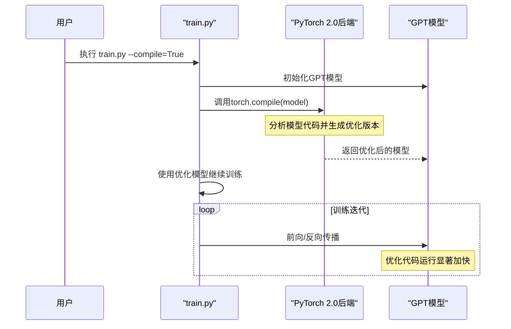

# 第七章：⭕性能与效率工具

欢迎回来

在[第六章：文本生成与采样](06_text_generation___sampling_.md)中，我们解锁了GPT模型的创作能力，使其能够生成新文本。但想象你的模型是一辆高性能赛车：即使有优秀车手和清晰赛道，你仍希望确保其发挥巅峰性能，高效利用燃料（内存）并达到极速（训练速度）。

这就是**性能与效率工具**的用武之地。本章介绍调校`nanoGPT`项目的"维修团队"，这些工具和技术旨在加速训练与推理（文本生成），==降低内存消耗，最大化硬件==（尤其是GPU）利用率。如同为赛车寻找每个微小调整以赢得冠军！

这些工具的核心目标很简单：**尽可能==快速且资源高效==地训练和运行GPT模型，助更快获得更好结果，处理更大模型或数据集**。

我们希望：
- 用数小时而非数天完成训练
- 训练原本GPU内存无法容纳的大模型
- 近乎实时生成文本

下面探索`nanoGPT`实现高性能的关键工具

-----------

## 1. `torch.compile()`：速度加速器（PyTorch 2.0）

想象你有一份复杂菜谱。`torch.compile()`如同超级厨师：先通读整个菜谱，找出最高效的步骤组合方式，然后快速执行。这是PyTorch 2.0的特性，能显著优化模型代码运行速度。

### 使用方法

在`train.py`（或`bench.py`）中简单启用：
```python
# 摘自train.py或bench.py配置
compile = True # 使用PyTorch 2.0编译模型以加速

# ...脚本后段...

if compile:
    print("正在编译模型...（约需1分钟）")
    model = torch.compile(model) # 这行代码实现魔法！
```
使用`--compile=True`运行`train.py`时（或配置中默认启用），会显示编译信息。一次性编译后，训练迭代速度将显著提升，日志中的`每次迭代时间`明显降低。

### 实现原理

`torch.compile(model)`调用时，PyTorch分析模型计算图，使用专用编译器（如TorchDynamo或Inductor）生成针对GPU的高度优化底层代码，通常带来2倍以上加速，对大模型尤其明显。



## 2. `Flash Attention`：加速注意力计算

注意力机制是GPT模型的核心（见[第二章](02_gpt_model_architecture_.md)），但处理长文本序列时计算量很大。`Flash Attention`是专为注意力计算设计的极速算法，如同熟练的图书管理员，能快速精准地整理数据，大幅提升速度并降低GPU内存占用（需兼容的NVIDIA GPU）。

### 使用方法

若PyTorch≥2.0且GPU兼容，`nanoGPT`自动启用该功能：
```python
# 摘自model.py（CausalSelfAttention类）
class CausalSelfAttention(nn.Module):
    def __init__(self, config):
        # ...其他设置...
        self.flash = hasattr(torch.nn.functional, 'scaled_dot_product_attention')
        if not self.flash:
            print("警告：使用慢速注意力，需PyTorch≥2.0启用Flash Attention")
            # ...（回退到标准实现）...

    def forward(self, x):
        # ...计算query/key/value...
        if self.flash:
            # 使用Flash Attention CUDA内核
            y = torch.nn.functional.scaled_dot_product_attention(q, k, v, attn_mask=None, is_causal=True)
```
启用时无特别提示（未启用会显示警告），其优势直接体现在整体速度提升中。

### 实现原理

当`self.flash`为`True`时，`CausalSelfAttention`模块调用专用CUDA内核，通过减少GPU全局内存访问，将中间结果保留在高速片上内存，从而显著提升速度和内存效率。

## 3. 混合精度训练（`torch.amp.autocast`与`GradScaler`）

多数神经网络使用`float32`计算，但GPU用`float16`或`bfloat16`（半精度）可更快且省内存。**混合精度训练**巧妙结合二者：大部分计算用低精度，关键部分（如权重更新）保持`float32`确保精度。

如同精细的厨师：关键食材需精确称量，次要成分可粗略估算以加速烹饪，同时保证菜品质量。

### 使用方法

在`train.py`中设置`dtype`启用：
```python
# 摘自train.py配置
# 自动选择bfloat16（若支持），否则float16，最后float32
dtype = 'bfloat16' if torch.cuda.is_bf16_supported() else 'float16'

# ...脚本后段...

# 自动管理精度转换
ptdtype = {'float32': torch.float32, 'bfloat16': torch.bfloat16, 'float16': torch.float16}[dtype]
ctx = torch.amp.autocast(device_type='cuda', dtype=ptdtype)

# 防止float16下溢
scaler = torch.cuda.amp.GradScaler(enabled=(dtype == 'float16'))

# 训练循环中：
with ctx: # 在此上下文内自动选择精度
    logits, loss = model(X, Y)
scaler.scale(loss).backward() # 梯度缩放
scaler.step(optimizer)       # 参数更新
scaler.update()              # 缩放器重置
```
混合精度训练通常更快且允许更大批量，因显著降低了GPU内存消耗。

### 实现原理

* **`autocast`上下文**：自动决定哪些计算可安全使用低精度（如矩阵乘法），哪些需保持`float32`（如softmax）
* **`GradScaler`**：针对`float16`训练，通过损失值缩放防止梯度下溢（`bfloat16`因数值范围大通常不需此操作）

```mermaid
sequenceDiagram
    participant 训练脚本 as "train.py"
    participant 模型 as "GPT模型"
    participant 损失计算 as "损失函数"
    participant 缩放器 as "GradScaler"
    participant 优化器 as "AdamW优化器"

    训练脚本->>模型: 前向传播（自动选择精度）
    Note over 模型: 大部分计算使用低精度加速
    模型-->>损失计算: 输出logits和损失（float32）
    损失计算->>缩放器: 损失值
    alt 使用float16
        缩放器->>缩放器: 放大损失值
        缩放器-->>训练脚本: 缩放后的损失
        训练脚本->>模型: 反向传播
        Note over 模型: 梯度保持放大状态
        模型-->>优化器: 缩放后的梯度
        优化器->>缩放器: 更新前解除缩放
        缩放器->>优化器: 正确更新参数
    else 使用bfloat16/float32
        直接更新参数
    end
```

## 4. `estimate_mfu()`：量化硬件效率

MFU（**模型浮点运算利用率**）衡量GPU实际发挥的理论算力百分比。高MFU（如50-70%）表示模型高效利用硬件，低值则提示潜在瓶颈（如数据加载过慢）。如同赛车的诊断工具，告诉你引擎是否全力工作。

### 使用方法

`estimate_mfu`是`GPT`类的方法，在`train.py`中定期调用并记录：
```python
# 摘自train.py（简化版）
if iter_num % log_interval == 0:
    mfu = model.estimate_mfu(batch_size * gradient_accumulation_steps, dt)
    print(f"迭代 {iter_num}: 损失 {lossf:.4f}, 时间 {dt*1000:.2f}ms, MFU {mfu*100:.2f}%")
```
终端输出示例：
```
迭代 100: 损失 3.4567, 时间 150.23ms, MFU 45.12%
```

### 实现原理

该方法基于模型架构（参数数量、层数等）计算理论FLOPS需求，与实际测量的FLOPS（根据迭代时间计算）对比，再除以参考GPU（如NVIDIA A100）的峰值算力得出利用率百分比。

```python
# 摘自model.py（简化版）
def estimate_mfu(self, fwdbwd_per_iter, dt):
    N = self.get_num_params()  # 模型总参数
    L, H, Q, T = self.config.n_layer, self.config.n_head, self.config.n_embd//self.config.n_head, self.config.block_size
    
    # 计算单标记FLOPS，扩展到完整前向/反向传播
    flops_per_token = 6*N + 12*L*H*Q*T
    flops_per_iter = flops_per_token * T * fwdbwd_per_iter

    # 实际达到的FLOPS/s
    flops_achieved = flops_per_iter / dt

    # A100 GPU的bfloat16峰值算力
    flops_promised = 312e12 # 312 TFLOPS

    return flops_achieved / flops_promised
```

## 性能工具总结

| 工具                 | 主要优势             | 机制                       | 启用方式                        |
| -------------------- | -------------------- | -------------------------- | ------------------------------- |
| `torch.compile()`    | 加速执行             | JIT编译优化模型操作        | `train.py`中`--compile`标志控制 |
| `Flash Attention`    | 加速注意力，节省内存 | 专用CUDA内核优化注意力计算 | PyTorch≥2.0且兼容GPU时自动启用  |
| `torch.amp.autocast` | 加速训练，节省内存   | 自动使用半精度计算         | `train.py`中`dtype`设置         |
| `GradScaler`         | 数值稳定性           | 防止float16梯度下溢        | `dtype=float16`时自动启用       |
| `estimate_mfu`       | 量化效率             | 计算实际/理论算力比        | `train.py`定期记录              |

## 本章小结

在这最后一章，我们探索了确保`nanoGPT`高效运行的"维修团队"工具：
- `torch.compile()`加速模型执行
- `Flash Attention`优化核心注意力机制
- 混合精度训练节省内存并加速
- `estimate_mfu`量化硬件效率

通过理解和运用这些工具，你可以更快训练GPT模型，用更少内存，更高效地生成文本，充分释放硬件潜力。至此，我们完成了`nanoGPT`的全部教程！从数据准备到模型架构，从训练编排到知识管理，从文本生成到性能优化，恭喜你掌握了全流程技能！

