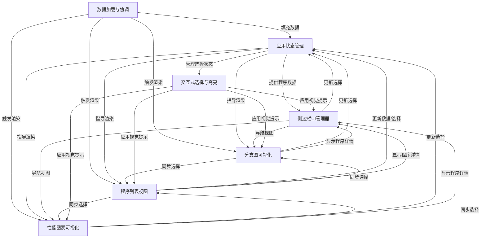
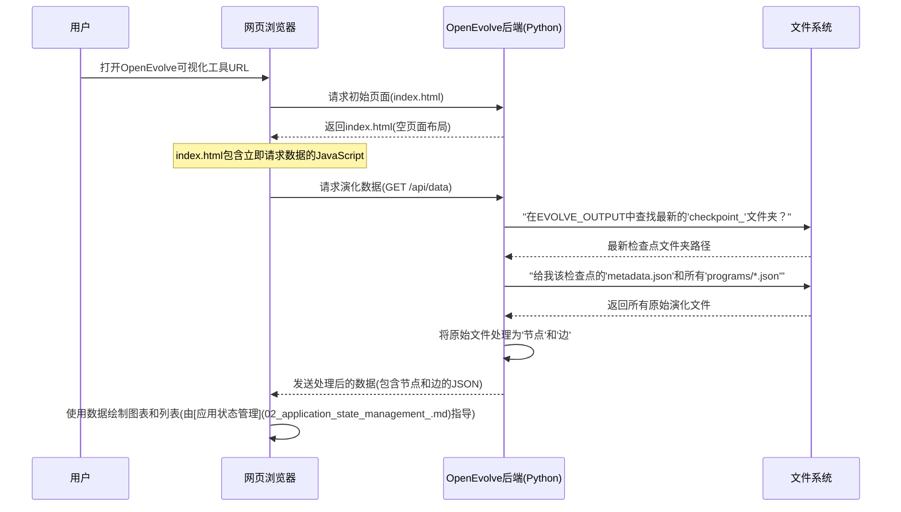

链接：[codelion/openevolve: Open-source implementation of AlphaEvolve](https://github.com/codelion/openevolve)


# docs：OpenEvolve

OpenEvolve演化可视化工具是一款专为探索和==理解程序演化历史设计的Web应用程序==。

提供**交互式界面**来可视化程序代码的创建与修改过程，支持用户通过分支图查看*程序间的关系*、追踪**随时间变化的性能指标**，并浏览可排序的程序列表。动态侧边栏还能展示*单个程序的详细信息*。

## 可视化概览



## 章节

1. [数据加载与协调](01_data_loading_and_orchestration_.md)
2. [应用状态管理](02_application_state_management_.md)
3. [分支图可视化](03_branching_graph_visualization_.md)
4. [性能图表可视化](04_performance_graph_visualization_.md)
5. [程序列表视图](05_program_list_view_.md)
6. [交互式选择与高亮](06_interactive_selection_and_highlighting_.md)
7. [侧边栏UI管理器](07_sidebar_ui_manager_.md)

------------


# 第1章：数据加载与协调

欢迎来到OpenEvolve

本章是我们理解可视化工具工作原理的第一步。我们将探索"数据加载与协调"系统，它就像是收集所有可视化所需信息的中央大脑。

### 演化乐团的指挥家

想象我们正在观看一场盛大的交响乐演出。我们看到不同的乐手（就像可视化工具中的图表和列表）在演奏各自的乐器。但谁在指挥他们何时演奏什么呢？这就是**指挥家**的工作。

在OpenEvolve中，"数据加载与协调"系统正是这样的指挥家。它的主要职责是：

1.  **获取数据**：找到演化实验保存结果的位置
2.  **理解数据**：读取这些结果并将其组织成可视化工具能理解的格式
3.  **指挥演出**：告诉可视化工具的其他部分（如"分支图可视化"或"程序列表视图"）用这些新信息更新自己

它确保我们在可视化工具中看到的所有内容都是最新、正确且完美同步的，展示演化实验的最新进展。

### 我们的用例：实时查看演化过程

假设我们正在运行一个OpenEvolve实验，它不断生成新程序并追踪它们的性能。我们希望打开可视化工具时，*总是*能看到实验的最新状态。

"数据加载与协调"系统通过自动查找最新结果并呈现它们来解决这个问题。

### OpenEvolve如何查找和准备数据

OpenEvolve将实验结果保存在称为**检查点**的特殊文件夹中。可以把检查点想象成实验在特定时刻的快照。每个检查点文件夹包含：

*   `metadata.json`：描述整个实验的文件，比如哪些程序属于"存档"（一个特殊的多样化程序集合）
*   `programs/`：包含多个`.json`文件的文件夹，每个文件代表一个演化出的程序，包含其详细信息、性能指标以及关于其"父"程序的信息（如果它从另一个程序演化而来）

我们的"指挥家"需要找到*最新*的检查点，读取所有这些文件，并将它们转换成可视化所需的两种主要数据结构：

1.  **节点**：代表单个程序。每个节点有ID、指标（分数、错误）、"代"（在演化中的年龄）以及所属的"岛"（如果是多群体实验）
2.  **边**：代表程序间的"父子"关系。一条边连接父程序（源）和子程序（目标），展示演化过程

这种结构化数据（节点和边）正是可视化组件绘制图表和列表所需的。

#### 第一步：定位最新的实验结果

当可视化工具启动时，它首先会查找实验的输出目录，找到最新的检查点文件夹。

以下是查找最新检查点的简化代码：

```python
import os
import glob

def find_latest_checkpoint(base_folder):
    # 查找所有名为"checkpoint_..."的文件夹
    checkpoint_folders = glob.glob(
        "**/checkpoint_*", root_dir=base_folder, recursive=True
    )
    if not checkpoint_folders:
        return None

    # 添加基础路径使其成为完整路径
    checkpoint_folders = [os.path.join(base_folder, folder) for folder in checkpoint_folders]

    # 按最后修改时间排序，最新的在前
    checkpoint_folders.sort(key=lambda x: os.path.getmtime(x), reverse=True)

    # 返回最新检查点的路径
    return checkpoint_folders[0]
```

这段Python代码使用`glob`模块在实验输出目录中查找所有以`checkpoint_`开头的文件夹，然后按创建或修改时间排序，选出最新的一个。

#### 第二步：读取和组织演化数据

找到最新检查点后，系统会读取该文件夹中的`metadata.json`和`programs/`子目录中的所有程序文件，将这些原始数据转换成可视化工具前端（我们在网页浏览器中看到的部分）可以轻松使用的"节点"和"边"格式。

```python
import os
import json

def load_evolution_data(checkpoint_folder):
    nodes = []
    edges = []
    id_to_program = {} # 通过ID快速查找程序的字典

    # 读取元数据文件
    meta_path = os.path.join(checkpoint_folder, "metadata.json")
    with open(meta_path) as f:
        meta = json.load(f)

    # 读取所有单独的程序文件
    programs_dir = os.path.join(checkpoint_folder, "programs")
    for prog_file in os.listdir(programs_dir):
        if prog_file.endswith(".json"):
            prog_path = os.path.join(programs_dir, prog_file)
            with open(prog_path) as pf:
                prog = json.load(pf)
                prog_id = prog_file.replace(".json", "") # 使用文件名作为ID
                prog["id"] = prog_id
                nodes.append(prog)
                id_to_program[prog_id] = prog # 存储以便后续查找父程序

    # 通过查看每个程序的parent_id创建边
    for prog in nodes:
        parent_id = prog.get("parent_id")
        if parent_id and parent_id in id_to_program:
            edges.append({"source": parent_id, "target": prog["id"]})

    return {"nodes": nodes, "edges": edges, "archive": meta.get("archive", [])}
```

这个`load_evolution_data`函数简化了核心逻辑。它首先读取`metadata.json`获取基本信息，然后处理`programs/`文件夹中的每个程序JSON文件，添加程序ID，并将其收集到`nodes`列表中。关键的是，它还识别每个程序的`parent_id`来创建展示演化谱系的`edges`。

#### 第三步：向Web可视化工具提供数据（API）

数据被处理成"节点"和"边"后，OpenEvolve可视化工具需要通过Web **API（应用程序编程接口）**端点将这些数据发送到浏览器。

当浏览器加载可视化页面时，它会自动向特定网址（如`/api/data`）发送请求以获取最新的演化数据。Python后端随后运行`find_latest_checkpoint`和`load_evolution_data`函数，将结果转换为JSON格式，并发送回浏览器。

```python
from flask import Flask, jsonify

app = Flask(__name__) # 我们的Web服务器应用

# 全局变量记住最后加载的检查点
checkpoint_dir = None

@app.route("/api/data")
def data_api_endpoint():
    global checkpoint_dir # 需要更新这个全局变量

    # 使用前面介绍的函数获取数据
    base_folder = os.environ.get("EVOLVE_OUTPUT", "examples/")
    checkpoint_dir = find_latest_checkpoint(base_folder) # 查找最新检查点

    if not checkpoint_dir:
        return jsonify({"archive": [], "nodes": [], "edges": [], "checkpoint_dir": ""})

    # 从检查点加载和处理数据
    evolution_data = load_evolution_data(checkpoint_dir)
    return jsonify(evolution_data) # 将处理后的数据作为JSON返回
```

这个`data_api_endpoint`函数是浏览器调用的接口。它充当Python数据处理和浏览器中运行的JavaScript代码之间的桥梁，获取最新数据，打包成JSON，并通过网络发送。

### 协调流程

让我们从打开浏览器到看到演化数据的整个"数据加载与协调"过程：



这个图表展示了组件间的交互。"数据加载与协调"系统（由"OpenEvolve后端(Python)"表示）负责与文件系统协调收集数据，然后将数据提供给"网页浏览器"，以便为可视化提供支持。

### `visualizer.py`中的底层实现

这个系统的核心位于`scripts/visualizer.py`文件中。该文件结合了我们讨论的所有部分：查找检查点、加载数据，以及使用Flask框架通过Web API提供服务。

以下是`scripts/visualizer.py`中实现这一协调的关键部分：

```python
# scripts/visualizer.py

# ... (导入和Flask应用设置) ...

# 查找最新实验快照的函数
def find_latest_checkpoint(base_folder):
    # 这个逻辑查找类似'checkpoint_001'、'checkpoint_002'等的文件夹
    # 确保我们总是获得最新的结果集
    # ... (前面展示的详细实现) ...
    pass # 为简洁起见使用占位符

# 读取所有文件并将其转换为结构化数据的函数
def load_evolution_data(checkpoint_folder):
    # 从'programs/'文件夹读取metadata.json和所有程序文件
    # 构建'节点'(单个程序)和'边'(父子链接)
    # ... (前面展示的详细实现) ...
    pass # 为简洁起见使用占位符

# 浏览器调用获取数据的Web地址
@app.route("/api/data")
def data():
    # 这个函数协调一切：
    # 1. 调用find_latest_checkpoint()获取正确的文件夹
    # 2. 调用load_evolution_data()处理文件
    # 3. 返回结构化数据作为JSON供浏览器使用
    global checkpoint_dir # 访问全局变量
    base_folder = os.environ.get("EVOLVE_OUTPUT", "examples/")
    checkpoint_dir = find_latest_checkpoint(base_folder)
    if not checkpoint_dir:
        return jsonify({"archive": [], "nodes": [], "edges": [], "checkpoint_dir": ""})

    data = load_evolution_data(checkpoint_dir)
    return jsonify(data)

# ... (其他Flask路由和主执行块) ...
```

如我们所见，`data()`函数充当加载和服务数据的中央协调器。它将`find_latest_checkpoint`和`load_evolution_data`函数结合在一起，为前端提供必要的信息。

### 总结

在本章中，我们了解到"数据加载与协调"系统是OpenEvolve可视化工具的支柱。它负责：

*   查找最新的实验结果（检查点）
*   读取原始实验文件（`metadata.json`、`program_id.json`）
*   将这些原始数据转换为适合可视化的组织格式（`节点`和`边`）
*   通过API端点使处理后的数据可供浏览器使用

这确保可视化的所有部分始终显示最新且结构正确的信息，让我们能够轻松追踪演化实验。

现在我们已经理解了数据是如何加载的，接下来让我们看看这些数据如何在浏览器中被管理和交互。

[下一章：应用状态管理](02_application_state_management_.md)

