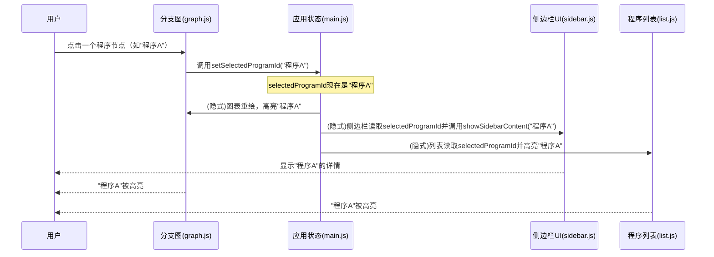

# 第2章：应用状态管理

在上一章[数据加载与协调](01_data_loading_and_orchestration_.md)中，我们学习了OpenEvolve后端如何==获取最新的实验数据并准备可视化==。

现在，这些处理过的数据已经存在于我们的网页浏览器中。但是可视化工具的不同部分——图表、列表、侧边栏——如何==共享这些数据、保持同步并响应我们的点击和选择==呢？

这就是"应用状态管理"发挥作用的地方。可以把它想象成可视化工具应用在浏览器中的中央大脑或"共享白板"。

## 共享白板：保持一切同步

想象一个大型会议室里，多个团队正在合作一个项目。每个团队不是各自记录笔记，而是共同查看和更新位于房间中央的一块大白板。当一个团队更新某个细节时，其他团队能立即看到并做出相应调整。

在OpenEvolve中，=="应用状态管理"系统就是这块`共享`白板==。它保存着可视化工具所有部分都需要的关键信息，例如：

*   所有演化程序的**完整数据集**（第1章讨论的`节点`和`边`）
*   **当前视图**：我们正在查看的窗口尺寸是多少？
*   **选择内容**：我们点击了哪个具体程序？
*   **性能洞察**：所有性能指标（如"分数"或"错误"）的最小值和最大值是多少？这样我们才能绘制有意义的进度条
*   **当前显示偏好**：我们当前按哪个指标排序或为图表着色？

这个系统确保当我们与可视化工具的某部分交互时（比如在图表中选择一个程序），所有其他相关部分（如程序列表或详情侧边栏）都能立即更新以反映我们的操作。

## 我们的用例：交互式点击

让我们用一个常见交互作为核心示例：**我们在主分支图中点击一个特定程序（节点）**。

当我们点击一个节点时，由于状态管理，可视化工具会发生以下变化：

1.  **图表**中被点击的节点应该突出显示（例如高亮或变色）
2.  右侧**侧边栏**应该打开（如果之前关闭）并显示该程序的详细信息（代码、指标、代数等）
3.  如果存在**程序列表视图**，列表中对应的条目也应该高亮显示

> 可视化工具如何知道点击了哪个程序？所有这些不同部分如何同时响应？通过读取和更新我们的共享白板

## 应用状态的关键概念

OpenEvolve可视化工具中的"共享白板"主要由一个名为`scripts/static/js/main.js`的JavaScript文件管理。它使用一些==全局变量和辅助函数来存储和更新应用最重要的信息==。

以下是它管理的核心信息（"状态"）：

*   **`allNodeData`**：所有程序及其演化链接的完整集合，直接从后端加载。这是我们的主要数据集。
*   **`selectedProgramId`**：这个变量存储用户最近点击或选择的程序ID。如果未选择任何内容，则为`null`
*   **`metricMinMax`**：一个对象，存储*所有*程序中*每个*性能指标的最低和最高值。这对正确缩放性能条和节点颜色至关重要
*   **`archiveProgramIds`**："存档"中程序的ID列表（例如来自MAP-elites实验）。这有助于突出显示特殊程序
*   **`width`和`height`**：当前浏览器窗口的可见尺寸，用于缩放可视化
*   **`lastDataStr`**：从后端接收的*最后*数据的字符串表示。这有助于检测是否有新数据需要重新加载

## OpenEvolve如何管理状态

让我们看看这些部分如何协同工作来处理我们的"交互式点击"用例并保持一切更新。

### 1. 初始数据加载和状态设置

当可视化工具首次加载时，需要将从后端加载的数据（如[第1章：数据加载与协调](01_data_loading_and_orchestration_.md)所述）放到我们的共享白板上。

`main.js`中的`loadAndRenderData`函数是实现这一点的关键入口：

```javascript
// scripts/static/js/main.js

import { renderGraph } from './graph.js';
import { renderNodeList } from './list.js';

export let allNodeData = []; // 这将保存所有程序数据
let archiveProgramIds = [];
let metricMinMax = {}; // 存储所有指标的最小/最大值

function computeMetricMinMax(nodes) {
    metricMinMax = {};
    if (!nodes) return;
    nodes.forEach(n => { /* ... 计算每个指标的最小/最大值 ... */ });
    // 简化：确保最小/最大值不相等以避免除以零
    for (const k in metricMinMax) {
        if (metricMinMax[k].min === metricMinMax[k].max) {
            metricMinMax[k].min = 0; metricMinMax[k].max = 1;
        }
    }
}

function loadAndRenderData(data) {
    archiveProgramIds = Array.isArray(data.archive) ? data.archive : [];
    lastDataStr = JSON.stringify(data); // 存储数据以便后续检测变化
    
    // 关键步骤：填充我们的共享状态
    allNodeData = data.nodes; // 存储所有程序节点
    computeMetricMinMax(allNodeData); // 计算指标的min/max

    renderGraph(data); // 告诉图表绘制自己
    renderNodeList(data.nodes); // 告诉列表绘制自己
    // ... (其他UI更新，如指标选择器) ...
}
```

**说明：**
`loadAndRenderData`函数在收到新的或更新的演化数据时被调用。它执行几个关键操作：
1.  更新`archiveProgramIds`和`lastDataStr`变量
2.  **最重要的是**，它获取`data.nodes`（所有程序的列表）并赋值给`allNodeData`。这将主数据集放到我们的共享白板上
3.  然后调用`computeMetricMinMax`遍历`allNodeData`，计算每个性能指标的最小和最大值。这些信息存储在`metricMinMax`中
4.  最后，它告诉不同的可视化组件（`renderGraph`、`renderNodeList`）使用这个新更新的`allNodeData`和`metricMinMax`绘制自己

### 2. 更新选中程序状态

当用户在图表中点击一个节点（或列表中的一个项目）时，可视化工具需要记录*哪个*程序现在被选中。这由一个简单的`setSelectedProgramId`函数处理：

```javascript
// scripts/static/js/main.js

export let selectedProgramId = null; // 我们用于选择的共享变量

export function setSelectedProgramId(id) {
    selectedProgramId = id; // 更新共享白板
    // console.log("选中程序ID:", selectedProgramId); // 用于调试
    // 这里不直接调用渲染，其他模块将*读取*这个变化
}
```

**说明：**
`setSelectedProgramId`函数非常简单：它只是更新共享白板上的`selectedProgramId`变量。它不*直接*触发任何视觉变化。相反，可视化工具的其他部分被设计为*读取*这个`selectedProgramId`变量并相应地更新自己的显示。这种关注点分离是状态管理的基础：一部分更新状态，其他部分对其做出反应。

### 3. 对状态变化的反应

现在，让我们看看可视化工具的不同部分如何*响应*`selectedProgramId`（或其他状态变量如`width`/`height`或选中的指标）的变化。

**A. 对窗口大小调整的反应（`state.js`）**

`scripts/static/js/state.js`文件处理最基本的全局状态：窗口尺寸。

```javascript
// scripts/static/js/state.js

export let width = window.innerWidth;
export let height = window.innerHeight;

export function updateDimensions() {
    width = window.innerWidth;
    const toolbar = document.getElementById('toolbar');
    const toolbarHeight = toolbar ? toolbar.offsetHeight : 0;
    height = window.innerHeight - toolbarHeight; // 考虑工具栏高度
}

// 事件监听器（通常在main.js或graph.js中）
// window.addEventListener('resize', updateDimensions);
// window.addEventListener('resize', () => renderGraph(latestData));
```

**说明：**
`width`和`height`变量存储当前尺寸。`updateDimensions`函数在浏览器窗口调整大小时更新这些值。其他模块，如[分支图可视化](03_branching_graph_visualization_.md)，将读取这些`width`和`height`值以正确重绘自己。

**B. 对指标/高亮变化的反应（`main.js`）**

用户可以选择不同的性能指标来为图表节点着色，或选择高亮过滤器（如"显示顶级程序"）。这些也会修改应用状态，导致视觉更新。

```javascript
// scripts/static/js/main.js

import { animateGraphNodeAttributes } from './graph.js';
import { renderNodeList } from './list.js';

// ... (其他函数) ...

// 这个函数从下拉菜单获取当前选中的指标
function getSelectedMetric() {
    const metricSelect = document.getElementById('metric-select');
    return metricSelect && metricSelect.value ? metricSelect.value : 'combined_score';
}

// 用户选择新指标时的事件监听器
const metricSelect = document.getElementById('metric-select');
metricSelect.addEventListener('change', function() {
    localStorage.setItem('selectedMetric', metricSelect.value); // 保存偏好
    animateGraphNodeAttributes(); // 更新图表节点颜色/大小
    renderNodeList(allNodeData); // 为新指标显示重新渲染列表
});

// 用户选择新高亮过滤器时的事件监听器
const highlightSelect = document.getElementById('highlight-select');
highlightSelect.addEventListener('change', function() {
    animateGraphNodeAttributes(); // 更新图表节点高亮
    // ... (更新列表视图高亮的逻辑) ...
});
```

**说明：**
当用户更改指标或高亮选择时，这些事件监听器会触发：
1.  它们记录新选择（例如将选中的指标存储在`localStorage`中）
2.  关键的是，它们调用其他模块的函数，如`animateGraphNodeAttributes`（来自[分支图可视化](03_branching_graph_visualization_.md)）和`renderNodeList`（来自[程序列表视图](05_program_list_view_.md)）。这些函数然后*读取*更新后的状态（如从`getSelectedMetric()`获取的新指标或`highlightSelect.value`），并仅重绘其视觉中必要的部分

## 交互式点击的协调过程

让我们把所有这些整合到我们的用例中：当我们在图表中点击一个程序时。



**说明：**
1.  **用户点击**：我们在[分支图可视化](03_branching_graph_visualization_.md)中点击一个程序
2.  **状态更新**：图表模块的事件处理程序调用`main.js`中的`setSelectedProgramId("程序A")`。这会更新共享白板上的`selectedProgramId`变量
3.  **视觉组件响应**：因为`selectedProgramId`已更改，其他视觉组件被设计为做出反应：
    *   [分支图可视化](03_branching_graph_visualization_.md)模块在知道选择已更改（或被通知重新评估）后，将查看`selectedProgramId`并重绘图，高亮"程序A"
    *   [侧边栏UI管理器](07_sidebar_ui_manager_.md)将检测`selectedProgramId`的变化，从`allNodeData`中检索"程序A"的完整程序数据，然后显示其详细信息
    *   [程序列表视图](05_program_list_view_.md)也会检查`selectedProgramId`并在列表中高亮对应的条目

整个过程确保应用的所有部分保持一致，并立即响应用户输入，提供无缝的交互体验。

## `scripts/static/js/main.js`的底层实现

`main.js`文件是前端应用状态管理魔法发生的主要地方。它将==数据加载、状态变量和各种视图的渲染触发器联系==在一起。

以下是`scripts/static/js/main.js`中与状态相关的关键方面：

*   **全局状态变量**：像`export let allNodeData = [];`和`let selectedProgramId = null;`这样的声明建立了共享白板
*   **状态操作函数**：
    *   `setAllNodeData(nodes)`：一个辅助函数（导出供其他模块使用）用于更新`allNodeData`并重新计算`metricMinMax`
    *   `setSelectedProgramId(id)`：如上所述，更新`selectedProgramId`
*   **状态派生信息**：
    *   `computeMetricMinMax(nodes)`：处理`allNodeData`以填充`metricMinMax`
    *   `getHighlightNodes(nodes, filter, metric)`：一个辅助函数，读取`allNodeData`、当前`highlightSelect.value`和`getSelectedMetric()`来确定哪些节点应该高亮
    *   `getSelectedMetric()`：从下拉菜单读取当前选中的指标
*   **事件监听器**：`main.js`注册了对窗口`resize`、`metric-select` `change`和`highlight-select` `change`等事件的监听器。这些监听器更新相关状态变量（如`width`/`height`，或`localStorage`中的偏好设置），然后触发图表或列表模块中依赖更新状态的特定渲染函数
*   **数据刷新逻辑**：`fetchAndRender`函数（用于实时更新）定期轮询后端，检查`lastDataStr`看数据是否已更改，如果是，则调用`loadAndRenderData`更新整个应用状态并重新渲染视图

这种集中式方法，即`main.js`充当应用数据和状态的指挥者，对于保持OpenEvolve的响应性和易于理解至关重要。

## 总结

在本章中，我们探索了"应用状态管理"，这是OpenEvolve可视化工具的中央神经系统。我们了解到它：

*   充当所有关键应用数据的"共享白板"
*   ==存储完整数据集（`allNodeData`）、选中程序（`selectedProgramId`）和计算的指标范围（`metricMinMax`）等信息==
*   确保可视化工具的所有部分（图表、列表、侧边栏）保持同步
*   通过更新中央状态并触发相关组件的重新渲染，实现对用户操作（如点击和选择）的交互式响应

理解这个概念至关重要，因为它支撑着OpenEvolve中每个交互元素和可视化如何协同工作。

[下一章：分支图可视化](03_branching_graph_visualization_.md)

