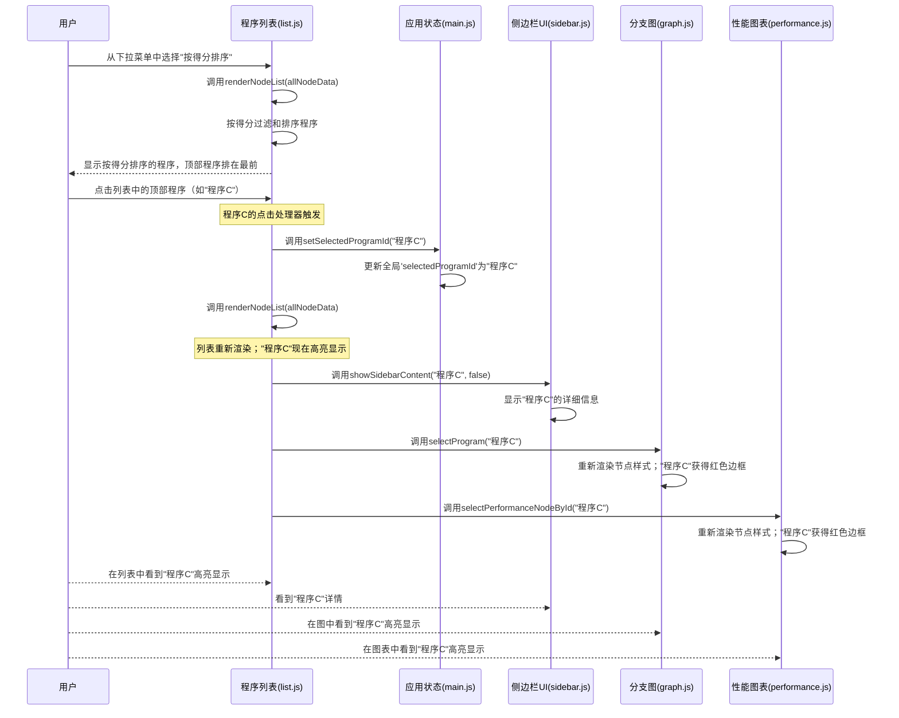

# 第5章：程序列表视图

在上一章[性能图表可视化](04_performance_graph_visualization_.md)中，我们学习了如何使用散点图追踪演化程序在多代中的进展

图表非常适合发现趋势和关系，但如果我们需要找到一个*特定*程序、==按最佳得分排序所有程序==，或者只是浏览代码的完整清单呢？

在拥有数千个节点的庞大分支图中寻找"Program_ID_742"就像大海捞针！而当程序只是图表上的点时，比较许多程序之间的精确指标值也很困难。

这就是**程序列表视图**的用武之地。它就像是一个精心组织、可搜索和可排序的目录，用于所有==演化程序==，与我们的可视化图表并列展示。

## 代码目录：触手可及的演化程序

想象我们正在管理一个巨大的图书馆。虽然图书馆的美丽地图（如我们的图表）帮助我们了解布局，但有时我们只需要一个传统的卡片目录或数字数据库来：

*   通过确切的书名或作者搜索书籍。
*   按出版日期或受欢迎程度对所有书籍排序。
*   快速查看每本书的关键细节摘要。

==OpenEvolve中的"程序列表视图"正是这种代码目录==。它的主要职责是：

1.  **提供结构化概览**：以清晰的表格格式显示所有演化程序。
2.  **实现高效搜索**：通过ID快速定位程序。
3.  **提供灵活排序**：根据代际、岛或性能得分等不同标准重新排序程序。
4.  **显示摘要统计**：提供实验性能和规模的高级概览。
5.  **便于详细检查**：允许点击任何程序立即查看其完整详情，并在所有视图中高亮显示。

## 我们的核心用例：==快速==找到最佳程序

假设我们运行了一个实验，希望找到表现最好的单个程序。我们想查看其确切得分，快速浏览其邻近程序，并轻松获取其完整详情。

程序列表视图使这一切变得简单：
1.  打开"列表"标签页。
2.  选择"按得分排序"，立即将表现最佳的程序排到顶部。
3.  点击顶部程序，在侧边栏查看其详情，并在图表中高亮显示。

## 程序列表视图的关键概念

列表视图将程序转化为易于理解的条目。以下是其核心功能：

### 1. 程序项（行）：每个程序的快照

*   **它们是什么**：列表中的每个条目代表一个演化程序。
*   **它们展示什么**：关键信息如程序ID、代际、岛及其性能指标（带有方便的进度条）。
*   **类比**：电子表格中的每一行或图书馆目录中的一张卡片。

### 2. 搜索框：即时程序查找器

*   **它是什么**：列表顶部的输入框。
*   **工作原理**：输入时，列表动态过滤，仅显示ID包含搜索文本的程序。
*   **目的**：快速缩小大型列表范围，找到特定程序。

### 3. 排序选项：组织清单

*   **它是什么**：提供不同组织列表方式的下拉菜单。
*   **选项**：可以按`ID`、`代际`、`岛`或`得分`（使用工具栏当前选定的指标）排序。
*   **目的**：帮助找到得分最高的程序、最新程序或来自特定群体的程序。

### 4. 摘要栏：实验概览

*   **它是什么**：列表顶部的一个小部分，位于程序项上方。
*   **它展示什么**：高级统计信息，如最高得分、平均得分、程序总数、代际数和实验中的岛数。
*   **目的**：立即了解实验的整体性能和规模。

### 5. 交互性：选择和详情

*   **它是什么**：点击程序项。
*   **工作原理**：选择一个项会在列表中高亮显示它，在侧边栏显示其完整详情，并在[分支图可视化](03_branching_graph_visualization_.md)和[性能图表可视化](04_performance_graph_visualization_.md)中高亮显示对应的节点。
*   **目的**：将表格视图与图形视图和详情面板连接起来，提供整体体验。

## OpenEvolve如何显示程序列表

程序列表视图使用标准HTML和JavaScript构建，主要在`scripts/static/js/list.js`文件中管理。`renderNodeList`函数是这里的核心，每当新数据到达、搜索查询更改或选择新的排序选项时，[应用状态管理](02_application_state_management_.md)系统就会调用它。

让我们逐步了解`renderNodeList`如何创建和更新此目录的简化流程。

### 步骤1：访问列表视图

首先，我们需要在"列表"标签页上。此标签页包含一个搜索框、一个排序下拉菜单和一个`div`元素（`node-list-container`），所有程序项将显示在其中。

```html
<!-- scripts/templates/index.html (简化) -->
    <div id="view-list" style="display:none;padding-top:3.5em;">
        <div style="display:flex;align-items:center;gap:1em;margin-bottom:1em;">
            <input id="list-search" type="text" placeholder="搜索程序ID..." >
            <select id="list-sort">
                <option value="id">按ID排序</option>
                <option value="generation" selected>按代际排序</option>
                <option value="island">按岛排序</option>
                <option value="score">按得分排序</option>
            </select>
        </div>
        <div id="node-list-container"></div>
    </div>
```

**说明**：这段来自`index.html`的HTML片段展示了列表视图的基本布局。它有一个用于搜索的输入框、一个用于排序的下拉菜单，以及一个容器，程序信息将通过JavaScript动态插入其中。

### 步骤2：过滤和排序数据

当调用`renderNodeList`时，它首先获取所有可用的程序数据（来自`main.js`的`allNodeData`）。然后，根据用户输入应用任何搜索过滤器和排序规则。

```javascript
// scripts/static/js/list.js (简化)
import { allNodeData, getSelectedMetric } from './main.js';

export function renderNodeList(nodes) {
    // 我们在main.js中更新allNodeData
    // setAllNodeData(nodes); // 在渲染列表之前在main.js中调用

    const container = document.getElementById('node-list-container');
    const search = document.getElementById('list-search').value.trim().toLowerCase();
    const sort = document.getElementById('list-sort').value;

    let filtered = nodes;
    if (search) {
        // 过滤ID包含搜索文本的程序
        filtered = nodes.filter(n => (n.id + '').toLowerCase().includes(search));
    }

    const metric = getSelectedMetric(); // 从工具栏获取当前指标
    if (sort === 'id') {
        filtered.sort((a, b) => (a.id + '').localeCompare(b.id + ''));
    } else if (sort === 'generation') {
        filtered.sort((a, b) => (a.generation || 0) - (b.generation || 0));
    } else if (sort === 'score') {
        // 按选定指标排序（降序）
        filtered.sort((a, b) => {
            const aScore = a.metrics && typeof a.metrics[metric] === 'number' ? a.metrics[metric] : -Infinity;
            const bScore = b.metrics && typeof b.metrics[metric] === 'number' ? b.metrics[metric] : -Infinity;
            return bScore - aScore;
        });
    }
    // ... (其他排序选项如'island') ...
    // ... renderNodeList的其余部分继续 ...
}
```

**说明**：这部分展示了`renderNodeList`函数如何首先获取用户的搜索查询和排序偏好。然后，它在`nodes`数组上使用简单的JavaScript `filter`和`sort`方法来准备要显示的数据。注意如何使用`getSelectedMetric()`（来自`main.js`）来确定按哪个得分排序。

### 步骤3：显示摘要统计

在显示单个程序之前，创建或更新摘要栏。

```javascript
// scripts/static/js/list.js (简化)
import { renderMetricBar } from './main.js';

export function renderNodeList(nodes) {
    // ... (完成过滤和排序) ...

    const metric = getSelectedMetric();
    // 计算摘要栏的最小、最大、平均得分
    const allScores = nodes.map(n => (n.metrics && typeof n.metrics[metric] === 'number') ? n.metrics[metric] : null).filter(x => x !== null && !isNaN(x));
    const minScore = allScores.length ? Math.min(...allScores) : 0;
    const maxScore = allScores.length ? Math.max(...allScores) : 1;
    const topScore = allScores.length ? Math.max(...allScores) : 0;
    const avgScore = allScores.length ? (allScores.reduce((a, b) => a + b, 0) / allScores.length) : 0;

    let summaryBar = document.getElementById('list-summary-bar');
    if (!summaryBar) { // 如果不存在摘要栏，创建它
        summaryBar = document.createElement('div');
        summaryBar.id = 'list-summary-bar';
        container.parentElement.insertBefore(summaryBar, container);
    }
    // 用计算的统计信息更新其内容
    summaryBar.innerHTML = `
      <div class="summary-block">🏆 最高得分: ${topScore.toFixed(4)} ${renderMetricBar(topScore, minScore, maxScore)}</div>
      <div class="summary-block">📊 平均: ${avgScore.toFixed(4)} ${renderMetricBar(avgScore, minScore, maxScore)}</div>
      <span class="summary-label">📦 总计: ${nodes.length} 程序, ${new Set(nodes.map(n => n.generation)).size} 代际</span>
    `;
    // ... renderNodeList的其余部分继续 ...
}
```

**说明**：此代码片段从所有程序（不仅仅是过滤后的程序）收集关键统计信息，以提供总体概览。然后，它动态创建或更新`list-summary-bar` HTML元素，并使用`renderMetricBar`（来自`main.js`）显示最高和平均得分的小进度条。

### 步骤4：渲染单个程序项

对于（现在已过滤和排序的）列表中的每个程序，`renderNodeList`创建一个专用的HTML `div`元素，并用程序的详细信息填充它。

```javascript
// scripts/static/js/list.js (简化)
import { selectedProgramId, setSelectedProgramId, getHighlightNodes, renderMetricBar, allNodeData } from './main.js';
import { showSidebarContent, setSidebarSticky, showSidebar } from './sidebar.js';
import { selectProgram, scrollAndSelectNodeById } from './graph.js';
import { selectPerformanceNodeById } from './performance.js';

export function renderNodeList(nodes) {
    // ... (之前的步骤) ...
    container.innerHTML = ''; // 清除现有列表项

    const highlightFilter = document.getElementById('highlight-select').value;
    const highlightNodes = getHighlightNodes(nodes, highlightFilter, metric);
    const highlightIds = new Set(highlightNodes.map(n => n.id));

    filtered.forEach((node, idx) => {
        const row = document.createElement('div');
        row.className = 'node-list-item' + (selectedProgramId === node.id ? ' selected' : '') + (highlightIds.has(node.id) ? ' highlighted' : '');
        row.setAttribute('data-node-id', node.id); // 存储ID以便轻松查找
        // 用节点详细信息填充行，如ID、代际、岛、父节点、指标
        row.innerHTML = `
            <div class="node-info-block">
                <div><b>ID:</b> ${node.id}</div>
                <div><b>代际:</b> ${node.generation ?? ''}</div>
                <div><b>岛:</b> ${node.island ?? ''}</div>
                <div><b>父节点:</b> <a href="#" class="parent-link" data-parent="${node.parent_id ?? ''}">${node.parent_id ?? '无'}</a></div>
            </div>
            <div class="metrics-block">
                <div class="metric-row"><b>${metric}:</b> ${node.metrics && node.metrics[metric] !== undefined ? node.metrics[metric].toFixed(4) : 'N/A'} ${renderMetricBar(node.metrics?.[metric], minScore, maxScore)}</div>
            </div>
            <a href="/program/${node.id}" target="_blank" class="open-in-new">[在新窗口中打开]</a>
        `;

        row.onclick = (e) => { // 为每行添加点击处理器
            if (e.target.tagName === 'A') return; // 不干扰链接
            setSelectedProgramId(node.id); // 更新全局选定的程序
            setSidebarSticky(true); // 保持侧边栏打开
            renderNodeList(allNodeData); // 重新渲染列表以显示新选择
            showSidebarContent(node, false); // 在侧边栏显示详情
            showSidebar(); // 确保侧边栏可见
            selectProgram(node.id); // 在分支图中高亮显示
            selectPerformanceNodeById(node.id); // 在性能图表中高亮显示
        };

        // 单独处理父节点链接点击
        const parentLink = row.querySelector('.parent-link');
        if (parentLink && parentLink.dataset.parent && parentLink.dataset.parent !== '无') {
            parentLink.onclick = (e) => {
                e.preventDefault();
                scrollAndSelectNodeById(parentLink.dataset.parent); // 在图中选择父节点
            };
        }
        container.appendChild(row);
    });
    // ... (滚动到选定项的逻辑) ...
}
```

**说明**：这是生成可视化列表的核心循环。对于每个程序，它创建一个`div`元素，添加程序的信息（ID、代际、指标等），并应用CSS类进行样式设置（如`selected`或`highlighted`）。

关键的是，它为每个`row`附加一个`onclick`事件监听器。当我们点击一行时，它会更新`selectedProgramId`（来自`main.js`），然后协调整个可视化工具的更新：列表本身重新渲染（以高亮显示新选择），[侧边栏UI管理器](07_sidebar_ui_manager_.md)显示程序的详情，[分支图可视化](03_branching_graph_visualization_.md)和[性能图表可视化](04_performance_graph_visualization_.md)都高亮显示对应的节点。

### 步骤5：搜索和排序的事件监听器

为了使搜索和排序功能动态化，事件监听器被附加到输入和选择元素上。

```javascript
// scripts/static/js/list.js (简化)
// ... (之前的代码) ...

// 列表搜索/排序事件
if (document.getElementById('list-search')) {
    document.getElementById('list-search').addEventListener('input', () => renderNodeList(allNodeData));
}
if (document.getElementById('list-sort')) {
    document.getElementById('list-sort').addEventListener('change', () => renderNodeList(allNodeData));
}
const highlightSelect = document.getElementById('highlight-select');
highlightSelect.addEventListener('change', function() {
    renderNodeList(allNodeData); // 高亮更改时重新渲染
});
```

**说明**：这些监听器检测用户在搜索框中输入（`input`事件）或更改排序选项（`change`事件）时的情况

在这两种情况下，它们只需再次调用`renderNodeList(allNodeData)`，重新过滤和排序`allNodeData`并相应地重绘列表。这提供了即时且响应迅速的体验。

## 列表交互的协调过程

让我们说明我们的用例：我们按得分排序列表，然后点击顶部程序。



**说明**：当我们排序列表时，调用`renderNodeList`，重新排序显示的项目。当我们点击一个项目时，它更新`main.js`中的中央`selectedProgramId`。这个中央更新然后触发一系列反应：列表本身刷新以显示点击的项目高亮，侧边栏打开程序详情，分支图和性能图表中的节点也被高亮显示，提供完全同步的视图。

## 总结

在本章中，我们探索了"程序列表视图"，这是OpenEvolve可视化工具中管理和检查演化程序的关键组件。我们了解到它：

*   提供所有程序的==结构化**表格显示**==。
*   支持通过程序ID==快速**搜索**==。
*   提供灵活的**排序**选项（ID、代际、岛、得分）。
*   显示有关实验的有用**摘要统计**。
*   具有高度**交互性**，点击更新[应用状态管理](02_application_state_management_.md)，并与[侧边栏UI管理器](07_sidebar_ui_manager_.md)和两个图表==可视化同步==。

此视图对于详细分析至关重要，使我们能够轻松精确定位特定程序，精确比较它们，并理解演化运行的定量方面。

现在我们已经了解了所有不同视图如何通过选择进行交互，让我们更深入地探讨实现这种交互式选择和突出显示的机制。

[下一章：交互式选择和突出显示](06_interactive_selection_and_highlighting_.md)

