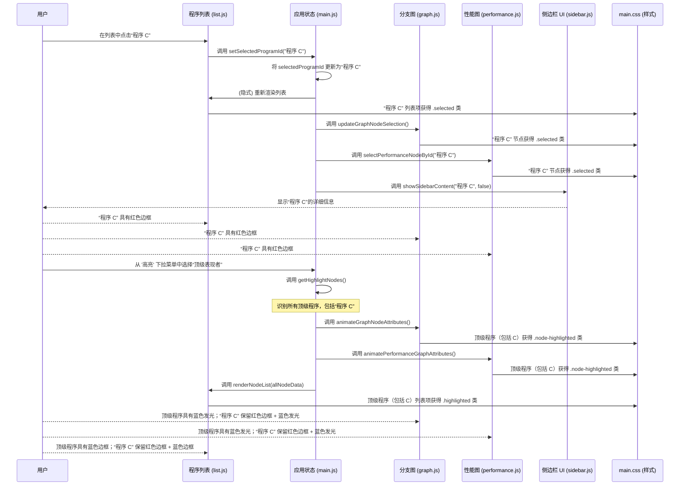

# 第6章：交互式选择与高亮

在之前的章节中，我们学习了 OpenEvolve 如何加载和管理数据（[数据加载与编排](01_data_loading_and_orchestration_.md)），如何通过 [应用状态管理](02_application_state_management_.md) 保持一切同步，以及如何通过 [分支图可视化](03_branching_graph_visualization_.md)、[性能图可视化](04_performance_graph_visualization_.md) 和 [程序列表视图](05_program_list_view_.md) 以不同方式显示程序。

但如果我们在图中看到一些有趣的内容并想了解更多呢？或者我们只想关注最佳程序，无论它们出现在哪里？如果没有一种方式来引导我们的注意力，那么==面对可能成千上万的程序，可视化工具就会变成一片信息的海洋==。

这就是“交互式选择与高亮”发挥作用的地方。

它就像一个动态聚光灯，我们可以将其投射到特定程序或一组程序上，使它们脱颖而出，并让我们的探索过程保持有条不紊和清晰

### 我们程序的动态聚光灯

想象一下，我们正在观看一场音乐会，舞台上挤满了音乐家

舞台灯光帮助我们看到所有人。但随后，一束特殊的 **聚光灯** 明亮地照在主唱身上，使我们很容易集中注意力

有时，另一种灯光可能会在所有弦乐器周围柔和地 **发光**，向我们展示管弦乐队的特定部分。

在 OpenEvolve 中，交互式选择与高亮的作用正是如此。它的主要任务是：

1.  **引导我们的注意力**：帮助我们轻松找到并检查一个我们感兴趣的特定程序。
2.  **揭示重要组别**：使特定类型的程序（如表现最佳者或来自“存档”的程序）突出显示。
3.  **确保一致性**：确保一旦我们选择或高亮一个程序，它在所有出现的地方——所有图表和列表中——都具有特殊外观。这样，我们永远不会失去对我们关注内容的追踪。

### 我们的核心用例：查找并定位一个冠军程序

让我们想象一下，我们的 OpenEvolve 实验成功产生了一些惊人的程序，我们想检查其中表现最好的一个。

我们的目标是：
1.  在 [程序列表视图](05_program_list_view_.md) 中 **识别** 一个特定的“冠军”程序。
2.  **选择** 它，使其立即获得清晰的视觉指示（例如，红色边框）。
3.  **看到** 同一个程序在 [分支图可视化](03_branching_graph_visualization_.md) 和 [性能图可视化](04_performance_graph_visualization_.md) 中立即被高亮显示。
4.  同时，应用一个“顶级表现者” **高亮**，以在所有视图中用蓝色发光看到其他高分程序，而不会丢失我们特定的选择。

本章将向我们展示 OpenEvolve 如何无缝地实现这一点。

### 关键概念：选择与高亮

虽然选择和高亮都使程序突出显示，但它们服务于略有不同的目的，并具有不同的视觉提示：

| 特性     | 目的                     | 视觉提示（示例） | 数量     | 交互方法                   |
| :------- | :----------------------- | :--------------- | :------- | :------------------------- |
| **选择** | 聚焦于 *一个特定* 程序。 | 粗红色边框       | 单个程序 | 用户点击                   |
| **高亮** | 根据标准强调 *组*。      | 蓝色发光/边框    | 多个程序 | 用户从下拉菜单中选择筛选器 |

重要的是，这些提示在所有视图中都保持 *一致* 应用：分支图、性能图和程序列表。

### OpenEvolve 如何使程序突出显示

“交互式选择与高亮”系统严重依赖 [应用状态管理](02_application_state_management_.md) 来跟踪 *哪个* 程序被选中以及 *哪些* 程序符合高亮标准。一旦此状态更新，所有可视化组件都会响应并更新其显示。

让我们通过我们的“冠军程序”用例来分解此过程：

#### 1. 选择程序（红色边框）

当我们点击一个程序（无论是在图中还是在程序列表中）时，会发生以下情况：

1.  **事件触发**：我们的点击在程序元素上注册（例如，图中的一个圆圈，或列表中的一行）。
2.  **状态更新**：点击处理程序调用类似 `setSelectedProgramId(programID)` 的函数（来自 `main.js`）。这会更新共享白板上的中央 `selectedProgramId` 变量。
3.  **视觉更新**：由于中央 `selectedProgramId` 已更改，各种可视化模块（图、列表）会重新评估其显示。它们检查其程序的 ID 是否与 `selectedProgramId` 匹配，如果是，则应用特定的 CSS 类（如 `node-selected`）或直接将元素的 `stroke` 属性更改为 `red`。

以下是更新分支图中所选程序外观的 JavaScript 的简化视图（类似的逻辑适用于性能图和列表视图）：

```javascript
// scripts/static/js/graph.js (simplified)

import { selectedProgramId } from './main.js'; // 导入中央选定的 ID

export function updateGraphNodeSelection() {
    if (!g) return; // 'g' 是包含所有图元素的 D3 组

    g.selectAll('circle') // 选择所有程序圆圈
        .attr('stroke', d => selectedProgramId === d.id ? 'red' : '#333') // 如果选中则为红色，否则为默认
        .attr('stroke-width', d => selectedProgramId === d.id ? 3 : 1.5) // 如果选中则边框更粗
        .classed('node-selected', d => selectedProgramId === d.id); // 添加/移除 'node-selected' 类

    // 这也会更新连接到所选节点的线（边）
    updateGraphEdgeSelection();
}
```
**解释**：每当 `selectedProgramId` 可能发生变化时，就会调用此 `updateGraphNodeSelection` 函数。它高效地更新图中的所有圆圈。如果圆圈的 `d.id`（程序的 ID）与 `selectedProgramId` 匹配，则它会获得 `red` 笔触、`3px` 宽度和 `node-selected` CSS 类。否则，它会恢复为默认外观。

`updateGraphEdgeSelection` 函数对连接程序的线执行类似操作：

```javascript
// scripts/static/js/graph.js (simplified)

import { selectedProgramId } from './main.js';

export function updateGraphEdgeSelection() {
    if (!g) return;

    g.selectAll('line') // 选择所有线（边）
        .attr('stroke', d => (selectedProgramId && (d.source.id === selectedProgramId || d.target.id === selectedProgramId)) ? 'red' : '#999')
        .attr('stroke-width', d => (selectedProgramId && (d.source.id === selectedProgramId || d.target.id === selectedProgramId)) ? 4 : 2)
        .attr('stroke-opacity', d => (selectedProgramId && (d.source.id === selectedProgramId || d.target.id === selectedProgramId)) ? 0.95 : 0.6);
}
```
**解释**：此代码检查边（线）的源或目标程序是否为 `selectedProgramId`。如果是，该线也会获得 `red` 笔触，表示它是所选程序直接谱系的一部分。

#### 2. 高亮程序（蓝色发光）

高亮涉及一种不同的机制，通常由工具栏中的下拉菜单触发（例如，“高亮：顶级表现者”）。

1.  **筛选器选择**：我们从工具栏中的“高亮”下拉菜单中选择一个筛选器选项（例如，“顶级表现者”）。
2.  **高亮计算**：`main.js` 模块（特别是 `getHighlightNodes` 函数）使用此筛选器，结合 `allNodeData` 和当前 `metric`，来确定哪些程序应被高亮。它返回这些程序 ID 的列表。
3.  **视觉更新**：下拉菜单的事件监听器然后触发可视化模块（图、列表）重新渲染或为其元素设置动画。它们检查其程序的 ID 是否在高亮程序列表中，如果是，则应用特定的 CSS 类（如 `node-highlighted`）或属性更改。

以下是简化的 `getHighlightNodes` 逻辑：

```javascript
// scripts/static/js/main.js (simplified)

export let allNodeData = []; // 所有加载的程序
let archiveProgramIds = []; // 存档中程序的 ID

export function getHighlightNodes(nodes, filter, metric) {
    if (!filter || filter === 'none') return []; // 未选择筛选器

    if (filter === 'top') {
        let bestScore = -Infinity;
        nodes.forEach(n => {
            if (n.metrics && typeof n.metrics[metric] === 'number') {
                if (n.metrics[metric] > bestScore) bestScore = n.metrics[metric];
            }
        });
        // 返回所有达到最高分的节点
        return nodes.filter(n => n.metrics && n.metrics[metric] === bestScore);
    } else if (filter === 'archive') {
        // 返回 ID 在存档列表中的节点
        return nodes.filter(n => archiveProgramIds.includes(n.id));
    }
    // ... (其他筛选器如 'first', 'failed', 'unset') ...
    return [];
}
```
**解释**：此函数接收所有程序、所选筛选器（例如，'top'）和活动指标。如果筛选器是 'top'，它会扫描所有程序以找到该指标的最高分，然后返回所有达到该最高分的程序。如果筛选器是 'archive'，它会返回其 ID 在 `archiveProgramIds` 列表中的程序。

以下是图中如何为视觉属性设置动画的示例：

```javascript
// scripts/static/js/graph.js (simplified)

import { getHighlightNodes, allNodeData, selectedProgramId, getSelectedMetric } from './main.js';

export function animateGraphNodeAttributes() {
    if (!g) return;

    const metric = getSelectedMetric();
    const highlightFilter = document.getElementById('highlight-select').value;
    const highlightNodes = getHighlightNodes(allNodeData, highlightFilter, metric);
    const highlightIds = new Set(highlightNodes.map(n => n.id)); // 用于快速查找

    g.selectAll('circle') // 选择所有圆圈
        .transition().duration(400) // 0.4 秒的平滑动画
        // 根据选择和高亮状态更新笔触/颜色
        .attr('stroke', d => {
            if (selectedProgramId === d.id) return 'red'; // 选择优先
            if (highlightIds.has(d.id)) return '#2196f3'; // 高亮为蓝色
            return '#333'; // 默认
        })
        .attr('stroke-width', d => {
            if (selectedProgramId === d.id) return 3;
            if (highlightIds.has(d.id)) return 4;
            return 1.5;
        })
        .selection() // 在转换后获取选择以进行类更改
        .each(function(d) {
            d3.select(this)
                .classed('node-highlighted', highlightIds.has(d.id))
                .classed('node-selected', selectedProgramId === d.id);
        });
}
```
**解释**：当高亮筛选器或指标更改时，会调用此 `animateGraphNodeAttributes` 函数。它高效地更新 *所有* 圆圈的视觉样式。它检查节点是否被选中（红色边框）或高亮（蓝色边框），并应用相应的视觉样式和 CSS 类。`transition().duration(400)` 使更改平滑出现，而不是突然出现。

[程序列表视图](05_program_list_view_.md) 也将这些类应用于其列表项：

```javascript
// scripts/static/js/list.js (simplified)

import { selectedProgramId, getHighlightNodes, getSelectedMetric } from './main.js';

export function renderNodeList(nodes) {
    // ... (过滤和排序逻辑) ...

    const highlightFilter = document.getElementById('highlight-select').value;
    const highlightNodes = getHighlightNodes(nodes, highlightFilter, getSelectedMetric());
    const highlightIds = new Set(highlightNodes.map(n => n.id));

    filtered.forEach((node, idx) => {
        const row = document.createElement('div');
        // 根据选择和高亮状态添加 CSS 类
        row.className = 'node-list-item' +
                        (selectedProgramId === node.id ? ' selected' : '') +
                        (highlightIds.has(node.id) ? ' highlighted' : '');
        // ... (填充行内容) ...
        container.appendChild(row);
    });
    // ... (滚动到所选项目逻辑) ...
}
```
**解释**：当 `renderNodeList` 函数运行时（例如，在搜索、排序或高亮更改后），它会根据当前状态动态地将 `selected` 或 `highlighted` CSS 类添加到每个程序的列表项中。

#### 3. 提示背后的 CSS

实际的视觉外观（红色边框、蓝色发光）在 `scripts/static/css/main.css` 文件中使用标准 CSS 规则定义。这些规则针对 `node-selected` 和 `node-highlighted` 类。

```css
/* scripts/static/css/main.css (simplified) */

/* 已选节点的样式（红色边框） */
.node-selected {
    stroke: red !important;
    stroke-width: 3px !important;
    transition: stroke 0.2s; /* 视觉反馈的平滑过渡 */
    z-index: 10; /* 确保其显示在顶部 */
}

/* 高亮节点的样式（蓝色发光） */
.node-highlighted {
    stroke: #2196f3; /* 蓝色边框 */
    stroke-width: 4px; /* 更粗的边框 */
    filter: drop-shadow(0 0 8px #2196f3) drop-shadow(0 0 16px #2196f3); /* 蓝色发光效果 */
    transition: filter 0.2s, stroke 0.2s;
}

/* 如果节点同时被选中和高亮会发生什么 */
.node-selected.node-highlighted {
    stroke: red !important; /* 选择优先于边框颜色 */
    stroke-width: 3px !important;
    box-shadow: 0 0 0 2px #2196f3, 0 0 0 3px red; /* 蓝色发光和红色轮廓 */
    /* 对于 D3 圆圈，filter 通常足以实现发光 */
    filter: drop-shadow(0 0 8px #2196f3) drop-shadow(0 0 16px #2196f3) drop-shadow(0 0 8px red);
}

/* 对于列表项，特别结合选择和高亮 */
.node-list-item.selected.highlighted, .node-list-item.highlighted.selected {
    border: 2.5px solid red !important;
    box-shadow: 0 0 0 2px #2196f3, 0 0 0 3px red;
    z-index: 4;
}
```
**解释**：这些 CSS 规则定义了具有 `node-selected` 或 `node-highlighted` 类的元素的外观。请注意，`.node-selected` 使用 `red` 笔触，而 `.node-highlighted` 使用 `blue` 笔触和 `drop-shadow` 实现发光效果。还有特定规则用于当元素同时具有 *两个* 类时，确保所选项目的红色边框始终清晰可见，同时仍显示高亮效果。

### 我们冠军程序用例的编排

让我们将所有内容整合起来。我们在列表视图中，按分数排序，然后点击一个顶级程序，再应用“顶级表现者”高亮。


**解释**：当我们点击“程序 C”时，中央 `selectedProgramId` 会被更新。这会立即触发可视化工具的其他部分（图、列表、侧边栏）更新其显示，导致“程序 C”以明显的红色边框出现。然后当我们应用“顶级表现者”筛选器时，`getHighlightNodes` 会识别所有顶级表现者程序。然后这会触发 *另一轮* 视觉更新。任何是顶级表现者的程序（包括“程序 C”，如果它是的话）都会收到蓝色发光/边框。由于“程序 C”同时被 *选中* 和 *高亮*，特定的 CSS 规则确保它同时显示两种视觉提示，确保我们仍能清楚地在高亮组内看到我们的活动选择。

### 总结

在本章中，我们探讨了“交互式选择与高亮”，这个系统为我们的 OpenEvolve 可视化带来了焦点和清晰度。我们了解到它：

*   使用 **动态聚光灯** 使单个程序或一组程序突出显示。
*   区分了 **选择**（一个用户选择的程序，通常带有红色边框）和 **高亮**（基于标准的多个程序，通常带有蓝色发光）。
*   依赖 **[应用状态管理](02_application_state_management_.md)** 来跟踪哪些程序被选中或高亮。
*   通过动态添加或删除 **CSS 类**（`.node-selected`、`.node-highlighted`）到 [分支图可视化](03_branching_graph_visualization_.md)、[性能图可视化](04_performance_graph_visualization_.md) 和 [程序列表视图](05_program_list_view_.md) 中的元素来实现其视觉提示。
*   在所有视图中提供 **一致的用户体验**，使我们能够轻松跟踪程序的状态并关注进化的相关部分。

这个强大的系统确保即使在复杂的进化景观中，我们也总能精确定位并分析对我们研究最重要的程序。

现在我们了解了程序是如何被选择和高亮的，让我们看看侧边栏如何显示当前所选程序的所有详细信息。

[下一章：侧边栏 UI 管理器](07_sidebar_ui_manager_.md)

