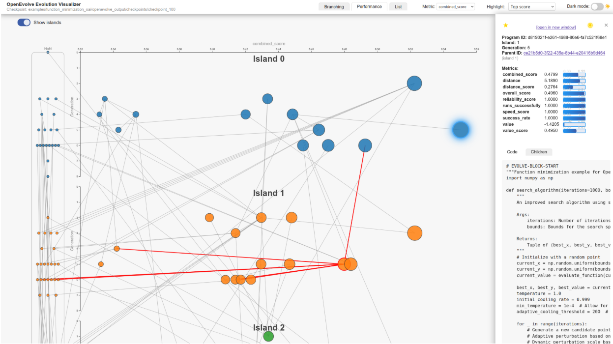

# 第7章：侧边栏UI管理器

在上一章[交互式选择和突出显示](06_interactive_selection_and_highlighting_.md)中，我们学习了如何使用红色边框和蓝色发光等==视觉提示在所有视图中轻松追踪单个程序或一组程序==。

这帮助我们聚焦于重要内容。

但当我们发现一个有趣的程序后，==如何获取==它的*所有*细节——完整代码、生成它的提示，或者它在演化树中的后代？

图表和列表提供了概览，但它们没有足够的空间展示所有内容。这就是**侧边栏UI管理器**的用武之地。它就像一个专用的"个人资料页面"，弹出或更新以展示我们选择的任何程序的深入信息，将所有详细内容组织得井井有条且触手可及。



## 程序的动态个人资料页

想象我们正在浏览社交媒体网站上的个人资料。我们看到一个人的个人资料摘要，但点击后，一个面板从侧面滑入，展示其完整传记、照片和联系信息。

OpenEvolve中的"侧边栏UI管理器"正是这样工作的。它的主要职责是：
1.  **显示详细信息**：提供一个专用空间，展示单个选定程序的*所有*可用数据（如ID、指标、代际、父节点、代码等）。
2.  **组织复杂数据**：将这些详细信息分解为易于导航的标签页（如"代码"、"提示"、"子代"、"差异"），以便快速找到所需内容。
3.  **交互性**：允许我们调整侧边栏大小，将其"固定"（永久打开）或在完成后关闭。还可以直接从内容跳转到相关程序（如父节点或子代）。
4.  **保持响应性**：确保在选择新程序或与可视化工具交互时，侧边栏动态调整其位置和内容。

## 我们的核心用例：调查一个有潜力的程序

假设我们在[性能图表可视化](04_performance_graph_visualization_.md)中找到了一个表现优异的程序。我们的目标是：
1.  **点击**该程序查看其完整详情。
2.  **检查**其生成的代码。
3.  **阅读**指导其创建的提示。
4.  **比较**其代码与其父程序的代码，了解发生了什么变化。
5.  **探索**其子代，看看其成功特征如何传递。
6.  **调整**侧边栏大小以查看更多代码（如果需要）。
7.  **固定**侧边栏打开，使其在鼠标移开时不会消失。

侧边栏UI管理器专门设计用于使这种详细调查变得流畅高效。

## 侧边栏UI管理器的关键概念

侧边栏是一个灵活的动态面板，具有几个重要功能：

### 1. 可伸缩面板：滑入和滑出

*   **它是什么**：从屏幕右侧出现的主面板。
*   **工作原理**：使用CSS `transform`属性滑入（显示）和滑出（隐藏），提供平滑的视觉效果。
*   **目的**：在不永久占用主可视化区域的情况下提供信息。

### 2. 程序详情：核心信息

*   **它是什么**：选定程序的基本数据，如ID、`代际`、`岛`、`父节点ID`和`指标`。
*   **目的**：在深入特定标签页之前提供快速概览。

### 3. 内容标签页：组织复杂数据

*   **它们是什么**：侧边栏内可点击的小部分（如"代码"、"提示"、"子代"、"差异"）。
*   **工作原理**：点击标签页会更改下方显示的内容，聚焦于程序的特定方面。
*   **目的**：通过分段不同类型的数据防止信息过载。

### 4. 可调整宽度：自定义视图

*   **它是什么**：侧边栏左侧边缘的一个可拖动的细手柄。
*   **工作原理**：可以向左或向右拖动此手柄以增加或减少侧边栏的宽度。偏好的宽度甚至会被记住以便下次使用！
*   **目的**：根据屏幕大小和内容需求调整显示（例如查看更多代码行）。

### 5. 固定与悬停行为：保持打开

*   **它是什么**：控制侧边栏是自动隐藏还是保持可见的设置。
*   **工作原理**：
    *   **悬停**：当鼠标悬停在图表中的节点上时，侧边栏可能会临时显示详情。鼠标移开时消失。
    *   **固定**：当*点击*程序时，侧边栏"固定"打开（由"图钉"图标表示）。它会保持打开，直到点击关闭按钮或选择另一个程序。
*   **目的**：允许快速浏览（悬停）和专注分析（固定）。

## OpenEvolve如何管理侧边栏UI

侧边栏的功能主要由`scripts/static/js/sidebar.js`文件处理，与`main.js`中的[应用状态管理](02_application_state_management_.md)系统紧密协作。

让我们按照调查一个有潜力程序的用例，看看侧边栏的简化工作流程。

### 步骤1：显示和隐藏侧边栏

侧边栏是`index.html`中的一个`div`元素，位于屏幕右侧。可以使用CSS `transform`属性移动它。

```javascript
// scripts/static/js/sidebar.js (简化)
const sidebar = document.getElementById('sidebar');

export function showSidebar() {
    // 将侧边栏滑入视图
    sidebar.style.transform = 'translateX(0)';
    // 同时启用其控件的交互性
    try { sidebar.style.pointerEvents = 'auto'; } catch (e) {}
}

export function hideSidebar() {
    // 将侧边栏滑出视图
    sidebar.style.transform = 'translateX(100%)';
    // 隐藏时禁用指针事件，以免干扰主内容
    try { sidebar.style.pointerEvents = 'none'; } catch (e) {}
    sidebarSticky = false; // 隐藏时始终取消固定
}
```

**说明**：`showSidebar()`通过重置`translateX`属性使侧边栏可见，将其从屏幕外位置（右侧100%）移回屏幕（0%）。`hideSidebar()`则相反，将其滑出。调整`pointerEvents`以确保侧边栏仅在可见时可交互。

### 步骤2：显示程序内容（`showSidebarContent`）

当我们点击一个程序时（如[交互式选择和突出显示](06_interactive_selection_and_highlighting_.md)所述），`main.js`模块调用`showSidebarContent`并传入选定程序的数据。

```javascript
// scripts/static/js/sidebar.js (简化)
import { allNodeData, formatMetrics, renderMetricBar } from './main.js';

export let sidebarSticky = false; // 跟踪侧边栏是否应保持打开

export function showSidebarContent(d, fromHover = false) {
    const sidebarContent = document.getElementById('sidebar-content');
    if (!sidebarContent || (fromHover && sidebarSticky)) return; // 如果已固定则不更新

    // 基本程序信息
    let contentHtml = `
        <button id="sidebar-close-btn">&times;</button>
        <div style="text-align:center;"><a href="/program/${d.id}" target="_blank">[在新窗口中打开]</a></div>
        <b>程序ID:</b> ${d.id}<br>
        <b>代际:</b> ${d.generation}<br>
        <b>指标:</b><br>${formatMetrics(d.metrics)}<br><br>
    `;

    // 确定显示哪些标签页（如代码、提示、子代、差异）
    let tabNames = [];
    if (d.code && d.code.trim() !== '') tabNames.push('代码');
    if (d.prompts && Object.keys(d.prompts).length > 0) tabNames.push('提示');
    const children = allNodeData.filter(n => n.parent_id === d.id);
    if (children.length > 0) tabNames.push('子代');
    // ... (克隆、差异标签页的逻辑) ...

    // 渲染标签页和内容
    let tabHtml = '';
    let tabContentHtml = '';
    if (tabNames.length > 0) {
        let activeTab = tabNames[0]; // 默认为第一个标签页
        tabHtml = `<div id="sidebar-tab-bar">${tabNames.map(name => `<span class="sidebar-tab">${name}</span>`).join('')}</div>`;
        tabContentHtml = `<div id="sidebar-tab-content">${renderSidebarTabContent(activeTab, d, children)}</div>`;
    }

    sidebarContent.innerHTML = contentHtml + tabHtml + tabContentHtml;
    // ... (附加关闭按钮、标签页、子代链接等的事件监听器) ...
}
```

**说明**：此函数接收选定程序的`d`（数据）对象。它构建侧边栏的基本HTML，包括程序的ID、代际和指标（由`main.js`中的`formatMetrics`格式化）。然后智能地确定哪些附加标签页（如"代码"、"提示"、"子代"）与此特定程序相关并渲染它们。`renderSidebarTabContent`（如下所示）处理每个标签页内的实际内容。

### 步骤3：切换内容标签页

`renderSidebarTabContent`辅助函数为活动标签页填充正确信息。

```javascript
// scripts/static/js/sidebar.js (简化，在showSidebarContent内或单独的辅助函数中)
import { escapeHtml } from './main.js'; // 安全显示的辅助函数

function renderSidebarTabContent(tabName, d, children) {
    if (tabName === '代码') {
        return `<pre class="sidebar-code-pre">${escapeHtml(d.code)}</pre>`;
    }
    if (tabName === '提示') {
        // 显示提示的复杂逻辑，可能带有下拉菜单
        // 为简化，直接显示所有提示
        let promptHtml = '';
        if (d.prompts) {
            promptHtml = JSON.stringify(d.prompts, null, 2); // 格式化的JSON
        }
        return `<h3>程序提示:</h3><pre class="sidebar-pre">${escapeHtml(promptHtml)}</pre>`;
    }
    if (tabName === '子代') {
        // 列出子代，带有选择它们的链接
        return `<h3>子代:</h3><ul>` +
            children.map(child => `<li style='margin-bottom:0.3em;'><a href="#" class="child-link" data-child="${child.id}">${child.id}</a></li>`).join('') +
            `</ul>`;
    }
    if (tabName === '差异') {
        // 渲染与父程序的代码差异（使用LCS算法）
        const parentNode = allNodeData.find(n => n.id === d.parent_id);
        if (parentNode && parentNode.code) {
             return renderCodeDiff(parentNode.code, d.code); // 差异的辅助函数
        }
        return '父程序代码不可用于差异比较。';
    }
    return '内容不可用。';
}

// renderCodeDiff的简化示例
function renderCodeDiff(aCode, bCode) {
    const aLines = (aCode || '').split('\n');
    const bLines = (bCode || '').split('\n');
    // 简化：仅突出显示不同的行
    let diffHtml = '';
    for (let i = 0; i < Math.max(aLines.length, bLines.length); i++) {
        if (aLines[i] !== bLines[i]) {
            if (aLines[i] !== undefined) diffHtml += `<div style="background:#fff0f0;">- ${escapeHtml(aLines[i])}</div>`;
            if (bLines[i] !== undefined) diffHtml += `<div style="background:#f2fff2;">+ ${escapeHtml(bLines[i])}</div>`;
        } else {
            diffHtml += `<div>  ${escapeHtml(aLines[i])}</div>`;
        }
    }
    return `<pre style="font-family:monospace;font-size:0.9em;">${diffHtml}</pre>`;
}
```

**说明**：此代码片段展示了不同类型的内容（代码、提示、子代、代码差异）如何生成。

对于"代码"，它简单地将程序的`code`放入`<pre>`标签中。

对于"提示"，它可能显示JSON结构。对于"子代"，它列出它们并带有可点击的链接，点击后将选择该子程序。

"差异"标签页使用简化的`renderCodeDiff`来突出显示当前程序代码与其父程序代码之间的变化。

### 步骤4：调整侧边栏大小

`enableSidebarResizer`函数是一个自执行的JavaScript模块，创建可拖动手柄并管理侧边栏的宽度。

```javascript
// scripts/static/js/sidebar.js (简化，enableSidebarResizer函数的一部分)
(function enableSidebarResizer() {
    const resizer = document.createElement('div');
    resizer.id = 'sidebar-resizer';
    document.body.appendChild(resizer); // 将调整器附加到body以定位

    let isResizing = false;
    let startX = 0;
    let startWidth = 0;

    resizer.addEventListener('pointerdown', (e) => {
        e.preventDefault();
        isResizing = true;
        startX = e.clientX;
        startWidth = parseInt(window.getComputedStyle(sidebar).width, 10) || 360;
        document.body.style.cursor = 'col-resize';
        document.addEventListener('pointermove', onPointerMove);
        document.addEventListener('pointerup', onPointerUp);
    });

    function onPointerMove(e) {
        if (!isResizing) return;
        const dx = e.clientX - startX;
        let newWidth = Math.round(startWidth - dx); // 向右移动缩小侧边栏
        sidebar.style.width = newWidth + 'px'; // 更新侧边栏宽度
    }

    function onPointerUp(e) {
        isResizing = false;
        document.body.style.cursor = '';
        document.removeEventListener('pointermove', onPointerMove);
        document.removeEventListener('pointerup', onPointerUp);
        // 保存新宽度以便下次使用
        try { localStorage.setItem('sidebarWidth', sidebar.style.width); } catch (err) { /* 忽略 */ }
    }
    // ... (调整器设置的其余部分，包括初始宽度、最小/最大值、键盘控制) ...
})();
```

**说明**：此代码创建一个小的`resizer`元素。

当我们点击并拖动它（`pointerdown`和`pointermove`事件）时，它会计算我们移动了多少并相应调整`sidebar.style.width`。当我们释放（`pointerup`）时，它将新宽度保存在浏览器的`localStorage`中，以便记住我们的偏好。

### 步骤5：管理固定行为

`sidebarSticky`变量控制侧边栏是保持打开还是鼠标移出时关闭。

```javascript
// scripts/static/js/sidebar.js (简化)
export let sidebarSticky = false; // 初始状态：不固定

export function setSidebarSticky(val) {
    sidebarSticky = val;
    // 固定时，确保启用指针事件以进行交互
    try {
        sidebar.style.pointerEvents = val ? 'auto' : 'none';
    } catch (e) {}
}

// 在graph.js文件中，例如在节点点击时：
// .on("click", function(event, d) {
//     setSelectedProgramId(d.id);
//     setSidebarSticky(true); // 点击时固定
//     showSidebarContent(d, false);
//     showSidebar();
//     // ...
// });

// 在图表背景的mouseout事件中：
// d3.select('#graph').on('mouseout', function(event) {
//     if (!sidebarSticky && !isResizing) { // 仅在不固定且未调整大小时隐藏
//         hideSidebar();
//     }
// });
```

**说明**：当明确点击程序时，调用`setSidebarSticky(true)`函数，更改`sidebarSticky`标志。

然后系统的其他部分（如图表背景的`mouseout`事件）检查此标志，以决定是`hideSidebar()`还是保持打开。

## 调查程序的协调过程

让我们追踪我们的用例：我们在性能图表中点击"程序A"，然后在侧边栏中探索其详情。


**说明**：当我们点击"程序A"时，`main.js`首先更新全局`selectedProgramId`，然后告诉`sidebar.js`"固定"并显示"程序A"的内容。侧边栏滑入视图，填充其基本信息，并将"代码"标签页设为活动状态。当我们点击其他标签页时，`sidebar.js`动态切换内容。如果我们调整大小，它会更新其宽度。最后，点击关闭按钮告诉`main.js`清除选择，`sidebar.js`隐藏自身并重置其固定状态。这种无缝交互提供了一种全面且用户友好的方式来详细检查演化程序。

## 总结

在本章中，我们探索了"侧边栏UI管理器"，这是项目中用于按需提供演化程序详细信息的解决方案。我们了解到它：

*   管理一个**可伸缩面板**，可以滑入和滑出视图。
*   作为选定程序的**"个人资料页"**，显示基本数据。
*   使用**内容标签页**（代码、提示、子代、差异、克隆）组织复杂信息。
*   允许用户**调整**其宽度，并选择**固定**（始终打开）或**悬停**（临时）行为。
*   与[应用状态管理](02_application_state_management_.md)紧密集成，以响应程序选择并提供丰富的交互体验。

侧边栏UI管理器对于深入分析至关重要，允许我们快速深入研究任何程序的细节，了解其代码、生成过程及其谱系，而无需离开可视化工具

END *★,°*:.☆(￣▽￣):*.°★* 。