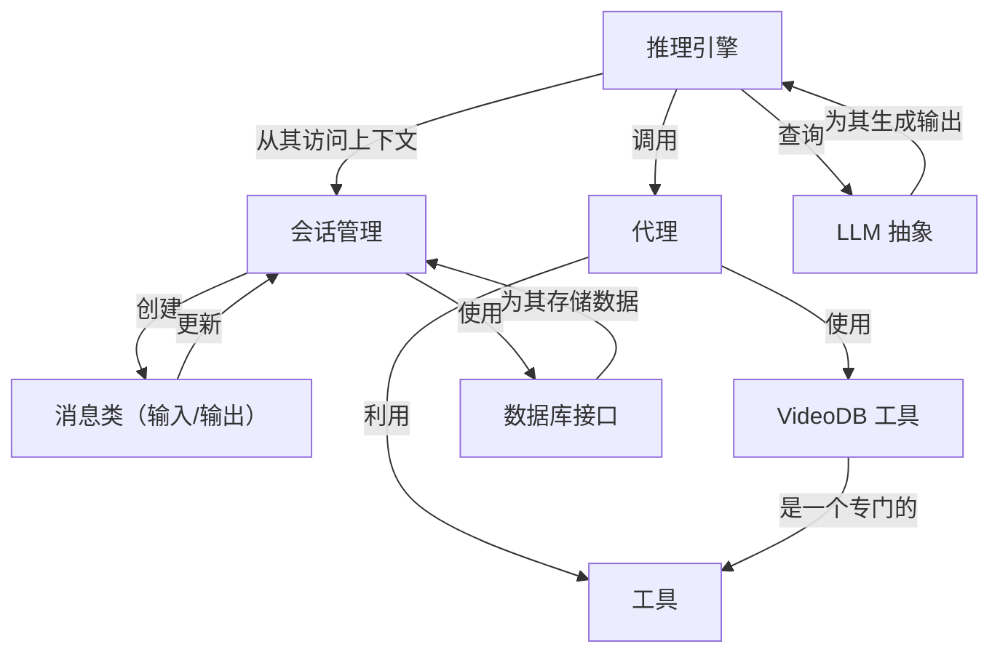

链接：[Director](https://chat.videodb.io/)

# docs：Director

Director 是一个 *AI 框架*，能够实现==与视频内容的自然语言交互，就像"视频版 ChatGPT"==

其核心是一个**推理引擎**，它理解用户请求并协调专门的**代理**来执行复杂的视频任务。

这些代理利用各种**工具**与外部服务交互，主要是 **VideoDB 工具**，而**会话管理**维护对话历史和上下文，所有这些都由灵活的**数据库接口**支持，并由 **LLM 抽象**提供 AI 能力。

## 可视化

## 章节

1. [会话管理
](01_session_management_.md)
2. [消息类（输入/输出）
](02_message_classes__input_output__.md)
3. [推理引擎
](03_reasoning_engine_.md)
4. [LLM 抽象
](04_llm_abstraction_.md)
5. [代理
](05_agents_.md)
6. [工具
](06_tools_.md)
7. [VideoDB 工具
](07_videodb_tool_.md)
8. [数据库接口
](08_database_interface_.md)

---

