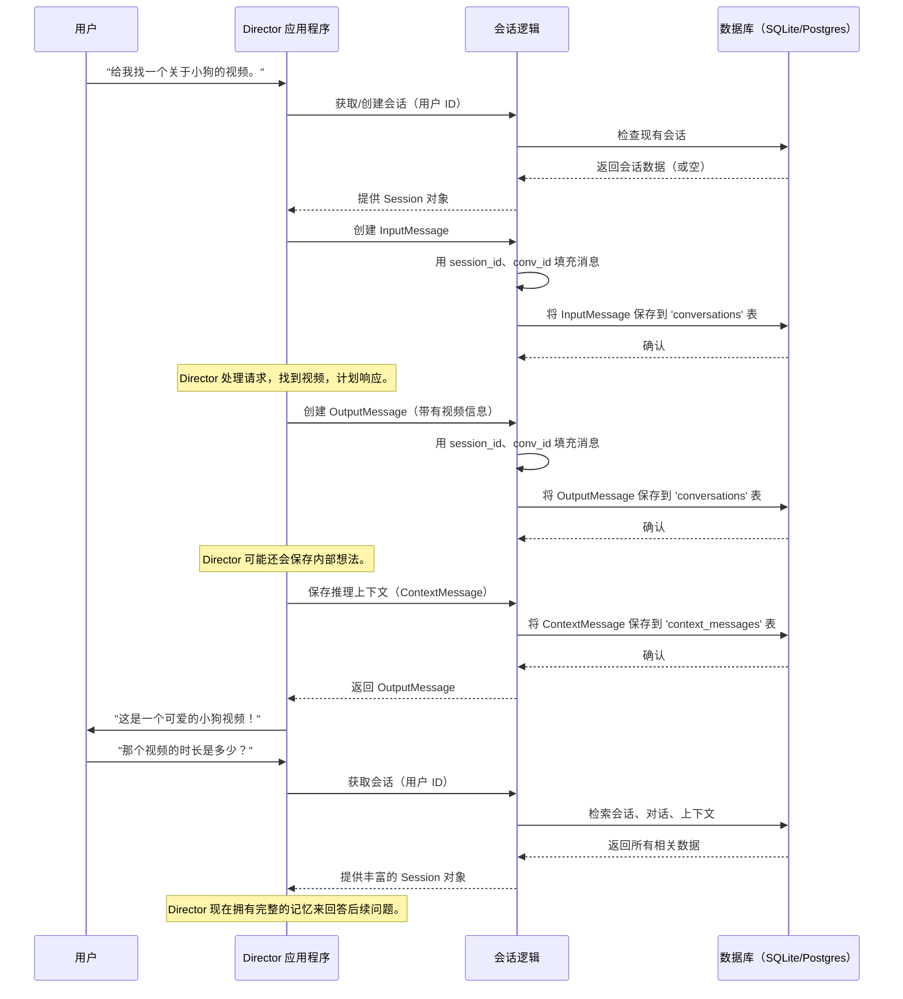

# 第 1 章：会话管理

欢迎来到 Director 

在第一章中，我们将探讨一个核心概念，它使我们的系统感觉智能且连续：**会话管理**。

想象一下我们正在与朋友聊天。我们不会每次说话时都重新介绍自己或谈话主题，对吧？我们都记得一分钟前甚至昨天谈论的内容。这种"记忆"使得流畅、自然的对话成为可能。

## 问题：遗忘过去

如果没有记忆，与系统的每次交互都会像与一个立即忘记我们刚说的一切的人交谈。如果我们问："给我看有趣的猫咪视频"，然后立即跟进问："*那个*视频的长度是多少？"，系统不会知道"那个"指的是什么。它会将我们的第二个请求视为一个全新的、孤立的问题。这会带来非常令人沮丧和低效的体验

## 解决方案：会话管理

这就是会话管理发挥作用的地方。可以将==**会话**视为 Director 为*每个单独用户*准备的"对话日志"==。每次用户与 Director 交互时，都会创建一个唯一的会话（或检索现有会话）。然后，此会话会保留发生的所有事情的完整记录：

*   **用户说了什么：** 我们的问题、命令和输入。
*   **Director 的响应：** 答案、信息和内容（如视频 ID）。
*   **内部采取的操作：** Director 的想法、计划和使用的工具。

这种"记忆"至关重要，它使 Director 能够：

*   **理解持续的上下文：** 知道"那个"指的是之前显示的猫咪视频。
*   **引用先前的输出：** 使用早期步骤中的视频 ID，而无需我们重复它。
*   **维持连续、连贯的对话：** 使交互感觉自然和智能。

## 我们的用例：连贯的视频搜索

让我们通过一个简单的用例来突出会话管理的强大功能：

1.  **用户询问：** "给我找一个关于小狗的视频。"
2.  **Director 响应：** "这是一个可爱的小狗视频！"（并在内部记录其唯一 ID，比如说 `puppy_video_123`）。
3.  **用户提出后续问题：** "*那个*视频的时长是多少？"

如果没有会话管理，Director 不会知道"那个视频"指的是哪个视频。==有了它，Director 回顾会话的记忆，看到刚才提到了 `puppy_video_123`，就可以正确回答==。

## `Session` 类：我们的对话中心

在 Director 项目中，`Session` 类是管理此对话日志的核心组件。它在 `backend/director/core/session.py` 中定义。

### 创建新会话

> 当用户第一次开始与 Director 交互时，需要创建一个新的 `Session`。这就像为新对话打开一本新的日志。

让我们看一个非常简化的示例：

```python
from director.core.session import Session
from director.db.sqlite.db import SQLiteDB # 为简单起见使用 SQLite

# 首先，我们需要一个数据库连接
# 在实际应用中，这将被正确初始化。
db_connection = SQLiteDB(db_path=":memory:") # 示例中使用内存数据库

# 假设用户刚开始聊天，我们生成一个唯一 ID
user_session_id = "user-123-abc"
user_conversation_id = "conv-456-def"

# 为此用户创建新会话
my_session = Session(
    db=db_connection,
    session_id=user_session_id,
    conv_id=user_conversation_id,
    video_id=None, # 还没有特定视频
    collection_id=None, # 还没有特定集合
)
my_session.create() # 将此新会话保存在数据库中

print(f"New session created with ID: {my_session.session_id}")
# 输出：New session created with ID: user-123-abc
```

**解释：**
在这里，我们创建了 `Session` 类的一个实例。

- 我们为它提供数据库连接（`db`）、唯一的 `session_id`（用于识别*此特定用户的整个交互历史*）和 `conv_id`（用于*此特定轮对话*）。

- 然后，`create()` 方法将此新会话记录保存到我们的数据库中。

### 向会话添加消息

现在，让我们继续我们的用例。

用户问："给我找一个关于小狗的视频。"这是一个**输入消息**。Director 找到一个视频并响应："这是一个可爱的小狗视频！"这是一个**输出消息**。这==两者都需要存储在会话的日志中==。

`Session` 类有一个方便的方法 `new_message` 来帮助创建这些：

```python
from director.core.session import MsgType, TextContent

# ...（上面的 my_session 设置）...

# 1. 用户询问："给我找一个关于小狗的视频。"
user_input_msg = my_session.new_message(
    msg_type=MsgType.input,
    content=[TextContent(text="Find me a video about puppies.").model_dump()]
)
user_input_msg.publish() # 保存用户的消息

print(f"User input saved: '{user_input_msg.content[0]['text']}'")
# 输出：User input saved: 'Find me a video about puppies.'

# 2. Director 响应（假设它找到了 'puppy_video_123'）
director_output_msg = my_session.new_message(
    msg_type=MsgType.output,
    content=[TextContent(text="Here's a cute puppy video!").model_dump()]
)
director_output_msg.publish() # 保存 Director 的响应

print(f"Director output saved: '{director_output_msg.content[0]['text']}'")
# 输出：Director output saved: 'Here's a cute puppy video!'

# 重要的是，Director 系统还会存储 video_id
# 以便稍后可以引用它。当我们讨论
# [推理引擎](03_reasoning_engine_.md)时，我们将更详细地介绍这一点。
```

**解释：**
我们使用 `my_session.new_message()` 创建 `InputMessage` 和 `OutputMessage` 对象

> ==这些对象会自动链接到我们的 `session_id` 和 `conv_id`==。然后，`.publish()` 方法将这些消息保存到数据库中的对话历史中。我们将在下一章[消息类（输入/输出）](02_message_classes__input_output__.md)中详细了解 `InputMessage` 和 `OutputMessage` 及其 `TextContent`。

### 检索会话历史

现在是魔法时刻

当用户问"*那个*视频的时长是多少？"时，==Director 需要回忆之前的交互。`Session` 类允许我们获取整个对话历史==。

```python
# ...（上面的 my_session 和消息设置）...

# 获取与此会话关联的所有对话
conversation_history = my_session.db.get_conversations(my_session.session_id)

print("\n--- Full Conversation History ---")
for msg in conversation_history:
    sender = "User" if msg['msg_type'] == 'input' else "Director"
    print(f"{sender}: {msg['content'][0]['text']}")

# 输出：
# --- Full Conversation History ---
# User: Find me a video about puppies.
# Director: Here's a cute puppy video!
```

**解释：**
通过调用 `my_session.db.get_conversations(my_session.session_id)`，Director 可以检索与当前会话关联的所有消息。这使它能够"记住"上下文，如之前提到的小狗视频，并连贯地回答后续问题。

除了对话之外，会话还存储 `reasoning_context`，这是 Director 采取的内部想法和步骤。

这就像 Director 的草稿本，帮助它回忆*为什么*做某事，而不仅仅是*说了什么*。==`Session` 类也处理保存和检索这些 `ContextMessage` 对象==。

## 🎢底层原理：Director 如何记忆

让我们看看 Director 管理会话时幕后发生了什么。

### 带有会话管理的对话流程

当我们与 Director 交互时，以下是简化的事件序列：



### 数据库交互：记忆库

`Session` 类严重依赖数据库来存储所有这些信息。Director 设计灵活，支持不同的数据库，如 SQLite 或 PostgreSQL。这通过一个名为 `BaseDB` 的接口进行管理，它充当任何数据库应如何存储和检索会话数据的蓝图。

让我们看看数据库实现（`backend/director/db/sqlite/db.py` 或 `backend/director/db/postgres/db.py`）中的一些简化代码片段，了解会话和消息是如何存储的。

#### 1. 创建会话（`create_session`）

当调用 `my_session.create()` 时，它会触发底层数据库中的 `create_session` 方法：

```python
# 来自 backend/director/db/sqlite/db.py（简化）
class SQLiteDB(BaseDB):
    def create_session(
        self,
        session_id: str,
        video_id: str, # 最初可能是 None
        collection_id: str, # 最初可能是 None
        created_at: int = None,
        updated_at: int = None,
        metadata: dict = {},
        **kwargs,
    ) -> None:
        self.cursor.execute(
            """
        INSERT OR IGNORE INTO sessions (session_id, video_id, collection_id, created_at, updated_at, metadata)
        VALUES (?, ?, ?, ?, ?, ?)
        """,
            (session_id, video_id, collection_id, created_at, updated_at, json.dumps(metadata)),
        )
        self.conn.commit()
```

**解释：**
此代码在 `sessions` 表中插入一行新记录。它确保每个 `session_id` 是唯一的（`INSERT OR IGNORE`）。此记录是我们对话日志的基础。

#### 2. 存储对话消息（`add_or_update_msg_to_conv`）

当调用 `user_input_msg.publish()` 或 `director_output_msg.publish()` 时，它使用 `add_or_update_msg_to_conv` 方法：

```python
# 来自 backend/director/db/sqlite/db.py（简化）
class SQLiteDB(BaseDB):
    def add_or_update_msg_to_conv(
        self,
        session_id: str,
        conv_id: str,
        msg_id: str,
        msg_type: str,
        agents: List[str],
        actions: List[str],
        content: List[dict],
        status: str = None,
        created_at: int = None,
        updated_at: int = None,
        metadata: dict = {},
        **kwargs,
    ) -> None:
        self.cursor.execute(
            """
        INSERT OR REPLACE INTO conversations (session_id, conv_id, msg_id, msg_type, agents, actions, content, status, created_at, updated_at, metadata)
        VALUES (?, ?, ?, ?, ?, ?, ?, ?, ?, ?, ?)
        """,
            (
                session_id, conv_id, msg_id, msg_type,
                json.dumps(agents), json.dumps(actions), json.dumps(content),
                status, created_at, updated_at, json.dumps(metadata),
            ),
        )
        self.conn.commit()
```

**解释：**
此方法将每条单独的消息（用户输入和 Director 输出）存储到 `conversations` 表中。

每条消息都链接到其 `session_id` 和 `conv_id`。`INSERT OR REPLACE` 确保如果具有相同 `msg_id` 的消息已经存在（例如，如果 Director 更新正在进行的消息的状态），它会被更新而不是创建重复项。

#### 3. 存储推理上下文（`add_or_update_context_msg`）

Director 还保存其内部"想法"或"推理上下文"，这有助于大型语言模型（LLM）理解正在进行的交互。

```python
# 来自 backend/director/db/sqlite/db.py（简化）
class SQLiteDB(BaseDB):
    def add_or_update_context_msg(
        self,
        session_id: str,
        context_messages: list, # 此列表包含 ContextMessage 对象
        created_at: int = None,
        updated_at: int = None,
        metadata: dict = {},
        **kwargs,
    ) -> None:
        self.cursor.execute(
            """
        INSERT OR REPLACE INTO context_messages (context_data, session_id, created_at, updated_at, metadata)
        VALUES (?, ?, ?, ?, ?)
        """,
            (
                json.dumps(context_messages), # 上下文消息存储为 JSON
                session_id,
                created_at,
                updated_at,
                json.dumps(metadata),
            ),
        )
        self.conn.commit()
```

**解释：**
这将 `ContextMessage` 对象列表（即 Director 的内部推理步骤）存储在 `context_messages` 表中，也链接到 `session_id`。

这使 Director 的推理引擎能够准确地从上次停止的地方继续，即使跨多个请求也是如此。

## 结论

会话管理是构建像 Director 这样的智能对话式 AI 系统的基石。通过将每次用户交互视为正在进行的 `Session` 的一部分，Director 获得了强大的记忆力，使其能够理解上下文、回忆过去的信息并维持真正连贯的对话。

这个"对话日志"对于使交互感觉自然和高效至关重要。

在下一章中，我们将仔细研究存储在这些会话中的实际数据：`InputMessage` 和 `OutputMessage` 类，以及它们如何表示用户所说的内容和 Director 的响应。

[下一章：消息类（输入/输出）](02_message_classes__input_output__.md)

