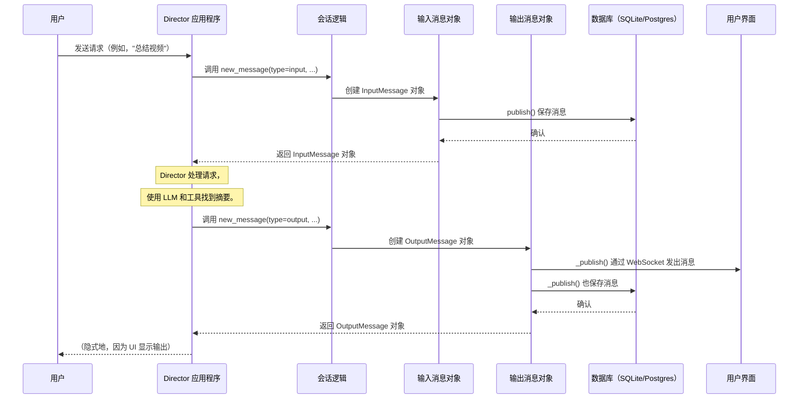

# 第 2 章：消息类（输入/输出）

欢迎回来

在[第 1 章：会话管理](01_session_management_.md)中，我们学习了 Director 如何记住我们的对话，使交互感觉连续和智能。我们看到 ==`Session` 如何像日志一样，存储发生的所有事情==。但日志中到底*记录*了什么？

这就是**消息类（输入/输出）**发挥作用的地方

这些是精心结构化的"信封"，包含我们与 Director 之间交换的所有信息。它们确保 Director 理解我们的请求，并且其响应始终清晰、一致且准备好显示。

## 问题：非结构化通信

想象一下试图与某人交谈，但每次我们说话时，都使用完全不同的格式。有时我们只是说单词，有时包括图片，然后我们可能开始给出复杂的指令而没有任何清晰的结构。这将是一片混乱！

同样，Director 需要一种清晰、可预测的方式来接收我们的请求并发送回答案。如果我们对视频摘要的请求一次以纯文本形式出现，然后下次以复杂的数据结构形式出现，Director 将难以理解。如果 Director 只是发送回原始数据而不告诉用户它是文本、图像还是视频，用户界面将不知道如何显示它。

## 解决方案：消息类

这就是 `InputMessage` 和 `OutputMessage` 拯救局面的地方。它们是==通信的标准化"信封"==

*   **`InputMessage`**：这是我们的请求（如"总结这个视频"或"找有趣的猫咪视频"）被打包并进入 Director 的方式。这是*我们告诉 Director 什么*的标准格式。
*   **`OutputMessage`**：这是 Director 发送回其响应的方式。它可以包含文本、图像、视频、搜索结果，甚至进度更新。这是 *Director 告诉我们什么*的标准格式。

这些类确保所有信息格式一致，易于系统的不同部分理解，并且易于在用户界面中显示。

## 我们的用例：结构化视频摘要

让我们继续我们要求 Director 总结视频的示例。这次，我们将看到请求和响应如何包装在 `InputMessage` 和 `OutputMessage` 对象中。

1.  **我们询问：** "总结最后一个视频。"（这成为一个 `InputMessage`。）
2.  **Director 响应：** "视频显示一只金毛猎犬在公园里玩耍，捡球，并在池塘里游泳。"（这成为一个 `OutputMessage`。）

## 关键概念：消息的构建块

消息不仅仅是纯文本。它们可以包含不同*类型*的内容。可以把它想象成一封信（消息），里面可以有各种附件（内容）。

在 Director 中，主要的消息类（`InputMessage` 和 `OutputMessage`）包含一个 `content` 对象列表。每个 `content` 对象描述一条特定的信息。

### 1. `BaseMessage`：基础

Director 中的所有消息都从 `BaseMessage` 开始。这就像所有信封使用的标准纸张和格式。它包含常见的详细信息，如：

*   `session_id`：此消息属于哪个对话。
*   `conv_id`：此消息属于对话的哪一轮。
*   `msg_type`：它是 `input` 还是 `output` 消息。
*   `content`：消息*内部*实际包含的内容列表。
*   `status`：消息的当前状态（例如，`progress`、`success`）。

### 2. `InputMessage`：我们对 Director 的请求

当我们输入命令或上传文件时，Director 将其打包到 `InputMessage` 中。

### 3. `OutputMessage`：Director 对我们的响应

当 Director 有答案、视频或图像要显示时，它将其放入 `OutputMessage` 中。然后将此消息保存到会话中，并发送到我们的用户界面以显示。

### 4. `Content` 类型：消息内部的内容

`InputMessage` 和 `OutputMessage` 中的 `content` 字段是一个*列表*，因为单个消息可以有多个部分。例如，Director 可能在同一响应中发送回文本*和*视频！

以下是一些常见的 `Content` 类型：

*   **`TextContent`**：用于纯文本，如摘要或问候语。
    
    ```python
    from director.core.session import TextContent
    text_part = TextContent(text="Hello! How can I help you today?").model_dump()
    # 输出：{'type': 'text', 'status': 'progress', 'status_message': None, 'agent_name': None, 'text': 'Hello! How can I help you today?'}
    ```
*   **`VideoContent`**：用于发送单个视频。它包含一个 `VideoData` 对象，其中包含 URL、ID、名称等详细信息。
    
    ```python
    from director.core.session import VideoContent, VideoData
    video_data = VideoData(
        id="puppy_video_123",
        name="Cute Puppy Playtime",
        stream_url="http://example.com/stream/puppy.mp4"
    ).model_dump()
    video_part = VideoContent(video=video_data).model_dump()
    # 输出：{'type': 'video', 'status': 'progress', ..., 'video': {'stream_url': 'http://example.com/stream/puppy.mp4', ...}}
    ```
*   **`VideosContent`**：用于发送多个视频的列表（例如，搜索结果）。
*   **`ImageContent`**：用于发送图像，包含 URL、名称等详细信息。
*   **`SearchResultsContent`**：用于发送特定的搜索结果，通常包括视频片段（`ShotData`）。

## 使用消息类：我们的视频摘要示例

让我们看看如何在实践中使用这些消息类，基于[第 1 章：会话管理](01_session_management_.md)中的 `Session`。

首先，让我们设置一个模拟会话（就像第 1 章中一样）：

```python
from director.core.session import Session, MsgType, TextContent, VideoContent, VideoData
from director.db.sqlite.db import SQLiteDB

# 为此示例初始化内存数据库
db_connection = SQLiteDB(db_path=":memory:")

# 为用户创建新会话
user_session_id = "user-abc-123"
user_conversation_id = "conv-xyz-456"

my_session = Session(
    db=db_connection,
    session_id=user_session_id,
    conv_id=user_conversation_id,
)
my_session.create()
print(f"Session created: {my_session.session_id}")
```
**解释：**
我们首先创建一个 `Session` 对象。这个 `my_session` 对象将是我们在此特定对话中创建和管理消息的接口。

### 步骤 1：用户发送 `InputMessage`

我们输入："总结最后一个视频。"这成为一个 `InputMessage`。

```python
# 为用户的消息创建内容
user_request_content = TextContent(text="Summarize the last video.").model_dump()

# 使用会话的辅助方法创建 InputMessage
input_msg = my_session.new_message(
    msg_type=MsgType.input,
    content=[user_request_content] # 内容始终是一个列表，即使只有一项
)

# "发布"消息以将其保存在对话历史中
input_msg.publish()
print(f"User input message published. Content: '{input_msg.content[0]['text']}'")
# 输出：User input message published. Content: 'Summarize the last video.'
```
**解释：**
我们使用 `my_session.new_message()` 和 `MsgType.input` 创建 `InputMessage`。实际文本"Summarize the last video."被包装在 `TextContent` 对象中，然后放入消息的 `content` 列表中。最后，`.publish()` 将此消息保存到我们的数据库。

### 步骤 2：Director 发送 `OutputMessage`（文本）

Director 处理我们的请求，找到摘要，并用文本响应。

```python
# 为 Director 的文本响应创建内容
director_summary_content = TextContent(
    text="The video shows a golden retriever playing in a park, fetching a ball, and swimming in a pond."
).model_dump()

# 创建 OutputMessage
output_msg_text = my_session.new_message(
    msg_type=MsgType.output,
    content=[director_summary_content]
)

# 发布消息（这也会将其发送到用户界面！）
output_msg_text.publish()
print(f"Director output (text) published. Content: '{output_msg_text.content[0]['text']}'")
# 输出：Director output (text) published. Content: 'The video shows a golden retriever playing in a park, fetching a ball, and swimming in a pond.'
```
**解释：**
与输入类似，我们使用 `MsgType.output` 创建 `OutputMessage`。摘要文本被打包为 `TextContent`。当在 `OutputMessage` 上调用 `.publish()` 时，它不仅将消息保存到数据库，还**发出**到用户界面，这样我们就可以看到 Director 的响应！

### 步骤 3：Director 发送 `OutputMessage`（文本 + 视频）

让我们想象我们然后要求 Director"再次显示那个视频。" Director 可能在一个 `OutputMessage` 中用简短的文本消息*和*视频本身响应。

```python
# 为同一消息创建多个内容部分
text_part = TextContent(text="Here's that puppy video again!").model_dump()
video_info = VideoData(
    id="puppy_video_123",
    name="Cute Puppy Playtime",
    stream_url="http://example.com/stream/puppy.mp4",
    thumbnail_url="http://example.com/thumbnail/puppy.jpg",
    length=185 # 秒
).model_dump()
video_part = VideoContent(video=video_info).model_dump()

# 创建一个包含列表中多个内容项的 OutputMessage
output_msg_multicontent = my_session.new_message(
    msg_type=MsgType.output,
    content=[text_part, video_part] # 不同内容类型的列表！
)

output_msg_multicontent.publish()
print(f"Director output (multi-content) published. Text: '{output_msg_multicontent.content[0]['text']}', Video: '{output_msg_multicontent.content[1]['video']['name']}'")
# 输出：Director output (multi-content) published. Text: 'Here's that puppy video again!', Video: 'Cute Puppy Playtime'
```
**解释：**
此示例显示了 `content` 字段作为*列表*的强大功能。我们可以在单个 `OutputMessage` 中组合 `TextContent` 和 `VideoContent`（或任何其他内容类型）。然后，Director 的 UI 将知道如何整齐地显示文本和视频。

## 底层原理：消息如何流动

那么，当我们在这些消息对象上调用 `publish()` 时会发生什么？

### 消息的流程



**解释：**

1.  **用户输入：** 当我们发送消息时，`Director 应用程序`使用 `Session` 创建 `InputMessage` 对象。
2.  **保存输入：** `InputMessage` 的 `publish()` 方法然后将其结构化数据保存到 `Database` 中，作为会话对话历史的一部分。
3.  **Director 处理：** 然后 `Director 应用程序`施展魔法（使用[推理引擎](03_reasoning_engine_.md)、[LLM 抽象](04_llm_abstraction_.md)和[代理](05_agents_.md)来确定响应）。
4.  **Director 输出：** 一旦 Director 有了答案，`Director 应用程序`使用 `Session` 创建 `OutputMessage` 对象。
5.  **发送输出：** `OutputMessage` 的 `_publish()` 方法做两件关键的事情：
    *   它使用 WebSocket 实时**发出**消息到 `用户界面`，这样我们立即看到响应。
    *   它**保存**消息到 `Database` 以保留对话的完整记录。

### 数据库交互：存储信封

让我们看看 `backend/director/core/session.py` 和 `backend/director/db/sqlite/db.py` 中的简化代码，了解 `publish()` 如何工作。

#### 1. `InputMessage.publish()`

```python
# 来自 backend/director/core/session.py（简化）
class InputMessage(BaseMessage):
    db: BaseDB # 这是数据库连接对象
    msg_type: MsgType = MsgType.input

    def publish(self):
        """将消息存储在数据库中以保存对话历史。"""
        # 这调用数据库的方法来保存消息
        self.db.add_or_update_msg_to_conv(**self.model_dump(exclude={"db"}))
```
**解释：**
`InputMessage` 的 `publish` 方法只是获取消息中的所有数据（如 `session_id`、`conv_id`、`content` 等）并将其传递给数据库（`self.db`）的 `add_or_update_msg_to_conv` 方法。`exclude={"db"}` 部分只是确保我们不会尝试将数据库连接本身保存到数据库中！

#### 2. `OutputMessage._publish()`

```python
# 来自 backend/director/core/session.py（简化）
class OutputMessage(BaseMessage):
    db: BaseDB = Field(exclude=True) # 序列化时排除 db
    msg_type: MsgType = MsgType.output

    def _publish(self):
        """内部方法，用于发布到套接字并存储在数据库中。"""
        try:
            # 将消息发送到连接的用户界面（UI）
            emit("chat", self.model_dump(), namespace="/chat")
        except Exception as e:
            print(f"Error in emitting message: {str(e)}")
        # 还将消息存储在数据库中以保存历史
        self.db.add_or_update_msg_to_conv(**self.model_dump())
```
**解释：**
`OutputMessage` 的 `_publish` 方法首先尝试通过 WebSocket 连接（使用 `emit`）将消息发送到用户的浏览器。这使响应立即出现在聊天中。之后（或即使发出失败），它然后将消息保存到数据库，确保对话历史完整。

#### 3. 在数据库中存储消息（`add_or_update_msg_to_conv`）

`InputMessage` 和 `OutputMessage` 都依赖数据库的 `add_or_update_msg_to_conv` 方法来实际存储消息。我们在第 1 章中简要看到了这一点。

```python
# 来自 backend/director/db/sqlite/db.py（简化）
class SQLiteDB(BaseDB):
    def add_or_update_msg_to_conv(
        self,
        session_id: str,
        conv_id: str,
        msg_id: str,
        msg_type: str,
        agents: List[str],
        actions: List[str],
        content: List[dict], # 我们的结构化内容在这里传递！
        status: str = None,
        created_at: int = None,
        updated_at: int = None,
        metadata: dict = {},
        **kwargs,
    ) -> None:
        self.cursor.execute(
            """
        INSERT OR REPLACE INTO conversations (session_id, conv_id, msg_id, msg_type, agents, actions, content, status, created_at, updated_at, metadata)
        VALUES (?, ?, ?, ?, ?, ?, ?, ?, ?, ?, ?)
        """,
            (
                session_id, conv_id, msg_id, msg_type,
                json.dumps(agents), json.dumps(actions), json.dumps(content), # 内容序列化为 JSON
                status, created_at, updated_at, json.dumps(metadata),
            ),
        )
        self.conn.commit()
```
**解释：**
此数据库方法获取 `InputMessage` 或 `OutputMessage` 的所有部分，并将它们插入到 `conversations` 表中。注意，`content` 列表（包含 `TextContent`、`VideoContent` 等）在存储之前被转换为 JSON 字符串（`json.dumps(content)`）。这允许我们在单个数据库字段中存储复杂的结构化数据。

## 结论

消息类是 Director 说话的语言。通过对我们的请求使用 `InputMessage`，对其响应使用 `OutputMessage`，Director 确保所有通信都是结构化、清晰和一致的。在这些消息中包含各种 `Content` 类型（文本、视频、图像）的能力使 Director 的交互丰富而动态。这些结构化消息不仅用于显示；它们是存储在会话中的关键组件，允许 Director 准确地引用过去的信息。

现在我们知道了==消息是如何结构化和存储的==，我们可能想知道：Director 实际上如何==*决定*将什么放入 `OutputMessage` 中==？这正是我们将在下一章中探讨的内容，我们将深入探讨 Director 的大脑：[推理引擎](03_reasoning_engine_.md)

[下一章：推理引擎](03_reasoning_engine_.md)

