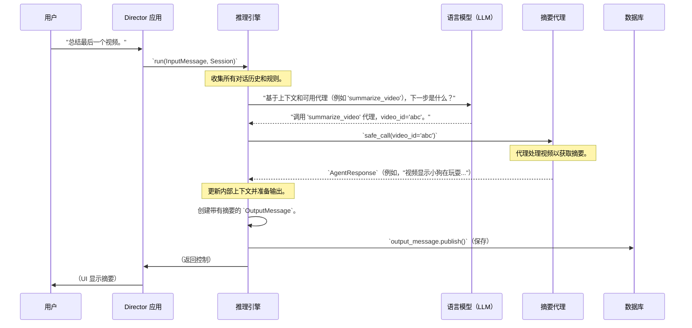

# 第 3 章：推理引擎

欢迎回来

在上一章[第 2 章：消息类（输入/输出）](02_message_classes__input_output__.md)中，我们探讨了 Director 如何使用结构化消息（`InputMessage` 和 `OutputMessage`）与我们通信。我们发送一个清晰的请求，Director 发送回一个格式良好的响应。

但这引发了一个大问题：当 Director 收到我们的 `InputMessage` 时，它如何*知道*该做什么？它如何决定创建那个特定的 `OutputMessage`？如果我们要求"总结最后一个视频"，在我们的输入和 Director 的摘要输出之间发生了什么？

这就是**推理引擎**发挥作用的地方——它是 Director 的"大脑"

## 问题：没有计划的 Director

想象一下电影导演在片场。他们收到剧本（我们的请求）。如果他们没有计划，他们会迷失方向

他们不知道该叫哪些演员（专门的"代理"），使用哪些道具或场地（"工具"），或者按什么顺序拍摄场景。整个制作将是混乱的，没有电影会被制作出来。

同样，如果没有中央"大脑"，Director 将不知道如何：
*   理解复杂的请求，如"给我找一个关于小狗的视频，然后从中创建一个 10 秒的精彩片段，并分享它。"
*   决定需要哪些专门的"代理"（如"视频搜索代理"或"精彩片段创建代理"）。
*   弄清楚这些代理应该使用哪些"工具"（如用于搜索的 `VideoDB 工具`）。
*   在多个步骤中跟踪对话上下文。

## 解决方案：推理引擎——Director 的大脑

**推理引擎**是 Director 的战略策划者。可以把它想象成技艺高超的电影导演，他接受我们的剧本（我们的输入），理解我们的愿景，然后精心计划和编排整个制作，使愿景成为现实。

它的主要工作是：
1.  **==理解==我们的请求：** 从我们的自然语言输入中弄清楚我们*真正*想要实现什么。
2.  **==规划==工作流程：** 决定需要使用*哪些*专门的"代理"和"工具"，以及按什么顺序来完成我们的请求。
3.  **==编排==代理：** 积极管理和指导代理，为它们提供必要的信息并处理它们的输出。
4.  **==维护==上下文：** 使用[会话管理](01_session_management_.md)系统记住对话中到目前为止发生的事情，确保连续性。
5.  **==交付==结果：** 确保使用[消息类（输入/输出）](02_message_classes__input_output__.md)将最终结果清楚地传达给我们。

它是使 Director 感觉智能并能够处理复杂、多步骤任务的中央智能。

## 我们的用例：总结视频（导演剪辑版）

让我们重新审视我们的简单用例：我们想要"总结最后一个视频。"这次，我们将关注推理引擎如何实现它：

1.  **我们（用户）询问：** "总结最后一个视频。"（这是一个 `InputMessage`。）
2.  **==推理引擎==（大脑）听到：** "好的，用户想要一个摘要。我需要找到 `summarize_video` 代理。我将检查会话以查看他们刚才在看哪个视频以获取其 ID。然后，我将告诉 `summarize_video` 代理使用该视频 ID 完成其工作。一旦代理给我摘要，我将把它放入 `OutputMessage` 并发送回用户。"
3.  **Director（系统）响应：** "视频显示一只金毛猎犬在公园里玩耍..."（这是一个 `OutputMessage`。）

## 关键概念：大脑如何工作

推理引擎使用几个核心概念来完成其工作：

### 1. 理解我们的请求（自然语言理解 - NLU）
Director 使用强大的**大型语言模型（LLM）**作为其大脑的一部分。当我们发送消息时，推理引擎将我们的消息以及对话历史和可用代理列表提供给 LLM。然后 LLM 弄清楚我们的意图。

### 2. 规划行动（代理编排）
基于其理解，LLM 告诉推理引擎它认为哪个特定的"代理"（我们的专业工作者）最适合该任务。它可能会说："使用 `summarize_video` 代理"，甚至提供代理需要的确切参数（如 `video_id`）。

### 3. 跟踪记录（上下文和记忆）
推理引擎持续更新 `session` 的 `reasoning_context`。这就像 Director 的草稿本，它记录我们的输入、自己的内部想法以及代理的结果。这种记忆对于处理后续问题和多步骤任务至关重要。

### 4. 执行计划（逐步进行）
推理引擎不会试图一次完成所有事情。它按"步骤"工作。在每个步骤中，它可能会向 LLM 寻求建议，运行代理，处理代理的输出，然后决定下一步。它继续这个循环，直到任务完成。

## 使用推理引擎

我们通常不会直接"调用"推理引擎，因为它是 Director 的核心编排者。相反，当我们==发送 `InputMessage` 时它会被激活==。但是，让我们看看它如何初始化和触发的简化：

```python
from director.core.reasoning import ReasoningEngine
from director.core.session import Session, InputMessage, MsgType, TextContent
from director.db.sqlite.db import SQLiteDB

# --- 设置（类似于前几章）---
db_connection = SQLiteDB(db_path=":memory:")
session_id = "user-reasoning-123"
conv_id = "conv-reasoning-456"

# 创建会话（假设它已经从上一步有了 video_id）
my_session = Session(db=db_connection, session_id=session_id, conv_id=conv_id, video_id="some_video_id_from_db")
my_session.create()

# 我们还需要一个 OutputMessage 来跟踪进度并发送最终响应
my_session.output_message = my_session.new_message(
    msg_type=MsgType.output, content=[]
)

# 1. 用户的请求作为 InputMessage 进来
user_input = my_session.new_message(
    msg_type=MsgType.input,
    content=[TextContent(text="Summarize the last video.").model_dump()]
)
user_input.publish() # 保存用户输入

# 2. 使用输入和会话初始化推理引擎
# （在实际应用中，这由 Director 的处理程序自动完成）
reasoning_engine = ReasoningEngine(
    input_message=user_input,
    session=my_session,
)

# 在实际设置中，各种代理将在这里注册：
# from director.agents.summarize import SummarizeVideoAgent
# reasoning_engine.register_agents([SummarizeVideoAgent(...)])

# 3. 告诉推理引擎"运行"并做它的事情
print("Reasoning Engine is starting to process your request...")
reasoning_engine.run(max_iterations=5) # 运行几个步骤
print("Reasoning Engine has finished.")

# 运行后，输出消息将被发布到 UI
# 并保存到数据库。
# 对于此示例，让我们检查理论上生成了什么：
# （注意：这是说明性的，实际输出将通过 WebSocket/DB）
final_output = my_session.output_message.content
if final_output:
    print(f"\nFinal output from Director: {final_output[0]['text']}")
```
**解释：**
在这里，我们首先设置一个 `Session` 和我们的 `InputMessage`。然后，我们创建一个 `ReasoningEngine` 实例，为它提供我们的输入和当前 `session` 的上下文。当我们调用 `reasoning_engine.run()` 时，它启动我们之前讨论的整个"思考"过程。它编排代理，与 LLM 通信，并最终创建并发布带有摘要（或任务所需的任何内容）的 `OutputMessage`。

## 底层原理：Director 的工作流程

让我们看看当推理引擎工作时，Director 内部发生了什么的简化序列，使用我们的"总结最后一个视频"示例。



**流程解释：**
1.  **我们的请求：** 我们发送命令，`DirectorApp` 接收。
2.  **引擎激活：** `DirectorApp` 将我们的 `InputMessage` 和当前 `Session` 传递给 `ReasoningEngine` 以开始处理。
3.  **上下文构建：** `ReasoningEngine` 首先收集所有必要的信息：我们的最新消息、来自 `Session` 的完整对话历史、系统范围的指令（如"始终尝试使用代理"）以及有关我们当前正在交互的任何视频或集合的详细信息。这形成了 `reasoning_context`。
4.  **询问 LLM：** 然后 `ReasoningEngine` 将此 `reasoning_context` 发送给 `LLM`。它还告诉 LLM 它拥有的所有可用 `agents`（例如，"summarize_video"、"upload_video"）。LLM 的工作是"思考"并决定下一步采取什么行动。
5.  **LLM 的决定：** LLM 响应，建议"调用 `summarize_video` 代理"并指定它从对话历史中推断出的 `video_id`。
6.  **代理执行：** 然后 `ReasoningEngine` 调用 `summarize_video` 代理，将 `video_id` 传递给它。
7.  **代理的工作：** `summarize_video` 代理执行其特定任务（例如，与 `VideoDB 工具`对话以获取摘要）。
8.  **代理的报告：** 代理在 `AgentResponse` 中将其结果（视频摘要）返回给 `ReasoningEngine`。
9.  **输出创建和发布：** `ReasoningEngine` 使用此摘要更新其内部 `OutputMessage`，将其状态设置为 `success`，然后调用 `publish()`。这将消息保存到 `Database` 并实时发送到我们的 `User Interface`。
10. **任务完成：** `ReasoningEngine` 发出信号表示它已完成，我们看到摘要！

### 代码

让我们看看这些核心思想如何在 `director/core/reasoning.py` 文件中表示。

#### 1. 初始化大脑（`ReasoningEngine.__init__`）
`ReasoningEngine` 需要知道我们当前的请求和对话状态。

```python
# director/core/reasoning.py（简化）
from director.llm import get_default_llm
# ... 其他导入 ...

class ReasoningEngine:
    def __init__(self, input_message, session):
        self.input_message = input_message # 我们的最新请求
        self.session = session             # 完整的对话日志
        self.llm = get_default_llm()       # 我们强大的语言模型
        self.agents = []                   # 所有可用专门代理的列表
        # 这是我们将更新并发送回用户的消息
        self.output_message = self.session.output_message
        self.stop_flag = False             # 控制引擎何时停止
```
**解释：**
这是我们的"大脑"被初始化的地方。它接收我们的请求（`input_message`）并记住整个对话（`session`）。它还准备好与强大的语言模型（`llm`）对话，并知道哪些专业工作者（`agents`）可用。`output_message` 是直接链接到最终将发送给我们的消息，允许引擎更新其内容和状态。

#### 2. 为 LLM 构建上下文（`ReasoningEngine.build_context`）
在向 LLM 寻求建议之前，Director 首先准备所有相关信息。

```python
# director/core/reasoning.py（简化）
from director.core.session import ContextMessage, RoleTypes, TextContent
# ... 其他导入 ...

class ReasoningEngine:
    # ... __init__ 和其他方法 ...
    def build_context(self):
        # 1. 添加系统的总体指令（Director 的规则）
        # 这是来自代码的固定提示，如 REASONING_SYSTEM_PROMPT
        # 为简单起见，我们在这里只添加一个占位符。
        self.session.reasoning_context.append(
            ContextMessage(content="SYSTEM PROMPT: The Director...")
        )

        # 2. 添加有关当前视频或集合的详细信息（如果有）
        if self.session.video_id:
            video = self.session.state["video"]
            self.session.reasoning_context.append(
                ContextMessage(
                    content=f"Here is the video you are referring to: title: {video.name}, video_id: {video.id}."
                )
            )
        # （完整代码中有更多关于集合的逻辑）

        # 3. 添加用户的最新输入消息
        user_context_msg = ContextMessage(
            content=self.input_message.content,
            role=RoleTypes.user
        )
        self.session.reasoning_context.append(user_context_msg)
```
**解释：**
此方法就像 Director 为 LLM 准备其"简报"。它收集总体 `SYSTEM_PROMPT`（Director 的"游戏规则"）、有关正在讨论的视频或集合的任何信息以及我们的最新 `InputMessage`。所有这些都被编译到 `self.session.reasoning_context` 中——一个 `ContextMessage` 对象列表，代表 LLM 的完整对话历史和指令。

#### 3. 核心思考循环（`ReasoningEngine.step`）
这是魔法发生的地方：Director 询问 LLM，运行代理，并更新输出。

```python
# director/core/reasoning.py（简化）
from director.core.session import ContextMessage, RoleTypes, MsgStatus, TextContent
from director.agents.base import AgentStatus
# ... 其他导入 ...

class ReasoningEngine:
    # ... __init__、build_context 和其他方法 ...
    def step(self):
        # 1. 基于历史和可用代理询问 LLM 该做什么
        llm_response = self.llm.chat_completions(
            messages=[msg.to_llm_msg() for msg in self.session.reasoning_context],
            tools=[agent.to_llm_format() for agent in self.agents]
        )

        if llm_response.tool_calls:
            # 2. 如果 LLM 决定使用代理（"工具调用"）
            self.session.reasoning_context.append( # 将 LLM 的决定添加到上下文
                ContextMessage(
                    content=llm_response.content,
                    tool_calls=llm_response.tool_calls,
                    role=RoleTypes.assistant
                )
            )
            for tool_call in llm_response.tool_calls:
                # 运行选择的代理
                agent_response = self.run_agent(
                    tool_call["tool"]["name"],
                    **tool_call["tool"]["arguments"]
                )
                # 3. 将代理的输出添加回对话上下文
                self.session.reasoning_context.append(
                    ContextMessage(
                        content=agent_response.__str__(),
                        tool_call_id=tool_call["id"],
                        role=RoleTypes.tool
                    )
                )
            # （在完整代码中，摘要在所有步骤结束时创建）
            # 为简单起见，让我们更新"正在处理"状态
            self.output_message.content.append(TextContent(text="Working on your request..."))
            self.output_message.push_update() # 向 UI 发送进度更新

        elif llm_response.finish_reason in ["stop", "end_turn"]:
            # 4. 如果 LLM 说它完成了，准备最终响应
            final_summary_text = llm_response.content # 或更精细的摘要
            self.output_message.content.append(
                TextContent(text=final_summary_text, agent_name="assistant")
            )
            self.output_message.status = MsgStatus.success
            self.output_message.publish() # 将最终消息发送到 UI 和 DB
            self.stop_flag = True # 告诉引擎停止其循环
```
**解释：**
这个 `step()` 方法是真正的"思考"反复发生的地方。Director 将整个 `reasoning_context`（对话历史和指令）以及所有可用 `agents` 的列表发送给 `LLM`。然后 LLM 要么决定使用这些代理之一（`tool_calls`），要么给出直接答案（`finish_reason == "stop"`）。如果调用代理，Director 运行它（`run_agent`）并将其结果添加回 `reasoning_context` 以进行下一次"思考"。最后，如果 LLM 完成了，Director 创建最终的 `OutputMessage` 并 `publish()` 它。

#### 4. 运行代理（`ReasoningEngine.run_agent`）
这是推理引擎实际调用专业工作者的方式。

```python
# director/core/reasoning.py（简化）
from director.agents.base import AgentResponse, AgentStatus, BaseAgent
# ... 其他导入 ...

class ReasoningEngine:
    # ... __init__、build_context、step 和其他方法 ...
    def run_agent(self, agent_name: str, **kwargs) -> AgentResponse:
        agent = next(
            (a for a in self.agents if a.agent_name == agent_name),
            None
        )
        if agent:
            # 通知 UI 代理正在运行
            self.output_message.actions.append(f"Running @{agent_name} agent")
            self.output_message.push_update() # 发送实时更新
            return agent.safe_call(**kwargs) # 使用其参数调用代理
        else:
            # 处理找不到代理的情况
            return AgentResponse(
                status=AgentStatus.ERROR,
                message=f"Agent '{agent_name}' not found."
            )
```
**解释：**
此方法就像 Director 告诉演员，"好的，现在是你的场景！"它通过 `agent_name` 找到 LLM 请求的特定代理，然后调用该代理的 `safe_call` 方法，传递所有必要的参数（如 `video_id`）。重要的是，它还更新 `output_message` 以向用户显示当前哪个代理处于活动状态。

## 结论

推理引擎确实是 Director 的"大脑"。它负责理解我们的请求，智能规划必要的步骤，编排各种专门的代理，并使用会话记忆维护连贯的对话。通过像熟练的电影导演一样行事，它确保我们复杂的视频任务从初始命令到最终输出都得到顺利有效的处理。

现在我们已经看到 Director 的大脑如何使用 LLM 做出决策，我们可能对那个强大的 `LLM` 组件本身感到好奇。在下一章中，我们将探讨 [LLM 抽象](04_llm_abstraction_.md)并了解 Director 如何与不同的语言模型交互。

[下一章：LLM 抽象](04_llm_abstraction_.md)

