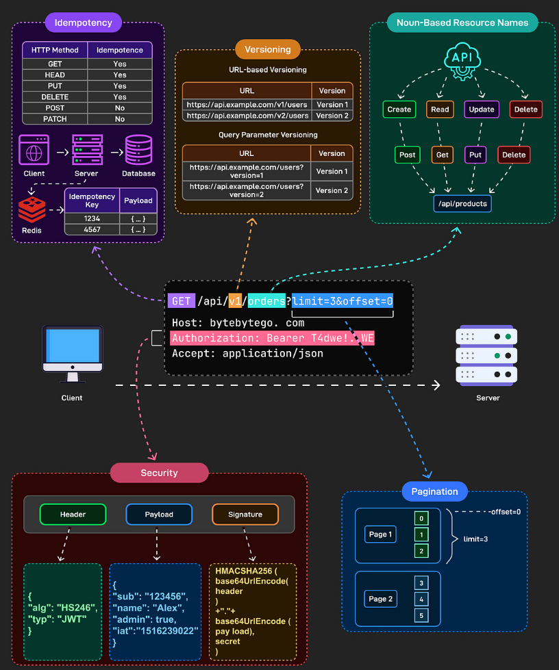
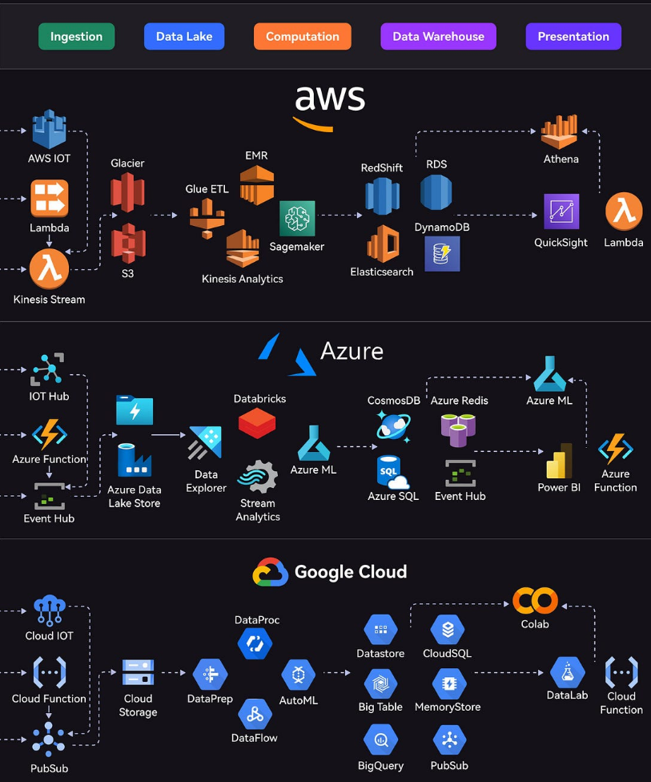
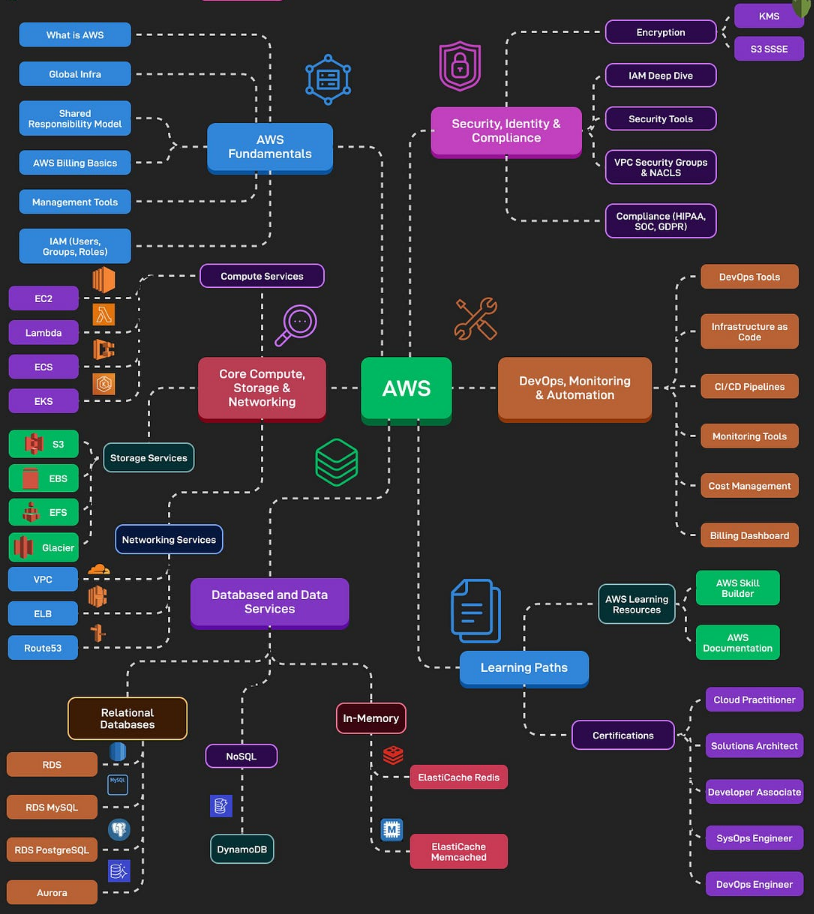
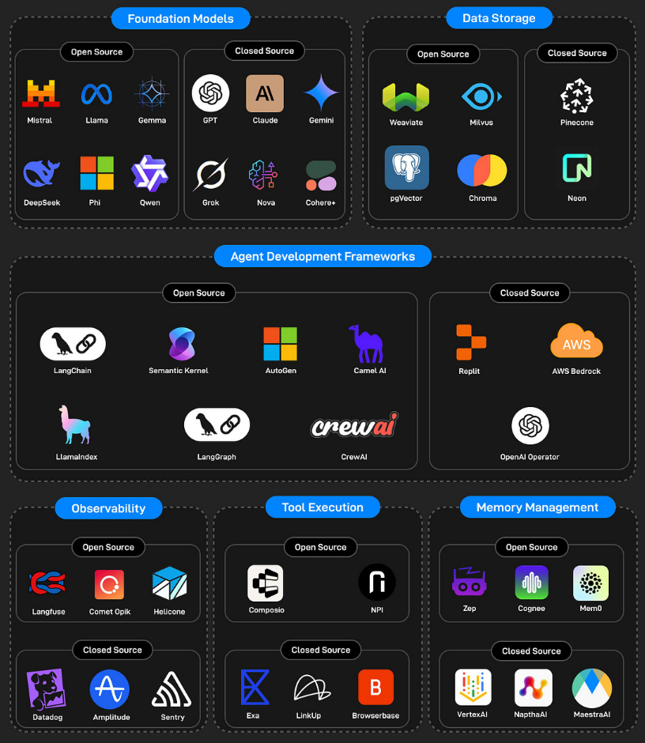
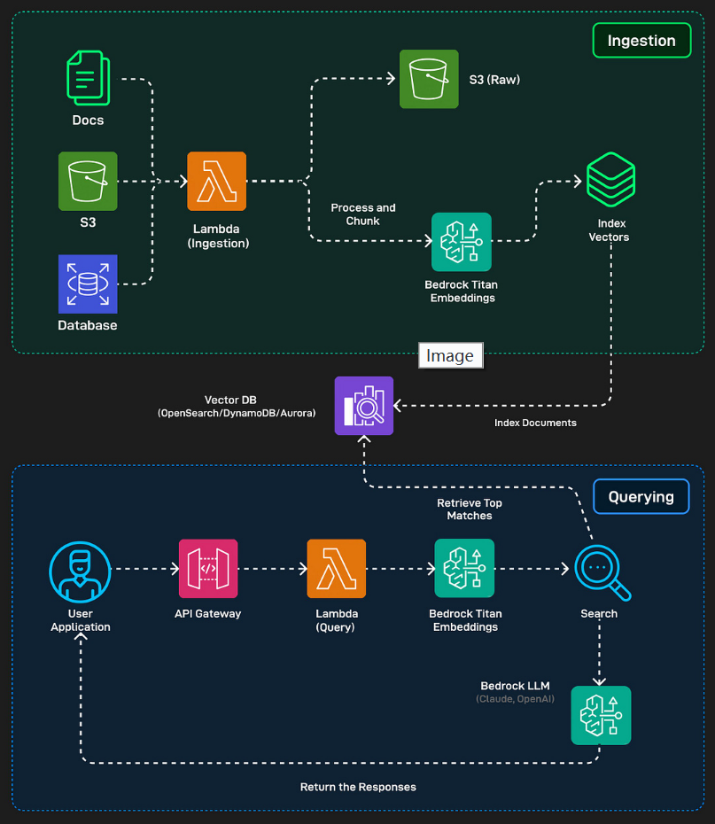

# **EP189: 如何设计优秀的API**

### **如何设计优秀的API**

设计良好的API感觉是无形的，它就是能正常工作

这种简洁性背后是一套一致的设计原则，使API具有可预测性、安全性和可扩展性。

以下是优秀API与糟糕API的区别：

- **`幂等性`**：GET、HEAD、PUT和DELETE应该是幂等的。发送相同的请求两次，得到相同的结果。没有意外的副作用。POST和PATCH不是幂等的。每次调用都会创建新资源或以不同方式修改状态。

使用存储在Redis或数据库中的幂等性密钥。

==客户端在重试时发送相同的密钥，服务器识别它并返回原始响应==，而不是再次处理。

- **版本控制**

- **基于名词的资源名称**：资源应该是名词，而不是动词。使用"/api/products"，而不是"/api/getProducts"。

- **安全性**：使用适当的身份验证保护每个端点。Bearer令牌（如JWT）包括标头、有效负载和签名来验证请求。始终使用HTTPS并在每次调用时验证令牌。

- **分页**：返回大型数据集时，`使用分页参数`如"?limit=10&offset=20"来保持响应的高效性和一致性。

### **AWS、Azure和Google Cloud的大数据管道速查表**

每个平台都提供涵盖整个生命周期的综合服务套件：

- **`摄取`**：从各种来源收集数据
- **`数据湖`**：存储原始数据
- **`计算`**：处理和分析数据
- **`数据仓库`**：存储结构化数据
- **`展示`**：可视化和报告洞察

AWS使用Kinesis进行数据流、S3进行存储、EMR进行处理、RedShift进行仓储、QuickSight进行可视化。

Azure的管道包括Event Hubs用于摄取、Data Lake Store用于存储、Databricks用于处理、Cosmos DB用于仓储、Power BI用于展示。

GCP提供PubSub用于数据流、Cloud Storage用于数据湖、DataProc和DataFlow用于处理、BigQuery用于仓储、Data Studio用于可视化。

### **如何学习AWS？**

AWS是最受欢迎的云平台之一。当AWS宕机时，互联网的很大一部分都会宕机。

以下是可以帮助我们掌握AWS的学习路线图：

1. **AWS基础知识** - 包括"什么是AWS？"、全球基础设施、AWS计费、管理和IAM基础
2. **核心计算、存储和网络** - 包括EC2、Lambda、ECS、EKS等计算服务，S3、EBS、EFS、Glacier等存储服务，以及VPC、ELB、Route 53等网络服务
3. **数据库和数据服务** - 包括关系数据库（RDS MySQL和PostgreSQL）、NoSQL和内存数据库如ElastiCache（Redis和Memcached）
4. **安全、身份和合规** - 包括IAM深入、加密（KMS、S3 SSE）、安全工具、VPC安全组和HIPAA、SOC、GDPR的合规工具
5. **DevOps、监控和自动化** - 包括DevOps工具（CodeCommit、CodeBuild、CodePipeline）、基础设施即代码、CI/CD管道、监控工具（CloudWatch、CloudTrail）和成本管理
6. **学习路径和认证** - 包括AWS学习资源和认证路径

### **AI代理技术栈**

- **基础模型**：大规模预训练语言模型
- **数据存储**：向量数据库和内存存储系统
- **代理开发框架**：帮助开发人员构建、编排和管理多步骤AI代理
- **可观测性**：实时监控、调试和记录AI代理行为
- **工具执行**：允许AI代理与真实世界工具交互
- **内存管理**：管理代理的长期和短期内存

### **如何在AWS上构建基本的RAG应用？**

RAG是一种AI模式，将搜索步骤与文本生成相结合

**摄取阶段**：
- 原始文档存储在Amazon S3
- AWS Lambda运行摄取函数处理文档
- 使用Amazon Bedrock的Titan嵌入模型转换为向量
- 存储在OpenSearch或DynamoDB等向量数据库中

**查询阶段**：
- 用户问题通过API Gateway发送到Lambda查询函数
- 问题转换为嵌入向量
- 与存储的文档嵌入进行比较找到最相关的块
- 相关块和问题发送到LLM生成答案
- 响应返回给用户

### **虚拟化类型**

1. **传统（裸机）**：应用程序直接在操作系统上运行
2. **虚拟化（基于VM）**：每个VM运行自己的完整操作系统
3. **容器化**：容器共享主机操作系统内核但获得隔离的运行时环境
4. **VM上的容器**：这是生产云环境中实际运行的方式，结合两者的优势

