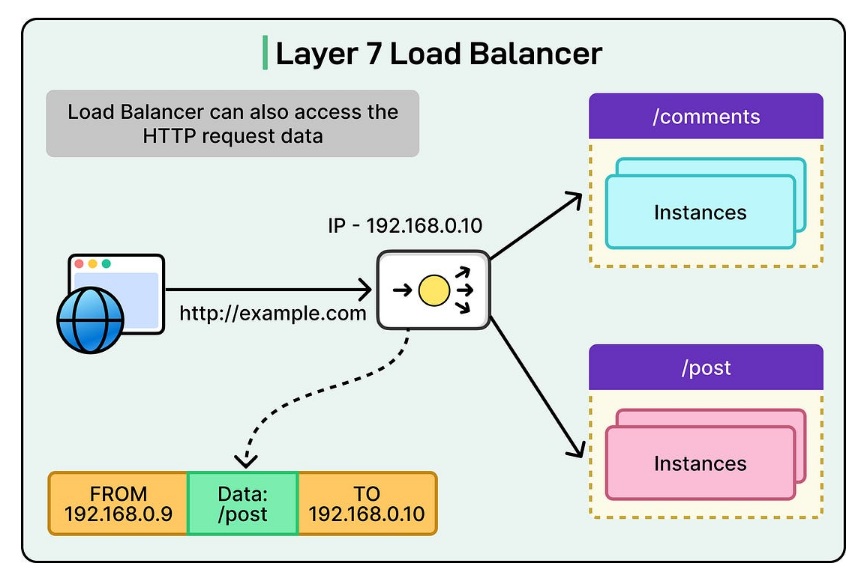
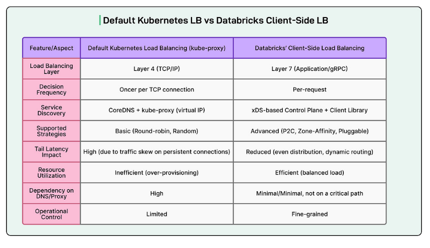
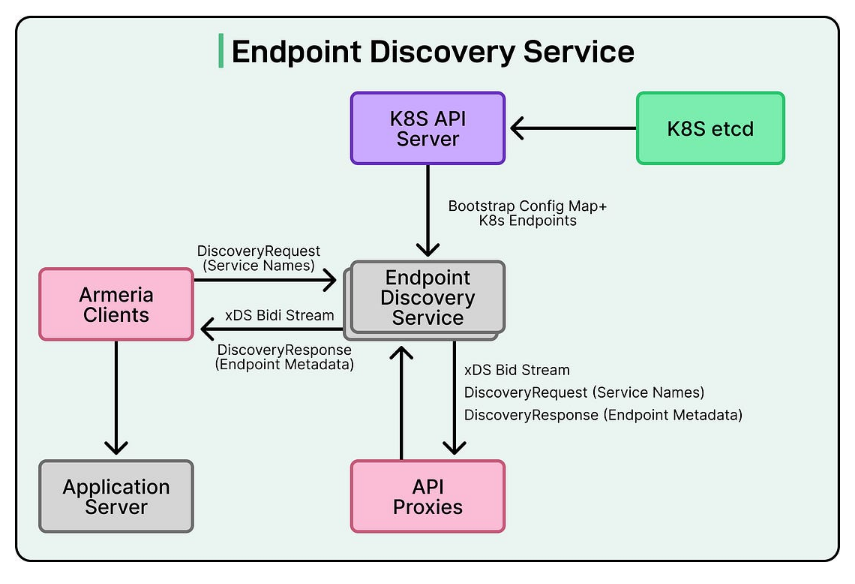

# **Databricks 如何实现智能 Kubernetes 负载均衡**

**你们的团队正在构建或扩展 AI 代理吗？**

当今 AI 面临的最大挑战之一是==内存==——代理如何随时间保留、回忆和记住。没有它，即使是最好的模型也会遇到上下文丢失、不一致和有限的可扩展性问题。

这份新的 O'Reilly + Redis 报告阐述了为什么内存是可扩展 AI 系统的基础，以及实时架构如何使其成为可能。

报告内容：

- 短期、长期和持久内存在代理性能中的作用
- LangGraph、`Mem0` 和 Redis 等框架
- 更快、更可靠、具有上下文感知能力的系统的架构模式

专栏传送：[Mem0 是一个**智能记忆层**，旨在为 AI 助手和智能体提供*持久化*和*个性化*的记忆能力](.\MCP\memo0)

------------

**免责声明**：本文中的详细信息来源于 Databricks 工程团队在线分享的内容。所有技术细节的功劳归于 Databricks 工程团队。原始文章和来源的链接位于文章末尾的参考部分。

Kubernetes 已成为==运行现代微服务的标准平台==。它通过内置的网络组件（如 `ClusterIP 服务`、`CoreDNS` 和 `kube-proxy`）简化了服务之间的通信方式。

这些原语对许多工作负载都很有效，但当流量变得高容量、持久且对延迟敏感时，它们就开始显示出局限性。

Databricks 正面临这一挑战。他们的许多内部服务`依赖于 gRPC，它运行在 HTTP/2 上，并在客户端和服务器之间保持长期的 TCP 连接`。

在 Kubernetes 的默认模型下，这会导致`流量分布不均`、不可预测的扩展行为和更高的尾部延迟。

> 默认情况下，Kubernetes 使用 ClusterIP 服务、CoreDNS 和 kube-proxy（iptables/IPVS/eBPF）来路由流量：
>
> - 客户端将服务 DNS（例如，my-service.default.svc.cluster.local）解析为 ClusterIP。
> - 数据包发送到 ClusterIP。
> - kube-proxy 使用轮询或随机选择来选择后端 pod。

由于选择仅在每个 TCP 连接时发生一次，因此==相同的后端 pod 在该连接的生命周期内持续接收流量==。对于短期的 HTTP/1 连接，这通常没问题。然而，对于持久的 HTTP/2 连接，结果是==流量倾斜==：少数 pod 过载，而其他 pod 保持空闲。

对于 Databricks，这产生了几个运营问题：

- **高尾部延迟**：少数 pod 处理了大部分负载，这增加了用户的响应时间。
- **资源利用率差**：一些 pod 不堪重负，而其他 pod 处于空闲状态，导致过度配置。
- **策略有限**：Kubernetes 内置的负载均衡无法处理错误感知或区域感知路由。

Databricks 工程团队需要更智能的东西：一个第 7 层、请求级别的负载均衡器，可以动态响应真实的服务条件，而不是依赖于连接级别的路由决策。

在本文中，我们将了解他们如何构建这样的系统以及他们在此过程中面临的挑战。

## **核心解决方案**

为了克服默认 Kubernetes 路由的局限性，Databricks 工程团队将负载均衡责任从基础设施层转移到客户端本身。他们没有依赖 kube-proxy 和 DNS 来做出连接级别的路由决策，而是构建了一个客户端负载均衡系统，该系统由提供实时服务发现的轻量级控制平面支持。

这意味着应用程序客户端不再等待 DNS 解析服务或等待 kube-proxy 选择后端 pod。相反，它已经知道哪些 pod 是健康和可用的。当发出请求时，客户端可以根据最新信息在那一刻选择最佳后端。

以下是显示默认 Kubernetes LB 和 Databricks 客户端 LB 之间差异的表格：

通过从关键路径中移除 DNS，系统为每个客户端提供了可用端点的直接和当前视图。这允许更智能的每请求路由决策，而不是静态的每连接路由。结果是更均匀的流量分布、更低的延迟以及更好地利用 pod 之间的资源。

这种方法还为 Databricks 提供了更大的灵活性来微调服务之间的流量流动方式，这在默认 Kubernetes 模型中很难实现。

## **自定义控制平面 - 端点发现服务**

智能负载均衡系统的关键部分是其自定义控制平面。该组件负责保持对 Kubernetes 集群内运行的服务的准确、实时视图。控制平面不依赖于 DNS 查找或静态路由，而是持续监控集群并向客户端提供实时端点信息。

请参见下图：

它的工作原理如下：

- **监视 Kubernetes API**：控制平面密切关注 Kubernetes 资源，如 Services 和 EndpointSlices。EndpointSlices 包含属于服务的所有 pod 的详细信息，包括它们的 IP 地址和健康状态。每当添加、删除 pod 或其状态发生变化时，控制平面几乎立即检测到它。

- **构建实时拓扑**：它维护每个服务的所有后端 pod 的内部映射。这包括重要的元数据，例如：

  - 区域信息，以了解 pod 在哪里运行（对于区域亲和性路由很有用）。

  - 就绪状态，以确保只有健康的 pod 接收流量。

  - 分片标签或其他识别信息，以智能地路由流量。

- **将数据转换为 xDS 响应**：控制平面将此信息转换为 xDS（Envoy 发现服务）响应。xDS 是一种广泛使用的 API 协议，允许客户端和代理接收动态配置更新，包括端点列表。

- **向客户端和代理流式传输更新**：客户端不是轮询或重新解析 DNS，而是订阅控制平面，并在端点发生变化时接收持续的流式更新。如果 pod 宕机，客户端几乎立即了解到它，并将请求路由到其他地方。如果新的 pod 上线，它可以立即开始接收流量。

这种设计有几个好处：

- 客户端不必等待 DNS 过期或连接中断。
- 路由决策基于集群的最新视图。
- 这消除了大规模 Kubernetes 系统中的常见瓶颈之一。

## **客户端与 RPC 框架的集成**

为了使任何负载均衡系统能够大规模工作，应用程序团队必须易于采用。Databricks 通过将新的负载均衡逻辑直接集成到他们的共享 RPC 客户端框架中来解决这个问题，该框架被大多数内部服务使用。

由于许多 Databricks 服务是用 Scala 编写的，工程团队能够构建一次此功能，并使其对所有服务可用，而无需各个团队的额外努力。

集成的工作原理如下：

- **订阅 EDS 更新**：每个服务使用一个自定义 RPC 客户端，该客户端自动订阅它所依赖的任何其他服务的端点发现服务（EDS）。这意味着客户端始终知道哪些 pod 可用且健康。

- **维护端点的内存列表**：客户端保留健康端点的实时内存列表，以及有用的元数据，如区域信息、分片标签和就绪状态。每当控制平面发送新信息时，此列表会自动更新。

- **绕过 DNS 和 kube-proxy**：因为客户端已经知道哪些端点可用，所以它不需要执行 DNS 查找或依赖 kube-proxy 来选择后端 pod。它可以直接为每个请求选择正确的 pod。

- **无缝的组织范围采用**：通过将逻辑嵌入到共享客户端库中，Databricks 使所有团队都能从智能负载均衡中受益，而无需更改其应用程序代码或部署复杂的 sidecar。这减少了运营开销，使推出变得更加简单。

## **高级负载均衡策略**

Databricks 客户端负载均衡系统的最大优势之一是其灵活性。由于路由发生在客户端内部并基于实时数据，系统可以使用比 kube-proxy 使用的基本轮询或随机选择更高级的策略。

这些策略允许客户端为每个请求做出更智能的路由决策，从而提高性能、可靠性和资源效率。

**二选一算法（P2C）**

二选一算法简单但强大。当请求进来时，客户端：

- 随机选择两个健康的端点。
- 检查它们的当前负载。
- 将请求发送到两者中负载较轻的一个。

这种方法避免了随机流量峰值和过载的 pod。它比轮询更均匀地平衡流量，同时保持逻辑轻量级和快速。Databricks 发现 P2C 对其大多数服务都很有效。

## **区域亲和性路由**

在大型分布式 Kubernetes 集群中，当流量跨区域时，网络延迟可能会增加。

为了最小化这一点，团队使用区域亲和性路由：

- 客户端优先选择与调用者位于同一区域的端点，以减少延迟和数据传输成本。
- 如果该区域过载或不健康，客户端会智能地将流量溢出到具有可用容量的其他区域。

这有助于保持低延迟，同时确保系统对部分故障保持弹性。

## **==可插拔==策略**

该架构设计为可扩展的。团队可以==轻松添加新的负载均衡策略==，而无需更改整个系统。例如：

- **加权路由**，其中流量根据自定义权重（如 pod 容量或专用硬件）分配。
- **特定于应用程序的路由**，其中可以针对特定工作负载（如 AI 或分析）调整策略。

## **xDS 与 Envoy 的集成用于入口流量**

Databricks 工程团队没有将其智能负载均衡系统限制在内部流量。他们还扩展了端点发现服务（EDS）控制平面以与 Envoy 配合使用，Envoy 管理外部入口流量。这意味着内部服务到服务通信和从外部进入集群的流量都遵循相同的路由规则集。

工作原理如下：

- **向 Envoy 提供实时端点数据**：控制平面实现端点发现服务（EDS）协议。这允许它向 Envoy 发送有关所有后端集群及其端点的最新信息。随着 pod 的添加、删除或状态更改，Envoy 会收到即时更新，确保外部流量始终定向到健康和可用的 pod。

- **内部和外部流量的一致路由**：因为内部客户端和 Envoy 都使用相同的控制平面作为其真相来源，所以路由决策在整个平台上保持一致。不存在外部流量被发送到陈旧端点或偏离内部路由逻辑的风险。

- **统一服务发现**：这种设计避免了为不同类型的流量维护多个服务发现系统。相反，Databricks 使用单个集中式控制平面来管理内部 RPC 调用和入口网关路由的端点信息。

## **结论**

转向客户端负载均衡为 Databricks 的基础设施带来了可衡量的好处。部署新系统后，pod 之间的流量分布变得均匀，消除了少数 pod 过载而其他 pod 处于空闲状态的问题。

这导致了稳定的延迟配置文件，P90 和尾部延迟变得更加可预测，并且多个服务的 pod 数量减少了 20%。

来源：Databricks 技术博客

改进的平衡意味着 Databricks 可以在不过度配置资源的情况下实现更好的性能。

推出还揭示了一些重要的经验教训：

- 冷启动变得更加明显，因为新的 pod 在上线后立即开始接收流量。为了解决这个问题，团队引入了慢启动爬坡和一种机制，将流量偏离高错误率的 pod。

- 另一个教训来自于尝试基于指标的路由。依赖 CPU 和内存指标被证明是不可靠的，因为这些信号通常滞后于实时条件。团队转向使用基于健康的信号，这提供了更准确和及时的路由决策。

- 此外，并非所有服务都能立即从该系统中受益，因为并非每种语言都有兼容的客户端库，这意味着一些流量仍然依赖于传统的负载均衡。

展望未来，Databricks 正在致力于跨集群和跨区域负载均衡，以使用扁平 L3 网络和多区域 EDS 集群在全球范围内扩展该系统。团队还在探索高级 AI 感知策略，包括针对专用后端的加权负载均衡。这些未来的改进旨在处理更大的工作负载，支持 AI 密集型应用程序，并在平台增长时保持高可靠性。

通过这种架构，Databricks 展示了一种实用的方法来克服默认 Kubernetes 负载均衡的局限性，并构建一个灵活、高效和可扩展的流量管理系统。

**参考资料：**

- Databricks 的智能 Kubernetes 负载均衡
- 服务、负载均衡和网络

