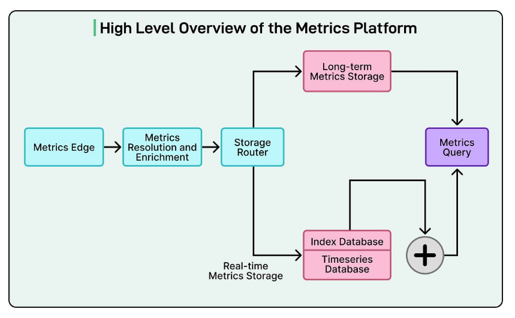
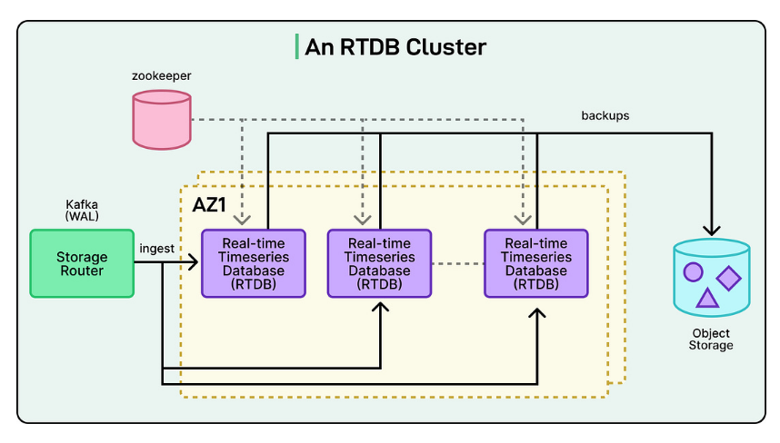
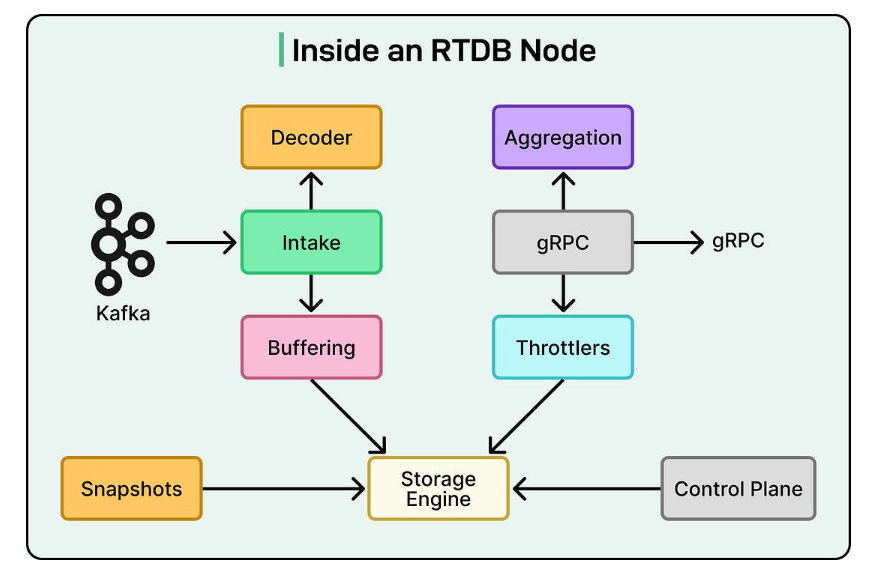
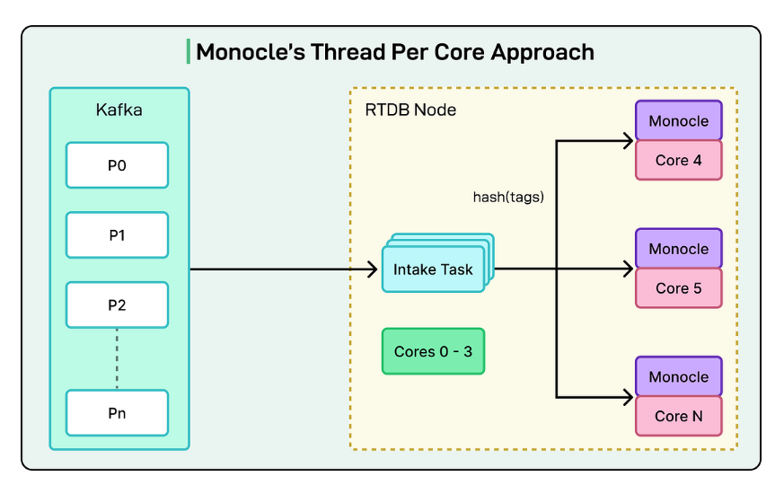

# **Datadog 如何构建自定义数据库以每秒摄取数十亿指标**

**构建更可持续的值班体验**


保持系统可靠性不应以牺牲我们的团队为代价。Datadog 的这份实用指南展示了如何设计可持续的值班流程，以减少倦怠并改善响应。

获取分步最佳实践，以便我们可以：

- 通过基于==信号==的监控减少警报噪音
- 通过==明确==的角色和更智能的升级简化响应
- 设计支持恢复和长期可持续性的==轮换==

---

**声明**：

- 本文中的详细信息来源于 Datadog 工程团队和 P99 会议组织者在线分享的内容。

- 所有技术细节的功劳归于 Datadog 工程团队。原始文章和来源的链接位于文章末尾的参考部分。

在==云监控领域==，Datadog 以大规模运营。该公司的平台必须每秒从全球数百万台主机摄取数十亿个数据点。

这种持续的信息流产生了巨大的工程挑战：

> 我们如何以不仅快如闪电而且具有成本效益的方式存储、管理和查询这些数据？

对于 Datadog 工程团队来说，答案是从头开始构建他们自己的解决方案。

在本文中，我们将了解 Datadog 工程团队如何构建 Monocle，这是他们定制的时间序列存储引擎，用于支持其实时指标平台。本文分析了==数据库背后的技术决策和巧妙优化==。

**使用 AI 更快地行动：编写我们可以信赖的代码**


AI 正在加速事情，但所有这些新代码都会产生瓶颈——==谁来验证质量和安全性==？不要让新的技术债务和安全风险溜走。Sonar 的==自动审查==为我们提供了对每一行代码（无论是人工编写还是 AI 编写）所需的信任。

使用 SonarQube，我们的团队可以：

- 无惧使用 AI：获得质量和安全性的持续分析。
- 及早修复问题：==在合并之前检测==并应用自动修复。
- 维护我们的标准：确保所有代码每次都符合我们团队的质量标准，以实现长期代码健康。

立即开始使用 SonarQube 以促进 AI 驱动的开发并在所有代码中建立信任。

---

### **高层指标平台架构**

在深入了解自定义数据库引擎之前，了解它的位置很重要。

他们的==自定义引擎名为 Monocle==，只是更大的"指标平台"中的一个专业组件。该平台是负责收集、处理、存储和提供所有客户指标的整个系统。

单个数据点的旅程始于"指标边缘"。

- 该组件充当前门，接收来自数百万客户系统的数据洪流。从那里，它被传递到"存储路由器"。
- 正如名称所示，该路由器的主要工作是处理传入的数据并智能地决定需要将其存储在哪里。

这是 Datadog 第一个主要设计决策变得清晰的地方。



Datadog 工程团队认识到，并非所有数据查询都是相同的。一位工程师要求去年的性能报告与自动警报检查过去 30 秒内的故障有着截然不同的需求。为了服务于两者，他们将存储分为两个庞大的专业系统。

- 第一个系统是长期指标存储。该系统就像一个庞大的历史档案。它是为重型分析查询而构建的，工程师可能希望分析许多月甚至数年的性能趋势。

- 第二个系统是实时指标存储，这是本文的主要焦点。该系统是一个高速、高性能的引擎，仅保存最近的数据，大约是最近 24 小时。虽然这听起来可能不多，但该系统处理平台的绝大部分工作负载：99% 的所有查询。这些是支持 Datadog 实时仪表板和关键自动监视器的查询。换句话说，当用户看到屏幕上的图表实时更新时，这就是正在工作的系统。

时间序列数据点有两部分：

- **数据**：这是实际的时间戳和正在测量的值。例如 [12:00:01 PM, 85.5]。

- **元数据**：这些是描述数据是什么的标签或"标签"，例如 service:api、host:server-10 或 region:us-east-1。

Datadog 工程团队做出了关键决策，将这两部分存储在单独的专业数据库中：

- **索引数据库**仅存储标签（元数据）。它唯一的工作是在查找数据方面非常快。当用户询问"向我显示 us-east 中所有服务的 CPU"时，该索引数据库会立即找到与这些标签匹配的所有唯一数据流。

- **实时时间序列数据库（RTDB）**仅存储时间戳和值。它是一个高度优化的存储，在从索引数据库获取流列表后，只检索原始数字。

### **使用 Kafka**

也许 Datadog 工程团队做出的最独特的架构决策是他们的数据库集群如何组织。在许多传统的分布式数据库中，服务器节点（集群中的各个计算机）不断相互通信。它们"聊天"以协调谁在做什么，在它们之间复制数据（称为复制的过程），并弄清楚如果其中一个失败该怎么办。

Datadog 的 RTDB 节点不会这样做。

相反，整个系统是围绕 Apache Kafka 设计的。在这里，Kafka 充当一个中心位置，所有新数据在接触数据库之前首先写入该位置。这种以 Kafka 为中心的设计是集群稳定性和速度的关键。

请参见下图，显示 RTDB 集群和 Kafka 的作用：



Datadog 工程团队使用 Kafka 执行三个关键功能，否则数据库节点将不得不自己完成这些功能。

- 首先是**数据分发**。Kafka 中的数据被组织成"主题"（如指标），这些主题被分成称为"分区"的较小日志。团队设计系统的方式是，每个 RTDB 数据库节点都被分配了自己特定的分区集以从中读取。这巧妙地分配了数十亿个传入数据点，而节点永远不需要协调。

- 其次，Kafka 充当**预写日志（WAL）**。这是确保数据安全的标准数据库概念。通过使用 Kafka 作为 WAL，Datadog 创建了一个"单一真相来源"。如果 RTDB 节点由于硬件故障而崩溃，则不会丢失任何数据。当节点重新启动时，它只需重新连接到 Kafka，找到其最后已知的读取位置，并赶上它错过的所有数据。

- 第三，Kafka 处理**复制**。为了防止数据丢失，我们必须在不同的物理位置拥有数据副本。团队利用 Kafka 的内置复制，它会自动将数据分区复制到不同的数据中心（称为可用区）。这提供了开箱即用的强大灾难恢复。

### **Monocle：用 ==Rust 构建==的自定义引擎**

每个 RTDB 节点的核心是 Monocle，Datadog 的自定义存储引擎。请参见下图：



这是团队对性能的追求真正令人印象深刻的地方。虽然平台的早期版本使用 RocksDB，这是一个流行且强大的开源数据库引擎，但团队最终决定构建自己的引擎。通过从头开始创建 Monocle，他们可以根据自己的特定需求定制每一个决策，从而释放新的效率水平。

Monocle 用 Rust 编写，这是一种现代编程语言，以其安全保证和"类 C"性能而闻名。它建立在 Tokio 之上，Tokio 是 Rust 生态系统中用于编写高速异步应用程序的流行框架，可以同时处理许多任务而不会陷入困境。

### **核心数据模型：哈希标签**

Monocle 的关键创新是其简单的数据模型。如前所述，时间序列由其标签定义，如"system.cpu.user"、"host:web-01"和"env:prod"。这组标签使系列独一无二。然而，这些标签集可能很长且难以搜索。

Datadog 工程团队大大简化了这一点。Monocle 不是处理这些复杂的字符串，而是对系列的整个标签集进行哈希处理，将其转换为单个唯一的数字。然后，数据库只是将数据存储在一个简单的映射中：

```css
(Organization, Metric Name, Tag Hash) -> (A list of [Timestamp, Value] pairs)
#（组织，指标名称，标签哈希）->（[时间戳，值] 对的列表）
```

这种设计非常快，因为使用该单个哈希查找任何给定时间序列的所有数据变成了直接而高效的查找。单独的索引数据库负责人性化部分：它告诉系统对 env: prod 的查询对应于特定的"标签哈希"列表。

### **Monocle 内部**

Monocle 的速度来自两个主要领域：其并发模型和存储结构。

Monocle 使用所谓的"每核一线程"或"无共享"架构。我们可以想象服务器中的每个 CPU 核心都有自己专用的工作线程，它完全独立运行。每个工作线程都有自己的数据、自己的缓存和自己的内存。它们不共享任何东西。

当来自 Kafka 的新数据进来时，它会被哈希。然后，系统将该数据发送到"拥有"该哈希的一个工作线程的特定队列。由于每个工作线程是唯一可以访问自己数据的线程，因此不需要锁，不需要协调，也不需要等待。这消除了传统数据库中常见的大规模性能瓶颈，在传统数据库中，不同的线程通常必须等待彼此访问相同的数据。

请参见下图：



Monocle 的存储布局是**日志结构合并树（LSM-Tree）**。这是一种对像 Datadog 这样的写入密集型工作负载非常高效的设计。

以下是与 LSM 树相关的主要概念：

- **Memtable**：所有新数据都在内存中的一个称为 Memtable 的结构中批处理。

- **刷新**：当 Memtable 已满时，它会作为一个完整的只读文件"刷新"到磁盘。系统永远不会回去修改旧文件。

- **压缩**：随着时间的推移，称为压缩的后台进程通过将这些小文件合并成更大、更有组织的文件来整理。

Datadog 工程团队为这种设计添加了两个关键优化：

- **Arena 分配器**：通常，当 Memtable 被刷新时，数据库必须从内存中释放数百万个微小对象，这是一个缓慢的过程。Monocle 使用自定义 arena 分配器。这意味着 Memtable 获得一大块内存（一个 arena）。完成后，整个块会一次性释放，这要高效得多。

- **基于时间的文件修剪**：由于 99% 的查询是针对最近的数据，Monocle 利用了这一点。磁盘上的每个文件都有一个已知的时间范围（例如，上午 10:00 - 上午 10:10）。当查询最后一小时的数据时，Monocle 可以立即修剪（忽略）所有不在该时间窗口内的文件。这减少了它必须读取以找到答案的文件数量。

### **在压力下保持快速**

使用"每核一线程"设计处理如此多的查询会产生独特的挑战。

由于查询会分散到所有工作线程，因此它的速度仅与最慢的工作线程一样快。如果一个工作线程正忙于执行后台任务，例如繁重的数据压缩，它可能会使所有其他工作线程的整个查询停滞。这是一个经典的计算机科学问题，称为队头阻塞。

为了解决这个问题，团队构建了一个两层系统来管理查询负载并保持响应。

- 第一层是**准入控制**。这充当前门的简单"门"。如果系统检测到它处于极端负载下（例如，它在从 Kafka 读取数据方面落后或内存不足），该门将简单地停止接受新查询。这保护数据库免受过载。

- 第二个是更智能的**基于成本的调度**系统。该层使用一种称为 CoDel（受控延迟）的著名算法来主动管理延迟。它可以根据查询的成本（它们需要做多少工作）对查询进行优先级排序，并确保即使在繁重、不可预测的查询突发下，数据库仍然保持响应并且不会停止运行。

### **结论**

Datadog 工程团队在 Monocle 上的工作远未结束。他们已经在规划平台的下一次演进，这涉及两个主要变化。

- **更智能的路由**：当前系统虽然有效，但相对静态。团队正在开发一个动态的负载平衡系统，该系统将允许集群实时移动数据。这将使数据库能够自动适应查询"热点"，例如，当许多工程师在事件期间突然查询同一小组指标时。

- **共置点和标签**：这是一个根本性的转变。团队计划将他们的两个单独的数据库（索引数据库和 RTDB）合并为一个统一的系统。新数据库将不仅仅存储标签哈希，而是将完整的标签字符串与其相应的时间戳和值一起存储。

为了实现这一点，团队将转向列式数据库格式。

在列式数据库中，数据按列而不是按行存储。这意味着查询只能读取它需要的特定标签和值，这对于分析来说是一个巨大的加速。

这是一项复杂的工作，可能需要完全重新设计他们的"每核一线程"模型，但它突显了 Datadog 推动性能边界的动力。

**参考资料：**

- 荒谬速度下的时间序列存储

- 大规模时间序列索引

- [再次演进我们的实时时间序列存储：用 Rust 构建以实现大规模性能](https://www.datadoghq.com/blog/engineering/rust-timeseries-engine/?utm_source=substack&utm_medium=email)

  

