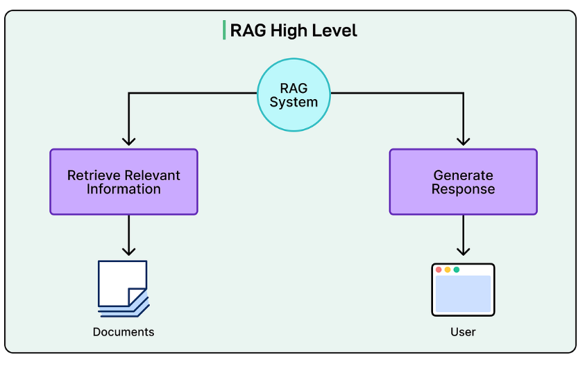
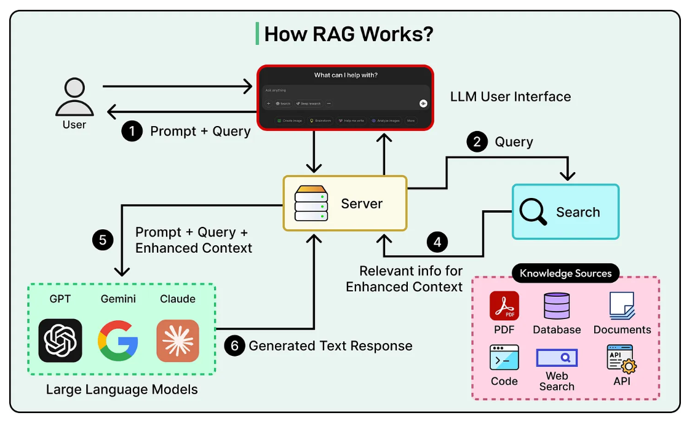
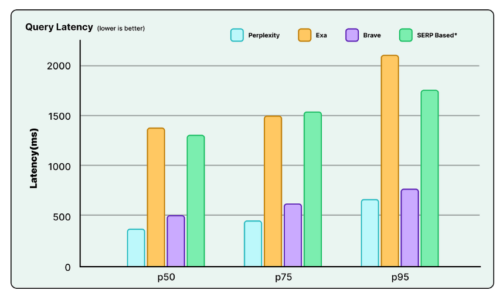
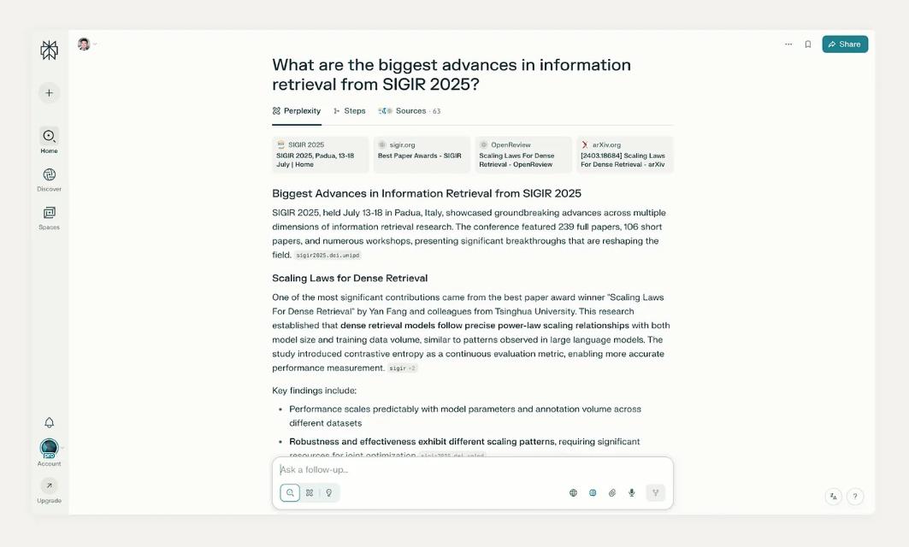
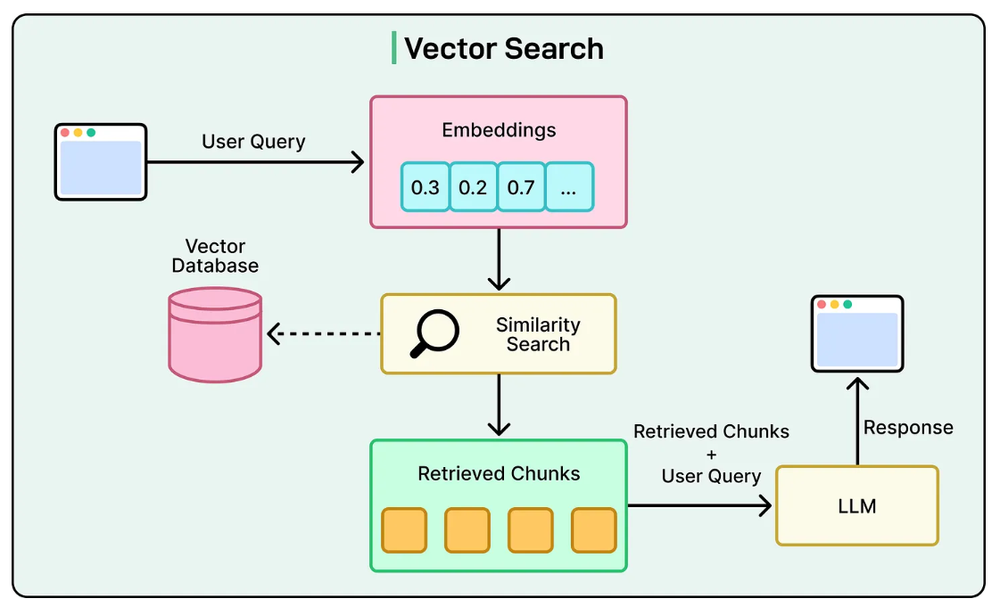
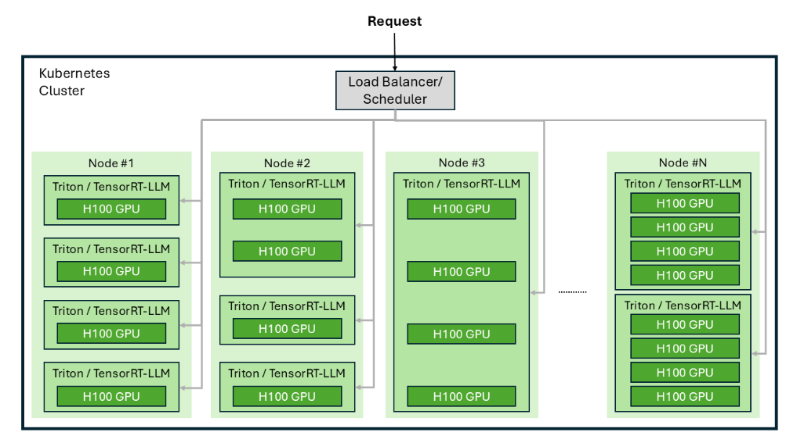

# **Perplexity 如何构建 AI 版 Google**

**Warp：我们可以信赖的编码伙伴**

很多时候，AI 代理编写的代码几乎可以工作，但却让开发人员==陷入调试==而不是发布。Warp 改变了这一点。

使用 Warp，我们可以获得：

- **排名第一的编码代理**：在基准测试中名列前茅，==开箱即用==地提供更准确的代码。
- **紧密的反馈循环**：内置的代码审查和编辑功能让开发人员==快速发现==问题、手动编辑或重新提示。
- **使用 Warp 每天节省 1-2 小时**：这一切都归功于 Warp 97% 的差异接受率。

**免责声明**：本文中的详细信息来源于 Perplexity 工程团队、Vespa 工程团队、AWS 和 NVIDIA 在线分享的内容。所有技术细节的功劳归于 Perplexity 工程团队、Vespa 工程团队、NVIDIA 和 AWS。原始文章和来源的链接位于文章末尾的参考部分。

从本质上讲，Perplexity AI 建立在一个简单但强大的理念之上：将在线搜索从几个蓝色链接的列表==转变为直接的"答案引擎"==。

> 目标是创建一个工具，可以为我们阅读网页，提取最重要的信息，并给我们一个单一、清晰的答案。

可以把它想象成传统搜索引擎和智能 AI 聊天机器人的结合

当我们提出问题时，Perplexity 首先搜索实时互联网以获取最新和最相关的信息。然后，它使用强大的 AI 来阅读和综合它找到的内容，形成一个直接的摘要。这种方法与仅依赖训练数据的 AI 模型非常不同，因为那些数据可能已经过时几个月甚至几年。

这种设计直接解决了 AI 聊天机器人面临的两个最大挑战：

- 无法访问当前事件。
- 倾向于"幻觉"或编造事实。

通过`将每个答案建立在真实、可验证的网页基础上`，并为其来源提供引用，Perplexity 旨在成为更值得信赖和可靠的信息来源。

有趣的是，该公司并不是从这个宏大的愿景开始的。他们最初的项目是一个更技术性的工具，用于`将普通英语翻译成数据库查询`。

然而，2022 年底 ChatGPT 的推出是一个转折点。团队注意到 ChatGPT 的主要批评之一是缺乏来源。他们意识到自己的内部原型已经解决了这个问题。在一个果断的举动中，他们放弃了在原始项目上进行的四个月工作，全力==专注于为网络构建真正的答案引擎的挑战==。这一决定塑造了公司的整个技术方向。

### **Perplexity 的 RAG 管道**

Perplexity 服务的支柱是精心实施的检索增强生成（RAG）管道。以下是 RAG 的高层次概览

在 Perplexity 的 RAG 背后是一个多步骤过程，几乎每个查询都会执行该过程，以确保生成的答案既相关又基于当前信息的事实。

该管道可以分解为五个不同的阶段：

- **查询意图解析**：当用户提交查询时，过程就开始了。系统首先使用 LLM（可能是 Perplexity 自己的微调模型之一，或者是 GPT-4 等第三方模型）来解析用户的意图，而不是依赖简单的关键词匹配。这个初始步骤超越了词汇层面，实现了对用户真正询问内容的更深层次的语义理解，解释上下文、细微差别和查询的潜在目标。

- **实时网络检索**：一旦理解了用户的意图，解析后的查询就会被发送到一个强大的实时搜索索引。这个检索系统会搜索网络，寻找一组可能包含答案的相关页面和文档。这种实时检索是过程中不可妥协的步骤，确保用于答案生成的信息始终尽可能新鲜和最新。

- **片段提取和上下文化**：系统不会将检索到的网页的完整文本传递给生成模型。相反，它利用算法从这些来源中提取最相关的片段、段落或文本块。这些简洁的片段直接与用户的查询相关，然后被聚合以形成将提供给 LLM 的"上下文"。

- **带引用的综合答案生成**：然后，精选的上下文被传递给选定的生成式 LLM。模型的任务是仅基于提供的上下文中包含的信息生成自然语言、对话式响应。这是架构的严格和定义性原则："我们不应该说任何我们没有检索到的内容"。为了执行这一原则并提供透明度，一个关键功能是在生成的文本中附加内联引用。这些引用链接回源文档，允许用户验证每条信息，并在选择时深入研究源材料。

- **对话式优化**：Perplexity 系统是为对话而设计的，而不是单次查询。它维护正在进行的对话的上下文，允许用户提出后续问题。当提出后续问题时，系统通过结合现有的对话上下文和新的迭代网络搜索来优化其答案。

下图显示了 RAG 原理上的一般工作方式：

### **编排层**

Perplexity 的核心技术能力不是开发单一、优越的 LLM，而是将各种 LLM 与高性能搜索系统相结合的编排，以提供快速、准确和成本效益高的答案

这是一个复杂的挑战，需要平衡 LLM 的高计算成本与实时搜索产品的低延迟需求。

为了解决这个问题，该架构被明确设计为模型无关的。

它利用异构模型组合，包括来自"Sonar"系列的内部微调模型和来自 OpenAI（GPT 系列）和 Anthropic（Claude 系列）等领先实验室的第三方前沿模型。

这种灵活性由智能路由系统管理。该系统使用小型、高效的分类器模型首先确定用户的意图和查询的复杂性。基于此分类，请求然后被路由到最适合和最具成本效益的模型来完成特定任务。例如，对定义的简单请求可能由小型、快速的内部模型处理，而需要多步推理或代理行为的复杂查询将被路由到更强大和更昂贵的模型，如 GPT-5 或 Claude Opus。

这种动态决策过程，遵循"使用能够提供最佳用户体验的最小模型"的原则，是大规模管理性能和成本的关键架构策略。

这种模型无关的设计不仅仅是技术优化，还是一个关键的战略防御。在一个底层大型语言模型快速发展并面临商品化风险的行业中，完全建立在单一第三方 API 上的简单架构会产生重大业务风险，包括供应商锁定、不可预测的价格变化以及对另一家公司路线图的依赖。

Perplexity 架构有意缓解这些风险。目标是创建一个可以利用不同模型（如开源和闭源）并让它们共生工作的系统，以至于最终用户不需要知道或关心正在使用哪个特定模型。

这种架构选择表明了一个明确的信念：公司的"护城河"不是任何单一的 LLM，而是管理与这些模型交互以为最终用户提供最佳结果的专有编排系统。

### **检索引擎**

Perplexity 的 RAG 管道的"检索"组件是整个系统准确性和相关性的基础。检索信息的质量直接决定了最终生成答案的质量。

Perplexity 使用 Vespa AI 来支持其庞大且可扩展的 RAG 架构。选择 Vespa 是因为需要一个能够提供实时、大规模 RAG 的平台，具有面向消费者的应用程序所需的高性能、低延迟和可靠性，该应用程序为数百万用户提供服务。

以下是 Perplexity 能够实现的查询延迟的比较图表：

来源：Perplexity 研究博客

Vespa 的一个关键优势是其统一性。它将多种关键搜索技术集成到一个单一、连贯的引擎中，包括用于语义理解的向量搜索、用于精确性的词汇搜索、结构化过滤和机器学习排名。这种集成方法消除了尝试将多个不同系统（如独立的向量数据库与单独的关键词搜索引擎如 Elasticsearch）拼接在一起所产生的大量工程开销和复杂性。

选择在 Vespa 上构建的决定也是由于需要专注于有限的工程资源。从头开始构建网络规模的实时搜索引擎是一项极其困难和资本密集的工作，这是 Google 和 Yahoo（Vespa 的起源地）等公司已经投入数十年和数十亿美元来解决的问题。

Perplexity 的核心使命不是重新发明搜索索引，而是在搜索基础之上构建新颖的答案引擎。通过战略性地将分布式、实时搜索这一成熟且基本"已解决"的问题外包给像 Vespa 这样的专业平台，Perplexity 相对较小的约 38 人的工程团队能够将其精力集中在其技术堆栈的独特和差异化部分，包括以下内容：

- RAG 编排逻辑。
- 其专有 Sonar 模型的微调。
- 其内部 ROSE 推理引擎的超优化。

这是在最高架构级别执行的经典"构建与购买"决策。

### **索引和检索基础设施**

建立在 Vespa 上的基础设施旨在处理 AI 驱动的答案引擎的独特需求，优先考虑规模、新鲜度和对内容的深入理解。

以下是其关键方面：

#### **1 - 网络规模索引**

该系统在一个涵盖数千亿网页的庞大索引上运行。

Perplexity 的爬取和索引基础设施跟踪超过 2000 亿个唯一 URL，由数万个 CPU 和一个多层存储系统支持，仅热存储就超过 400 PB。

Vespa 的分布式架构是管理这种规模的基础。它自动、透明和动态地在许多节点的集群中分区和分发内容。至关重要的是，它将给定数据的所有信息、索引和计算逻辑共同定位在同一节点上，这有效地分配了查询负载，并避免了可能使大规模系统瘫痪的网络带宽瓶颈。

#### **2 - 实时新鲜度**

对于答案引擎来说，信息陈旧是一个关键的失败模式。系统必须反映世界的现状，就在此刻。

Perplexity 的基础设施专为此而设计，每秒处理数万个索引更新请求，以确保索引提供最新鲜的可用结果。

这是由 Vespa 独特的索引技术实现的，该技术能够在实时廉价且高效地改变索引结构，即使在它们被主动读取以服务查询时也是如此。它允许持续的更新流而不会降低查询性能。

为了管理这个过程，训练了一个 ML 模型来预测候选 URL 是否需要被索引，并在最有用的时间安排索引操作，根据 URL 的重要性和可能的更新频率进行校准。

#### **3 - 细粒度内容理解**

系统对内容的理解远远超出文档级别。

Perplexity 的索引基础设施将文档划分为"细粒度单元"或"块"。Vespa 的分层排名能力允许它根据这些单独块与查询的相关性对它们进行评分，而不是返回长文章的整个内容。

这意味着系统可以识别并仅返回最相关文档中最相关的段落或句子，为 LLM 处理提供更集中和高效的上下文。

以下是显示 Perplexity 通常如何呈现其搜索结果的屏幕截图：

来源：Perplexity 研究博客

#### **4 - 自我改进和 AI 驱动的内容解析**

为了应对开放网络的非结构化和经常不一致的性质，Perplexity 的索引操作利用 AI 驱动的内容理解模块。

该模块动态生成并调整解析规则集，以从不同网站提取语义上有意义的内容。

该模块不是静态的。它通过迭代的 AI 自我改进过程优化自身。在这个循环中，前沿 LLM 评估当前规则集在完整性和质量维度上的性能。然后，系统使用这些评估来制定、验证和部署建议的更改以解决错误类别，确保模块持续演进。这个过程对于将文档分割成独立的、原子的上下文单元至关重要，这些单元对 LLM 来说是理想的。

#### **5 - 混合搜索和排名能力**

Perplexity 答案的高质量从根本上受到其检索信息质量的限制。因此，其排名算法充当整个 RAG 管道的关键质量守门人。

Perplexity 利用 Vespa 的高级功能实现多阶段架构，在严格的延迟预算下逐步优化结果。以下是关键方面：

- **密集检索（向量搜索）**：这种技术允许系统超越关键词，在语义或概念层面匹配内容。它使用向量嵌入来理解用户查询背后的含义，并找到上下文相似的文档，即使它们不共享相同的词语。

- **稀疏检索（词汇搜索）**：虽然向量搜索在捕获广泛含义方面表现出色，但它可能缺乏精确性。稀疏检索包括传统的基于关键词的技术和排名函数（如 BM25），提供了这种必要的精确性。它允许系统对罕见术语、产品名称、内部公司名称和其他特定标识符进行精确匹配，在这些情况下语义歧义是不可取的。

- **机器学习排名**：系统的真正力量在于其结合这些不同信号的能力。Vespa 使 Perplexity 能够实现高级的多阶段排名模型。在这个过程中，可能使用词汇和向量搜索的组合检索初始候选文档集。然后，更复杂的机器学习模型评估这些候选文档，使用丰富的特征集（如词汇相关性分数、向量相似性、文档权威性、新鲜度、用户参与信号和其他元数据）来产生最终的、高度准确的排名。

下图显示了向量搜索在 RAG 系统上下文中的典型工作方式：

排名堆栈与 Perplexity 的面向用户的产品共同设计，使其能够利用来自数百万日常用户请求的丰富、自动化信号来持续丰富其训练数据。

### **生成引擎**

在 Perplexity 在网络上找到最佳信息后，下一步是将其转化为清晰、易读的答案。

这由"生成引擎"处理，它是编写响应的 AI 大脑。为此，Perplexity 使用了一个巧妙的两部分策略：它将自己的定制 AI 模型与来自其他领先技术实验室的最强大模型的选择相结合。这种混合方法使公司能够完美平衡成本、速度和对最先进 AI 能力的访问。

- 这一策略的第一部分是 Perplexity 自己的 AI 模型系列，称为 Sonar。这些模型不是完全从头开始构建的，那将是非常昂贵和耗时的。
- 相反，Perplexity ==从强大的、公开可用的开源模型开始。然后他们针对自己的特定需求对它们进行"微调"==。

Perplexity 在自己的大量数据集合上训练这些基础模型，教它们成为出色答案引擎所需的特殊技能。这些技能包括准确总结信息的能力、正确添加来源引用以及严格遵守在网络搜索期间发现的事实。每次用户与服务交互时，Perplexity 都会收集更多数据，帮助它持续改进其 Sonar 模型，使它们更智能、更有帮助。

该策略的第二部分涉及整合来自更广泛 AI 世界的"最佳中的最佳"。对于付费订阅者，Perplexity 提供对可用的最先进模型的精选访问，例如 OpenAI 的 GPT 系列和 Anthropic 的 Claude 模型。这为用户提供了使用绝对最强大的 AI 来完成需要深度推理、创造力或复杂问题解决的任务的选项。

为了使这一切顺利运行，Perplexity 使用一个名为 Amazon Bedrock 的服务，它就像一个通用适配器，允许他们轻松地将这些不同的第三方模型插入他们的系统，而无需为每个模型构建单独的自定义集成。

这种"两全其美"的方法是 Perplexity 商业模式的关键。

### **Perplexity 的推理堆栈**

拥有强大的 AI 模型是一回事，但向数百万人提供快速且负担得起的答案是一个巨大的技术挑战。

运行 AI 模型非常昂贵，因此 Perplexity 构建了一个复杂的高性能系统来高效地完成它。这个系统，被称为"==推理堆栈=="，是使整个服务成为可能的引擎。

该系统的核心是一个名为 ROSE 的定制引擎。Perplexity 创建 ROSE 是为了做好两件事。

- 首先，它需要==灵活==，允许工程团队快速测试和采用最新发布的 AI 模型。

- 其次，它需要成为==极端优化==的平台，从模型中挤出每一点性能，使它们运行得更快、更便宜。

ROSE 主要用 Python 构建，并利用 PyTorch 进行模型定义。这种选择提供了适应新的和各种模型架构所需的灵活性和易于开发性。

- 然而，对于性能绝对关键的组件，例如`服务逻辑`和`批处理调度算法`，团队正在将代码库迁移到 Rust。此举利用了 Rust 与 C++ 相当的性能，以及其强大的内存安全保证，使其成为高性能、可靠系统代码的理想选择。

该引擎围绕一个核心 LLM 引擎构建，该引擎可以加载模型权重并生成解码的 token。它支持高级解码策略，包括推测解码和 MTP（多 token 预测）解码器，这可以改善延迟。

整个操作在 Amazon Web Services（AWS）云平台上运行，使用最先进的 NVIDIA H100 GPU 集群。这些 GPU 本质上是专门为 AI 用例设计的超强大计算机芯片。为了管理这个强大硬件的集群，Perplexity 使用像 Kubernetes 这样的行业标准工具来编排所有移动部件，并确保系统平稳运行并能够处理大量流量。

请参见下图，显示 Perplexity 如何==使用 NVIDIA 大规模部署 LLM 生产==

来源：[NVIDIA 技术博客](https://developer.nvidia.com/blog/spotlight-perplexity-ai-serves-400-million-search-queries-a-month-using-nvidia-inference-stack/)

决定在内部构建这个复杂系统而不是简单地付费使用其他 AI 模型有巨大的回报。通过控制整个堆栈，从软件引擎到硬件，Perplexity 可以针对其特定需求优化一切。这种控制直接导致用户响应时间更快，业务成本更低。

## **结论**

Perplexity AI 的技术架构揭示了其作为"AI 版 Google"的力量并非源于单一、神奇的大型语言模型。

相反，它的成功是工程化一个完整的端到端系统的结果，其中每个组件都经过精心选择和深度优化，以与其他组件协同工作。

- 首先是世界级的检索引擎，建立在 Vespa.ai 的可扩展和实时基础之上。该系统提供高质量、新鲜和相关的信息，作为每个答案的事实基石。它还有一个复杂的混合排名算法充当关键守门人。

- 其次是灵活的、模型无关的编排层。这个核心逻辑智能地解析用户意图，并将查询路由到最合适的生成模型，无论是针对特定任务微调的成本效益高的内部 Sonar 模型，还是来自第三方实验室的最先进的前沿模型。这一层提供了在快速发展的 AI 领域竞争所需的经济和战略灵活性。

- 第三是超优化的内部推理堆栈，以 ROSE 引擎为中心。这个定制系统在 AWS 云中的最先进 NVIDIA 硬件上运行，从它服务的模型中提取每一滴性能和成本效率。

**参考资料：**

- 架构和评估 AI 优先搜索 API
- Perplexity 如何使用 Vespa AI 在 AI 搜索上击败 Google
- 聚焦：Perplexity AI 使用 NVIDIA 推理堆栈每月服务 4 亿次搜索查询
- 深度阅读：Perplexity CTO Denis Yarats 谈 AI 驱动的搜索
- Perplexity 使用 Amazon Bedrock 中的 Anthropic Claude 3 构建高级搜索引擎

