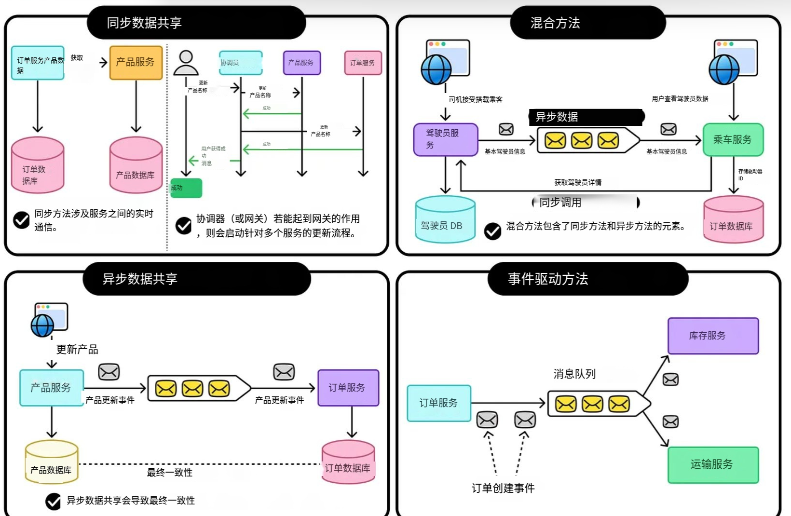

# 服务间数据共享的策略

前文回顾：

- API 网关 101：现代 API 管理与安全的核心
- 构建可扩展系统的微服务架构指南
- 域名系统：互联网的电话簿
- 服务发现 101：分布式系统的电话簿
- GraphQL 101：超越 REST 的 API 方法

现代软件系统变得越来越复杂，许多组织已经从构建大型单体应用程序转向使用服务。

这种转变带来了多项好处，例如更快的开发速度、更容易的部署和更好的可扩展性。

> 然而，它也带来了新的挑战，特别是在服务如何处理和共享数据方面。

在单体系统中，所有组件共享同一个数据库。

应用程序的任何部分都可以从公共源读取或更新数据。这使得协调变得简单，但也在`系统的不同部分之间创建了紧密耦合`。

一个区域的小改动可能会影响整个应用程序。

相比之下，面向服务的架构==将系统划分为更小的独立服务。每个服务负责特定的业务功能，并应管理自己的数据==。

- 这一原则通常被称为服务数据所有权。它确保服务可以独立开发、测试和部署，而不依赖于其他服务的内部工作方式。

然而，尽管服务拥有自己的数据，它们仍然需要==相互交换信息==。例如，订单服务可能需要来自客户服务的客户详细信息，或者支付服务可能需要来自订单服务的交易信息。服务之间共享数据对于系统作为整体运行变得至关重要。

因此，主要挑战是如何在==不失去微服务旨在实现的独立性的情况下共享数据==。

- 多个服务应该连接到同一个数据库吗？

- 还是它们应该通过 API 或消息进行通信？

- 我们如何在保持服务松散耦合的同时确保一致性、性能和容错性？

在本文中，我们探讨这些问题。我们研究共享数据源和共享数据之间的区别，并检查用于在服务之间共享数据的主要策略。

**数据所有权和隔离**