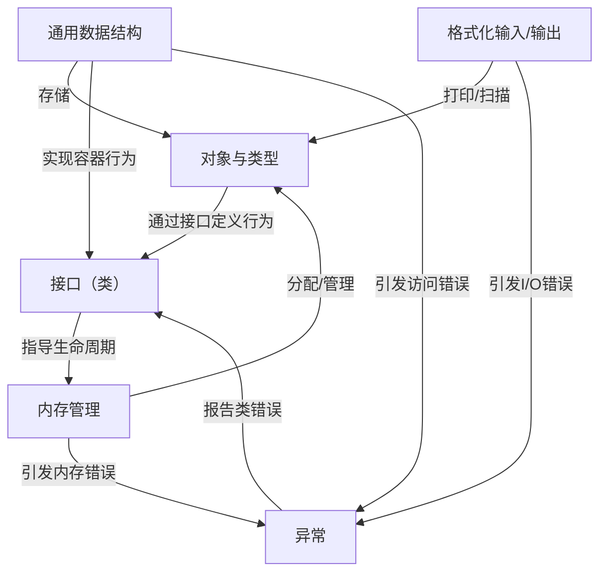

链接：[Cello • Cello World](https://libcello.org/learn/cello-world)

# docs：Cello

Cello 是一个 C 语言库，为 C 语言提供了**高级编程**能力

- 引入了 `var` 作为*多态对象*的通用指针，其 `Types` 通过灵活的*接口（类）*定义行为。

- Cello 通过可选的垃圾回收机制处理**内存管理**，提供了一套用于集合的**通用数据结构**，实现了结构化的**异常处理**以增强错误管理能力，并通过特殊的格式说明符简化了**格式化输入/输出**。

## 可视化



## 章节

1. [对象与类型
](01_objects_and_types_.md)
2. [接口（类）
](02_interfaces__classes__.md)
3. [通用数据结构
](03_generic_data_structures_.md)
4. [格式化输入/输出
](04_formatted_input_output_.md)
5. [异常
](05_exceptions_.md)
6. [内存管理
](06_memory_management_.md)

---

# Cello：为C语言带来高级编程特性的库

Cello是一个为C语言提供高级编程功能的运行时库系统。

通过作为现代化、强大的运行时系统，Cello使得许多在传统C语言中难以实现或实现起来很笨拙的功能变得简单易用，例如：

- 泛型数据结构
- 多态函数
- 接口/类型类
- 构造/析构函数
- 可选垃圾回收
- 异常处理
- 反射机制

由于Cello可以与标准C无缝协作，还能获得其他优势，包括出色的性能、强大的工具链支持以及丰富的库资源~

#### 🎢栈和堆

> 为什么需要栈对象和堆对象?

- ===栈对象生命周期短且自动管理(`临时`),堆对象生命周期长且手动控制(`全局`)==

- **——栈快速但受限,堆灵活但需管理。**

---

## 对比

| 特性         | 栈对象 `$(Int, 5)`       | 堆对象 `new(Array, ...)`   |
| ------------ | ------------------------ | -------------------------- |
| **生命周期** | ==函数结束自动销毁==     | 需==手动==释放或GC回收     |
| **分配速度** | 极快(==指针==移动)       | 较慢(需查==找空闲==块)     |
| **大小限制** | 受限(通常几MB)           | 仅受内存总量限制           |
| **作用域**   | ==局部变量==             | 可跨函数传递               |
| **典型用途** | ==临时==计数器、循环变量 | 动态数组、==复杂数据结构== |

code:

```c
var i0 = $(Int, 5);        // 栈: 临时整数,main结束即销毁
var items = new(Array...); // 堆: 数组需在多处使用,由GC管理
```

**设计原则**: 
- 小而短命的用**栈**(如例子中的3个整数)
- 大而长命的用**堆**(如需要在循环中遍历的数组容器)

理解：

- **栈** = 便签纸:写完即扔,速度快但空间小
- **堆** = 文件柜:需要登记管理,但能存大量持久数据

------

## 示例代码

```c
#include "Cello.h"

int main(int argc, char** argv) {
  
  /* 使用"$"创建栈对象 */
  var i0 = $(Int, 5);
  var i1 = $(Int, 3);
  var i2 = $(Int, 4);

  /* 使用"new"创建堆对象 */
  var items = new(Array, Int, i0, i1, i2);
  
  /* 可遍历集合 */
  foreach (item in items) {
    print("对象 %$ 的类型是 %$\n",
      item, type_of(item));
  }
  
  /* 堆对象通过垃圾回收机制销毁 */
  return 0;
}
```

```c
#include "Cello.h"

int main(int argc, char** argv) {
  
  /* 基本类型可使用简写$ */
  var prices = new(Table, String, Int);
  set(prices, $S("Apple"),  $I(12)); 
  set(prices, $S("Banana"), $I(6)); 
  set(prices, $S("Pear"),   $I(55)); 

  /* 表也支持迭代 */
  foreach (key in prices) {
    var val = get(prices, key);
    print("%$ 的价格是 %$\n", key, val);
  }
  
  return 0;
}
```

## 学习资源

入门资料：
- 安装指南
- Cello世界
- 快速入门
- 常见问题/陷阱

关于其实现原理的文章：
- Cello 2.0的重大改进
-  [A Fat Pointer Library](http://libcello.org/learn/a-fat-pointer-library) 
- [Cello vs C++ vs ObjC](http://libcello.org/learn/cello-vs-cpp-vs-objc)
- 性能基准测试
- 垃圾回收机制

## 更多示例

```c
#include "Cello.h"

int main(int argc, char** argv) {

  var items = new(Array, Int, 
    $I(8), $I(5), $I(20), 
    $I(15), $I(16), $I(98));

  /* 使用"range"遍历索引 */
  foreach (i in range($I(len(items)))) {
    print("范围项 %i 的值是 %i\n", i, get(items, i));
  }

  /* 使用"slice"每隔一项遍历 */ 
  foreach (item in slice(items, _, _, $I(2))) {
    print("切片项 %i\n", item);
  }
  
  return 0;
}
```

```c
#include "Cello.h"

/* 定义普通C结构体 */
struct Point {
  float x, y;
};

/* 使其兼容Cello */
var Point = Cello(Point);

int main(int argc, char** argv) {
  
  /* 在栈或堆上创建 */
  var p0 = $(Point, 0.0, 1.0);
  var p1 = new(Point, $(Point, 0.0, 2.0));
  
  /* 可展示、比较、哈希等...
  **
  ** p0: <'Point' 位于 0x000000000022FC58>
  ** p1: <'Point' 位于 0x00000000004C7CC8>
  ** 比较结果: 1
  ** 哈希值: 2849275892l
  */ 
  print("p0: %$\np1: %$\n比较: %i\n哈希: %ul\n",
    p0, p1, $I(cmp(p0, p1)), $I(hash(p0)));
  
  /* 超出作用域后由GC回收 */
  return 0;
}
```

## 常见问题

**为什么创建这个项目？**

- Cello最初是一个有趣的实验，旨在探索C语言的极限可能性。它不仅是一个强大的工具库，对于那些想探索C语言可能性的人来说也很有参考价值。

**它的工作原理是什么？**

- 建议阅读《 [A Fat Pointer Library](http://libcello.org/learn/a-fat-pointer-library) 》了解Cello的基本原理。也可以查看源代码（可读性非常不错ovo），或者通过邮件向我提问。

**能用于生产环境吗？**

- 建议先在业余项目中试用。虽然Cello力求达到生产级质量，但由于其实现方式的特殊性，存在一些特性和陷阱。如果是团队项目或有严格期限，C++等语言有更成熟的工具链和社区支持。

**有人在使用Cello吗？**

- 虽然有人进行过实验，但目前没有知名项目采用。`对于追求可移植性和易维护性的新C项目来说，Cello作为依赖项可能过于复杂`

**我能参与贡献吗？**
当然欢迎~如果您有任何Cello相关成果，欢迎通过contact@theorangeduck.com联系我，或者在GitHub仓库参与开发。贡献非常欢迎~
