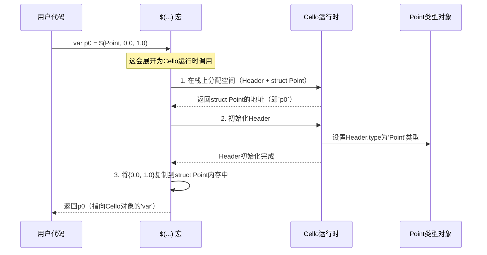

# 第1章：对象与类型

欢迎来到Cello

本章将介绍Cello最核心的基础概念：**对象**和**类型**。理解这些构建模块是解锁Cello在C语言中实现高级功能的关键。

想象你正在处理基本的C语言数据，比如数字（`int`、`float`）或自定义结构体（`struct Point { float x, y; };`）。在标准C中，这些都只是原始数据块。你无法轻松地在运行时询问一个`int`它的"类型"是什么，也无法让一个通用函数打印*任何*类型的数据而不需要大量手动的`if-else`或`switch`语句。Cello改变了这一切。

本质上，Cello将普通的C数据转化为称为**Cello对象**的"智能"实体。这些对象携带了关于它们是什么以及能做什么的信息。

让我们通过一个简单示例深入了解：如何让你的C `struct`表现得像一个一流的Cello对象。

## 通用指针：`var`

在Cello中，你会频繁遇到`var`。可以将`var`视为Cello的通用指针。它类似于C的`void*`，因为它可以指向*任何*类型的数据。然而，`var`更加智能！每个由`var`引用的数据都带有隐藏的"元数据"，告诉Cello它是什么类型的对象。这种秘密机制使得Cello能够实现所有高级功能。

在Cello中，`var`被定义为简单的`void*`：

```c
// 来自include/Cello.h
typedef void* var;
```

虽然`var`本身是`void*`，但Cello运行时确保你获取的任何`var`*总是*指向一个有效的Cello对象，并附带其类型信息。

## Cello对象及其蓝图（`Type`）

每个`var`都指向一个**Cello对象**。是什么让某个东西成为Cello对象？本质上，它是你的C数据包裹在一个称为`Header`的小而关键的信息块中。这个`Header`包含一个指向对象**`Type`**的指针。

在Cello中，`Type`就像蓝图或类定义。它保存了关于特定类型Cello对象的所有元数据：

*   **名称**：例如"Int"、"Float"或"Point"。
*   **大小**：该类型对象占用的内存量。
*   **行为（接口）**：该类型对象支持的操作或函数（例如如何打印自己、如何与其他对象比较、如何复制自己）。我们将在下一章[接口（类）](02_interfaces__classes__.md)中探讨这些行为。

## 将你的C `struct`转化为Cello `Type`

让我们用`Point`示例来看看如何将普通的C `struct`转化为Cello `Type`。

首先，像往常一样定义你的C `struct`：

```c
#include "Cello.h"

// 定义一个普通的C结构体
struct Point {
  float x, y;
};
```

这个`struct Point`只是普通的C数据。要让它成为Cello `Type`，你需要使用`Cello()`宏：

```c
#include "Cello.h"

struct Point {
  float x, y;
};

// 使其兼容Cello
var Point = Cello(Point);
```

**说明：**
`var Point = Cello(Point);`这行代码在幕后做了大量工作：
1.  它定义了一个全局变量`Point`，类型为`var`。这个`Point`变量*就是*你的`struct Point`的Cello `Type`对象。
2.  它告诉Cello为`struct Point`创建一个蓝图（`Type`）。这个蓝图自动包含名称"Point"及其内存大小`sizeof(struct Point)`。
3.  它准备这个`Type`来保存关于`Point`可能实现的任何[接口（类）](02_interfaces__classes__.md)的信息（例如如何打印自己）。

现在，你可以使用Cello的特殊语法创建`Point`类型的实例（对象）：`$(Type, ...)`用于栈分配，或`new(Type, ...)`用于堆分配。

```c
#include "Cello.h"

struct Point { float x, y; };
var Point = Cello(Point); // 我们的Cello类型

int main(int argc, char** argv) {
  // 在栈上创建一个Point对象
  var p0 = $(Point, 0.0, 1.0);

  // 在堆上创建另一个Point对象
  var p1 = new(Point, $(Point, 0.0, 2.0));

  // 查看它们的类型和值！
  print("p0的类型: %$\n", type_of(p0));
  print("p0: %$\n", p0);
  print("p1的类型: %$\n", type_of(p1));
  print("p1: %$\n", p1);

  return 0;
}
```

**可能的输出：**
```
p0的类型: Point
p0: <'Point' 位于 0x... (某个内存地址)>
p1的类型: Point
p1: <'Point' 位于 0x... (某个内存地址)>
```

**说明：**
*   `$(Point, 0.0, 1.0)`在程序栈上创建了一个类型为`Point`的Cello对象，初始化为`x=0.0`和`y=1.0`。`var` `p0`现在指向这个Cello对象。
*   `new(Point, $(Point, 0.0, 2.0))`做了同样的事情，但在堆上分配。`p1`指向它。
*   `type_of(p0)`是一个Cello函数，检查`p0`并返回其`Type`对象（即我们的`var Point`）。
*   `print("p0的类型: %$\n", type_of(p0));`使用了Cello的通用`print`函数。`%`占位符告诉`print`使用`Type`对象自己的指令来将其表示为字符串。
*   `print("p0: %$\n", p0);`类似地询问`Point`类型如何打印其对象。默认情况下，它会打印名称和内存地址。稍后，你可以自定义这一点！

这展示了其强大之处：`print`不需要*具体*知道`Point`结构体。它只是询问`Type`蓝图如何完成工作。

## 幕后：Cello对象的结构

让我们深入了解一下`var`和`Type`如何协同工作。

### `Header`

每个Cello对象都有一个小的`Header`结构，位于你的实际C数据*之前*的内存中。这个`Header`至关重要，因为它包含指向对象`Type`的指针。

```c
// 来自include/Cello.h

struct Header {
  var type; // 指向对象的Type
  // ... 其他Cello内部标志 ...
};
```

当你有一个`var self`（即指向你的数据的`void*`）时，Cello可以通过查看`self`*之前*的内存来找到其`Header`。

### 创建Cello对象

当你使用`$(Point, 0.0, 1.0)`时，以下是简化的事件序列：



### `Type`结构

你通过`Cello(Point)`定义的`var Point`本身是一个`var`，指向一个`struct Type`对象。这个`struct Type`存储了我们讨论的蓝图信息：

```c
// 来自include/Cello.h

struct Type {
  var cls;  // 用于接口的内部使用
  var name; // 类型的名称（例如"Point"、"Int"）
  var inst; // 用于接口的内部使用
};
```

当Cello需要知道对象类型的名称时，它会查看`object->header->type->name`。

### `type_of()`的工作原理

`type_of()`函数简单而优雅：

```c
// 来自src/Type.c（简化版）
var type_of(var self) {
  // 1. 计算Header的地址（在'self'之前）
  struct Header* head = (struct Header*)((char*)self - sizeof(struct Header));

  // 2. 从Header返回'type'字段
  return head->type;
}
```

这意味着任何Cello对象都固有地知道自己的`Type`，因为`Header`始终存在并直接指向`Type`对象。

## 总结

在本章中，你学到了：

*   `var`是Cello的通用、类型感知指针。
*   每个`var`指向一个**Cello对象**，这是你的C数据加上一个`Header`。
*   `Header`包含一个指向对象**`Type`**的指针。
*   `Type`就像蓝图，保存了关于对象的元数据，包括其名称、大小和支持的行为。
*   你使用`Cello()`宏将标准的C `struct`转化为Cello `Type`。
*   像`type_of()`这样的函数可以检查`var`以在运行时发现其`Type`。

这种对象和类型的基础是Cello为C语言带来高级、多态编程能力的关键。但我们如何实际*定义*`Type`支持的"行为"呢？这就是[接口（类）](02_interfaces__classes__.md)的用武之地。

[下一章：接口（类）](02_interfaces__classes__.md)

