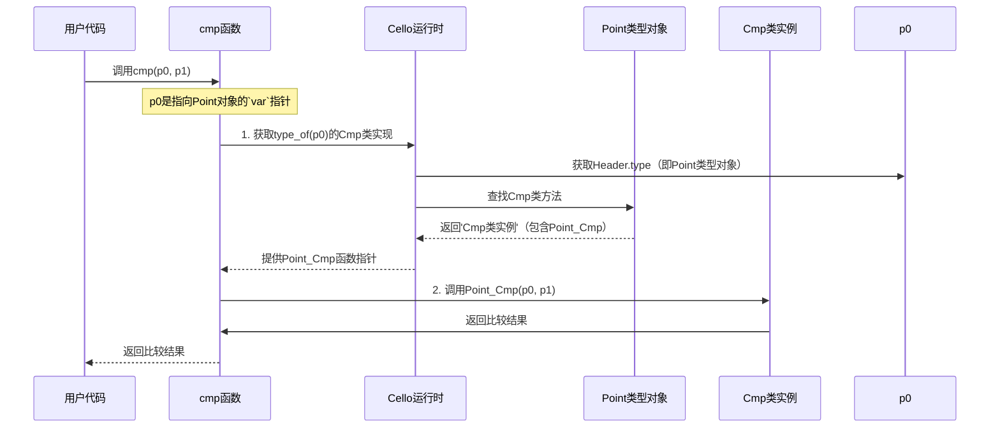

# 第2章：接口（类）

欢迎回到Cello

在[第1章：对象与类型](01_objects_and_types_.md)中，我们学习了`var`作为Cello的通用指针，以及每个`var`如何指向一个携带自身**`Type`**蓝图的**Cello对象**。我们甚至将自定义的`struct Point`转化为了Cello的`Type`。

但这些Cello对象能*做什么*呢？目前，我们的`Point`对象可以被创建并识别类型，但我们无法轻松执行常见操作，比如比较两个`Point`或用自定义格式打印`Point`。如果你在上章尝试过`print("p0: %$\n", p0);`，得到的默认输出会是`<'Point' At 0x... (某个内存地址)>`，这并不直观！

本章将介绍**接口（类）**，这是Cello定义共享行为的优雅解决方案，不同`Type`可以实现这些行为。这是Cello在C语言中实现强大泛型编程的核心机制。

## 什么是Cello的"类"（接口）？

想象你在制定一份合同。这份合同不规定*如何*履行，而是定义*必须支持*哪些行为。例如，"可打印"合同可能要求："你必须能以文本形式描述自己"；"可比较"合同可能要求："你必须能判断自己是否小于、等于或大于另一个对象"。

在Cello中，这些"合同"被称为**类**（有时也称为"类型类"或"接口"）。一个Cello `Class`定义了一组函数（方法），任何`Type`都可以选择实现这些函数。

以下是Cello内置的一些类示例：

*   **`New`**：描述对象的构造和析构方式。
*   **`Cmp`**：定义对象的比较方式（`cmp`用于小于/等于/大于判断）。
*   **`Show`**：定义对象如何以字符串形式表示（`print`函数使用此功能）。
*   **`Len`**：描述如何获取对象的长度（如数组的`len`）。

当一个`Type`实现了一个`Class`，意味着该`Type`提供了执行该`Class`定义行为的具体方式。这是**多态性**的关键——能够以统一方式处理不同类型的对象。只要对象的`Type`实现了`Cmp`类，你就可以调用`cmp(obj1, obj2)`，而无需关心`obj1`和`obj2`是`Int`、`Float`还是自定义的`Point`。

让我们通过让`Point`类型支持比较和打印功能，使其更加实用。

## 通过`Cmp`类实现`Point`的可比较性

在第1章的`README.md`示例中，`print("cmp: %i\n", $I(cmp(p0, p1)));`输出了`cmp: 1`。Cello是如何知道如何比较两个`Point`对象的？它使用了`Cmp`类！

要让`struct Point`支持比较，我们需要：
1.  定义一个比较两个`Point`结构体的C函数。此函数需遵循`Cmp`类的"合同"。
2.  告诉`Point` `Type`它实现了`Cmp`类，并提供我们的比较函数。

首先，定义`Point`对象的比较函数。`Cmp`类需要一个接收两个`var`参数（我们的对象）并返回`int`的函数：负值表示第一个对象较小，正值表示较大，零表示相等。

```c
#include "Cello.h" // 始终包含Cello.h

struct Point {
  float x, y;
};

// 比较两个Point对象的函数
static int Point_Cmp(var self, var obj) {
  // 将通用`var`指针转换回`struct Point`
  struct Point* p0 = (struct Point*)self;
  struct Point* p1 = (struct Point*)obj;

  // 先比较x坐标
  if (p0->x < p1->x) return -1;
  if (p0->x > p1->x) return 1;

  // 如果x坐标相等，比较y坐标
  if (p0->y < p1->y) return -1;
  if (p0->y > p1->y) return 1;

  // 如果x和y都相等
  return 0;
}
```
**说明：**
*   `Point_Cmp`接收`self`和`obj`，它们是指向Cello对象的通用`var`指针。
*   在函数内部，我们将它们转换回`struct Point*`以访问其`x`和`y`字段。
*   我们首先比较`x`值。如果不同，返回`-1`或`1`。
*   如果`x`值相同，再比较`y`值。
*   如果`x`和`y`都相同，则返回`0`表示相等。

接下来，我们需要告诉Cello，`Point` `Type`实现了`Cmp`类。我们在定义`Point` `Type`时通过`Cello()`宏的`Instance(Cmp, Point_Cmp)`参数实现：

```c
#include "Cello.h"

struct Point { float x, y; };

// 使其兼容Cello并实现Cmp类
var Point = Cello(Point,
  Instance(Cmp, Point_Cmp) // Point现在知道如何比较！
);

// ... (上面的Point_Cmp函数定义) ...

int main(int argc, char** argv) {
  var p0 = $(Point, 0.0, 1.0);
  var p1 = $(Point, 0.0, 2.0);
  var p2 = $(Point, 0.0, 1.0);

  // 现在可以使用Cello的通用`cmp`函数比较它们
  print("p0和p1是否相等: %i\n", $I(eq(p0, p1))); // eq内部使用cmp
  print("p0和p2是否相等: %i\n", $I(eq(p0, p2)));
  print("p0 > p1: %i\n", $I(gt(p0, p1))); // gt也使用cmp
  print("p0 < p1: %i\n", $I(lt(p0, p1)));

  return 0;
}
```

**可能的输出：**
```
p0和p1是否相等: 0
p0和p2是否相等: 1
p0 > p1: 0
p0 < p1: 1
```

**说明：**
*   `Instance(Cmp, Point_Cmp)`告诉Cello："对于`Point`类型，当需要调用`Cmp`类的`cmp`函数时，使用我们的`Point_Cmp`函数。"
*   `eq`、`gt`、`lt`（等于、大于、小于）是Cello的通用函数，内部调用`Cmp`类的`cmp`方法。由于`Point`现在实现了`Cmp`，这些函数可以正确处理`Point`对象！这就是多态性的力量。

## 通过`Show`类实现`Point`的可打印性

默认的`print`输出`<'Point' At 0x...>`并不理想。让我们通过`Show`类让`Point`显示其`x`和`y`坐标。

`Show`类需要一个函数（通常命名为`Type_Show`），接收对象本身（`self`）、输出流（`output`，通常是控制台的`Terminal`）和当前位置（`pos`）以格式化输出。它返回写入后的新位置。

```c
#include "Cello.h"

// ... (struct Point和Point_Cmp的定义) ...

// 显示（打印）Point对象的函数
static int Point_Show(var self, var output, int pos) {
  struct Point* p = (struct Point*)self;
  // 使用print_to写入输出流
  // 用$F()包装浮点数作为Cello对象以支持通用格式化
  pos = print_to(output, pos, "(%F, %F)", $F(p->x), $F(p->y));
  return pos;
}

// 更新Point以同时实现Cmp和Show！
var Point = Cello(Point,
  Instance(Cmp,  Point_Cmp),
  Instance(Show, Point_Show, NULL) // Show还有一个'look'方法，这里简单起见设为NULL
);

int main(int argc, char** argv) {
  var p0 = $(Point, 0.0, 1.0);
  var p1 = $(Point, 0.0, 2.0);

  // 现在，print会使用我们自定义的Point_Show函数！
  print("p0: %$\n", p0);
  print("p1: %$\n", p1);

  return 0;
}
```

**可能的输出：**
```
p0: (0.000000, 1.000000)
p1: (0.000000, 2.000000)
```
**说明：**
*   `Point_Show`将`p->x`和`p->y`格式化为字符串`(%F, %F)`。
*   `print_to`是Cello的低级函数，用于将格式化输出写入`var`流（如`Terminal`）。
*   `Instance(Show, Point_Show, NULL)`告诉Cello，`Point`类型使用`Point_Show`处理`Show`类的主方法。我们将可选的`look`方法设为`NULL`。
*   现在，当你用`print`打印`Point`对象（使用`%`占位符）时，Cello会调用`Point_Show`！

## 幕后机制：多态调用的实现

让我们追踪调用`cmp(p0, p1)`这样的泛型函数时发生了什么。



**过程说明：**

1.  调用`cmp(p0, p1)`时，泛型`cmp`函数（Cello核心库的一部分）将`p0`和`p1`作为`var`指针接收。
2.  它需要找到`Point`对象的*具体*比较函数。为此，它会询问`Cello运行时`："`p0`类型的`Cmp`类实现是什么？"
3.  `Cello运行时`首先通过查看`Header`（如第1章所述）获取`p0`的`Type`（即`Point`类型对象）。
4.  然后，它在`Point`类型对象的元数据中查找我们通过`Instance(Cmp, Point_Cmp)`提供的`Cmp`类实现。
5.  它获取指向`Point_Cmp`函数的指针。
6.  最后，`cmp`函数调用`Point_Cmp`并传入`p0`和`p1`，执行我们的自定义比较逻辑。

这种动态查找是Cello实现多态性的方式：`cmp`函数无需提前知道它是在比较`Int`、`Float`还是`Point`。它根据对象的`Type`在运行时找到正确的方法。

### 探索`Type`和`Instance`

回顾第1章中简化的`struct Type`：

```c
// 来自include/Cello.h

struct Type {
  var cls;  // 用于接口的内部使用
  var name; // 类型名称（如"Point"、"Int"）
  var inst; // 用于接口的内部使用
};
```
`cls`和`inst`字段是实现类功能的关键。
当你使用`Instance(Cmp, Point_Cmp)`时，它会扩展为一个保存该类特定函数指针的结构。

例如，`Cmp`本身是一个指向`struct Cmp`定义的`var`：
```c
// 来自include/Cello.h（简化版）
struct Cmp {
  int (*cmp)(var, var); // 比较函数的指针
};

extern var Cmp; // Cmp是此类的Cello类型对象
```
而我们的`Point` `Type`内部存储了一个填充了`Point_Cmp`的`struct Cmp`实例的引用。

Cello提供了`instance(var self, var cls)`和`method(X, C, M, ...)`等辅助函数和宏来执行查找和调用：

*   `instance(self, cls)`：此函数接收Cello对象`self`和Cello类对象`cls`（如`Cmp`）。它遍历`self`的`Type`信息，找到`cls`的具体实现。返回实现结构的指针（如`struct Cmp*`）。
*   `method(X, C, M, ...)`：此宏是调用方法的便捷方式。它使用`instance`获取正确的类实现，然后在对象`X`上调用方法`M`并传入额外参数。例如，`cmp(p0, p1)`内部扩展为类似`method(p0, Cmp, cmp, p1)`的调用。

这种设计使Cello能够构建一个灵活的泛型编程系统，只要类型遵守必要的类合同，函数就可以操作多种类型。

## 总结

在本章中，我们学习了：

*   **Cello类（接口）**定义了共享行为的合同（如`Cmp`用于比较，`Show`用于打印）。
*   Cello `Type`通过提供符合类合同的特定函数来实现`Class`。
*   使用`Cello()`宏中的`Instance(Class, function_pointers...)`声明`Type`实现了某个`Class`。
*   泛型Cello函数（如`cmp`、`eq`、`print`）在运行时自动查找并调用对象`Type`的正确实现。这就是**多态性**。
*   这种机制允许我们编写适用于任何Cello对象的泛型代码，从而在C语言中实现强大的抽象能力。

掌握了对象、类型和类的基础后，我们接下来可以看看Cello如何利用这些概念构建能够容纳*任何*类型对象的灵活数据结构。

[下一章：泛型数据结构](03_generic_data_structures_.md)

