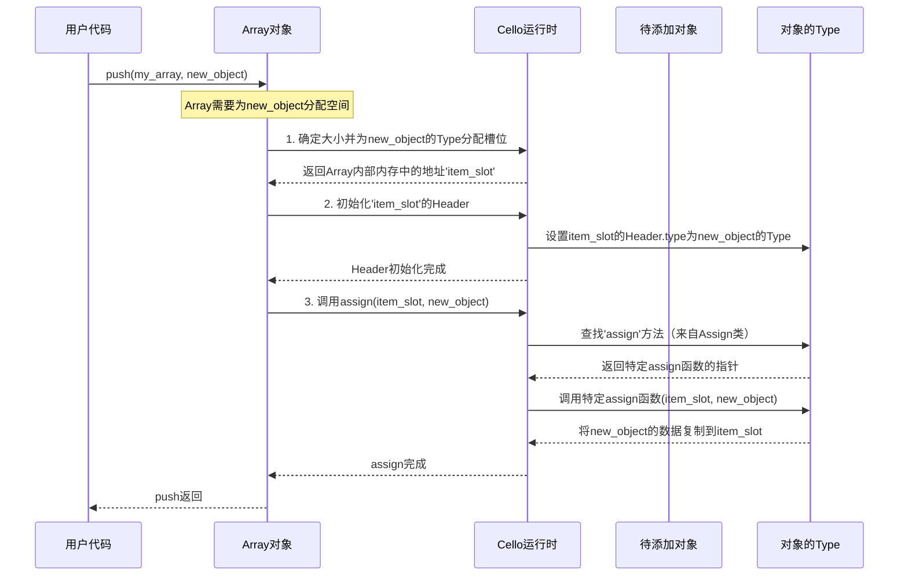

# 第3章：泛型数据结构

欢迎回来~

在[第1章：对象与类型](01_objects_and_types_.md)中，我们学习了Cello中一切都是指向带有**`Type`**蓝图的**Cello对象**的`var`指针。接着在[第2章：接口（类）](02_interfaces__classes__.md)中，我们发现了**类**如何定义共享行为，使不同类型能够以相似方式运作（多态性）。

现在，让我们将这些强大的概念结合起来，解决一个常见的编程挑战：当我们无法提前知道要存储的数据类型，或者想在同一个集合中混合不同类型时，该如何管理数据集合？

在标准C语言中，如果需要`int`数组，我们会用`int[]`；`float`数组用`float[]`；自定义的`struct Point`数组用`struct Point[]`。但如果想要一个能同时存储`int`和`Point`的数组呢？在C语言中这非常困难，通常需要手动类型跟踪和`void*`技巧。

Cello的**泛型数据结构**优雅地解决了这个问题！它们是能够存储**任何Cello对象**的容器，简化了多样化数据集合的管理。

## 什么是"泛型"数据结构？

"泛型"数据结构是指不关心所存储数据的具体`Type`的容器。它可以存储任何内容！这之所以可能，是因为Cello对象通过其`Header`和`Type`信息，携带了自身的身份和行为。

可以把它想象成一个万能玩具箱。你可以放入任何玩具——汽车、娃娃、积木——因为这个玩具箱设计用来容纳*任何玩具*，而不仅仅是"汽车"或"娃娃"。当你想玩某个玩具时，只需从箱子里取出一个`var`（你的"玩具"），然后可以直接询问玩具它是什么（`type_of`）或如何与之互动（通过调用其`Class`方法如`show`或`cmp`）。

Cello提供了几种内置的泛型数据结构：

*   **`Array`**：动态数组，类似于C++的`std::vector`或Python的`list`。适合需要频繁在末尾增删的有序集合。
*   **`List`**：双向链表，类似于C++的`std::list`。适合需要在中间频繁插入/删除的场景。
*   **`Table`**：哈希表（或字典），类似于C++的`std::unordered_map`或Python的`dict`。存储键值对以实现快速查找。
*   **`Tree`**：平衡二叉搜索树，类似于C++的`std::map`。存储键值对，按键排序，并提供高效查找。

所有这些容器都能与Cello对象协作，并自动管理存储项的内存。它们依赖于我们已经学习过的Cello基础**类**：

*   **`Push`**：定义如何添加（`push`）或移除（`pop`）元素。
*   **`Get`**：定义如何访问（`get`）或修改（`set`）元素，通常通过索引或键。
*   **`Len`**：定义如何获取元素数量（`len`）。
*   **`Iter`**：定义如何遍历元素（`foreach`）。

让我们看看它们如何让`Point`和`Int`对象和谐共处。

## 使用`Array`混合存储数据

让我们回顾前几章的`Point`结构体。我们将确保它实现`Show`以便友好打印。

```c
#include "Cello.h"

// 定义Point结构体（来自第1章）
struct Point { float x, y; };

// 打印Point对象的函数（来自第2章）
static int Point_Show(var self, var output, int pos) {
  struct Point* p = (struct Point*)self;
  pos = print_to(output, pos, "(%F, %F)", $F(p->x), $F(p->y));
  return pos;
}

// 使Point成为Cello类型并实现Show
var Point = Cello(Point,
  Instance(Show, Point_Show, NULL)
);

int main(int argc, char** argv) {
  // 创建新Array。第一个参数指定元素将被*复制到*的类型。
  // 使用'Ref'允许存储任何Cello对象。
  var mixed_items = new(Array, Ref);

  // 添加Int对象
  push(mixed_items, $I(123));

  // 添加Point对象
  push(mixed_items, $(Point, 1.0, 2.0));

  // 添加另一个Int对象
  push(mixed_items, $I(456));

  print("混合数组为: %$\n", mixed_items);
  // 预期输出: 混合数组为: <'Array' At 0x... [123, (1.000000, 2.000000), 456]>

  return 0;
}
```

**说明：**
*   `new(Array, Ref)`创建一个设计用于存储`Ref`对象的`Array`。`Ref`是Cello的通用"引用"类型，可以引用*任何*Cello对象。这让我们能在同一数组中存储不同类型。
*   `push(mixed_items, ...)`使用`Push`类添加新元素。Cello会自动包装我们的`int`和`Point`对象，并将其存储为引用。
*   `print("... %$\n", mixed_items)`使用`Array`实现的`Show`类打印整个集合。注意它如何对每个包含的项调用`Show`，从而得到我们定义的自定义`Point`输出！

### 访问和遍历元素

可以通过`get`按索引访问元素，使用`foreach`遍历它们。

```c
#include "Cello.h"
// ... (Point结构体和Cello(Point, ...)定义同上) ...

int main(int argc, char** argv) {
  var mixed_items = new(Array, Ref, $I(123), $(Point, 1.0, 2.0), $I(456));

  // 按索引获取元素
  var first_item = get(mixed_items, $I(0));
  var second_item = get(mixed_items, $I(1));

  print("第一项: %$\n", first_item);
  print("第二项: %$\n", second_item);
  // 预期输出:
  // 第一项: 123
  // 第二项: (1.000000, 2.000000)

  // 使用foreach遍历所有项
  print("数组中的项:\n");
  foreach (item in mixed_items) {
    print("- %$\n", item);
  }
  // 预期输出:
  // 数组中的项:
  // - 123
  // - (1.000000, 2.000000)
  // - 456

  return 0;
}
```

**说明：**
*   `get(mixed_items, $I(0))`使用`Get`类获取索引`0`处的项。`$I(0)`将C整数`0`转换为Cello `Int`对象，这是泛型函数的要求。
*   `foreach`宏使用`Iter`类安全且泛型地遍历`mixed_items`数组中的所有元素。它自动处理每个`item`的`var`类型。

## 其他泛型数据结构：`Table`示例

Cello的`Table`（哈希表）是另一个强大的键值对泛型容器。它也展示了如何为键和值指定`Type`。

```c
#include "Cello.h"

int main(int argc, char** argv) {
  // 创建新Table，键为'String'对象，值为'Int'对象
  var prices = new(Table, String, Int);

  // 使用String和Int对象设置键值对
  set(prices, $S("Apple"),  $I(12));
  set(prices, $S("Banana"), $I( 6));
  set(prices, $S("Pear"),   $I(55));

  print("价格表: %$\n", prices);
  // 预期输出: 价格表: <'Table' At 0x... {"Banana":6, "Pear":55, "Apple":12}>
  // (Table的顺序可能不同)

  // 通过键访问值
  var apple_price = get(prices, $S("Apple"));
  print("苹果价格: %$\n", apple_price);
  // 预期输出: 苹果价格: 12

  // 遍历键并获取对应值
  print("所有价格:\n");
  foreach (key in prices) {
    var val = get(prices, key);
    print("- %$ 的价格是 %$\n", key, val);
  }
  // 预期输出:
  // 所有价格:
  // - Banana 的价格是 6
  // - Pear 的价格是 55
  // - Apple 的价格是 12
  // (顺序可能不同)

  return 0;
}
```

**说明：**
*   `new(Table, String, Int)`创建一个`Table`，期望`String`对象作为键，`Int`对象作为值。
*   `set(prices, $S("Apple"), $I(12))`使用`Get`类的`set`方法存储与键关联的值。注意使用`$S()`和`$I()`创建Cello `String`和`Int`对象。
*   `get(prices, $S("Apple"))`使用`Get`类检索值。
*   `foreach (key in prices)`循环遍历`Table`中的*键*。在循环内，`get(prices, key)`用于获取对应值。

这展示了Cello的泛型数据结构如何抽象掉底层的C语言复杂性，让你专注于管理对象集合，而无需关心具体类型。

## 幕后机制：泛型容器的工作原理

本质上，像`Array`这样的Cello泛型数据结构通过始终使用`var`指针并依赖存储对象的`Type`信息和`Classes`来实现其"泛型性"。

想象一个泛型容器是一系列"槽位"或"格子"。每个槽位可以容纳任何类型的Cello对象，因为它最终只保存一个`var`指针。当你向容器添加对象时，容器不仅存储原始的C `int`或`struct Point`，而是为完整的Cello对象分配空间（包括其`Header`和你的数据），并将你的对象数据*复制*到该空间中。

让我们追踪当你`push`一个对象到`Array`时发生了什么：



**过程说明：**

1.  调用`push(my_array, new_object)`时，`Array`对象接收`new_object`（一个`var`）。
2.  `Array`需要为`new_object`的*副本*分配空间。它使用`new_object`的`Type`确定所需内存大小（使用`Size`类），并在内部数据缓冲区中分配新槽位。
3.  关键的是，它随后初始化这个新分配槽位的`Header`，指向`new_object`的`Type`。这意味着副本*也*成为完整的Cello对象，知道自己的类型。
4.  最后，`Array`调用泛型函数`assign(destination, source)`。此函数使用`new_object`的`Type`的`Assign`类，将`new_object`的数据正确复制到分配的`destination`槽位。
5.  当`Array`本身被`del`删除时，它会遍历所有存储的对象并对每个对象调用`destruct`，确保正确清理。

### 代码窥探：`Array`内部

让我们看看`Array`的简化定义以及`New`和`Del`如何工作（来自`src/Array.c`）：

```c
// 简化自include/Cello.h和src/Array.c

// 定义Cello Array对象的内部结构
struct Array {
  var type;     // 此Array默认存储的对象类型
  var data;     // 指向存储项的原始内存块的指针
  size_t tsize; // 每个项类型的大小（包括Cello Header）
  size_t nitems; // 数组中当前实际项数
  size_t nslots; // 'data'中可用槽位总数
};

// 简化的Array_New（构造函数）
static void Array_New(var self, var args) {
  struct Array* a = (struct Array*)self;
  // 从构造函数参数获取项的主类型
  a->type = cast(get(args, $I(0)), Type);
  // 计算每个项实际需要的大小（包括Cello的Header）
  a->tsize = Array_Size_Round(size(a->type));
  // ... (更多初始分配和项复制的逻辑) ...
  // 对于'args'中的每个初始项：
  // Array_Alloc为新槽位设置Cello Header
  // assign将对象内容复制到新槽位
  // assign(Array_Item(a, i), get(args, $I(i+1)));
}

// 简化的Array_Del（析构函数）
static void Array_Del(var self) {
  struct Array* a = (struct Array*)self;
  // 遍历数组中当前所有项
  for(size_t i = 0; i < a->nitems; i++) {
    // 使用项的Type的New类调用析构函数
    destruct(Array_Item(a, i));
  }
  // 释放存储所有项的原始内存块
  free(a->data);
}
```

**代码要点：**

*   `struct Array`包含`type`（元素的预期类型，如`Int`或`Ref`）、`data`（原始内存缓冲区）、`tsize`（每个元素的总内存大小，包括`Header`）、`nitems`（当前存储的对象数）和`nslots`（分配的空间）。
*   在`Array_New`中，`type`参数帮助`Array`知道为每个项保留多少内存（使用`size(a->type)`）。然后它`assign`初始值，为每个对象调用`Assign`类方法。
*   在`Array_Del`中，`Array`确保在释放自己的内存块之前，正确`destruct`每个包含的对象（调用其`New`类的`destruct`方法）。这是Cello对包含项自动内存管理的体现！

`var`、`Type`和`Classes`之间的这种复杂协作，使得Cello的泛型数据结构能够无缝地与任何Cello对象协作，简化你的代码，并使其比传统C编程灵活得多。

## 总结

在本章中，我们学习了：

*   **泛型数据结构**如`Array`、`List`、`Table`和`Tree`可以存储任何Cello对象。
*   它们通过使用`var`指针并依赖所存储对象的`Type`和`Classes`实现这一点。
*   通过指定`Ref`作为项类型，可以在容器中存储混合类型。
*   常见操作如`push`、`pop`、`get`、`set`、`len`和`foreach`通过Cello的类系统提供。
*   这些容器自动管理存储对象的内存，添加时调用`assign`，移除或清理时调用`destruct`。

掌握了对象、类型、类和泛型数据结构后，我们已经准备好用Cello管理复杂数据。接下来，我们将探索Cello如何帮助轻松打印和读取复杂数据。

[下一章：格式化输入/输出](04_formatted_input_output_.md)

