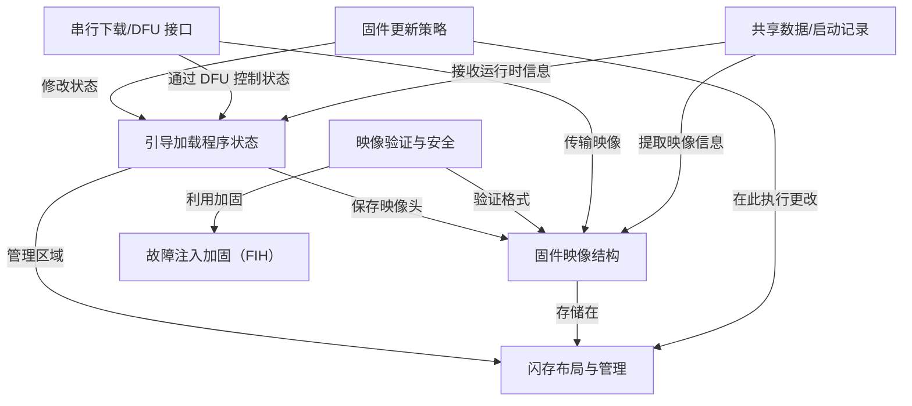
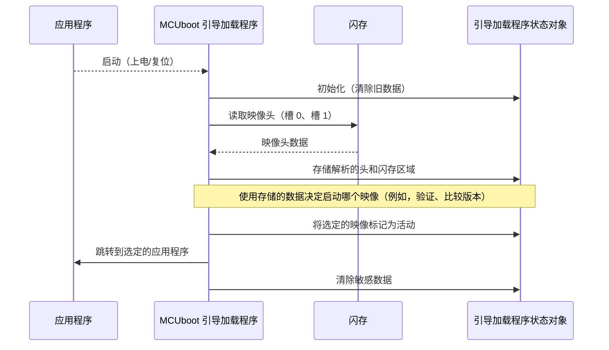

链接：[github.com/mcu-tools/mcuboot](https://github.com/mcu-tools/mcuboot)

# docs：mcuboot

`mcuboot` 是一个为嵌入式设备设计的**安全引导加载程序**

其主要功能是==保证只有*可信*和*经过身份验证*的固件映像被加载和执行==。

它通过执行强大的映像验证（检查加密签名、哈希值和防回滚计数器）、管理闪存分区以及向应用程序传递必要的启动上下文，来促进安全的*固件更新*（DFU）。

此外，它还结合了强大的*故障注入加固*措施来防御物理攻击。

## 可视化



## 章节

1. [引导加载程序状态](01_bootloader_state_.md)
2. [固件映像结构](02_firmware_image_structure_.md)
3. [闪存布局与管理](03_flash_layout___management_.md)
4. [映像验证与安全](04_image_validation___security_.md)
5. [故障注入加固（FIH）](05_fault_injection_hardening__fih__.md)
6. [固件更新策略](06_firmware_update_strategies_.md)
7. [串行下载/DFU 接口](07_serial_download_dfu_interface_.md)
8. [共享数据/启动记录](08_shared_data___boot_record_.md)

---

# 第 1 章：引导加载程序状态

作为我们嵌入式设备的安全引导加载程序，MCUboot 有一项关键任务：确保只有可信的软件才能运行。为了做到这一点，它需要在工作时跟踪大量信息。想象一下，如果试图在没有任何笔记、计划或记忆的情况下管理一个复杂的项目——那将是不可能的！

这就是**引导加载程序状态**发挥作用的地方。可以把它想象成 MCUboot 的中央控制面板或白板，它在那里保存所有在启动过程中做出决策所需的动态信息。它就像引导加载程序的"大脑"和"记忆"合二为一的重要结构。

### 为什么我们需要引导加载程序状态？

让我们考虑一个常见场景：我们想要更新设备上的固件。MCUboot 需要执行几个步骤：

1.  **查找新固件**：它存储在设备闪存的哪里？
2.  **验证新固件**：它是真实的吗？是否被篡改过？它与设备兼容吗？
3.  **做出决定**：这个新固件应该替换旧固件吗？
4.  **执行更新**：如果是，它应该如何安全地移动或交换固件？
5.  **启动正确的固件**：一旦过程完成，系统应该准确地跳转到哪里开始运行应用程序？

要回答所有这些问题，MCUboot 需要一个临时工作空间。`boot_loader_state` 结构正是这个工作空间。没有它，MCUboot 就不知道它去过哪里、发现了什么，或者接下来该做什么。

### 引导加载程序状态保存什么？

`boot_loader_state` 结构保存 MCUboot 收集和使用的*所有*动态信息。以下是它的一些关键内容：

*   **解析的映像头**：每个固件映像都有一个头，就像身份证一样，包含关键信息，如版本号、映像大小和标志。MCUboot 从闪存上的不同存储"槽"读取这些头并将它们存储在这里。
*   **闪存区域指针**：我们设备的闪存被划分为不同的区域（称为闪存区域或槽）。`boot_loader_state` 跟踪这些区域的位置。
*   **扇区布局**：闪存被组织成扇区。为了有效地擦除或复制固件的部分内容，MCUboot 需要知道这些扇区的详细布局。这些信息存储在状态中。
*   **当前映像索引**：如果我们的设备支持运行多个应用程序（多映像设置），这会告诉 MCUboot 它当前正在处理哪个应用程序。
*   **临时加密密钥**：如果我们的固件是加密的，MCUboot 可能会在这里临时存储密钥以解密和验证映像。这些密钥仅在启动过程中保存，之后会被安全清除。

让我们用一个类比：想象 `boot_loader_state` 就像侦探的案件档案。它包含犯罪现场照片（闪存区域）、嫌疑人身份证（映像头）、详细地图（扇区布局）、关于哪个案件处于活动状态的笔记（当前映像索引），甚至包括只在需要时使用然后立即保护的秘密解码器（加密密钥）。

### MCUboot 如何使用引导加载程序状态（高级视图）

作为开发者，我们通常不会直接创建或修改 `boot_loader_state` 结构。相反，MCUboot 在内部处理它。当引导加载程序启动时，它初始化这个状态，用信息填充它，使用它做出决策，然后清理它。

以下是 MCUboot 启动时的简化事件序列：



此图显示了 `MCUboot` 如何与 `Flash Memory` 交互以收集信息，将其存储在 `BootLoaderState` 中，然后使用该 `Bootloader State` 做出关于运行哪个 `Application` 的最终决定。

### 探索代码：`boot_loader_state` 结构

`boot_loader_state` 结构在 `boot/bootutil/src/bootutil_priv.h` 中定义。让我们看一个简化版本来理解它的组件：

```c
// 文件：boot/bootutil/src/bootutil_priv.h
// 为清晰起见进行了简化

struct boot_loader_state {
    struct {
        struct image_header hdr;         // 固件的身份证（版本、大小等）
        const struct flash_area *area;   // 指向此映像在闪存上位置的指针
        // ... 其他与扇区相关的信息 ...
    } imgs[BOOT_IMAGE_NUMBER][BOOT_NUM_SLOTS]; // 用于多个映像和槽的数组

#ifdef MCUBOOT_ENC_IMAGES
    // ... 加密密钥数据 ...
#endif

#if (BOOT_IMAGE_NUMBER > 1)
    uint8_t curr_img_idx; // 当前正在处理哪个映像
    // ... 其他多映像特定标志 ...
#endif
    // ... 许多其他字段用于交换类型、写入大小等 ...
};
```

在这个结构中：
*   `imgs` 是一个数组。`BOOT_IMAGE_NUMBER` 指的是我们的设备可以管理多少个*不同的应用程序*（通常为 1）。`BOOT_NUM_SLOTS` 指的是每个应用程序的主存储区域和辅助存储区域（通常为 2）。
*   `imgs` 中的每个条目都包含一个 `image_header`（固件的身份证）和一个指向其 `flash_area`（其存储柜）的指针。我们将在接下来的两章中更深入地探讨这些：[固件映像结构](02_firmware_image_structure_.md) 和 [闪存布局与管理](03_flash_layout___management_.md)。

#### 初始化状态

当 MCUboot 启动时，`boot_loader_state` 需要被清除和准备。这由 `boot_state_init` 处理：

```c
// 文件：boot/bootutil/src/loader.c

void boot_state_init(struct boot_loader_state *state)
{
    // 清除整个结构，将所有字节设置为零。
    memset(state, 0, sizeof(*state));

    #if defined(MCUBOOT_ENC_IMAGES)
    // 如果启用了加密，还会初始化加密特定的数据
    // ...（为简洁起见省略了详细信息）...
    #endif
}
```
这个 `boot_state_init` 函数有效地擦除白板，确保 MCUboot 在每次启动过程中都从一个干净的状态开始。

#### 访问状态（内部）

虽然我们通常不会直接调用它，但 MCUboot 的内部函数经常需要访问当前的 `boot_loader_state`。它使用 `boot_get_loader_state()` 检索指向此全局状态的指针：

```c
// 文件：boot/bootutil/include/bootutil/bootutil.h
struct boot_loader_state *boot_get_loader_state(void);

// 文件：boot/bootutil/src/loader.c
static struct boot_loader_state boot_data; // 实际的全局状态对象

struct boot_loader_state *boot_get_loader_state(void)
{
    return &boot_data; // 返回指向全局 boot_data 对象的指针
}
```
MCUboot 中的函数然后使用此指针读取和写入 `boot_data` 对象的信息，指导整个启动过程。例如，要从特定槽获取映像头：

```c
// 文件：boot/bootutil/src/bootutil_priv.h（简化的宏）

static inline struct image_header*
boot_img_hdr(struct boot_loader_state *state, size_t slot)
{
    // 访问当前映像和指定槽的 'hdr' 成员
    return &state->imgs[BOOT_CURR_IMG(state)][slot].hdr;
}
```
这个辅助函数（在实际代码中通常实现为宏）显示了 MCUboot 如何提取映像头数据，这是 `boot_loader_state` 的一个组成部分，用于给定的槽。

### 结论

`boot_loader_state` 是 MCUboot 操作的支柱，充当其所有运行时信息的中央存储库。它是允许 MCUboot 在管理我们设备的固件时变得智能、安全和灵活的机制。理解这个核心概念对于掌握 MCUboot 如何做出关键决策至关重要，从验证映像到执行更新。

现在我们已经了解了 MCUboot 的内部"大脑"，让我们继续了解它试图管理的内容：固件本身。我们的下一章将探讨这些软件包的详细结构。

[下一章：固件映像结构](02_firmware_image_structure_.md)

