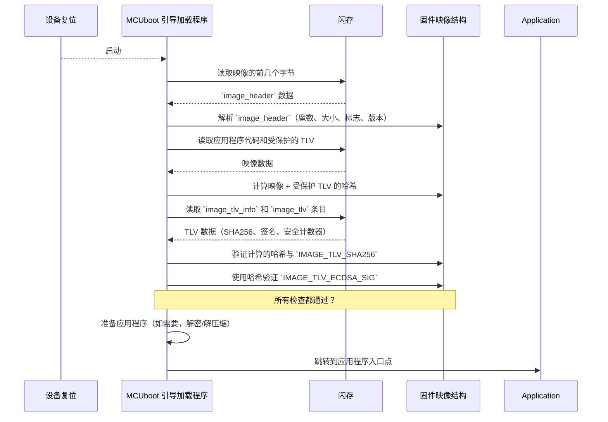

# 第 2 章：固件映像结构

在上一章[引导加载程序状态](01_bootloader_state_.md)中，我们了解了 MCUboot 的内部"大脑"——`boot_loader_state`，它在启动过程中跟踪所有信息。MCUboot 在其状态中存储的最重要信息之一是它找到的固件映像的详细信息。但从 MCUboot 的角度来看，固件映像到底*是*什么？它如何知道自己在看什么、有多大，或者运行是否安全？

这就是**固件映像结构**发挥作用的地方。

### 固件作为结构化包

想象一下，我们正在通过安全快递服务发送一个敏感包裹。我们不会只是把随机物品放进盒子里然后祈祷一切顺利。我们需要：
1.  **标记盒子**：包括发件人、收件人、内容和尺寸。
2.  **包含特殊说明**：可能是内容清单、海关申报或"易碎"标签。
3.  **安全密封**：确保没有人篡改它。

MCUboot 对待我们的应用程序固件就像对待这个安全包裹一样。它不仅仅是原始代码块；它是一个精心构造的二进制文件，不仅包含我们应用程序的指令，还包含 MCUboot 所需的关键元数据，用于：
*   识别固件。
*   理解其属性（如大小和版本）。
*   验证其真实性和完整性。
*   处理任何特殊功能（如加密或压缩）。

这种标准化的"包"允许 MCUboot 一致且安全地处理我们提供的任何固件二进制文件。

### 固件映像的关键组件

MCUboot 处理的固件映像由两个主要部分组成：

1.  **`image_header`**：就像固件的运输标签或身份证。
2.  **类型-长度-值（TLV）条目**：就像附加在包裹上的特殊标签或说明，携带重要元数据。
3.  **应用程序代码**：我们编写的实际固件，嵌套在头和 TLV 之间。

让我们详细分析这些内容。

#### 1. `image_header`：固件的身份证

`image_header` 是 MCUboot 遇到固件映像时首先查看的内容。它是位于映像开头的一个小型固定大小结构。

可以把它想象成固件的身份证。没有这张卡，MCUboot 对映像一无所知，无法开始处理它。

以下是 `image_header` 通常包含的内容：

*   **`ih_magic`**：一个特殊的"魔数"（如 `0x96f3b83d`）。这是 MCUboot 首先检查的内容，以确认它实际上在查看有效的 MCUboot 映像，而不仅仅是随机数据。就像检查包裹是否有正确的公司标志。
*   **`ih_load_addr`**：映像打算加载或执行的内存地址。
*   **`ih_hdr_size`**：此头本身的大小。
*   **`ih_protect_tlv_size`**：特殊"受保护"TLV 区域的大小。稍后详细介绍！
*   **`ih_img_size`**：映像的应用程序代码部分的总大小（不包括头和 TLV）。
*   **`ih_flags`**：一组标志，告诉 MCUboot 映像的特殊属性，例如：
    *   `IMAGE_F_ENCRYPTED_AES256`：固件是否加密？
    *   `IMAGE_F_COMPRESSED_LZMA2`：固件是否压缩？
    *   `IMAGE_F_RAM_LOAD`：是否应该加载到 RAM 而不是直接从闪存运行？
*   **`ih_ver`**：固件的版本号（例如，`1.2.3.4`）。对于检查新更新是否实际上比当前版本更新至关重要。
*   `_pad1`：一个小填充，以确保结构在内存中正确对齐。

让我们看一下来自 `boot/bootutil/include/bootutil/image.h` 的 `image_header` 结构的简化版本：

```c
// 文件：boot/bootutil/include/bootutil/image.h
STRUCT_PACKED image_version {
    uint8_t iv_major;       // 主版本号：1
    uint8_t iv_minor;       // 次版本号：2
    uint16_t iv_revision;   // 修订版本：3
    uint32_t iv_build_num;  // 构建号：4
};

STRUCT_PACKED image_header {
    uint32_t ih_magic;          // 标识这是一个 MCUboot 映像
    uint32_t ih_load_addr;      // 应用程序期望运行的位置
    uint16_t ih_hdr_size;       // 此头结构的大小
    uint16_t ih_protect_tlv_size; // 受保护 TLV 区域的大小
    uint32_t ih_img_size;       // 实际应用程序代码的大小
    uint32_t ih_flags;          // 标志，如加密、压缩
    struct image_version ih_ver; // 固件版本（例如，1.2.3.4）
    uint32_t _pad1;             // 对齐填充
};
```
> `STRUCT_PACKED` 关键字确保编译器不会在字段之间插入间隙（填充），使结构的大小正好符合我们的预期。这在直接从闪存读取时很重要。

MCUboot 使用从固件映像读取的 `image_header` 数据（如版本和标志），并将其临时存储在 `boot_loader_state` 中（我们在[第 1 章：引导加载程序状态](01_bootloader_state_.md)中讨论过）。这允许 MCUboot 比较不同的映像或决定如何处理当前映像。

#### 2. 类型-长度-值（TLV）条目：特殊说明

在 `image_header` 和实际应用程序代码之后，MCUboot 附加一系列称为**类型-长度-值（TLV）条目**的小数据块。这些就像包裹上的特殊标签或附加说明，包含 MCUboot 在安全和高级功能方面所需的关键元数据。

每个 TLV 条目都很简单：
*   **类型**：一个 16 位数字，标识此 TLV 保存的信息类型（例如，"这是一个 SHA256 哈希"）。
*   **长度**：一个 16 位数字，指示此 TLV 的 `Value` 部分占用多少字节。
*   **值**：实际数据。

在各个 TLV 条目之前，有一个小的 `image_tlv_info` 头，指定 TLV 区域的魔数及其总大小：

```c
// 文件：boot/bootutil/include/bootutil/image.h
STRUCT_PACKED image_tlv_info {
    uint16_t it_magic;      // 标识这是一个 TLV 区域（例如，0x6907）
    uint16_t it_tlv_tot;    // 整个 TLV 区域的总大小
};

STRUCT_PACKED image_tlv {
    uint16_t it_type;       // 数据类型（例如，SHA256 哈希、签名）
    uint16_t it_len;        // 紧随其后的'value'数据的长度
    // 'value' 数据紧跟在此结构之后
};
```

以下是一些常见的 TLV 类型示例及其重要性：

| TLV 类型                | 用途                                                         |
| :---------------------- | :----------------------------------------------------------- |
| `IMAGE_TLV_SHA256`      | 包含固件的 SHA256 加密哈希。用于检测任何篡改。               |
| `IMAGE_TLV_ECDSA_SIG`   | 包含固件的数字签名，使用私钥生成。验证真实性。               |
| `IMAGE_TLV_SEC_CNT`     | 存储安全计数器。用于防回滚保护，以防止降级到较旧的易受攻击版本。 |
| `IMAGE_TLV_DEPENDENCY`  | 指定此映像是否依赖于另一个映像（例如，需要特定引导加载程序版本的应用程序）。 |
| `IMAGE_TLV_ENC_AES256`  | 如果固件本身是加密的，则包含加密密钥。                       |
| `IMAGE_TLV_DECOMP_SIZE` | 如果映像被压缩，这会告诉 MCUboot 解压缩*后*的映像大小。      |

头中的 `IMAGE_TLV_PROT_INFO_MAGIC` 和 `ih_protect_tlv_size` 字段表示 TLV 区域的某个初始部分是"受保护的"。这意味着这些 TLV（如安全哈希）在计算映像签名时被包括在内。如果受保护 TLV 区域中的单个字节发生变化，签名验证将失败，从而确保其完整性。

### MCUboot 如何使用映像结构

当 MCUboot 启动时，它不会盲目地加载我们的应用程序。它使用这种结构仔细检查固件映像：

1.  **读取 `image_header`**：它读取固定大小的头以获取基本信息，如 `ih_magic`、`ih_img_size` 和 `ih_flags`。
2.  **计算映像哈希**：基于 `ih_img_size`，MCUboot 读取应用程序代码和*受保护的* TLV 区域（由 `ih_protect_tlv_size` 指示）。它计算整个部分的加密哈希（如 SHA256）。
3.  **遍历 TLV**：然后 MCUboot 使用 `image_tlv_info` 找到 TLV 部分的开始和结束。它遍历每个 `image_tlv` 条目。
4.  **验证完整性和真实性**：
    *   它查找 `IMAGE_TLV_SHA256` 条目，并将其与步骤 2 中计算的哈希进行比较。如果它们不匹配，映像已被篡改
    *   它找到签名 TLV（例如，`IMAGE_TLV_ECDSA_SIG`）并使用它以及受信任的公钥来验证哈希。这确认映像来自合法来源。
5.  **检查其他元数据**：它读取 `IMAGE_TLV_SEC_CNT` 以确保防止回滚攻击，读取 `IMAGE_TLV_DEPENDENCY` 以确保兼容性。
6.  **解密/解压缩（如有必要）**：如果 `ih_flags` 指示映像已加密或压缩，MCUboot 使用其他 TLV 中的密钥或其内部功能来准备映像。
7.  **启动应用程序**：如果所有检查都通过，MCUboot 信任固件并跳转到其入口点。

以下是简化的序列图：



#### 探索代码：TLV 迭代

我们通常不会手动解析 `image_header` 或 TLV。MCUboot 提供实用函数来执行此操作。例如，要读取 TLV，MCUboot 使用来自 `boot/bootutil/src/tlv.c` 的 `bootutil_tlv_iter_begin` 和 `bootutil_tlv_iter_next` 等函数。

这些函数创建一个"迭代器"，让 MCUboot 有效地遍历映像中的所有 TLV，而无需事先知道它们的确切位置。

```c
// 文件：boot/bootutil/include/bootutil/image.h（简化）
struct image_tlv_iter {
    const struct image_header *hdr; // 指向映像头的指针
    const struct flash_area *fap;   // 指向映像在闪存上存储位置的指针
    uint16_t type;                  // 要搜索的 TLV 类型（或 IMAGE_TLV_ANY）
    uint32_t tlv_off;               // TLV 区域内的当前偏移量
    uint32_t tlv_end;               // TLV 区域的结束
    // ... 其他内部字段 ...
};

// 文件：boot/bootutil/src/tlv.c（简化的函数签名）

// 初始化迭代器以开始扫描 TLV
int bootutil_tlv_iter_begin(struct image_tlv_iter *it,
                            const struct image_header *hdr,
                            const struct flash_area *fap, uint16_t type,
                            bool prot);

// 查找下一个 TLV 条目，存储其偏移量、长度和类型
int bootutil_tlv_iter_next(struct image_tlv_iter *it, uint32_t *off,
                           uint16_t *len, uint16_t *type);

// 检查给定的 TLV 条目是否在受保护区域内
int bootutil_tlv_iter_is_prot(struct image_tlv_iter *it, uint32_t off);
```

MCUboot 在 `bootutil_img_validate`（来自 `boot/bootutil/src/image_validate.c`）中内部使用这些函数来遍历 TLV，从闪存读取它们的值，并执行上述所有必要的安全检查。

### 结论

固件映像结构是 MCUboot 操作的基础。通过==将应用程序代码与标准化的 `image_header` 和关键的类型-长度-值（TLV）元数据打包在一起==，MCUboot 获得了不仅加载代码，而且**安全识别、验证和管理**我们设备固件的智能。

这种结构是实现安全更新、防回滚保护和其他高级引导加载程序功能的关键。

现在我们了解了固件本身是如何构造的，让我们探索这些结构化映像实际存储在我们设备内存的哪里。我们的下一章将探讨[闪存布局与管理](03_flash_layout___management_.md)。

[下一章：闪存布局与管理](03_flash_layout___management_.md)

