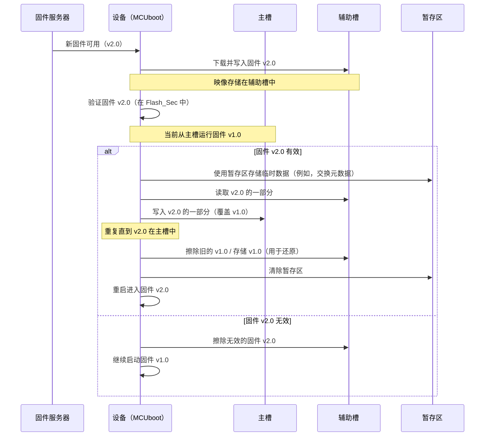

# 第 3 章：闪存布局与管理

欢迎回来

在上一章[固件映像结构](02_firmware_image_structure_.md)中，我们探讨了 MCUboot 如何将我们的应用程序打包成一个安全、可验证的"固件映像"。我们了解了 `image_header` 和特殊的 `TLV`（类型-长度-值）条目，它们为 MCUboot 提供了所需的所有元数据。

但这些结构化的固件映像*实际上*存储在我们设备的哪里？当我们用新软件更新设备时，MCUboot 如何安全地移动它们？这就是**闪存布局与管理**变得至关重要的地方。

### 问题：为安全更新组织存储

想象一下，我们的嵌入式设备有有限的存储空间，就像一个小型专用衣柜。我们需要存储当前的衣服（活动固件），但也要准备好接收新衣服（更新固件），甚至要交换它们。我们不会只是把所有东西扔进一堆！我们需要架子、抽屉，甚至可能需要一个临时桌子来管理交换，而不会弄得一团糟或丢失任何重要的东西。

这正是闪存布局与管理为 MCUboot 解决的问题。我们设备的闪存不仅仅是一个大的、未分化的块。为了让 MCUboot 安全地管理固件更新，这个内存需要被仔细地**分区**成不同的逻辑区域。然后 MCUboot 精确控制如何从这些区域读取、写入和擦除数据。

这方面的一个核心用例是**空中（OTA）固件更新**。当需要安装新固件版本时，MCUboot 必须：
1.  找到一个地方存储新映像，而不影响当前运行的映像。
2.  安全地将新映像移动到活动位置。
3.  可能保留旧映像以便可能的回滚。
4.  确保即使在过程中断电也不会丢失或损坏数据。

这需要一种复杂的方式来管理我们的闪存。

### 闪存布局的关键概念

MCUboot 使用几个核心概念来定义闪存结构：

#### 1. 闪存区域（`flash_area`）

可以把 `flash_area` 想象成设备闪存中明确定义的"架子"或"隔间"。每个 `flash_area` 都有特定的用途和唯一的 ID。它告诉 MCUboot：
*   **它从哪里开始**：从闪存开始的 `offset`（偏移量）。
*   **它有多大**：以字节为单位的 `size`（大小）。
*   **它在哪个设备上**：如果我们的系统有多个闪存芯片。

我们通常不会在应用程序代码中直接看到原始的 `flash_area` 结构，但 MCUboot 在内部使用指向这些结构的指针来知道*在哪里*读取或写入。

#### 2. 主槽（`FLASH_AREA_IMAGE_PRIMARY`）

这是"活动"隔间。它是我们设备上当前运行的固件所在的位置。当 MCUboot 完成其工作时，它通常会跳转到主槽中的固件。

#### 3. 辅助槽（`FLASH_AREA_IMAGE_SECONDARY`）

这是"暂存"隔间。当我们收到新的固件更新（例如，通过网络连接）时，MCUboot 会首先在这里下载并存储它。这是一个临时保存区域，新固件可以在*替换*主槽中的活动固件*之前*被完全接收、验证和准备。

#### 4. 暂存区（`FLASH_AREA_IMAGE_SCRATCH`）

暂存区是一个临时工作空间，就像一个小白板或临时暂存桌。它在更复杂的更新过程中使用，特别是当 MCUboot 需要在主槽和辅助槽之间执行"交换"时。如果无法直接移动大型固件映像（例如，由于内存限制或特定闪存芯片属性），暂存区提供了一个安全的中间存储。

#### 5. 闪存扇区大小

闪存不像 RAM，我们可以在其中写入或擦除单个字节。它被组织成称为**扇区**的较大块。我们一次只能擦除整个扇区，写入通常以必须对齐的较小"写入块"进行。MCUboot 知道这些扇区大小，并始终将其擦除和写入操作对齐到这些边界，以确保效率并防止数据损坏。

### 闪存布局如何实现安全更新

让我们使用这些概念重新审视我们的 OTA 更新场景：


此图简化了"交换"更新，其中辅助槽的内容替换主槽。如果在交换期间断电，MCUboot 可以使用[共享数据/启动记录](08_shared_data___boot_record_.md)中的元数据（通常存储在闪存区域的尾部）检测部分交换，并恢复或还原过程，确保设备保持功能正常。

### MCUboot 内部：管理闪存区域

MCUboot 使用抽象层与闪存交互，使其能够与各种硬件配合工作。它不是直接调用硬件特定的函数，而是依赖于"闪存映射后端"（例如，由我们的 RTOS 如 Zephyr 或 Mynewt 提供）。

#### 1. 存储闪存区域指针

`boot_loader_state`（我们在[第 1 章：引导加载程序状态](01_bootloader_state_.md)中的"大脑"）跟踪这些闪存区域。

```c
// 文件：boot/bootutil/src/bootutil_priv.h（简化）

struct boot_loader_state {
    struct {
        struct image_header hdr;
        const struct flash_area *area; // 指向此映像槽的闪存区域的指针
        // ... 扇区详细信息 ...
    } imgs[BOOT_IMAGE_NUMBER][BOOT_NUM_SLOTS]; // 用于主槽和辅助槽

#if MCUBOOT_SWAP_USING_SCRATCH
    struct {
        const struct flash_area *area; // 指向暂存闪存区域的指针
        // ... 扇区详细信息 ...
    } scratch;
#endif
    // ... 其他状态数据 ...
};
```
这里，`BOOT_IMG_AREA(state, slot)` 是一个辅助宏，方便地为特定映像和槽提供 `const struct flash_area *` 指针。这是 MCUboot 对所有内容位置的内部引用。

#### 2. 读取、写入和擦除闪存

一旦 MCUboot 有了 `flash_area` 指针，它就使用基本的闪存操作（如 `flash_area_read`、`flash_area_write`、`flash_area_erase`）与物理内存交互。这些函数是 `flash_map_backend` 接口的一部分。

```c
// 概念性：MCUboot 如何*调用*闪存操作
// （实际实现在平台特定的 flash_map_backend 文件中）

// 从主槽读取固件头
const struct flash_area *primary_fa = BOOT_IMG_AREA(state, BOOT_SLOT_PRIMARY);
struct image_header current_hdr;
int rc = flash_area_read(primary_fa, 0, &current_hdr, sizeof(current_hdr));
if (rc != 0) {
    // 处理错误
}

// 擦除辅助槽的一个区域
const struct flash_area *secondary_fa = BOOT_IMG_AREA(state, BOOT_SLOT_SECONDARY);
uint32_t offset_to_erase = 0; // 从辅助槽的开头开始
uint32_t size_to_erase = flash_area_get_size(secondary_fa); // 整个槽
rc = flash_area_erase(secondary_fa, offset_to_erase, size_to_erase);
if (rc != 0) {
    // 处理错误
}
```
这些概念性示例展示了 MCUboot 如何使用 `flash_area` 对象执行操作。`flash_area_read` 和 `flash_area_erase` 函数直接与低级闪存驱动程序交互。

#### 3. 管理扇区信息

为了高效和正确的闪存操作（特别是在交换期间），MCUboot 需要知道每个 `flash_area` 的详细扇区布局。`boot_read_sectors` 函数处理这个问题。

```c
// 文件：boot/bootutil/src/bootutil_misc.c（简化）

int
boot_read_sectors(struct boot_loader_state *state, struct boot_sector_buffer *sectors)
{
    uint8_t image_index;
    int rc;

    image_index = BOOT_CURR_IMG(state); // 获取当前映像索引

    // 在 boot_loader_state 中分配扇区缓冲区
    BOOT_IMG(state, BOOT_SLOT_PRIMARY).sectors = sectors->primary[image_index];
#if BOOT_NUM_SLOTS > 1
    BOOT_IMG(state, BOOT_SLOT_SECONDARY).sectors = sectors->secondary[image_index];
#if MCUBOOT_SWAP_USING_SCRATCH
    state->scratch.sectors = sectors->scratch;
#endif
#endif

    // 初始化主槽的扇区信息
    rc = boot_initialize_area(state, FLASH_AREA_IMAGE_PRIMARY(image_index));
    if (rc != 0) {
        return BOOT_EFLASH;
    }

#if BOOT_NUM_SLOTS > 1
    // 初始化辅助槽的扇区信息
    rc = boot_initialize_area(state, FLASH_AREA_IMAGE_SECONDARY(image_index));
    if (rc != 0) {
        return BOOT_EFLASH_SEC; // 区分主槽与辅助槽错误
    }
#if MCUBOOT_SWAP_USING_SCRATCH
    // 初始化暂存区的扇区信息
    rc = boot_initialize_area(state, FLASH_AREA_IMAGE_SCRATCH);
    if (rc != 0) {
        return BOOT_EFLASH;
    }
#endif
#endif
    return 0;
}
```
此函数填充 `boot_loader_state` 中的 `sectors` 数组，为 MCUboot 提供组成每个 `flash_area` 的各个闪存扇区的映射。然后，像 `boot_erase_region` 这样的函数使用此映射来精确擦除必要的扇区。

#### 4. 计算尾部大小

正如我们将在[固件更新策略](06_firmware_update_strategies_.md)中看到的，MCUboot 需要在映像槽的末尾存储特殊的"尾部"元数据，以跟踪交换状态、魔数和其他详细信息。此尾部的大小取决于闪存的最小写入大小和各种配置选项。像 `boot_trailer_sz` 这样的函数计算这个：

```c
// 文件：boot/bootutil/src/bootutil_area.c（简化）

uint32_t
boot_status_entry_sz(uint32_t min_write_sz)
{
#if defined(MCUBOOT_SINGLE_APPLICATION_SLOT) // ... 其他模式
    return 0; // 单槽模式中没有交换状态字段
#else
    return BOOT_STATUS_STATE_COUNT * min_write_sz; // 多少个状态 * min_write_size
#endif
}

uint32_t
boot_trailer_sz(uint32_t min_write_sz)
{
    return boot_status_sz(min_write_sz) + boot_trailer_info_sz();
}
```
`boot_trailer_sz` 计算此元数据的总大小，确保它与闪存写入规则（`min_write_sz`）对齐。这对于将[引导加载程序状态](01_bootloader_state_.md)信息写入持久存储至关重要。

### 结论

闪存布局与管理为 MCUboot 安全可靠地运行提供了基础框架。

通过将设备的闪存划分为不同的 `flash_area` 区域（主槽、辅助槽和暂存区），并通过理解底层闪存扇区架构，==MCUboot 可以战略性地存储、检索和管理固件映像==。

这种有组织的方法对于实现强大的固件更新和确保我们的设备始终运行可信软件至关重要。

接下来，我们将探讨 MCUboot 如何使用==加密技术来确保这些固件映像的完整性==和真实性。

[下一章：映像验证与安全](04_image_validation___security_.md)

