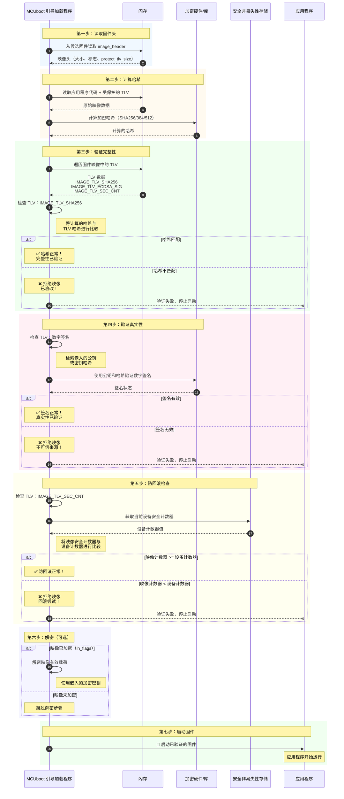

# 第 4 章：映像验证与安全

欢迎回来

在上一章[闪存布局与管理](03_flash_layout___management_.md)中，我们了解了 MCUboot 如何巧妙地将我们设备的闪存组织成不同的"槽"（主槽、辅助槽和暂存区）。这种有组织的存储对于管理固件至关重要，特别是在更新期间。

现在，想象一下我们的设备收到了一个新的固件包。它整齐地存储在辅助槽中，准备被考虑进行更新。但 MCUboot 如何知道这个新固件是否可以安全安装？它可能是恶意的、损坏的，或者是一个旧的、易受攻击的版本吗？仅仅将它存储在正确的位置是不够的；它需要严格的安全检查

这就是**映像验证与安全**发挥作用的地方。这个关键过程是 MCUboot 的最终守门人，确保只有**可信和有效的固件**才能在我们的设备上运行。这是 MCUboot 存在的核心原因——提供安全启动。

### 问题：信任我们的固件

把我们的嵌入式设备想象成一个高度安全的保险库。我们不会让任何人随意进入并更改密码或内容。同样，我们设备的固件是其核心智能，允许不可信的软件运行可能会危及整个系统。这可能导致：

*   **恶意代码执行**：黑客注入他们自己的软件。
*   **设备变砖**：损坏的更新使设备无法使用。
*   **回滚攻击**：降级到具有已知漏洞的旧固件版本。
*   **未经授权的访问**：绕过安全功能。

映像验证与安全的核心用例是**通过在允许固件控制设备之前严格检查每个固件映像来防止任何这些场景**。

### 映像验证与安全的关键概念

MCUboot 使用几种强大的技术来建立对固件映像的信任：

#### 1. 加密哈希：唯一指纹

**加密哈希**（如 SHA256、SHA384 或 SHA512）就像我们固件的唯一、不可更改的指纹。它是从整个固件映像计算出的一个短的、固定大小的字符串。

*   **工作原理**：即使固件中的单个字节发生变化，也会导致完全不同的哈希。实际上不可能找到产生相同哈希的两个不同映像。
*   **使用原因**：MCUboot 计算它在闪存上找到的固件映像的哈希。然后它将这个新计算的哈希与在映像最初构建和签名时*嵌入到映像本身*的可信哈希值进行比较。如果它们不匹配，映像已被篡改！

#### 2. 数字签名：可信公证人的印章

**数字签名**提供真实性和完整性的证明。它确认*谁*创建了固件，并保证固件在签名*之后*没有被更改。

*   **工作原理**：
    1.  固件开发人员使用**私钥**（他们保密）"签名"固件的加密哈希。这创建了数字签名。
    2.  此签名以及相应的**公钥**（公开可用，通常嵌入在 MCUboot 中或存储在安全硬件中）被嵌入到固件映像中。
    3.  MCUboot 使用公钥验证签名与固件哈希的对应关系。如果验证成功，意味着固件确实来自私钥的所有者，并且没有被更改。
*   **使用原因**：它防止未经授权的各方创建假固件或修改合法固件。MCUboot 支持各种签名算法，如 RSA、ECDSA 和 Ed25519。

#### 3. 防回滚安全计数器：不断增加的版本号

**防回滚安全计数器**是固件元数据的一部分，是一个单调（始终递增）的数字。

*   **工作原理**：每个新的合法固件版本都带有一个安全计数器值，该值等于或大于先前版本。MCUboot 将当前设备的安全计数器存储在安全的非易失性位置（如 OTP 内存）。当提供新映像时，MCUboot 将其嵌入的安全计数器与存储的值进行比较。
*   **使用原因**：它防止攻击者将较旧的、可能易受攻击的固件版本加载到设备上。如果新映像的计数器低于或等于存储的计数器（并且不是批准的降级），MCUboot 会拒绝它。

#### 4. 映像解密：锁定的保险箱

如果固件包含敏感的知识产权或关键数据，它可以被**加密**。

*   **工作原理**：固件映像使用对称加密密钥（如 AES256）加密。这个密钥本身通常使用公钥加密并嵌入到映像中，或通过密钥交换机制派生。MCUboot 使用它持有的秘密私钥解密这个对称密钥。然后，它使用对称密钥在启动过程中解密固件映像。
*   **使用原因**：它确保固件的机密性，防止未经授权的查看或代码逆向工程。

### MCUboot 如何验证映像：安全检查点

当 MCUboot 考虑启动映像时（无论是活动映像还是辅助槽中新下载的映像），它会协调所有这些安全检查。

以下是验证过程的简化视图：



如果**任何**这些检查失败，映像立即被视为无效，**将不会被启动**，维护 MCUboot 的"安全"方面。==只有当每个安全门都通过时，固件才能赢得 MCUboot 的信任。

### 探索代码：`bootutil_img_validate` 函数

整个映像验证过程由一个中心函数协调：`bootutil_img_validate`。此函数（位于 `boot/bootutil/src/image_validate.c`）将映像头、闪存区域和临时缓冲区作为输入，并执行所有必要的检查。

让我们看一下简化的代码片段，以了解它如何使用我们刚刚讨论的概念。

#### 1. 计算映像哈希

首先，MCUboot 需要计算映像内容的加密哈希。这由 `bootutil_img_hash` 处理，它由 `bootutil_img_validate` 调用。它使用"哈希上下文"（`bootutil_sha_context`）在从闪存读取映像块时更新哈希。

```c
// 来自 boot/bootutil/src/bootutil_img_hash.c 中 bootutil_img_hash 的简化摘录
int
bootutil_img_hash(struct boot_loader_state *state,
                  struct image_header *hdr, const struct flash_area *fap,
                  uint8_t *tmp_buf, uint32_t tmp_buf_sz, uint8_t *hash_result,
                  uint8_t *seed, int seed_len
                 )
{
    bootutil_sha_context sha_ctx; // 哈希上下文（例如，用于 SHA256）
    uint32_t size;
    // ... 声明 ...

    bootutil_sha_init(&sha_ctx); // 初始化哈希算法

    // 如果有种子（例如，来自分割映像加载器），将其添加到哈希中
    if (seed && (seed_len > 0)) {
        bootutil_sha_update(&sha_ctx, seed, seed_len);
    }

    // 确定要哈希的数据大小（头 + 映像有效载荷 + 受保护的 TLV）
    size = hdr->ih_hdr_size + hdr->ih_img_size + hdr->ih_protect_tlv_size;

    // 循环从闪存中分块读取数据并更新哈希
    for (uint32_t off = 0; off < size; off += blk_sz) {
        // 计算块大小并从闪存读取到 tmp_buf
        // ...（第 3 章的 flash_area_read 逻辑）...

        // 使用当前数据块更新哈希
        bootutil_sha_update(&sha_ctx, tmp_buf, blk_sz);
    }

    // 完成哈希计算
    bootutil_sha_finish(&sha_ctx, hash_result);
    bootutil_sha_drop(&sha_ctx); // 清除敏感数据

    return 0; // 成功
}
```
此过程从闪存区域（`fap`）读取映像的相关部分到临时缓冲区（`tmp_buf`），然后将这些块输入 SHA 上下文（`sha_ctx`）以构建最终哈希。`bootutil_sha_init`、`bootutil_sha_update` 和 `bootutil_sha_finish` 函数抽象了正在使用的特定 SHA 算法（例如，SHA256、SHA384、SHA512），如 `boot/bootutil/include/bootutil/crypto/sha.h` 中所示。

#### 2. 迭代和验证 TLV

在计算映像哈希后，`bootutil_img_validate` 使用 TLV 迭代器（在[第 2 章：固件映像结构](02_firmware_image_structure_.md)中介绍）来查找和处理各种与安全相关的 TLV 条目。

```c
// 来自 boot/bootutil/src/image_validate.c 中 bootutil_img_validate 的简化摘录
fih_ret
bootutil_img_validate(...) // 接受 state、hdr、fap、tmp_buf、hash 等
{
    struct image_tlv_iter it;
    uint32_t off;
    uint16_t len;
    uint16_t type;
    // ... 其他声明 ...

    // 初始化 TLV 迭代器以扫描所有 TLV
    rc = bootutil_tlv_iter_begin(&it, hdr, fap, IMAGE_TLV_ANY, false);
    if (rc) { /* 处理错误 */ FIH_SET(fih_rc, FIH_FAILURE); goto out; }

    // 循环遍历每个 TLV 条目
    while (true) {
        rc = bootutil_tlv_iter_next(&it, &off, &len, &type);
        if (rc < 0) { /* 错误 */ FIH_SET(fih_rc, FIH_FAILURE); goto out; }
        if (rc > 0) { break; /* 没有更多 TLV */ }

        switch(type) {
            case EXPECTED_HASH_TLV: // 例如，IMAGE_TLV_SHA256
            {
                // 从闪存读取嵌入在 TLV 中的哈希
                rc = LOAD_IMAGE_DATA(hdr, fap, off, buf, sizeof(hash));
                // ...（错误检查）...

                // 将嵌入的哈希与我们计算的哈希进行比较
                FIH_CALL(boot_fih_memequal, fih_rc, hash, buf, sizeof(hash));
                if (FIH_NOT_EQ(fih_rc, FIH_SUCCESS)) {
                    BOOT_LOG_ERR("映像哈希不匹配！");
                    FIH_SET(fih_rc, FIH_FAILURE); goto out;
                }
                // 标记哈希为有效
                image_hash_valid = 1;
                break;
            }
            case EXPECTED_SIG_TLV: // 例如，IMAGE_TLV_ECDSA_SIG 或 IMAGE_TLV_RSA2048_PSS
            {
                // 从 TLV 读取签名数据
                rc = LOAD_IMAGE_DATA(hdr, fap, off, buf, len);
                // ...（错误检查）...

                // 查找公钥（来自内部密钥或硬件）
                // 此调用帮助 MCUboot 找到正确的公钥进行验证
                key_id = bootutil_find_key(image_index, key_buf, len); // 简化；key_buf/len 变化
                if (key_id < 0) { /* 未找到密钥，忽略此签名或错误 */ continue; }

                // 使用计算的哈希、签名数据和公钥验证签名
                FIH_CALL(bootutil_verify_sig, valid_signature, hash, sizeof(hash), buf, len, key_id);
                if (FIH_NOT_EQ(valid_signature, FIH_SUCCESS)) {
                    BOOT_LOG_ERR("签名验证失败！");
                    // 不要立即退出，如果配置允许其他签名。
                }
                break;
            }
            case IMAGE_TLV_SEC_CNT: // 防回滚安全计数器
            {
                // 从 TLV 读取映像的安全计数器
                rc = LOAD_IMAGE_DATA(hdr, fap, off, &img_security_cnt, len);
                // ...（错误检查）...

                // 获取当前设备安全存储的安全计数器
                FIH_CALL(boot_nv_security_counter_get, fih_rc, image_index, &security_cnt);
                // ...（错误检查）...

                // 比较：新映像的计数器必须 >= 设备的计数器
                fih_rc = fih_ret_encode_zero_equality(img_security_cnt <
                                   (uint32_t)fih_int_decode(security_cnt));
                if (FIH_NOT_EQ(fih_rc, FIH_SUCCESS)) {
                    BOOT_LOG_ERR("检测到回滚！映像计数器 %u < 设备计数器 %u",
                                 img_security_cnt, (uint32_t)fih_int_decode(security_cnt));
                    FIH_SET(fih_rc, FIH_FAILURE); goto out;
                }
                // 标记安全计数器为有效
                security_counter_valid = fih_rc;
                break;
            }
            // ... 处理其他 TLV 类型，如 UUID ...
        }
    }

    // 最终检查所有必需的验证步骤是否通过
    if (FIH_NOT_EQ(fih_rc, FIH_SUCCESS)) { // 检查是否有任何先前的检查失败
        FIH_SET(fih_rc, FIH_FAILURE);
    }
out:
    FIH_RET(fih_rc);
}
```

`bootutil_verify_sig` 函数（这里没有显示为直接代码片段，但从 `image_validate.c` 内部调用）然后使用适当的加密后端（例如，来自 `boot/bootutil/include/bootutil/crypto/ecdsa.h` 的 `bootutil_ecdsa_verify` 或来自 `boot/bootutil/include/bootutil/crypto/rsa.h` 的 `bootutil_rsassa_pss_verify`）执行实际的数学签名验证。

#### 3. 解密（如果适用）

如果 `image_header` 的 `ih_flags` 指示映像已加密（例如，`IMAGE_F_ENCRYPTED_AES256`），MCUboot 也会执行解密。这通常发生在映像复制过程*之前*或*期间*，而不是直接在 `bootutil_img_validate` 中（它专注于加密完整性/真实性）。

`boot_enc_load` 函数（来自 `boot/bootutil/src/bootutil_loader.c`）负责此操作，通常涉及 `boot_decrypt_key` 来获取实际的解密密钥，然后 `boot_enc_set_key` 来准备加密上下文。最后，像 `boot_enc_decrypt`（来自 `boot/bootutil/include/bootutil/enc_key.h`）这样的函数用于在读取或复制数据块时解密它们。

```c
// boot_check_image 中的简化概念流程（bootutil_loader.c 的一部分）
fih_ret boot_check_image(...) {
    // ...
    // 检查辅助槽是否需要解密
#if defined(MCUBOOT_ENC_IMAGES) && !defined(MCUBOOT_RAM_LOAD)
    if (MUST_DECRYPT(fap, BOOT_CURR_IMG(state), hdr)) {
        // 从 TLV 加载加密密钥，解密它，并在加密状态中设置它
        rc = boot_enc_load(state, BOOT_SLOT_SECONDARY, hdr, fap, bs);
        if (rc < 0) { /* 处理错误 */ FIH_RET(fih_rc); }
        // 如果成功，boot_enc_set_key 将为解密准备加密引擎
        if (rc == 0 && boot_enc_set_key(BOOT_CURR_ENC_SLOT(state, BOOT_SLOT_SECONDARY),
                                        bs->enckey[BOOT_SLOT_SECONDARY])) {
            FIH_RET(fih_rc);
        }
    }
#endif
    // ... 继续调用 bootutil_img_validate，如果定义了 MCUBOOT_ENC_IMAGES
    // 并且它是一个解密槽，它将在哈希计算期间使用解密逻辑。
    FIH_CALL(bootutil_img_validate, fih_rc, state, hdr, fap, tmpbuf, BOOT_TMPBUF_SZ,
             NULL, 0, NULL);
    // ...
    FIH_RET(fih_rc);
}
```
这演示了 `boot_check_image` 如何设置解密过程，如果该映像槽的解密处于活动状态，这会透明地影响 `bootutil_img_hash` 读取数据的方式。

### 结论

映像验证与安全是 MCUboot 确保可信执行环境使命的基石。通过采用加密哈希来保证完整性、数字签名来保证真实性、防回滚计数器来进行版本控制，以及可选的加密来保证机密性，MCUboot 创建了一个强大的安全链。每个固件都必须通过这一系列检查才能控制我们的设备，保护它免受损坏、篡改和恶意攻击。理解这些机制对于构建安全的嵌入式系统至关重要。

接下来，我们将==探讨一个高级安全功能，它进一步加固 MCUboot 以抵御复杂的物理攻击==。

[下一章：故障注入加固（FIH）](05_fault_injection_hardening__fih__.md)

