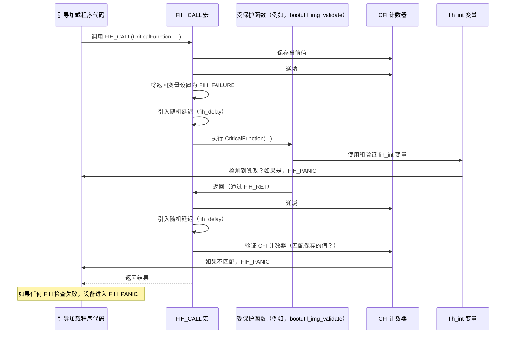

# 第 5 章：故障注入加固（FIH）

欢迎回来

在上一章[映像验证与安全](04_image_validation___security_.md)中，我们探讨了 MCUboot 如何充当强大的守门人，使用加密哈希、数字签名和安全计数器来确保只有可信固件在我们的设备上运行。这可以防止基于软件的攻击，如恶意更新。

但是，如果攻击者试图不是通过巧妙的代码，而是通过直接的**物理手段**来绕过这些检查呢？这就是一个更高级的威胁发挥作用的地方：**故障注入攻击**。这些攻击涉及在精确的时刻故意向我们设备的硬件引入故障、电压尖峰，甚至激光脉冲，以改变其行为。想象一下，试图通过短暂分散其"大脑"的注意力来使安全系统"忘记"关键的安全检查！

这正是**故障注入加固（FIH）**所解决的问题。FIH 是内置于 MCUboot 中的一组高级保护措施，使这些物理攻击更难成功，即使在直接的物理篡改尝试下也能确保我们设备的安全。

### 问题：对关键逻辑的物理攻击

想想 MCUboot 在验证映像中的作用：它执行几个关键比较，如"计算的哈希是否等于存储的哈希？"或"新固件的版本号是否大于旧版本号？"。如果攻击者能够在这些比较之一发生的确切时刻物理"故障"硬件，他们可能能够强制比较返回"真"，即使它应该是"假"，从而有效地绕过安全检查。

FIH 的核心用例是**保护引导加载程序内的这些关键决策点和控制流**。这就像在我们安全保险库的最重要部分周围放置额外的钢层、警报和冗余系统，以防止即使是复杂的物理破坏。

### 故障注入加固的关键概念

MCUboot 使用几种协同工作的技术来实现 FIH，以检测和抵抗故障注入：

#### 1. 双变量（`fih_int`）

想象一下，我们有一个超级重要的秘密数字。我们不是只写一次，而是写两次：一次正常写，一次用特殊掩码加密写。为了验证我们的秘密，我们解密第二个副本并将其与第一个副本进行比较。如果它们不匹配，我们就知道有人试图篡改我们的秘密。

这就是使用 `fih_int` 类型的**双变量**背后的想法。关键值不是作为简单的 `int` 变量存储，而是作为一对存储：
*   实际值（`val`）。
*   值的异或掩码（`msk`），其中 `msk = val ^ _fih_mask`。

MCUboot 在使用变量之前检查这两部分。如果故障注入只改变 `val` 或 `msk`，但没有一致地改变两者，检查将失败，MCUboot 将检测到篡改。

#### 2. 控制流完整性（CFI）计数器（`_fih_cfi_ctr`）

当 MCUboot 执行复杂操作时，它遵循非常特定的步骤序列（其"控制流"）。CFI 就像在安全门处有一个数字旋转门或检查清单。每次 MCUboot 进入关键函数时，全局 **CFI 计数器**递增。当它成功退出时，计数器递减。

在调用关键函数之前，保存当前的 CFI 计数器值。函数返回后，MCUboot 验证计数器是否正确返回到其先前的值（意味着它恰好递增然后递减一次）。如果数字不匹配，这表明由于故障可能跳过了指令或采取了意外路径，从而触发恐慌。

#### 3. 随机延迟（`fih_delay`）

故障注入攻击通常依赖于精确的时序——在执行特定指令的确切微秒时用故障击中设备。

**随机延迟**在关键代码路径的各个点引入微小的、不可预测的暂停。这使得攻击者更难正确计时他们的故障注入。这就像试图射击一个移动目标，它还不可预测地改变其速度和方向。这些延迟需要随机性来源，通常来自加密安全伪随机数生成器（CSPRNG）。

#### 4. 全局故障循环（`fih_panic_loop`）

如果 MCUboot 检测到故障或不一致（例如，双变量不匹配或 CFI 计数器错误），它需要进入安全的、不可恢复的状态——"恐慌"。简单地循环 `while(1)` 有时可以被高级故障注入绕过。

**全局故障循环**提供了一个加固的恐慌状态。它设计有多个冗余跳转，并用编译器属性标记以防止优化。这使得攻击者极难"解除循环"恐慌并强制引导加载程序在检测到故障后继续执行。

### MCUboot 如何使用 FIH：超级安全检查点

这些机制集成到 MCUboot 中，特别是在敏感操作周围，如映像验证、密钥解密和闪存操作。

以下是使用 FIH 保护 MCUboot 中关键函数调用的方式：



在此流程中，`FIH_CALL` 宏包装敏感函数（`CriticalFunction`）。它使用 CFI 计数器确保函数被正确调用，引入随机延迟以阻止精确计时，并且在内部，`CriticalFunction` 本身使用 `fih_int` 变量，这些变量也会被检查完整性。如果这些检查中的任何一个失败，设备将立即进入加固的 `FIH_PANIC` 状态。

### 探索代码：MCUboot 的 FIH 实现内部

MCUboot 的 FIH 实现主要位于 `boot/bootutil/include/bootutil/fault_injection_hardening.h` 和 `boot/bootutil/src/fault_injection_hardening.c` 中。启用的特定 FIH 功能取决于我们项目配置中选择的 `MCUBOOT_FIH_PROFILE`（例如，`MCUBOOT_FIH_PROFILE_HIGH` 启用所有功能，`MCUBOOT_FIH_PROFILE_LOW` 启用子集，`MCUBOOT_FIH_PROFILE_OFF` 禁用它）。

#### 1. 双变量（`fih_int`）

让我们看看 `fih_int` 结构和相关函数：

```c
// 文件：boot/bootutil/include/bootutil/fault_injection_hardening.h

#ifdef FIH_ENABLE_DOUBLE_VARS
extern volatile int _fih_mask; // 全局异或掩码
typedef volatile struct {
    volatile int val; // 实际值
    volatile int msk; // 与 _fih_mask 异或的值
} fih_int;
typedef volatile int fih_ret; // FIH 保护函数的返回类型

// ...（其他 FIH_ENABLE_DOUBLE_VARS 代码）...

__attribute__((always_inline)) inline
void fih_int_validate(fih_int x)
{
    if (x.val != (x.msk ^ _fih_mask)) {
        FIH_PANIC; // 检测到篡改！
    }
}

__attribute__((always_inline)) inline
int fih_int_decode(fih_int x)
{
    fih_int_validate(x); // 使用前验证
    return x.val;
}

__attribute__((always_inline)) inline
fih_int fih_int_encode(int x)
{
    fih_int ret = {x, x ^ _fih_mask}; // 存储值及其掩码副本
    return ret;
}

#define FIH_EQ(x, y) ((x == y) && fih_delay() && !(y != x)) // 加固的相等性检查
#define FIH_NOT_EQ(x, y) ((x != y) || !fih_delay() || !(y == x)) // 加固的不等性检查
#define FIH_SET(x, y) x = y; if(fih_delay() && (x != y)) FIH_PANIC // 加固的赋值
#endif // FIH_ENABLE_DOUBLE_VARS
```
*   `_fih_mask`：用于创建掩码副本的全局易失性值。`volatile` 防止编译器将其优化掉。
*   `fih_int`：保存值及其掩码副本的结构。
*   `fih_int_validate`：此函数执行关键检查：它将 `msk` 与 `_fih_mask` 异或，并将结果与 `val` 进行比较。如果它们不匹配，触发 `FIH_PANIC`。
*   `fih_int_decode`：从 `fih_int` 获取真实值，但*仅在验证后*。
*   `fih_int_encode`：从常规 `int` 创建 `fih_int`，自动生成掩码副本。
*   `FIH_EQ`、`FIH_NOT_EQ`、`FIH_SET`：这些宏提供常见操作的加固版本，集成随机延迟和对不一致的即时恐慌。

#### 2. 控制流完整性（CFI）计数器

CFI 计数器跟踪执行流：

```c
// 文件：boot/bootutil/include/bootutil/fault_injection_hardening.h

#ifdef FIH_ENABLE_CFI
extern fih_int _fih_cfi_ctr; // 全局 CFI 计数器
#endif // FIH_ENABLE_CFI

// 文件：boot/bootutil/src/fault_injection_hardening.c

#ifdef FIH_ENABLE_CFI
// 在启动时初始化计数器（0, 0 ^ _fih_mask）。

fih_int fih_cfi_get_and_increment(void)
{
    fih_int saved = _fih_cfi_ctr;
    _fih_cfi_ctr = fih_int_encode(fih_int_decode(saved) + 1); // 递增计数器
    return saved; // 返回递增*之前*的值
}

void fih_cfi_validate(fih_int saved)
{
    if (fih_int_decode(saved) != fih_int_decode(_fih_cfi_ctr)) {
        FIH_PANIC; // 不匹配意味着执行被篡改！
    }
}

void fih_cfi_decrement(void)
{
    _fih_cfi_ctr = fih_int_encode(fih_int_decode(_fih_cfi_ctr) - 1); // 递减计数器
}
#endif // FIH_ENABLE_CFI
```
*   `_fih_cfi_ctr`：存储 CFI 计数器的全局 `fih_int`（因此它也受益于双变量保护）。
*   `fih_cfi_get_and_increment`：由 `FIH_CFI_PRECALL_BLOCK`（`FIH_CALL` 的一部分）调用，以保存当前计数器然后递增它。
*   `fih_cfi_validate`：由 `FIH_CFI_POSTCALL_BLOCK`（`FIH_CALL` 的一部分）调用，以将函数执行后的计数器值与 `saved` 值进行比较。如果它们不相等，`FIH_PANIC`。
*   `fih_cfi_decrement`：由 `FIH_CFI_PRERET`（`FIH_RET` 的一部分）调用，当受保护的函数成功返回时递减计数器。

#### 3. 随机延迟

`fih_delay` 函数引入随机的、非确定性的暂停：

```c
// 文件：boot/bootutil/include/bootutil/fault_injection_hardening.h

#ifdef FIH_ENABLE_DELAY
// 包含定义 fih_delay_random_uchar() 的头文件

__attribute__((always_inline)) inline
int fih_delay(void)
{
    unsigned char delay;
    volatile int foo = 0; // 防止优化
    volatile int rc;

    delay = fih_delay_random_uchar(); // 获取随机延迟值

    for (volatile int i = 0; i < delay; i++) {
        foo++; // 引入忙等待循环
    }

    rc = 1; // 易失性返回以防止优化
    return rc;
}
#endif // FIH_ENABLE_DELAY
```
*   `fih_delay_random_uchar()`：此函数通常使用加密安全随机数生成器（CSPRNG）如 mbedTLS 实现，提供随机的 `unsigned char` 值。
*   `for` 循环忙等待随机持续时间，使后续指令的确切时序不可预测。`volatile` 关键字对于防止编译器优化掉循环或返回值至关重要。

以下是 mbedTLS 后端：

```c
// 文件：boot/bootutil/src/fault_injection_hardening_delay_rng_mbedtls.c
#ifdef FIH_ENABLE_DELAY
#include "mbedtls/ctr_drbg.h"
#include "mbedtls/entropy.h"

mbedtls_entropy_context fih_entropy_ctx;
mbedtls_ctr_drbg_context fih_drbg_ctx;

int fih_delay_init(void)
{
    // 初始化熵源和 DRBG（确定性随机位生成器）
    mbedtls_entropy_init(&fih_entropy_ctx);
    mbedtls_ctr_drbg_init(&fih_drbg_ctx);
    mbedtls_ctr_drbg_seed(&fih_drbg_ctx , mbedtls_entropy_func,
                          &fih_entropy_ctx, NULL, 0);
    return 1;
}

unsigned char fih_delay_random_uchar(void)
{
    unsigned char delay;
    // 使用 DRBG 生成随机字节
    mbedtls_ctr_drbg_random(&fih_drbg_ctx,(unsigned char*) &delay,
                            sizeof(delay));
    return delay;
}
#endif // FIH_ENABLE_DELAY
```
这显示了 `fih_delay_random_uchar` 如何从 mbedTLS 支持的 DRBG 获取其随机性，而 DRBG 又由熵源播种。

#### 4. 全局故障循环

加固的 `fih_panic_loop` 确保强大的恐慌状态：

```c
// 文件：boot/bootutil/src/fault_injection_hardening.c

#ifdef FIH_ENABLE_GLOBAL_FAIL
__attribute__((used)) __attribute__((noinline)) __attribute__((noreturn))
void fih_panic_loop(void)
{
    // 多个无条件跳转到自身以混淆攻击者
    __asm volatile ("b fih_panic_loop");
    __asm volatile ("b fih_panic_loop");
    __asm volatile ("b fih_panic_loop");
    // ... 更多跳转 ...
    __asm volatile ("b fih_panic_loop");

    // 一个无限循环以抑制编译器警告
    while (1) {}
}
#define FIH_PANIC fih_panic_loop() // 调用恐慌循环的宏
#else
#define FIH_PANIC while (1) {} // 如果未启用则简单循环
#endif // FIH_ENABLE_GLOBAL_FAIL
```
*   `__attribute__((used))`、`__attribute__((noinline))`、`__attribute__((noreturn))`：这些编译器属性确保函数不被优化掉，不被内联（因此保留其独特结构），并且永不返回。
*   `__asm volatile ("b fih_panic_loop")`：这些是汇编指令，创建多个到 `fih_panic_loop` 开始的无条件分支。这使得攻击者更难跳过循环或强制执行到代码的不同部分。

默认情况下，如果我们通过 `MCUBOOT_FIH_PROFILE_HIGH`、`MEDIUM` 或 `LOW` 启用 FIH，这些保护将在关键的 MCUboot 代码路径中激活，例如，在[映像验证与安全](04_image_validation___security_.md)检查或[固件更新策略](06_firmware_update_strategies_.md)状态更改期间。

### 结论

故障注入加固（FIH）为 MCUboot 添加了关键的防御层，超越了仅软件安全，以防止复杂的物理攻击。通过结合双变量、控制流完整性、随机延迟和弹性恐慌机制等技术，FIH 使攻击者极难篡改 MCUboot 的执行并绕过其基本安全检查。这确保即使在直接物理攻击下，我们的嵌入式设备仍然安全可信。

接下来，我们将探讨 ==MCUboot 如何利用所有这些安全和管理功能在我们的设备上执行可靠和安全的固件更新==。

[下一章：固件更新策略](06_firmware_update_strategies_.md)

