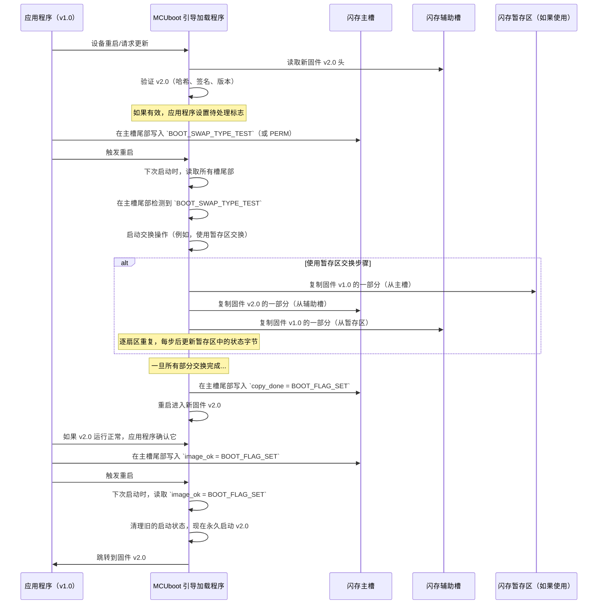
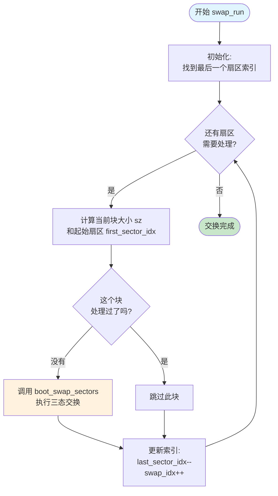
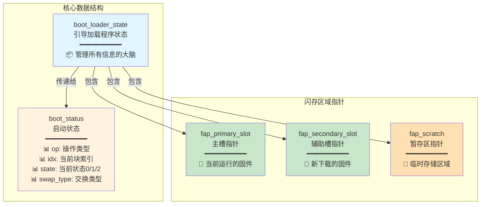
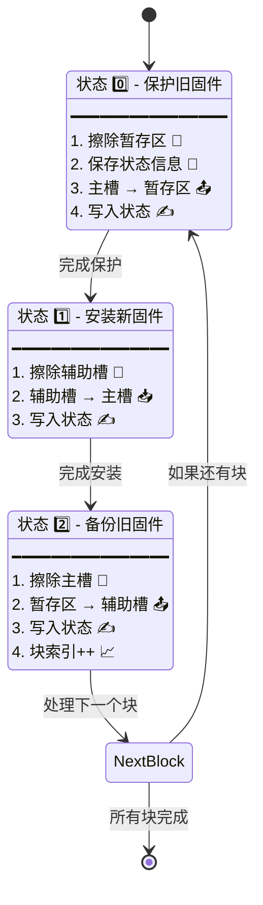
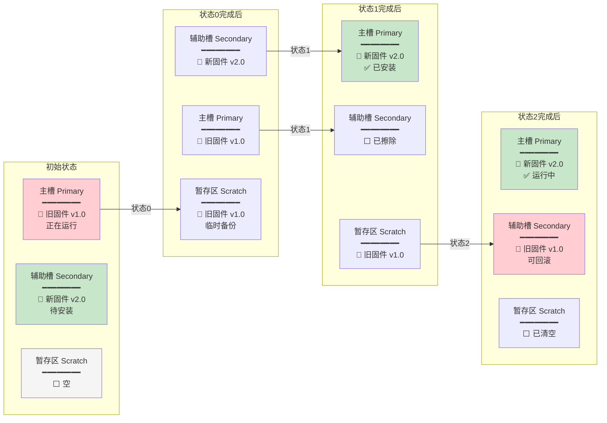
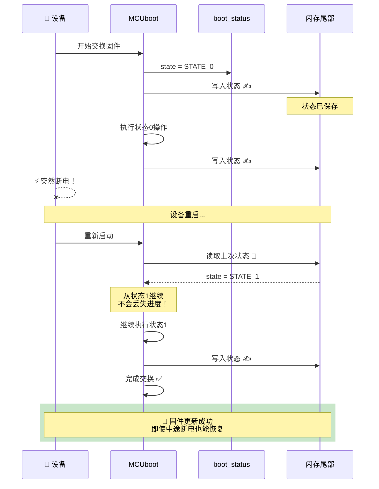
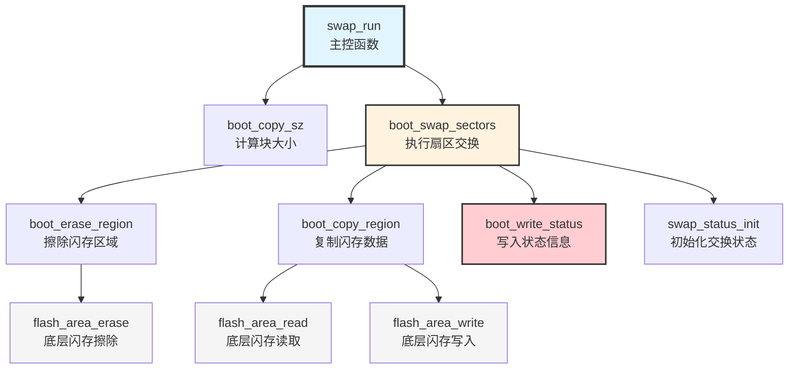

# 第 6 章：固件更新策略

欢迎回来

在上一章[故障注入加固（FIH）](05_fault_injection_hardening__fih__.md)中，我们了解了 MCUboot 如何保护自己免受复杂的物理攻击，确保其关键安全检查不能被绕过。但如果更新我们设备固件的基本行为本身不够强大和可靠，那么所有这些安全性都是徒劳的。

想象一下，我们已经向设备发送了一个新的、安全的固件更新。它位于辅助存储槽中，已验证并准备就绪。MCUboot 实际上如何*安装*这个新固件并使其成为活动的、运行的软件？如果在此过程中突然断电会发生什么？我们如何确保设备不会最终"变砖"——完全无法启动任何有效软件？

这就是**固件更新策略**发挥作用的地方。这些是 MCUboot 用来安全可靠地替换我们设备固件的精心设计的"游戏计划"。它们精确规定了如何安装新映像，确保我们的设备始终有一个可工作的软件版本，即使在更新过程中出现问题。

### 问题：安全可靠的固件更新

在嵌入式设备上更新固件就像在患者仍在移动时进行心脏直视手术。我们需要替换一个重要组件（固件），而不能让系统变得不稳定或无响应。

固件更新策略的核心用例是执行**空中（OTA）固件更新**而不会有设备故障的风险。当需要安装新固件版本时，MCUboot 必须：

1.  **存储新映像**：在一个单独的、非活动的区域，这样当前运行的固件不会受到干扰。（参考[闪存布局与管理](03_flash_layout___management_.md)）
2.  **验证新映像**：检查其真实性和完整性。（参考[映像验证与安全](04_image_validation___security_.md)）
3.  **执行交换**：用新固件替换旧固件。这是棘手的部分！
4.  **确保断电安全**：如果在交换过程中断电，设备仍然必须能够启动*某些*有效的东西。它永远不应该处于不可用状态。
5.  **防止回滚**：确保攻击者不能强制设备回到较旧的、易受攻击的固件版本。（参考[映像验证与安全](04_image_validation___security_.md)）
6.  **确认更新**：一旦新固件成功启动，将其标记为永久。

这些策略都是关于执行步骤 3 并确保始终满足步骤 4-6。

### 固件更新策略

所有 MCUboot 更新策略都围绕管理我们设备闪存中的数据。它们使用**主槽**（活动固件运行的地方）和**辅助槽**（新固件暂存的地方）。一些高级策略还使用**暂存区**进行临时存储，如[闪存布局与管理](03_flash_layout___management_.md)中所讨论的。

所有这些策略依赖的一个关键元素是存储在闪存槽最末端的**元数据**，称为"映像尾部"。此元数据包括：

*   ==**魔数**：特殊值（如 `BOOT_MAGIC_GOOD`），指示槽是否包含有效的、完全复制的映像==
*   **交换类型标志**：（`BOOT_SWAP_TYPE_TEST`、`BOOT_SWAP_TYPE_PERM`、`BOOT_SWAP_TYPE_REVERT`）这些告诉 MCUboot *需要什么类型*的更新（例如，"试用这个新映像一次"、"使这个新映像永久"或"返回到旧映像"）。
*   **状态标志**：（`copy_done`、`image_ok`）这些跟踪更新操作的进度以及启动的映像是否已被确认为正常工作。

这些元数据，通常被称为"启动记录"（我们将在[共享数据/启动记录](08_shared_data___boot_record_.md)中探讨），以一种允许 MCUboot 在意外重置后准确从中断处继续的方式存储。

### MCUboot 中的固件更新策略类型

MCUboot 支持几种策略，每种策略在复杂性、闪存空间要求和性能方面都有不同的权衡。

| 策略               | 描述                                                         | 关键特性                                                 | 优点                                                         | 缺点                                                       | 使用场景                                                     |
| :----------------- | :----------------------------------------------------------- | :------------------------------------------------------- | :----------------------------------------------------------- | :--------------------------------------------------------- | :----------------------------------------------------------- |
| **仅覆盖**         | 新固件映像直接写入主槽，覆盖旧固件。没有单独的辅助槽用于暂存。 | 无辅助槽，最简单。                                       | 最小的闪存占用空间。                                         | 写入期间没有真正的断电安全（可能变砖），无法回滚到旧映像。 | 非常小的、资源受限的设备，闪存空间极其有限，更新不频繁/不太关键。 |
| **使用暂存区交换** | 新映像下载到辅助槽。在更新期间，旧的主槽映像临时移动到专用的"暂存区"区域，新映像从辅助槽移动到主槽，然后旧映像从暂存区移动到辅助槽。 | 需要主槽、辅助槽和第三个"暂存区"闪存区域。               | 最强大，高度断电安全，易于回滚。                             | 需要更多闪存空间（三个完整大小的映像区域或等效空间）。     | 关键系统（例如，医疗、工业），其中高可靠性、断电安全和回滚能力至关重要。 |
| **使用移动交换**   | 新映像下载到辅助槽。主槽通常比辅助槽大一个闪存扇区。这个额外的扇区充当临时缓冲区，允许在主槽和辅助槽扇区之间"洗牌"数据，而无需单独的暂存区。 | 主槽通常比辅助槽大一个扇区；无暂存区。                   | 不需要暂存区，断电安全，可能回滚。                           | 更复杂的闪存布局（不均匀的槽大小），更复杂的逻辑。         | 闪存空间有限（无法承受暂存区）但仍需要强大的、断电安全更新的设备。 |
| **使用偏移交换**   | 新映像下载到辅助槽。辅助槽通常比主槽大一个闪存扇区。此策略在主槽和辅助槽之间移动扇区，通过一个扇区偏移有效地移动映像以执行交换。不需要暂存区。 | 辅助槽通常比主槽大一个扇区；无暂存区；通过偏移移动内容。 | 不需要暂存区，断电安全，可能回滚，某些情况下可能更少的擦除/写入。 | 更复杂的闪存布局（不均匀的槽大小），更复杂的逻辑。         | 类似于使用移动交换，但对于特定的闪存硬件架构或更新模式可能更优化。 |

大多数现代 MCUboot 实现使用"交换"策略之一，因为它们具有卓越的断电安全性和回滚能力。

### 基于交换的更新如何工作

让我们看一下通用的交换更新过程。想象一下，我们正在从 `固件 v1.0`（在主槽中）更新到 `固件 v2.0`（在辅助槽中）。



注意将"状态字节"（如 `BOOT_SWAP_TYPE_TEST`、`copy_done`、`image_ok`）写入闪存区域尾部的关键步骤。这些小写入通常以原子方式完成（在单个可验证的操作中），并允许 MCUboot 在任何意外重置后重建状态。如果在交换期间断电，MCUboot 在下次启动时读取这些状态字节，并恢复交换或恢复到原始的、可工作的固件。这就是**断电安全**的本质。

### 触发更新：应用程序的角色

虽然 MCUboot 处理实际的交换，但我们设备的应用程序决定*何时*触发更新以及执行*什么类型*的更新。应用程序使用简单的 API 调用来指示 MCUboot。

`boot_swap_type_multi` 函数（来自 `boot/bootutil/include/bootutil/bootutil_public.h`）由 MCUboot 内部使用以确定所需的操作。然而，应用程序使用像 `boot_set_pending_multi` 这样的函数来请求更新。

```c
// 文件：boot/bootutil/include/bootutil/bootutil_public.h（简化）

// 这些定义了交换操作的不同"意图"
#define BOOT_SWAP_TYPE_NONE     1  // 不需要交换
#define BOOT_SWAP_TYPE_TEST     2  // 试用新映像一次，然后确认或恢复
#define BOOT_SWAP_TYPE_PERM     3  // 立即使新映像永久
#define BOOT_SWAP_TYPE_REVERT   4  // 返回到先前的映像
// ... 其他用于失败情况的交换类型 ...

/**
 * 将辅助槽中的映像标记为待处理。
 *
 * @param image_index       映像对索引（单映像系统为 0）。
 * @param permanent         0 = 运行映像一次；1 = 永久运行映像。
 * @return                  成功时为 0；失败时为非零。
 */
int boot_set_pending_multi(int image_index, int permanent);

/**
 * 将主槽中的映像标记为已确认。
 *
 * @param image_index       映像对索引。
 * @return                  成功时为 0；失败时为非零。
 */
int boot_set_confirmed_multi(int image_index);
```
*   `boot_set_pending_multi(0, 0)`：告诉 MCUboot 对映像 0 执行"测试"交换。它将交换到新映像，启动它，然后如果应用程序*没有*调用 `boot_set_confirmed_multi`，它将在下次重启时恢复。
*   `boot_set_pending_multi(0, 1)`：告诉 MCUboot 对映像 0 执行"永久"交换。新映像将立即成为永久映像。
*   `boot_set_confirmed_multi(0)`：在应用程序成功启动并在新固件（例如，v2.0）上运行一段时间后由应用程序调用。这告诉 MCUboot v2.0 是好的，应该永久保留。它清除任何待处理的测试交换标志。

这些函数通过将适当的 `BOOT_SWAP_TYPE_` 值和其他标志写入相关闪存区域的尾部来工作，然后 MCUboot 在下次启动时读取这些标志。

### MCUboot 内部：`swap_run` 编排

移动数据和管理状态的实际"繁重工作"由一个名为 `swap_run` 的函数处理。此函数的确切实现因启用的交换策略而异（例如，`MCUBOOT_SWAP_USING_SCRATCH`、`MCUBOOT_SWAP_USING_MOVE`、`MCUBOOT_SWAP_USING_OFFSET` 作为编译时选项）。

让我们看一下来自 `使用暂存区交换` 策略的简化 `swap_run`，以了解其逻辑。

```c
// 文件：boot/bootutil/src/swap_scratch.c（简化）

void
swap_run(struct boot_loader_state *state, struct boot_status *bs,
         uint32_t copy_size)
{
    // ...（闪存区域、扇区大小等的声明）...

    BOOT_LOG_INF("使用暂存区算法开始交换。");

    // 确定需要复制哪些扇区
    last_sector_idx = find_last_sector_idx(state, copy_size);
    swap_idx = 0;

    // 循环遍历可以放入暂存区的每个扇区"块"
    while (last_sector_idx >= 0) {
        // 计算当前要使用暂存区交换的数据块的大小（sz）和第一个扇区索引（first_sector_idx）。
        sz = boot_copy_sz(state, last_sector_idx, &first_sector_idx);

        // 如果此块尚未处理（或需要恢复）
        if (swap_idx >= (bs->idx - BOOT_STATUS_IDX_0)) {
            // 此核心函数执行三向复制（主槽 -> 暂存区 -> 辅助槽 -> 主槽）
            // 并更新 `bs->state` 中的状态标志。
            boot_swap_sectors(first_sector_idx, sz, state, bs);
        }

        // 移动到要处理的下一个扇区块（向后工作）
        last_sector_idx = first_sector_idx - 1;
        swap_idx++;
    }
}

// 使用暂存区交换的简化 'boot_swap_sectors' 逻辑
static void
boot_swap_sectors(int idx, uint32_t sz, struct boot_loader_state *state,
        struct boot_status *bs)
{
    // 指向主槽、辅助槽和暂存区闪存区域的指针
    const struct flash_area *fap_primary_slot = BOOT_IMG_AREA(state, BOOT_SLOT_PRIMARY);
    const struct flash_area *fap_secondary_slot = BOOT_IMG_AREA(state, BOOT_SLOT_SECONDARY);
    const struct flash_area *fap_scratch = state->scratch.area;

    uint32_t img_off = boot_img_sector_off(state, BOOT_SLOT_PRIMARY, idx); // 当前数据块的偏移量
    int rc;

    // 状态 0：从辅助槽复制到暂存区（临时保存主槽数据）
    if (bs->state == BOOT_STATUS_STATE_0) {
        BOOT_LOG_DBG("擦除暂存区");
        rc = boot_erase_region(fap_scratch, 0, flash_area_get_size(fap_scratch), false); ASSERT(rc == 0);

        // 将状态信息保存到暂存区（例如，如果断电，MCUboot 知道在这里查找）
        rc = swap_status_init(state, fap_scratch, bs); ASSERT(rc == 0);

        // 从辅助槽复制内容到暂存区
        rc = boot_copy_region(state, fap_secondary_slot, fap_scratch, img_off, 0, sz); ASSERT(rc == 0);

        rc = boot_write_status(state, bs); // 更新活动状态区域中的状态
        bs->state = BOOT_STATUS_STATE_1; // 移动到下一个状态
    }

    // 状态 1：从辅助槽复制到主槽（安装新固件）
    if (bs->state == BOOT_STATUS_STATE_1) {
        rc = boot_erase_region(fap_secondary_slot, img_off, sz, false); ASSERT(rc == 0);
        // 从主槽复制内容到辅助槽（旧主槽现在在辅助槽中）
        rc = boot_copy_region(state, fap_primary_slot, fap_secondary_slot, img_off, img_off, sz); ASSERT(rc == 0);

        rc = boot_write_status(state, bs);
        bs->state = BOOT_STATUS_STATE_2;
    }

    // 状态 2：从暂存区复制到主槽（恢复旧主槽内容）
    if (bs->state == BOOT_STATUS_STATE_2) {
        rc = boot_erase_region(fap_primary_slot, img_off, sz, false); ASSERT(rc == 0);
        // 从暂存区复制内容到主槽（新主槽现在在主槽中）
        rc = boot_copy_region(state, fap_scratch, fap_primary_slot, 0, img_off, sz); ASSERT(rc == 0);

        rc = boot_write_status(state, bs);
        bs->idx++; // 递增到下一个块
        bs->state = BOOT_STATUS_STATE_0; // 为下一个块重置状态
    }
}
```
*   `boot_loader_state`：此对象（我们在[第 1 章：引导加载程序状态](01_bootloader_state_.md)中的"大脑"）被传递以管理所有信息。
*   `boot_status *bs`：此结构（`boot_status`）保存交换操作的当前状态（`op`、`idx`、`state`、`swap_type` 等）。它对于断电安全至关重要。
*   `boot_erase_region`、`boot_copy_region`：这些函数执行实际的闪存操作，从一个[闪存布局与管理](03_flash_layout___management_.md)区域读取并写入另一个区域。
*   `boot_write_status`：此函数被频繁调用以在闪存尾部记录当前进度。如果设备重启，MCUboot 读取此状态并确切知道从哪里恢复。

这种复杂的擦除、复制和更新状态标志的舞蹈确保在任何时候，即使断电，设备也可以恢复到已知的良好状态，要么通过继续交换，要么恢复到先前的固件。

### 可视化

## 1. 整体流程图 - swap_run 函数执行流程



## 2. 数据结构关系图



## 3. 三态交换过程 - boot_swap_sectors 详细步骤



## 4. 闪存区域数据流动图 - 三向复制可视化



## 5. 断电恢复机制图



## 6. 关键函数调用关系图



## 总结

想象你要搬家（更新固件）：

1. **主槽** = 你现在住的房子（旧固件 v1.0）
2. **辅助槽** = 新买的房子（新固件 v2.0）
3. **暂存区** = 临时仓库

**三态交换过程就像：**

- **状态 0**：把旧房子的东西先搬到仓库 📦
- **状态 1**：把新房子的东西搬进旧房子 🚚
- **状态 2**：把仓库里的旧东西搬到新房子（作为备份）🏠

**断电安全就像：**
==每搬完一车东西，就在小本子上记一笔 ✍️，即使中途停电，醒来看看小本子就知道搬到哪了，继续搬就行==！

### 结论

==固件更新策略是 MCUboot 用来保持我们设备软件最新和安全的精心规划的程序。==

通过==智能利用闪存槽、仔细管理元数据（如魔数和状态标志）以及利用原子操作==，MCUboot 确保更新不仅安全和经过验证，而且对断电具有强大的抵抗力，并能够防止回滚攻击。理解这些策略是体悟 MCUboot 为嵌入式系统带来的弹性和可靠性的关键。

接下来，我们将探讨==如何首先将新固件放到我们的设备上，使用串行下载接口。==

[下一章：串行下载/DFU 接口](https://monica.im/home/chat/Monica/07_serial_download_dfu_interface_.md)