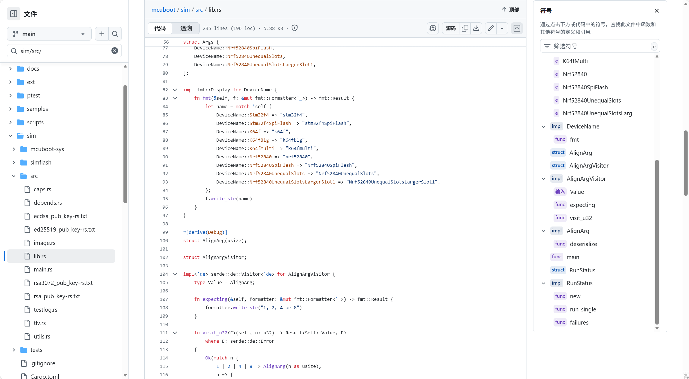
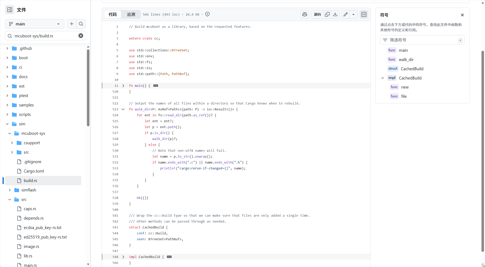
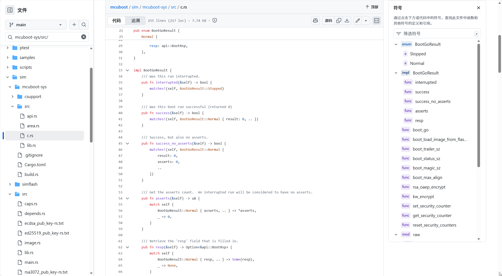

# C 语言仓库引入 Rust： MCUboot 为例

## 背景

MCUboot 是一个成熟的嵌入式设备安全引导加载程序，核心代码由 C 语言编写。然而在其代码仓库中，我们能发现 `Cargo.toml`、`Cargo.lock` 等 Rust 项目的典型文件。这是否意味着项目正在从 C 迁移到 Rust？实际情况更加巧妙。


## 发现

**MCUboot 并未重写核心代码，而是在工具层引入了 Rust。** 具体来说：

- **C 代码仍是主体**：引导加载器本身依然用 C 实现
- **Rust 用于工具链**：==模拟器、测试工具等辅助组件采用 Rust 编写==
- **通过 FFI 桥接**：两种语言通过外部函数接口（FFI）协作

## 架构

### 1. Workspace 结构

根目录的 `Cargo.toml` 定义了 Rust workspace：


这表明 Rust 代码主要集中在 `sim` 目录（模拟器组件）。

### 2. 关键组件

**bootsim（sim/Cargo.toml）**
- 用 Rust 编写的引导加载器模拟器
- 依赖现代 Rust 生态库（ring、aes、cipher 等）
- ==通过 feature 映射调用底层 C 功能==

**mcuboot-sys**
- 标准的 `-sys` 风格 Rust crate
- 使用 `cc` crate 在构建时编译 C 源码
- 提供 `extern "C"` FFI 接口供 Rust 调用

### 3. 🎢工作流程


**构建过程：**
1. `mcuboot-sys` 的 `build.rs` 脚本调用 `cc` crate
2. 将仓库中的 C 代码编译成静态库
3. 生成 Rust FFI 绑定
4. `bootsim` 通过这些绑定调用 C 函数
5. 实现模拟 flash、签名验证等功能

## 为什么这样做？

### 优势

**保留既有投资**：无需重写经过验证的 C 代码  
**现代工具链**：利用 Rust 的包管理、测试框架  
**渐进式改进**：==从工具层开始，风险可控==  
**生态互补**：Rust 的密码学库 + C 的底层控制

### 场景

这种模式特别适合：
- ==有大量成熟 C 代码的项目==
- 需要更好的开发工具和==测试==设施
- 希望逐步引入现代语言特性
- 团队同时具备 C 和 Rust 能力

## 实践

### 关键文件位置

```
mcuboot/
├── Cargo.toml          # Workspace 定义
├── Cargo.lock          # 依赖锁定
├── sim/
│   ├── Cargo.toml      # bootsim crate
│   └── src/            # Rust 模拟器代码
└── mcuboot-sys/
    ├── Cargo.toml      # FFI 绑定 crate
    ├── build.rs        # C 代码编译脚本
    └── src/            # extern "C" 接口
```

### 交互

想了解 C/Rust 交互，可以学习下面文件（之后有机会 可以对这部分 开一个专栏，其中代码有很多我们可以学习到的tricks~）

`sim/src/` - Rust 如何调用 C 函数



`mcuboot-sys/build.rs` - C 代码如何被编译



`mcuboot-sys/src/` - FFI 绑定的具体实现



## 总结

MCUboot 的 Rust 集成是一个**务实的工程决策**：

> 不是替换，而是增强。通过 `-sys` crate 模式，让 C 和 Rust 各司其职——C 负责关键的引导逻辑，==Rust 提供强大的工具和测试能力==。

这种模式在开源社区中越来越常见（如 curl、OpenSSL 等项目），==为传统 C 项目提供了一条平滑的现代化路径==。对于考虑引入 Rust 的 C 项目，这是一个值得参考的实践案例。

---

参考

- [MCUboot 仓库](https://github.com/mcu-tools/mcuboot)
- [Rust FFI 指南](https://doc.rust-lang.org/nomicon/ffi.html)
- [cc crate 文档](https://docs.rs/cc/)