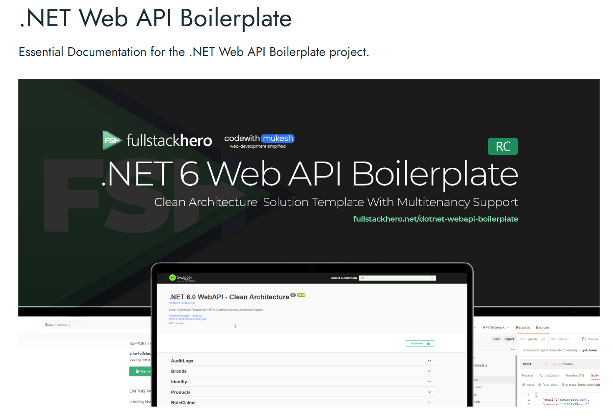
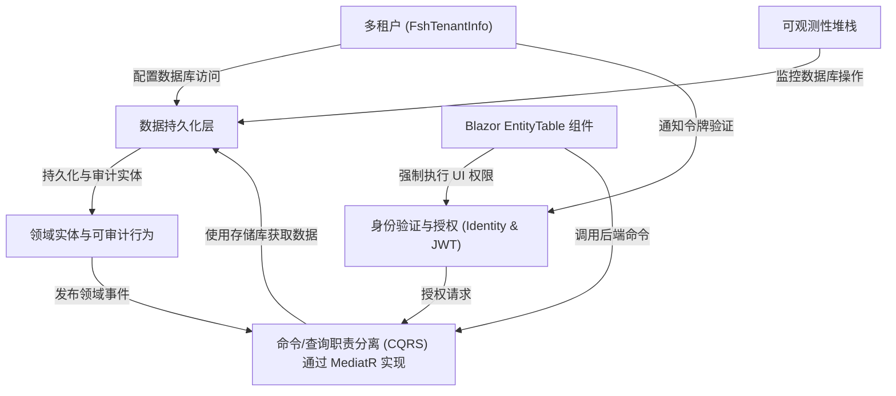
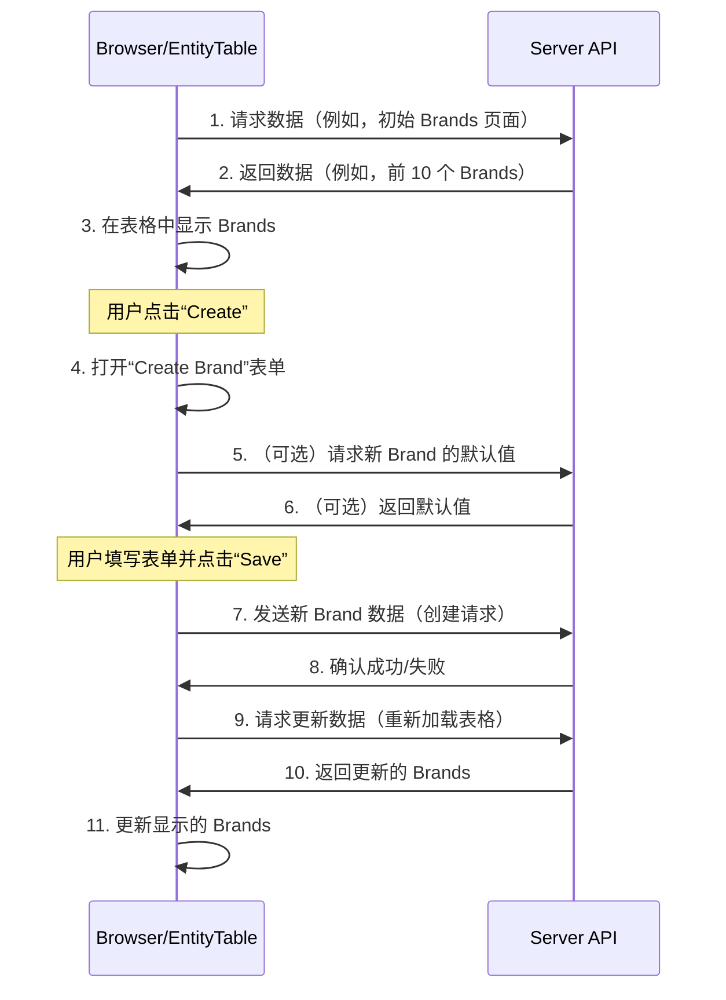

链接：[.NET Web API Boilerplate - fullstackhero](https://fullstackhero.net/dotnet-webapi-boilerplate/)



# docs：dotnet-starter-kit

`FullStackHero .NET Starter Kit` 是一个基于 ASP.NET Core Web API 和 Blazor 构建的==**Clean Architecture solution**==。

它提供了开箱即用的支持，包括*多租户*、*身份验证与授权*（使用 JWT）以及*数据持久化*。

开发者可以利用其*命令/查询职责分离（CQRS）模式*（通过 MediatR 实现）、*可审计的领域实体*、可复用的*Blazor EntityTable 组件*以及用于监控的*可观测性堆栈*，使其成为新项目的理想起点。

## 可视化



## 章节

1. [Blazor EntityTable 组件
](01_blazor_entitytable_component_.md)
2. [身份验证与授权 (Identity & JWT)
](02_authentication___authorization__identity___jwt__.md)
3. [命令/查询职责分离 (CQRS) 通过 MediatR 实现
](03_command_query_responsibility_segregation__cqrs__with_mediatr_.md)
4. [领域实体与可审计行为
](04_domain_entities___auditable_behavior_.md)
5. [数据持久化层
](05_data_persistence_layer_.md)
6. [多租户 (FshTenantInfo)
](06_multi_tenancy__fshtenantinfo__.md)
7. [可观测性堆栈
](07_observability_stack_.md)

---

# 第1章：Blazor EntityTable 组件

想象一下，我们正在构建一个网站，而一个==常见的任务是显示各种列表==：产品列表、客户列表、发票列表，甚至是品牌列表。

对于每个列表，我们通常需要做类似的事情：查看项目、添加新项目、修改现有项目或删除它们。

> 如果我们每次都要为每个列表从头编写这些功能的代码，那将是非常重复的工作

这就是 **Blazor EntityTable 组件** 的用武之地。

我们可以把它想象成一个超级智能的、预构建的电子表格或数据库查看器，专为我们的 Blazor 应用程序设计。

我们不需要从头开始，只需告诉这个组件我们想要显示什么类型的数据（我们的“实体”），它就会自动处理所有常见的任务，例如：

*   **显示数据（读取）**：展示项目列表。
*   **添加新项目（创建）**：提供一个按钮，打开表单并添加新条目。
*   **编辑现有项目（更新）**：在每个项目旁边提供一个按钮，用于修改其详细信息。
*   **删除项目（删除）**：提供一个按钮，用于从列表中删除项目。
*   **搜索**：提供一个搜索框，快速查找特定项目。
*   **分页**：将长列表分成较小的页面，方便浏览。

它解决的问题很简单：**节省时间和精力**，通过提供==一种一致且强大的方式来管理所有数据列表==，而无需编写大量自定义代码。

让我们通过一个常见示例来演示：在应用程序中显示 `Brands` 列表。

我们希望看到它们的名称和描述，并能够创建、编辑和删除它们。

## 核心概念：什么是 EntityTable？

> `EntityTable` 本质上是一个 **可复用的 UI 组件**。在 Blazor 中，UI 组件就像是网页的自包含构建块。我们可以在不同的地方多次使用它，每次稍微配置一下即可。

`EntityTable` 组件需要一个“配方”来知道要显示什么数据以及如何与之交互。这个配方是通过一个 `EntityTableContext` 对象提供的。这个上下文告诉表格：

1.  **数据的结构**：`Brand` 的哪些属性（如 `Name`、`Description`）应该显示为列？
2.  **如何获取/保存数据**：它应该调用哪些函数来加载列表、创建新品牌、更新或删除品牌？
3.  **如何称呼它**：单数名称（例如“Brand”）和复数名称（例如“Brands”）是什么？
4.  **权限**：谁被允许创建、编辑或删除品牌？（我们将在下一章 [身份验证与授权 (Identity & JWT)](02_authentication___authorization__identity___jwt__.md) 中深入探讨，但现在要知道，表格可以自动遵守这些规则。）

根据我们==如何处理搜索和分页==等操作，`EntityTableContext` 主要有两种类型：

*   **`EntityClientTableContext`**：表格首先从服务器加载 *所有* 数据，然后在用户的浏览器中直接处理搜索、排序和分页。这适用于较小的列表。
*   **`EntityServerTableContext`**：表格为每个页面、搜索或排序操作向服务器发送请求。服务器负责过滤并仅返回请求的数据。这对于非常大的列表非常有用，因为它能保持浏览器的快速响应。

对于我们的 `Brands` 示例，我们将使用 `EntityServerTableContext`，因为它在实际应用中通常更具扩展性。

## 使用 EntityTable 管理 Brands

让我们看看如何轻松设置一个 `EntityTable` 来管理我们的 `Brands`。我们将使用一个名为 `Brands.razor.cs` 的 Blazor 页面。

首先，我们为 `EntityTable` 定义 `Context`。这是我们提供“配方”所有材料的地方。

```csharp
// src/apps/blazor/client/Pages/Catalog/Brands.razor.cs

public partial class Brands
{
    [Inject] // 用于与后端通信的 API 客户端
    protected IApiClient _client { get; set; } = default!;

    protected EntityServerTableContext<BrandResponse, Guid, BrandViewModel> Context { get; set; } = default!;

    protected override void OnInitialized() =>
        Context = new(
            entityName: "Brand",           // 单个项目的显示名称
            entityNamePlural: "Brands",    // 多个项目的显示名称
            entityResource: FshResources.Brands, // 用于权限检查
            fields: new() // 定义表格的列
            {
                new(brand => brand.Id, "Id", "Id"),
                new(brand => brand.Name, "Name", "Name"),
                new(brand => brand.Description, "Description", "Description")
            },
            enableAdvancedSearch: true,
            idFunc: brand => brand.Id!.Value, // 如何获取 Brand 的唯一 ID
            searchFunc: async filter => // 如何从服务器搜索/加载数据
            {
                var brandFilter = filter.Adapt<SearchBrandsCommand>();
                var result = await _client.SearchBrandsEndpointAsync("1", brandFilter);
                return result.Adapt<PaginationResponse<BrandResponse>>();
            },
            createFunc: async brand => // 如何创建新 Brand
            {
                await _client.CreateBrandEndpointAsync("1", brand.Adapt<CreateBrandCommand>());
            },
            updateFunc: async (id, brand) => // 如何更新现有 Brand
            {
                await _client.UpdateBrandEndpointAsync("1", id, brand.Adapt<UpdateBrandCommand>());
            },
            deleteFunc: async id => await _client.DeleteBrandEndpointAsync("1", id)); // 如何删除 Brand
}

public class BrandViewModel : UpdateBrandCommand { } // 用于创建/更新表单的模型
```

让我们分解这个配置：

*   **`entityName` / `entityNamePlural`**：简单的名称，如“Brand”和“Brands”，用于显示目的（例如“Create Brand”按钮、“Search for Brands”占位符）。
*   **`entityResource`**：这将表格链接到特定资源（`FshResources.Brands`），用于检查权限。例如，只有对 `FshResources.Brands` 拥有 `FshActions.Create` 权限的用户才能看到“Create”按钮。更多内容请参考 [身份验证与授权 (Identity & JWT)](02_authentication___authorization__identity___jwt__.md)。
*   **`fields`**：这是一个 `EntityField` 对象的列表。每个 `EntityField` 定义表格中的一列：
    *   `new(brand => brand.Id, "Id", "Id")`：这意味着我们希望显示 `BrandResponse` 的 `Id` 属性，列名为“Id”，排序标签为“Id”。
*   **`enableAdvancedSearch`**：设置为 `true` 以显示更高级的搜索选项。
*   **`idFunc`**：一个小函数 `brand => brand.Id!.Value`，告诉表格如何从 `BrandResponse` 对象中提取唯一 ID。这对于标识要编辑或删除的项目非常重要。
*   **`searchFunc`**：这是 `EntityTable` 在需要从服务器获取数据时调用的函数。它接收一个 `PaginationFilter`（包括搜索词、页码、排序）并返回 `PaginationResponse<TEntity>`。这是我们与后端 API 集成以获取过滤和分页数据的地方。
*   **`createFunc`**：一个处理创建新品牌的函数。它接收一个 `BrandViewModel`（用户在创建表单中输入的内容）并将其发送到我们的 API。
*   **`updateFunc`**：类似于 `createFunc`，但用于更新。它接收要更新的品牌的 `id` 和包含新数据的 `BrandViewModel`。
*   **`deleteFunc`**：一个通过 `id` 删除品牌的函数。

一旦定义了这个 `Context`，我们只需将 `EntityTable` 组件放在 Blazor 页面中并传递上下文：

```html
@* src/apps/blazor/client/Pages/Catalog/Brands.razor *@

@* 这是实际的 EntityTable 组件。 *@
@* 我们将“配方”（Context）传递给它。 *@
<EntityTable Context="Context">
    @* 我们可以在这里为高级功能定义自定义内容， *@
    @* 但现在，默认值已经很棒了！ *@
</EntityTable>
```

就是这样！只需几行配置，我们就==获得了一个功能齐全的数据表格==，支持 CRUD、搜索和分页，而==无需从头编写 UI 或数据处理逻辑==。

### 客户端示例：Users

为了说明 `EntityClientTableContext`，让我们看看 `Users.razor.cs` 的示例。在这里，`loadDataFunc` 获取 *所有* 用户，而 `searchFunc` 在这个内存中的列表上操作。

```csharp
// src/apps/blazor/client/Pages/Identity/Users/Users.razor.cs

// ... 其他代码 ...

Context = new(
    entityName: "User",
    entityNamePlural: "Users",
    entityResource: FshResources.Users,
    // ... 其他公共属性 ...
    idFunc: user => user.Id,
    loadDataFunc: async () => (await UsersClient.GetUsersListEndpointAsync()).ToList(), // 一次性加载所有用户
    searchFunc: (searchString, user) => // 对已加载列表应用客户端搜索逻辑
        string.IsNullOrWhiteSpace(searchString)
            || user.FirstName?.Contains(searchString, StringComparison.OrdinalIgnoreCase) == true
            || user.LastName?.Contains(searchString, StringComparison.OrdinalIgnoreCase) == true
            // ... 更多搜索条件 ...
            || user.UserName?.Contains(searchString, StringComparison.OrdinalIgnoreCase) == true,
    createFunc: user => UsersClient.RegisterUserEndpointAsync(user),
    hasExtraActionsFunc: () => true,
    exportAction: string.Empty);
```

注意关键区别：
*   `loadDataFunc`：一个函数，获取完整的 `UserDetail` 对象列表。
*   `searchFunc`：一个函数，接收用户的 `searchString` 和一个 `user` 对象，如果用户匹配搜索条件则返回 `true`。`EntityTable` 组件将使用它来过滤 *已加载* 的用户列表。

这种方法对于较小的数据集设置更简单，但如果我们有数千条记录，可能会变慢，因为所有数据都在浏览器中传输和处理。

## 底层原理：EntityTable 如何工作

让我们简单看看 `EntityTable` 组件是如何协调所有这些功能的。

假设我们刚刚加载了“Brands”页面。以下是简化的操作序列：



这个图表展示了加载数据然后创建新项目的基本流程。浏览器中的 `EntityTable` 组件（`Browser/EntityTable`）充当指挥者，使用 `Context` 配方知道何时调用哪些函数。

### 深入代码

`EntityTable` 组件（`EntityTable.razor` 和 `EntityTable.razor.cs`）本质上是一个强大的 MudBlazor `MudTable` 组件的包装器，添加了 CRUD、权限和客户端/服务器端数据处理的所有智能功能。

核心逻辑从组件初始化时开始：

```csharp
// src/apps/blazor/client/Components/EntityTable/EntityTable.razor.cs

public partial class EntityTable<TEntity, TId, TRequest>
{
    // ... 参数和注入 ...

    protected override async Task OnInitializedAsync()
    {
        var state = await AuthState; // 获取当前用户的认证状态
        // 根据 Context 配方检查各种操作的权限
        _canSearch = await CanDoActionAsync(Context.SearchAction, state);
        _canCreate = await CanDoActionAsync(Context.CreateAction, state);
        _canUpdate = await CanDoActionAsync(Context.UpdateAction, state);
        _canDelete = await CanDoActionAsync(Context.DeleteAction, state);
        _canExport = await CanDoActionAsync(Context.ExportAction, state);

        await LocalLoadDataAsync(); // 如果是客户端上下文，初始加载数据
    }

    private async Task<bool> CanDoActionAsync(string? action, AuthenticationState state) =>
        !string.IsNullOrWhiteSpace(action) &&
            (bool.TryParse(action, out bool isTrue) && isTrue || // 操作是否显式为“true”？
            Context.EntityResource is { } resource && await AuthService.HasPermissionAsync(state.User, action, resource)); // 或者用户是否有权限？
}
```

在这里，`OnInitializedAsync` 检查用户对 `Search`、`Create`、`Update`、`Delete` 和 `Export` 操作的权限。这决定了哪些按钮和选项对用户可见。这是它与 [身份验证与授权 (Identity & JWT)](02_authentication___authorization__identity___jwt__.md) 集成的绝佳示例。

当我们点击“Create”或“Edit”时，会调用 `InvokeModal` 方法：

```csharp
// src/apps/blazor/client/Components/EntityTable/EntityTable.razor.cs

private async Task InvokeModal(TEntity? entity = default)
{
    bool isCreate = entity is null; // 检查是否是创建操作

    var parameters = new DialogParameters() { /* ... */ }; // 准备对话框参数

    Func<TRequest, Task> saveFunc;
    TRequest requestModel;
    string title, successMessage;

    if (isCreate)
    {
        saveFunc = Context.CreateFunc!; // 使用 Context 中的 CreateFunc
        requestModel = Context.GetDefaultsFunc is not null
            && await ApiHelper.ExecuteCallGuardedAsync(/* ... */) is { } defaultsResult
            ? defaultsResult : new TRequest(); // 获取默认值或新实例
        title = $"Create {Context.EntityName}";
        successMessage = $"{Context.EntityName} Created";
    }
    else // 更新操作
    {
        var id = Context.IdFunc!(entity!); // 获取要更新的实体的 ID
        saveFunc = request => Context.UpdateFunc!(id, request); // 使用 UpdateFunc
        requestModel = Context.GetDetailsFunc is not null
            && await ApiHelper.ExecuteCallGuardedAsync(/* ... */) is { } detailsResult
            ? detailsResult : entity!.Adapt<TRequest>(); // 获取详细信息或映射实体
        title = $"Edit {Context.EntityName}";
        successMessage = $"{Context.EntityName}Updated";
    }

    parameters.Add(nameof(AddEditModal<TRequest>.SaveFunc), saveFunc); // 传递保存函数
    // ... 将 requestModel、title、successMessage 添加到参数 ...

    var dialog = DialogService.ShowModal<AddEditModal<TRequest>>(parameters); // 显示模态框
    var result = await dialog.Result; // 等待模态框关闭

    if (!result!.Canceled)
    {
        await ReloadDataAsync(); // 如果保存，重新加载表格以显示更改
    }
}
```

这个 `InvokeModal` 方法动态设置了一个通用的 `AddEditModal`，带有正确的标题、初始数据（`requestModel`），最重要的是 `SaveFunc`。`SaveFunc` 是我们提供的 `Context.CreateFunc` 或 `Context.UpdateFunc`。这就是组件调用 *我们的* 代码与后端 API 交互的方式。

`EntityTable.razor` 文件本身使用这些权限和上下文属性来渲染 UI：

```html
@* src/apps/blazor/client/Components/EntityTable/EntityTable.razor *@

@if (_canCreate)
{
    <MudButton OnClick="(() => InvokeModal())" StartIcon="@Icons.Material.Filled.Add">Create</MudButton>
}
<MudButton OnClick="ReloadDataAsync" StartIcon="@Icons.Material.Filled.Refresh">Reload</MudButton>

@* ... 稍后在文件中，表格行内 ... *@
<MudTd DataLabel="Actions" Style="text-align: right">
    @if (ActionsContent is not null) { @ActionsContent(context) }
    else if (HasActions)
    {
        <MudMenu Label="Actions">
            @if (CanUpdateEntity(context))
            {
                <MudMenuItem @onclick="@(() => InvokeModal(context))">Edit</MudMenuItem>
            }
            @if (CanDeleteEntity(context))
            {
                <MudMenuItem Style="color:red!important" @onclick="@(() => Delete(context))">Delete</MudMenuItem>
            }
            @if (ExtraActions is not null)
            {
                @ExtraActions(context)
            }
        </MudMenu>
    }
</MudTd>
```

在这里可以看到：
*   只有在 `if (_canCreate)` 为真时，“Create”按钮才会出现。
*   “Actions”菜单中的“Edit”和“Delete”选项只有在 `CanUpdateEntity(context)` 和 `CanDeleteEntity(context)` 为真时才会出现。这些辅助方法利用了权限和我们提供的 `Context` 中的自定义逻辑。

### 上下文类型总结

| 功能 / 上下文类型 | `EntityClientTableContext`            | `EntityServerTableContext`          |
| :---------------- | :------------------------------------ | :---------------------------------- |
| **数据加载**      | `LoadDataFunc` 一次性加载所有数据。   | `SearchFunc` 从服务器逐页加载数据。 |
| **分页、排序**    | 在浏览器中处理。                      | 由服务器处理。                      |
| **搜索**          | `SearchFunc` 过滤浏览器中已有的数据。 | `SearchFunc` 将过滤器传递给服务器。 |
| **最佳适用场景**  | 小型数据集，设置简单。                | 大型数据集，对大量项目性能更好。    |

## 结论

我们刚刚学习了强大的 Blazor EntityTable 组件

我们看到了它如何像一个可定制的电子表格，通过内置的 CRUD、搜索和分页功能，==简化了数据列表（实体）的显示和管理==。

我们通过 `EntityTableContext` 配置“配方”，选择客户端或服务器端数据处理。通过设置与后端 API 交互的函数，我们==以最少的代码获得了一个功能丰富的表格==。

> 这个组件对于==高效构建与数据交互的用户界面==至关重要。

在下一章中，我们将深入探讨 `EntityTable` 如何知道 *谁* 被允许对数据做 *什么*，通过探索 [身份验证与授权 (Identity & JWT)](02_authentication___authorization__identity___jwt__.md)。

