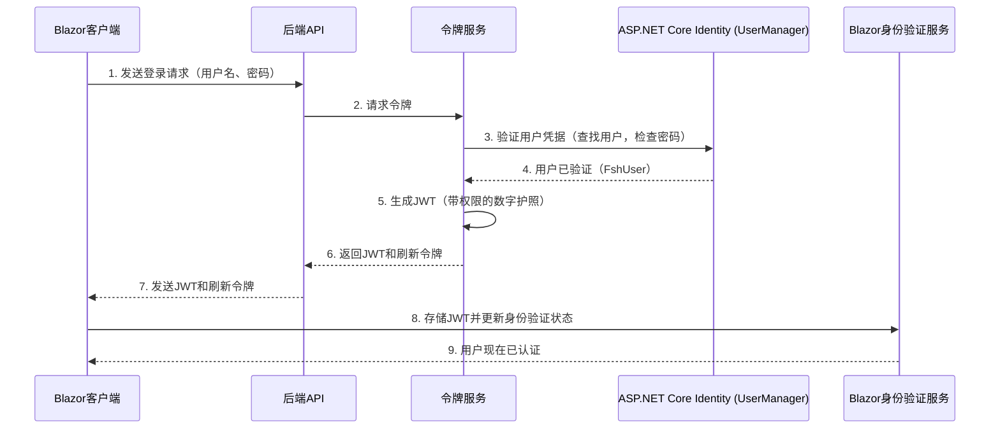
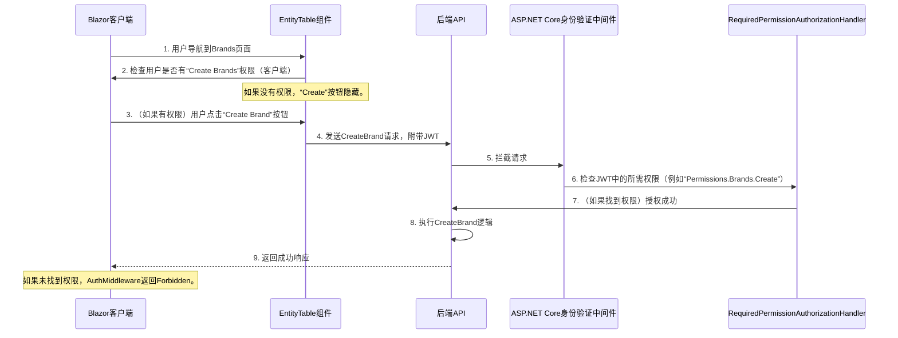

# 第2章：身份验证与授权（Identity & JWT）

欢迎回来

在[第1章：Blazor EntityTable组件](01_blazor_entitytable_component_.md)中，我们学习了`EntityTable`组件如何帮助我们==快速显示和管理数据列表==（如`Brands`）。

还记得`EntityTable`的“配方”（`Context`）中包含一个名为`entityResource: FshResources.Brands`的属性吗？它==提到使用权限==来决定谁可以`Create`或`Delete`？

这正是我们现在要深入探讨的内容

构建Web应用程序不仅仅是显示数据，还要确保==*正确的人*能够访问*正确的数据*并执行*正确的操作*==。

想象一下，如果任何人都可以删除所有产品！那将是一场灾难。

本章将解释我们的应用程序如何像一个警惕的安全系统，确保只有经过授权的个人才能访问特定功能和信息。

## 问题：你是谁，你能做什么？

将我们的应用程序想象成一个繁忙的私人俱乐部。当有人想要进入或使用VIP区域时，会出现两个主要问题：

1.  ==**你是谁？（身份验证）**==：你是否有权进入俱乐部？是否有有效的身份证明来验证你的身份并证明你在宾客名单上？
2.  ==**你被允许做什么？（授权）**==：一旦进入，你可以进入VIP休息室，还是只能待在主舞池？你的入场券或特殊徽章可能会授予你不同级别的访问权限。

在我们的`dotnet-starter-kit`应用程序中，我们面临同样的挑战：

*   **身份验证**：如何验证用户确实是他们所声称的人？（例如，在登录时检查他们的用户名和密码）。
*   **授权**：一旦我们知道他们是谁，如何决定他们可以查看或交互应用程序的哪些部分？（例如，只有“Admin”用户可以创建新的`Brands`，而“Basic”用户只能查看它们）。

这个系统对于保护应用程序和数据安全至关重要。

## 解决方案：Identity & JWT

我们的`dotnet-starter-kit`通过==结合**ASP.NET Core Identity**和**JSON Web Tokens (JWTs)**来解决这个问题==。让我们分解这些关键概念。

### 1. 身份验证：证明你是谁

这是确认用户身份的过程。

*   **ASP.NET Core Identity：宾客名单管理器**
    
    *   ASP.NET Core Identity是一个强大的框架，处理与用户管理相关的所有常见任务：存储用户名、密码（当然是安全哈希的）、电子邮件地址，甚至管理角色（如“Admin”或“Basic”）。
    *   在我们的项目中，我们通过自己的`FshUser`和`FshRole`类扩展基本的`IdentityUser`。
    *   允许我们添加与应用程序相关的额外信息，例如名字、姓氏或图像URL。
    
    ```csharp
    // src/api/framework/Infrastructure/Identity/Users/FshUser.cs
    public class FshUser : IdentityUser
    {
        public string? FirstName { get; set; }
        public string? LastName { get; set; }
        public Uri? ImageUrl { get; set; }
        public bool IsActive { get; set; }
        public string? RefreshToken { get; set; }
        public DateTime RefreshTokenExpiryTime { get; set; }
        // ... 更多属性 ...
    }
    ```
    这个==`FshUser`类就像在俱乐部的宾客名单中添加额外细节==，例如你最喜欢的饮料或关于VIP状态的备注。
    
*   **JSON Web Tokens (JWTs)：你的数字护照**
    
    *   ==一旦你成功“登录”（身份验证）用户名和密码，系统不会仅仅记住你。相反，它会给你一个**JSON Web Token (JWT)**==。
    *   将JWT视为一个安全、防篡改的数字护照。它是一个长字符串，包含关于你的重要信息（你的ID、名字）以及关键的**权限**（你被允许做什么）。
    *   ==这个护照随后会随你发送的每个请求一起发送到服务器==。服务器可以快速检查护照以验证你是谁以及你被允许做什么，而无需每次都重新询问你的用户名和密码。
    *   ==JWT是“签名”的==，以防止任何人在不使令牌失效的情况下更改其中的信息，就像物理护照具有防止伪造的安全功能一样。

### 2. 授权：你被允许做什么

这是确定经过身份验证的用户是否有权执行特定操作或访问特定资源的过程。

*   **`FshPermissions`：规则手册和访问徽章**
    *   为了决定用户可以执行哪些操作，我们需要一套清晰的规则。`FshPermissions`是我们应用程序的“规则手册”。它定义了可以在不同资源（如`Brands`、`Products`、`Users`、`Tenants`）上执行的特定操作（如`Create`、`View`、`Update`、`Delete`、`Search`）。
    *   每条规则都是一个唯一的权限，例如：`Permissions.Brands.Create`允许创建新品牌，`Permissions.Products.View`允许查看产品。

    ```csharp
    // src/Shared/Authorization/FshPermissions.cs
    public static class FshPermissions
    {
        private static readonly FshPermission[] AllPermissions =
        [
            // ... 其他权限 ...
            new("View Brands", FshActions.View, FshResources.Brands, IsBasic: true),
            new("Search Brands", FshActions.Search, FshResources.Brands, IsBasic: true),
            new("Create Brands", FshActions.Create, FshResources.Brands),
            new("Update Brands", FshActions.Update, FshResources.Brands),
            new("Delete Brands", FshActions.Delete, FshResources.Brands),
            // ... 更多权限 ...
        ];
    
        public static string NameFor(string action, string resource)
        {
            return $"Permissions.{resource}.{action}";
        }
    }
    
    public record FshPermission(string Description, string Action, string Resource, bool IsBasic = false, bool IsRoot = false);
    ```
    这些`FshPermission`定义就像俱乐部的一系列特殊访问徽章，每个徽章授予特定区域或活动的权限。

*   **`RequiredPermissionAuthorizationHandler`：安全警卫**
    *   这是实际执行规则的组件。当用户尝试执行某些操作（例如创建品牌）时，`RequiredPermissionAuthorizationHandler`会介入。
    *   它查看该操作所需的权限（例如`Permissions.Brands.Create`），然后检查用户的数字护照（他们的JWT）以查看是否列出了该特定权限。
    *   如果他们有权限，则允许操作。如果没有，则拒绝访问。

    ```csharp
    // src/api/framework/Infrastructure/Auth/Policy/RequiredPermissionAuthorizationHandler.cs
    public sealed class RequiredPermissionAuthorizationHandler(IUserService userService) : AuthorizationHandler<PermissionAuthorizationRequirement>
    {
        protected override async Task HandleRequirementAsync(AuthorizationHandlerContext context, PermissionAuthorizationRequirement requirement)
        {
            // 简化：获取当前操作所需的权限
            var requiredPermissions = /* ... 从端点元数据获取 ... */ ;
    
            // 简化：从JWT中获取用户ID
            if (context.User?.GetUserId() is { } userId)
            {
                // 检查用户是否有所需权限
                if (await userService.HasPermissionAsync(userId, requiredPermissions.First()))
                {
                    context.Succeed(requirement); // 用户已授权！
                    return;
                }
            }
    
            // 如果执行到这里，用户未被授权。
            // context.Fail(); // 如果未调用Succeed，则隐式处理
        }
    }
    ```
    这个处理程序是安全警卫，在每个受限门前检查你的徽章是否符合俱乐部的规则手册。

## 整体协作：创建品牌的流程

让我们回顾一下[第1章：Blazor EntityTable组件](01_blazor_entitytable_component_.md)中的`Brands`示例，看看当用户想要创建新`Brand`时，这些安全概念如何应用。

1.  **用户登录（身份验证）**：
    *   用户在登录页面输入用户名和密码。
    *   应用程序将这些凭据发送到后端。
    *   后端的`TokenService`使用ASP.NET Core Identity管理的`FshUser`和`FshRole`信息验证凭据。
    *   如果成功，`TokenService`为用户生成一个JWT（数字护照）。这个JWT包含用户的ID、电子邮件以及他们拥有的所有权限列表（例如`Permissions.Brands.View`、`Permissions.Brands.Create`）。
    *   这个JWT被发送回Blazor客户端应用程序并安全存储（例如在本地存储中）。

    ```csharp
    // src/apps/blazor/infrastructure/Auth/Jwt/JwtAuthenticationService.cs
    public async Task<bool> LoginAsync(string tenantId, TokenGenerationCommand request)
    {
        // 1. 发送凭据到后端获取令牌
        var tokenResponse = await _client.TokenGenerationEndpointAsync(tenantId, request);
        string? token = tokenResponse.Token;
        string? refreshToken = tokenResponse.RefreshToken;
    
        if (string.IsNullOrWhiteSpace(token) || string.IsNullOrWhiteSpace(refreshToken))
        {
            return false; // 登录失败
        }
    
        // 2. 存储数字护照（JWT）
        await CacheAuthTokens(token, refreshToken);
    
        // 3. 获取此用户的权限并存储（这些通常是JWT本身的一部分）
        var permissions = await _client.GetUserPermissionsAsync();
        await CachePermissions(permissions);
    
        // 4. 更新应用程序的身份验证状态
        NotifyAuthenticationStateChanged(GetAuthenticationStateAsync());
        return true;
    }
    ```

    ```csharp
    // src/api/framework/Infrastructure/Identity/Tokens/TokenService.cs
    public async Task<TokenResponse> GenerateTokenAsync(TokenGenerationCommand request, string ipAddress, CancellationToken cancellationToken)
    {
        // 简化：使用UserManager验证用户凭据
        // ...（检查电子邮件、密码、用户活动状态、租户活动状态）...
    
        // 生成JWT（数字护照）
        string token = GenerateJwt(user, ipAddress);
    
        // 更新用户以获取稍后令牌续订的刷新令牌
        user.RefreshToken = GenerateRefreshToken();
        user.RefreshTokenExpiryTime = DateTime.UtcNow.AddDays(_jwtOptions.RefreshTokenExpirationInDays);
        await _userManager.UpdateAsync(user);
    
        return new TokenResponse(token, user.RefreshToken, user.RefreshTokenExpiryTime);
    }
    
    private string GenerateJwt(FshUser user, string ipAddress)
    {
        // 此方法创建实际的JWT字符串
        List<Claim> claims = GetClaims(user, ipAddress); // 收集用户ID、名称、租户，以及重要的权限！
        // ... 签名和加密令牌的代码 ...
        return new JwtSecurityTokenHandler().WriteToken(token);
    }
    ```
    当`TokenService`构建JWT时，它包含用户被授予的所有权限（`FshClaims.Permission`），通常基于他们分配的角色。

2.  **用户点击“创建品牌”（授权检查 - 客户端）**：
    *   `EntityTable`组件在初始化时使用客户端的`IAuthenticationService`（知道缓存的JWT和权限）来检查当前用户是否具有`Permissions.Brands.Create`权限。
    *   如果用户有权限，“Create”按钮可见。如果没有，则隐藏。

    ```csharp
    // src/apps/blazor/client/Components/EntityTable/EntityTable.razor.cs（简化）
    protected override async Task OnInitializedAsync()
    {
        var state = await AuthState; // 获取当前用户的身份验证状态
        // 根据Context配方检查权限
        _canCreate = await CanDoActionAsync(Context.CreateAction, state);
        // ...
    }
    
    private async Task<bool> CanDoActionAsync(string? action, AuthenticationState state) =>
        !string.IsNullOrWhiteSpace(action) &&
        Context.EntityResource is { } resource &&
        await AuthService.HasPermissionAsync(state.User, action, resource); // 检查用户是否有权限
    ```

3.  **客户端发送创建请求（授权检查 - 服务器端）**：
    *   如果“Create”按钮可见且用户点击它，Blazor应用程序会向后端API发送请求以创建新品牌。
    *   此请求自动在标头中包含用户的JWT，就像在提交表单之前附上你的数字护照一样。
    *   创建品牌的API端点标记了一个属性，指定`Permissions.Brands.Create`为所需权限。

    ```csharp
    // API端点的示例（未直接提供片段，但它是如何工作的）
    // [RequiredPermission(FshActions.Create, FshResources.Brands)]
    // public async Task<ActionResult<Guid>> CreateBrand(CreateBrandCommand command) { ... }
    ```

4.  **`RequiredPermissionAuthorizationHandler`拦截（授权强制执行）**：
    *   在执行`CreateBrand` API方法之前，ASP.NET Core的授权系统会拦截请求。
    *   我们的`RequiredPermissionAuthorizationHandler`充当安全警卫。它从端点的元数据中提取所需的权限（`Permissions.Brands.Create`），然后检查用户提供的JWT。
    *   具体来说，它查找类型为`FshClaims.Permission`的声明，并检查`Permissions.Brands.Create`是否存在于该声明中。

    ```csharp
    // src/Shared/Authorization/FshClaims.cs
    public static class FshClaims
    {
        // ...
        public const string Permission = "permission"; // 这是权限的声明类型
        // ...
    }
    ```

5.  **访问被允许或拒绝**：
    *   如果JWT包含`Permissions.Brands.Create`声明，`RequiredPermissionAuthorizationHandler`允许请求继续。新品牌被创建。
    *   如果JWT*不*包含该权限，处理程序拒绝请求，服务器返回“Unauthorized”或“Forbidden”错误，阻止品牌被创建。

整个过程确保即使聪明的用户试图绕过客户端UI，服务器端的安全门（`RequiredPermissionAuthorizationHandler`）也会始终在那里执行规则。

## 幕后：流程

让我们可视化用户登录并尝试创建`Brand`时的交互。

### 1. 用户登录（身份验证）


此图显示，在用户提供凭据后，`TokenService`与`UserManager`（ASP.NET Core Identity部分）交互以验证用户。如果有效，`TokenService`创建包含用户权限的JWT。这个JWT随后返回给客户端并存储，以备将来请求使用。

### 2. 访问受保护资源（授权）


在这里，`EntityTable`首先进行客户端检查以决定显示哪些UI元素。当实际请求发送到服务器时，`AuthMiddleware`和`RequiredPermissionAuthorizationHandler`成为最终的守门人，确保用户的JWT包含该API端点所需的特定权限。

## 关键组件及其角色

| 组件                                         | 角色                                                | 类比                                           |
| :------------------------------------------- | :-------------------------------------------------- | :--------------------------------------------- |
| **`FshUser` / `FshRole`**                    | 管理用户账户和组（角色）                            | 俱乐部的官方宾客名单和会员等级                 |
| **JWT (JSON Web Token)**                     | 包含用户ID、名称和权限的安全数字护照                | 你的照片ID和特殊访问徽章的组合                 |
| **`FshPermissions`**                         | 定义所有可能的细粒度访问权限（例如“Create Brands”） | 俱乐部的规则手册，详细说明哪些区域允许哪些操作 |
| **`RequiredPermissionAuthorizationHandler`** | 通过检查JWT强制执行`FshPermissions`规则             | 每个受限门前警惕的安全警卫                     |
| **`TokenService`**                           | 在成功登录后生成和刷新JWT                           | 入口处的接待台，发放你的数字护照               |
| **`JwtAuthenticationService`**               | 处理JWT存储和客户端身份验证状态                     | 你的钱包，保存数字护照并在需要时出示           |

## 结论

对`dotnet-starter-kit`中的身份验证和授权工作原理有了基础理解。

我们学习了**身份验证**如何使用ASP.NET Core Identity（`FshUser`、`FshRole`）来验证用户是谁，并在成功登录时发放安全的**JWT（数字护照）**。然后，**授权**开始发挥作用，使用`FshPermissions`定义细粒度的访问规则，并通过`RequiredPermissionAuthorizationHandler`检查用户JWT中列出的权限来强制执行这些规则。

这个强大的系统就像一个安全警卫，确保只有==合法用户才能访问授权的资源和功能==。

这个安全框架深度集成到整个应用程序中。接下来，我们将探索==应用程序如何使用[命令/查询职责分离（CQRS）与MediatR](03_command_query_responsibility_segregation__cqrs__with_mediatr_.md)来保持逻辑的组织性和可扩展性==。

